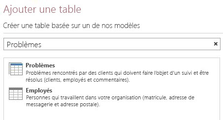
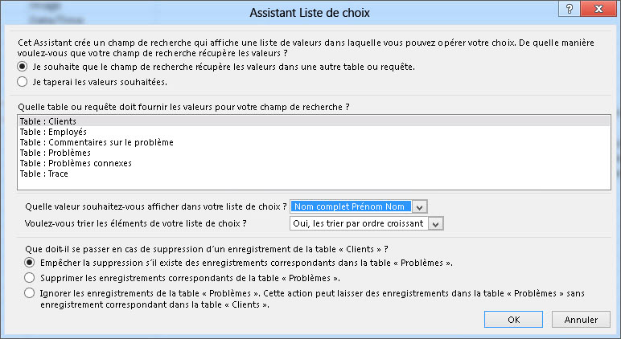
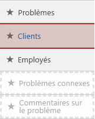
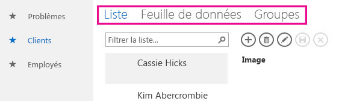
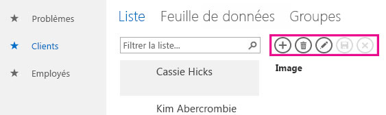
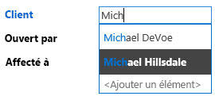
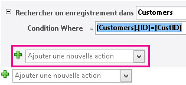
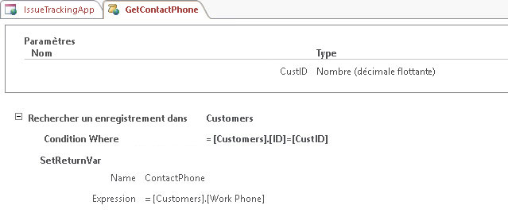
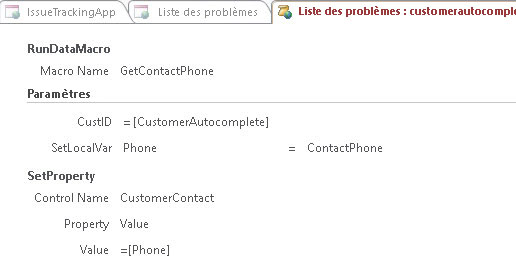
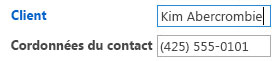

# Création et personnalisation d’une application web dans AccessCreate and customize a web app in Access

> [!IMPORTANT]
> Microsoft ne recommande plus la création et l'utilisation d'applications web Access dans SharePoint. En guise d'alternative, vous pouvez utiliser [Microsoft PowerApps](https://powerapps.microsoft.com/en-us/) pour générer des solutions d'entreprise sans code pour le web et les appareils mobiles.Microsoft no longer recommends creating and using Access web apps in SharePoint. As an alternative, consider using [Microsoft PowerApps](https://powerapps.microsoft.com/en-us/) to build no-code business solutions for the web and mobile devices. 
  
Access 2013 propose un nouveau modèle d'application qui permet aux experts de créer rapidement des applications pour le web. Access inclut un ensemble de modèles qui vous permettent de commencer à créer votre application.Access 2013 features a new application model that enables subject matter experts to quickly create web-based applications. Included with Access are a set of templates that you can use to jump start creating your application.

## Conditions préalables à la création d'une application avec Access 2013Prerequisites for building an app with Access 2013

Pour suivre les étapes de cet exemple, vous avez besoin des éléments suivants :To follow the steps in this example, you need the following:
  
- AccessAccess
    
- Un environnement de développement SharePointA SharePoint development environment
    
Pour plus d'informations sur la configuration de votre environnement de développement SharePoint, consultez [Configurer un environnement de développement général pour SharePoint](https://docs.microsoft.com/sharepoint/dev/general-development/set-up-a-general-development-environment-for-sharepoint).For more information about setting up your SharePoint development environment, see [Set up a general development environment for SharePoint](https://docs.microsoft.com/sharepoint/dev/general-development/set-up-a-general-development-environment-for-sharepoint). 
  
Pour plus d'informations sur l'obtention d’Access et SharePoint, consultez [Téléchargements](https://msdn.microsoft.com/office/apps/fp123627).For more information about obtaining Access and SharePoint, see [Downloads](https://msdn.microsoft.com/office/apps/fp123627).

## Création de l'applicationCreate the app

Supposons que vous vouliez créer une application Access qui assure le suivi des problèmes pour votre entreprise. Avant de commencer à créer les tables et affichages à partir de rien, vous devriez rechercher un modèle de schéma correspondant à vos besoins.Suppose you want to create an Access app that tracks issues for your business. Before you start creating the tables and view from scratch, you should search for a schema template that meets your needs.
  
### Pour créer l'application de suivi des problèmesTo create the issue tracking app

1. Ouvrez Access, puis sélectionnez **Application web personnalisée**.Open Access and choose **Custom web app**.
    
2. Entrez un nom et un emplacement web pour votre application. Vous pouvez également sélectionner un emplacement dans la liste **Emplacements**, puis sélectionner **Créer**.Enter a name and the web location for your app. You can also choose a location from the **Locations** list and choose **Create**.
    
3. Dans le champ **Quels sont les éléments dont vous souhaitez effectuer le suivi ?**, entrez **Problèmes**, puis appuyez sur Entrée.Type **Issues** into the **What would you like to track?** box and then press ENTER. 
    
   La figure 1 présente la liste des modèles pouvant être utiles pour le suivi des problèmes.A list of templates that might be useful for tracking issues is displayed in Figure 1.
    
   **Figure 1. Modèles appropriés pour la recherche des problèmes****Figure 1. Templates that match the search for issues**

   
  
4. Sélectionnez **Problèmes**.Choose **Issues**.
    
Access crée un ensemble de tables et d'affichages.Access creates a set of tables and views.
  
## Exploration de l'applicationExplore the app

Pour savoir si le schéma et les affichages répondent à vos besoins, vous devez les examiner.To understand whether the schema and views meet your needs, you should examine them.
  
Les tables créées en sélectionnant le schéma Problèmes s'affichent dans le volet en mosaïque. Les tables Problèmes, Clients et Employés constituent la cible principale de l'application. La table Problèmes stocke des informations sur chaque problème. Chaque problème est attribué à l'employé qui l'ouvre au nom d'un client. Les tables Problèmes connexes et Commentaires sur le problème jouent un rôle de soutien dans l'application. La table Problèmes connexes vous permet de lier des problèmes. La table Commentaires sur le problème stocke plusieurs commentaires pour un même problème.The tables created by selecting the Issues schema are displayed in the Tile Pane. The Issues, Customer, and Employees tables are the main focus of the app. The Issues table stores information about each issue. Each issue is opened by and assigned to an employee on behalf of a customer. The Related Issues and Issue Comments tables play a supporting role in the app. The Related Issues table enables you to link one issue to another. The Issue Comments table stores multiple comments for a single issue.
  
Dans une base de données du bureau Access (.accdb), les relations entre tables sont gérées dans la fenêtre **Relations**. Les applications Access 2013 gèrent les relations à l'aide de champs définis pour le type de données **Recherche**. Examinons les relations pour la table Problèmes en cliquant avec le bouton droit sur l'élément de mosaïque **Problèmes**, puis en sélectionnant **Modifier la table**.In an Access desktop (.accdb) database, the relationships between tables are managed in the **Relationships** window. Access 2013 apps manage relationships by using fields set to the **Lookup** data type. Let's examine the relationships for the Issues table by right-clicking the **Issues** tile and selecting **Edit Table**.
  
Le champ **Client** est associé à la table **Clients**. Pour examiner la relation, sélectionnez le champ **Client**, puis **Modifier les listes de choix**. L' **Assistant Liste de choix** s'affiche comme illustré à la figure 2.The **Customer** field is related to the **Customers** table. To examine the relationship, select the **Customer** field and then select **Modify Lookups**. The **Lookup Wizard** is displayed, as shown in Figure 2. 
  
**Figure 2. Assistant Liste de choix affichant la relation à la table Clients****Figure 2. Lookup Wizard displaying the relationship to the Customers table**

  
La boîte de dialogue de l'Assistant Liste de choix indique que le champ **Client** est lié à la table **Clients**, et invite à revenir au champ **Nom complet Prénom Nom** de la table **Clients**.The Lookup Wizard dialog box shows that the **Customer** field is linked to the **Customers** table and to return the **Display Name First Last** field from the **Customers** table. 
  
Les champs **Ouvert par**, **Affecté à** et **Modifié par** ont trait à la table **Employés**. Plusieurs autres champs sont également définis pour le type de données **Recherche**. Dans ces cas, celui-ci est utilisé pour spécifier les valeurs à autoriser pour ce champ.The **Opened By**, **Assigned To**, and **Changed By** fields are related to the **Employees** table. Several other fields are also set to the **Lookup** data type. In these cases, the Lookup data type is used to specify the specific values to allow for in the field. 
  
Fermez la table **Problèmes**, puis examinez le volet des mosaïques. Les trois mosaïques supérieures pour les tables **Problèmes**, **Clients** et **Employés** s'affichent différemment des deux mosaïques inférieures pour les tables **Problèmes connexes** et **Commentaires sur le problème**, comme l'illustre la figure 3.Close the **Issues** table and examine the Tile Pane. The top three tiles, for the **Issues**, **Customers**, and **Employees** tables, are displayed differently than the bottom two tiles for the **Related Issues** and **Issue Comments** table, as shown in Figure 3. 
  
**Figure 3. Volet des mosaïques pour le schéma Problèmes****Figure 3. Tile Pane for the Issues schema**

  
Les tables **Problèmes connexes** et **Commentaires sur le problème** sont grisées parce qu'elles devront être invisibles pour l'utilisateur dans le navigateur web.The **Related Issues** and **Issue Comments** tables are dimmed because they are to be hidden from the user in the web browser. 
  
Utilisons l'application pour suivre certains problèmes. À cette fin, cliquez sur **Démarrer l'application** pour ouvrir l'application dans votre navigateur Web.Let's use the app to track some issues. To do this, click **Launch App** to open the app in your web browser. 
  
L'application ouvre l'affichage **Liste des problèmes** de la table Problèmes. Avant d'ajouter un problème, il est recommande d'ajouter des clients et employés. Pour commencer à ajouter des clients, cliquez sur la mosaïque **Clients**.The app opens the **Issues List** view of the Issues table. Before adding an issue, it would be a good idea to add some customers and employees. Click the **Customers** tile to start adding customers. 
  
Utilisez le Sélecteur d'affichage pour choisir l'un des trois modes d'affichage disponibles pour la table **Clients**, à savoir **Liste**, **Feuille de données** ou **Groupes**, comme illustré à la figure 4.Use the View Selector to choose one of three views available for the **Customers** table, labeled **List**, **Datasheet**, and **Groups** as shown in Figure 4. 
  
**Figure 4. Sélecteur d’affichage****Figure 4. View Selector**

  
Le choix du mode **Liste** active l'affichage **Liste des clients**, qui est un affichage de type Détails de la liste. L'affichage Détails de la liste est l'un de ceux qu'Access génère automatiquement lors de la création d'une table. Le principal élément qui caractérise un affichage Détails de la liste est le volet Liste du côté gauche de l'affichage. Ce volet permet de filtrer et de parcourir les enregistrements figurant dans l'affichage. Dans une base de données du Bureau Access , l'implémentation d'un affichage Liste permettant d'effectuer une recherche requiert l'écriture d'un code personnalisé.Choosing **List** activates the **Customers List** view, which is a List Details view. List Details is one of the views Access automatically generates when you create a table. The main feature that distinguishes a List Details view is the list pane that appears on the left side of the view. The list pane is used to filter and navigate the records contained in the view. In an Access desktop database, implementing a searchable list view would require writing custom code. 
  
Le choix du mode **Feuille de données** ouvre l'affichage **Feuille de données clients**. La feuille de données est l'autre type d'affichage qu'Access génère automatiquement lors de la création d'une table. L'affichage Feuille de données est utile pour ceux qui trouvent plus facile d'entrer, de trier et de filtrer des données comme ils le font dans une feuille de calcul.Choosing **Datasheet** opens the **Customers Datasheet** view. Datasheet is the other kind of view Access automatically generates when you create a table. Datasheet views are useful for those who find it easier to enter, sort, and filter data in a spreadsheet-like manner. 
  
Le choix du mode Groupes ouvre un Affichage de synthèse. Ce type d'affichage permet de regrouper des enregistrements sur la base d'un champ, et d'éventuellement calculer une somme ou une moyenne.Choosing Groups opens a Summary view. Summary views can be used to group records based on a field and optionally calculate a sum or average.
  
Lors de l'ajout de clients, utilisez la barre d'action pour ajouter, modifier, rétablir, enregistrer ou supprimer des enregistrements. La barre d'action est une barre d'outils personnalisable qui s'affiche en haut de chaque affichage, comme l'illustre la figure 5.As you're adding customers, use the Action Bar to add records, edit records, save records, delete records, and cancel edits. The Action Bar is a customizable toolbar that appears at the top of each view, as shown in Figure 5.
  
**Figure 5. Barre d’action****Figure 5. Action Bar**

  
Après avoir ajouté des clients et des employés, ouvrez l'affichage Liste des problèmes, puis commencez à ajouter un problème. À mesure que vous tapez le nom d'un client dans le champ Client, un ou plusieurs noms de client s'affichent, comme l'illustre la figure 6.Once you've added some customers and employees open the Issues List view and start adding an issue. As you type the name of a customer into the into the Customer box, one or more of the customer names will appear, as shown in Figure 6.
  
**Figure 6. Contrôle de saisie semi-automatique****Figure 6. AutoComplete control**

  
Le champ Client est un contrôle de saisie semi-automatique. Ce contrôle affiche la liste des enregistrements correspondant à ce que vous tapez dans le champ. Cela vous aide à contrôler l'exactitude des données que vous entrez.The Customer box is an AutoComplete control. The AutoComplete control displays a list of records that match what you're typing into the box. This helps ensure the accuracy of data entry.
  
## Personnalisation de l'applicationCustomize the app

Après avoir examiné l'application, vous constatez que l'affichage Liste des problèmes ne contient pas d'information de contact pour le client. Personnalisons l'application pour ajouter le numéro de téléphone professionnel du client à la table Problème lors de la création d'un problème.Now that you've taken a tour of the app, you notice that the Issues List view doesn't contain contact information for the customer. Let's customize the app to add the customer's work phone to the Issues table as the issue is being created.
  
### Pour ajouter un champ à la table ProblèmesTo add a field to the Issues table

1. Ouvrez l'application dans Access.Open the app in Access.
    
2. Sélectionnez la mosaïque **Problèmes**, l'icône **Paramètres/Action**, puis **Modifier la table**.Choose the **Issues** tile, choose the **Settings/Action** icon, and then choose **Edit Table**.
    
3. Entrez les **Coordonnées du contact** dans la première cellule vide de la colonne **Nom de champ**.Enter **Contact Number** in the first blank cell in the **Field Name** column. 
    
4. Sélectionnez **Texte court** dans la colonne **Type de données**.Choose **Short Text** in the **Data Type** column. 
    
5. Cliquez sur **Enregistrer**.Choose **Save**.
    
6. Fermez la table Problèmes.Close the Issues table.
    
À présent que nous avons un champ dans lequel enregistrer le numéro de téléphone, créons une macro de données pour rechercher les informations de contact.Now that we have field in which to store the phone number, let's create a data macro to look up the contact information.
  
### Pour créer la macro de données recherchant des informations de contactTo create the data macro to look up contact information

1. Dans le groupe **Créer**, sélectionnez **Avancé**, puis **Macro de données**.In the **Create** group, choose **Advanced**, and then choose **Data Macro**.
    
2. Sélectionnez **Créer un paramètre**.Choose **Create Parameter**.
    
3. Dans le champ **Nom**, entrez **CustID**. Dans la liste déroulante **Type**, sélectionnez **Nombre (décimale flottante).**In the **Name** box, enter **CustID**. In the **Type** dropdown, choose **Number (Floating Decimal).**
    
4. Dans la liste déroulante **Ajouter une nouvelle action**, sélectionnez **LookupRecord**.From the **Add New Action** dropdown, choose **LookupRecord**. 
    
5. Dans la liste déroulante **Rechercher un enregistrement dans**, sélectionnez **Clients**.In the **Look Up A Record In** dropdown, choose **Customers**. 
    
6. Dans le champ **Condition Where**, entrez **[Customers].[ID]=[CustID]**.In the **Where Condition** box, enter **[Customers].[ID]=[CustID]**. 
    
7. Dans la liste déroulante **Ajouter une nouvelle Action**, sélectionnez **SetReturnVar**.Choose **SetReturnVar** from the **Add New Action** dropdown. 
    
    > [!NOTE]
    > Vous verrez deux listes déroulantes **Ajouter une nouvelle action** : une au sein du bloc **LookupRecord** et une autre extérieure au bloc **LookupRecord**.You'll see two **Add New Action** dropdowns, one within the **LookupRecord** block, and another outside the **LookupRecord** block. Vous devez sélectionner la liste déroulante **Ajouter une nouvelle action** dans le bloc **LookupRecord**, comme illustré dans la Figure 7.You should choose the **Add New Action** dropdown within the **LookupRecord** block, as shown in Figure 7. 
  
   **Figure 7. Liste déroulante Ajouter une nouvelle action****Figure 7. Add New Action dropdown**

   
  
8. Dans le champ **Nom**, entrez **TéléphoneContact**.In the **Name** box, enter **ContactPhone**. 
    
9. Dans le champ **Expression**, entrez **[Customers].[Work Phone]**.In the **Expression** box, enter **[Customers].[Work Phone]**. 
    
10. Sélectionnez **Enregistrer**. Dans le champ **Nom de macro**, entrez **ObtenirTéléphoneContact**, puis sélectionnez **OK**.Choose **Save**. Enter **GetContactPhone** in the **Macro Name** box and then choose **OK**.
    
    La macro doit ressembler celle illustrée à la figure 8.The macro should resemble the macro shown in Figure 8.
    
    **Figure 8. Macro de données ObtenirTéléphoneContact****Figure 8. GetContactPhone data macro**

    
  
11. Fermez l'affichage Création de macros.Close macro Design View.
    
À présent, nous sommes prêts à ajouter le champ **Coordonnées du contact** au formulaire Liste des problèmes.Now we're ready to add the **Contact Number** field to the Issues List form. 
  
### Pour ajouter le champ Coordonnées du contact au formulaire Liste des problèmesTo add the Contact Number field to the Issues List form

1. Sélectionnez la table **Problèmes**. Cette action sélectionne le formulaire Liste des problèmes.Choose the **Issues** table. This chooses the Issues list form. 
    
2. Dans le sélecteur d'affichage, sélectionnez **Liste**, l'icône **Paramètres/Action**, puis **Modifier**.In the View selector, choose **List**, choose the **Settings/Action** icon, and then choose **Edit**.
    
3. Faites glisser le champ **Cordonnées du contact** du volet **Liste de champs** vers l'emplacement du formulaire où vous voulez que le numéro de contact s'affiche.Drag the **Contact Number** field form the **Field List** pane to the location on the form where you want the contact number to be displayed. 
    
4. Activez la case à cocher **Coordonnées du contact**, puis cliquez sur **Données**.Choose the **Contact Number** text box, and then click **Data**. 
    
5. Dans le champ **Nom du contrôle**, entrez **ContactClient**, puis fermez la fenêtre contextuelle **Données**.In the **Control Name** box, enter **CustomerContact** and then close the **Data** popup. 
    
6. Cliquez sur **Enregistrer**.Choose **Save**.
    
À présent, nous devons écrire une macro d'interface utilisateur qui copie le champ **Téléphone professionnel** de la table **Clients** vers le champ **Téléphone du contact** de la table **Problèmes**. L'événement **Après la mise à jour** du contrôle **CustomerAutocomplete** est un bon emplacement pour enregistrer la macro.Now we should write a user interface (UI) macro that copies the **Work Phone** field from the **Customers** table into the **Contact Phone** field of the **Issues** table. The **After Update** event of the **CustomerAutocomplete** control is a good location for the macro. 
  
### Pour créer la macro AprèsMiseàJourTo create the AfterUpdate macro

1. Sélectionnez le contrôle **CustomerAutocomplete**, le bouton **Actions**, puis **Après la mise à jour**.Choose the **CustomerAutocomplete** control, choose the **Actions** button, and then choose **After Update**. 
    
    Une macro vide s'ouvre dans l'affichage Création de macros.A blank macro is opened in macro Design View.
    
2. Dans la liste déroulante **Ajouter une nouvelle action**, sélectionnez **ExécuterMacroDonnées**.From the **Add New Action** dropdown, choose **RunDataMacro**. 
    
3. Dans la liste déroulante **Nom de la macro**, sélectionnez **ObtenirTéléphoneContact**.In the **Macro Name** dropdown, choose **GetContactPhone**. 
    
4. Dans le champ **CustID**, entrez **[CustomerAutocomplete]**.In the **CustID** box, enter **[CustomerAutocomplete]**. 
    
5. Dans le champ **DéfinirVarLocale**, entrez **Téléphone**.In the **SetLocalVar** box, enter **Phone**. 
    
    Après sélection de la macro de données ObtenirTéléphoneContact créée précédemment, Access a automatiquement complété le nom du paramètre et renvoie une variable pour la macro.When you chose the GetContactPhone data macro that was created earlier, Access automatically filled in the parameter name and return variable for the macro.
    
    Le numéro de téléphone du client est stocké dans une variable nommée Téléphone.The phone number for the customer is stored in a variable named Phone.
    
6. Dans la liste déroulante **Ajouter une nouvelle action**, sélectionnez **DéfinirPropriété**.From the **Add New Action** dropdown, choose **SetProperty**. 
    
7. Dans le champ **Nom du contrôle**, entrez **ContactClient**.In the **Control Name** box, enter **CustomerContact**. 
    
8. Dans la liste déroulante **Propriété**, sélectionnez **Valeur**.In the **Property** dropdown, choose **Value**. 
    
9. Dans le champ **Valeur**, entrez **=[Phone]**.In the **Value** box, enter **=[Phone]**. 
    
10. Cliquez sur **Enregistrer**.Choose **Save**.
    
    La macro doit ressembler celle illustrée à la figure 9.The macro should resemble the macro shown in Figure 9.
    
    **Figure 9. Macro Après mise à jour****Figure 9. After Update macro**

    
  
11. Fermez l'affichage Création de macros.Close macro Design View.
    
12. Fermez l'affichage Liste des problèmes. Lorsque vous êtes invité à enregistrer vos modifications, sélectionnez **Oui**.Close the Issues List view. Choose **Yes** when you are prompted to save your changes. 
    
À présent, nous sommes prêts pour la personnalisation du texte.Now we're ready to text the customization. Cliquez sur **Lancer l’application** pour ouvrir l’application dans votre navigateur web, puis ajoutez un problème.Click **Launch App** to open the app in your web browser and then add a new issue. Le champ **Coordonnées du contact** est automatiquement mis à jour après la saisie du nom du client, comme illustré à la Figure 10.The **Contact Number** box updates automatically after the customer name is entered,  as shown in Figure 10. 
  
**Figure 10. Affichage Problèmes mis à jour avec un numéro de téléphone****Figure 10. Issues view updated with phone number**

  
## ConclusionConclusion

L'utilisation d'un des modèles de schéma inclus dans est une bonne manière de commencer à créer une application web Access. Les affichages créés automatiquement pour vous contiennent des fonctionnalités avancées qui requièrent un code personnalisé à implémenter dans une base de données du Bureau Access.Using one of the schema templates included with is a good way to jump start the creation of an Access web app. The views that are automatically created for you contain advanced functionally that requires custom code to implement in a Access desktop database. 
  
## Voir aussiSee also

- [Nouveautés d’Access 2013 pour les développeursWhat's new for Access 2013 developers](https://msdn.microsoft.com/library/df778f51-d65e-4c30-b618-65003ceb39b3%28Office.15%29.aspx) 
- [Référence de l'application web personnalisée AccessAccess custom web app reference](access-custom-web-app-reference.md)
  

