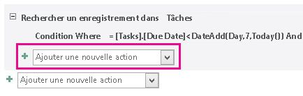
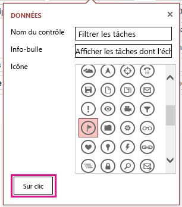
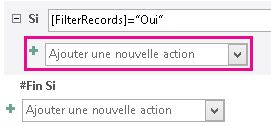
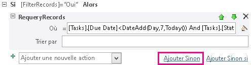

# <a name="filter-a-view-by-using-a-macro-in-an-access-app"></a>Filtrage d’une vue à l’aide d’une macro dans l’application Access

Découvrez comment filtrer un affichage dans une application Access à l’aide de l’action de macro RequeryRecords et une macro de données.
  
> [!IMPORTANT]
> Microsoft ne recommande plus la création et l'utilisation d'applications web Access dans SharePoint. En guise d'alternative, vous pouvez utiliser [Microsoft PowerApps](https://powerapps.microsoft.com/) pour générer des solutions d'entreprise sans code pour le web et les appareils mobiles.

L’affichage de liste par défaut dans une application Access vous permet de filtrer les problèmes sur les valeurs contenues dans les champs. Vous voudrez peut-être filtrer un affichage en fonction d’un ensemble de conditions au lieu de la mise en correspondance d’une valeur. Pour ce faire, vous devez créer une macro. Cet article vous explique comment créer une macro qui filtre un affichage afin de présenter les tâches dont l’échéance est passée ou arrive dans les 7 prochains jours.
  
## <a name="prerequisites-for-building-an-app-with-access"></a>Conditions préalables à la création d’une application avec Access

Pour suivre les étapes de cet exemple, vous avez besoin des éléments suivants :
  
- Access 2013
- Un environnement de développement SharePoint 2013

> [!NOTE]
> Pour plus d'informations sur la configuration de votre environnement de développement SharePoint, consultez [Configurer un environnement de développement général pour SharePoint 2013](https://msdn.microsoft.com/library/08e4e4e1-d960-43fa-85df-f3c279ed6927%28Office.15%29.aspx).
> Pour plus d’informations sur l’obtention d’Access 2013, consultez [Téléchargements](https://www.microsoft.com/en-us/download/details.aspx?id=39358) et SharePoint 2013, voir [Téléchargements](https://www.microsoft.com/en-us/download/details.aspx?id=35488).
  
## <a name="create-the-app"></a>Création de l’application

Supposons que vous vouliez créer une application Access qui assure le suivi des problèmes pour votre entreprise. Avant de commencer à créer les tables et affichages à partir de rien, vous devriez rechercher un modèle de schéma correspondant à vos besoins.
  
### <a name="to-create-the-task-tracking-app"></a>Créer l’application de suivi des tâches

1. Ouvrez Access, puis sélectionnez **Application web personnalisée**.
2. Entrez un nom et un emplacement web pour votre application. Vous pouvez également sélectionner un emplacement dans la liste **Emplacements**, puis sélectionner **Créer**.
3. Saisissez les **tâches** dans la zone **Recherche**, puis appuyez sur ENTRÉE.

    La figure 1 présente la liste des modèles pouvant être utiles pour le suivi des tâches.

   **Figure 1. Modèles appropriés pour la recherche des tâches**

   
  
4. Sélectionnez **Tâches**.

Access crée un ensemble de tables et d’affichages.
  
Saisissez plusieurs exemples de tâches et d’employés dans votre application. À cette fin, cliquez sur **Lancer l’application** pour ouvrir l’application dans votre navigateur web. Saisissez une valeur dans le champ **Date d’échéance** pour chaque tâche. Revenez à Access lorsque vous avez terminé.
  
## <a name="plan-the-customizations"></a>Planifier les personnalisations

Vous avez désormais une application qui contient plusieurs tâches. L’affichage par défaut vous permet de rechercher les tâches utilisant des éléments stockés dans les champs présentés dans l’affichage. Par exemple, vous pouvez rechercher les problèmes hautement prioritaires ou les problèmes en cours. Supposons que vous vouliez hiérarchiser votre travail en affichant les problèmes actifs qui arrivent à échéance la semaine prochaine. Pour ce faire, vous devez créer une macro d’interface utilisateur (IU).
  
La commande de macro d’interface utilisateur que vous pouvez utiliser pour filtrer l’affichage est [RequeryRecords Macro Action (application web personnalisée Access)](requeryrecords-macro-action-access-custom-web-app.md). L’action de macro **RequeryRecords** permet de filtrer l’affichage basé sur l’argument *Where*, fourni sous la forme d’une clause SQL WHERE. Pour filtrer l’affichage, vous devez fournir plusieurs faits dans un format spécifique pour filtrer l’affichage.
  
Les faits pertinents sont :
  
- Le ou les champs à comparer
- Comment faire référence à la date du jour
- Comment faire référence à un jour spécifique par rapport à la date du jour
- Comment identifier les tâches en cours

Le champ **Date d’échéance** fournit des informations sur l’échéance d’une tâche. Le champ **État** fournit des informations d’état des tâches. Pour faire référence à un champ dans une macro, utilisez le format **[*TableName*].[*FieldName*]**. Utilisez **[Tasks].[Due Date]** pour faire référence au champ **Date d’échéance** et **[Tasks].[Status]** pour faire référence au champ **État**.
  
La [fonction Aujourd’hui (application web personnalisée Access)](today-function-access-custom-web-app.md) retourne la date du jour. La [fonction DateAdd (application web personnalisée Access)](dateadd-function-access-custom-web-app.md) peut être utilisée pour calculer une date qui correspond à un certain nombre de jours après une date spécifiée.
  
Le champ **État** contient plusieurs valeurs possibles. Une valeur **Terminée** indique que la tâche n’est plus active.
  
Ces faits peuvent être regroupés dans la clause suivante SQL WHERE.
  
```sql
[Tasks].[Due Date]<DateAdd(Day,7,Today()) AND [Tasks].[Status]<>"Completed"
```

Cette clause SQL WHERE est utilisée dans la macro pour filtrer l’affichage afin de présenter les problèmes actifs dont l’échéance est passée ou arrive dans les 7 prochains jours.
  
Pour exécuter la macro d’interface utilisateur, elle doit être liée à un élément ou à un événement qui survient dans l’affichage. La **barre d’action** est un endroit pratique pour ajouter une commande personnalisée à l’affichage. La **barre d’action** est une barre d’outils personnalisable qui s’affiche en haut de chaque affichage. Par défaut, la **barre d’action** contient des boutons pour ajouter, modifier, enregistrer, supprimer et annuler des modifications. Vous pouvez ajouter des boutons qui effectuent des actions personnalisées, telles que le filtrage de l’affichage.
  
Si l’affichage contient des enregistrements répondant aux critères spécifiés, **RequeryRecords** filtre alors l’affichage. Cependant, si l’affichage ne contient pas d’enregistrements qui répondent aux critères, un nouvel enregistrement vide s’affiche. Si vous ne souhaitez pas afficher un enregistrement vide si aucune des tâches n’arrive à échéance la semaine suivante, vous devez trouver une méthode pour vérifier les tâches avant d’appeler l’action de macro **RequeryRecords**. Pour ce faire, créez une macro de données pour rechercher les enregistrements qui répondent aux critères.
  
La macro d’interface utilisateur va appeler la macro de données, qui va tenter de trouver une tâche dont l’échéance arrive la semaine suivante. Si la macro de données trouve la tâche, personnalisez ensuite l’application.
  
## <a name="customize-the-app"></a>Personnalisation de l’application

À présent que vous avez déterminé les personnalisations, implémentez-les. Vous devriez créer la macro de données en premier. Certaines macros de données sont liées directement aux tables. Cependant, cette macro de données est une macro de données autonome.
  
### <a name="to-create-the-data-macro"></a>Créer la macro de données

1. Ouvrez l’application dans Access.

2. Dans le groupe **Créer**, sélectionnez **Avancé**, puis **Macro de données**.

    Une macro de données vide s’ouvre dans l’affichage Création de macros.

3. Dans la zone de liste **Ajouter une nouvelle action**, sélectionnez **LookupRecord**.

4. Dans la zone de liste **Rechercher un enregistrement**, sélectionnez **Tâches**.

5. Dans la zone **Condition Où** , entrez **[Tâches]. [Date d’échéance]\<DateAdd(Day,7,Today()) AND [Tasks].[Status]\<\>« Terminé »**.

6. Dans la zone de liste **Ajouter une nouvelle Action**, sélectionnez **SetReturnVar**.

    > [!NOTE]
    > Vous verrez deux zones de liste **Ajouter une nouvelle action**, l’une dans le bloc **LookupRecord** et l’autre en dehors du bloc **LookupRecord**. Vous devez choisir la zone de liste **Ajouter une nouvelle action** dans le bloc **LookupRecord**, comme illustré dans la figure 1.
  
   **Figure 1. Zone de liste Ajouter une nouvelle action**

   
  
7. Dans la zone **Nom**, saisissez **TaskFound**.

8. Dans la zone **Expression**, saisissez **« Yes »**.

9. Sélectionnez **Enregistrer**. Dans le champ **TasksDueSoon**, entrez **Nom de Macro**, puis sélectionnez **OK**.

    La macro doit ressembler à celle illustrée à la figure 2.

   **Figure 2. Macro de données TasksDueSoon**

   
  
10. Fermez l’affichage Création de macros.

À présent, nous sommes prêts à ajouter un bouton personnalisé à la barre d’action.
  
### <a name="to-add-a-custom-button-to-the-action-bar"></a>Ajouter un bouton personnalisé à la barre d’action

1. Sélectionnez la table **Tâches**. Cette action choisit le formulaire Liste de tâches.

2. Dans le sélecteur d’affichage, sélectionnez **Liste**, l’icône **Paramètres/Action**, puis **Modifier**.

    L’affichage est ouvert en mode Création.

3. À présent, nous sommes prêts à ajouter un bouton personnalisé à la barre d’action. Pour ce faire, sélectionnez **Ajouter une action personnalisée** comme illustré dans la Figure 3.

   **Figure 3. Bouton Ajouter une action personnalisée**

   
  
    La nouvelle action est représentée par un bouton en forme étoile comme illustré dans la Figure 4.

   **Figure 4. Nouveau bouton de la barre d’action**

   
  
4. Sélectionnez le bouton de barre d’action personnalisé, puis sélectionnez l’icône **Données**.

    La boîte de dialogue **Données** apparaît.

5. Dans la zone **Nom du contrôle**, saisissez **FilterTasks**.

6. Dans la zone **Info-bulle**, saisissez **Afficher les tâches dont l’échéance est passée ou arrive la semaine suivante**.

À présent, nous sommes prêts à créer la macro d’interface utilisateur qui va filtrer l’affichage.
  
### <a name="to-create-the-ui-macro-to-filter-the-view"></a>Créer la macro d’interface utilisateur pour filtrer l’affichage

1. Dans la boîte de dialogue **Données**, choisissez **Sur clic** comme illustré dans la Figure 5.

   **Figure 5. Boîte de dialogue Données**

   
  
    Une macro d’interface utilisateur vide s’ouvre dans l’affichage Création de macros.

2. Dans la zone de liste **Ajouter une nouvelle action**, sélectionnez **RunDataMacro**.

3. Dans la zone Nom de Macro, saisissez **TasksDueSoon**.

    Dans la zone **SetLocalVar**, saisissez **FilterRecords**.

    L’action **RunDataMacro** appelle la macro de données **TasksDueSoon** que nous avons créée précédemment et enregistre son résultat dans une variable nommée **FilterRecords**.

4. Dans la zone de liste **Ajouter une nouvelle action**, sélectionnez **If**.

5. Dans la zone **If**, saisissez **[FilterRecords]="Yes"**.

6. Dans la zone de liste **Ajouter une nouvelle action**, sélectionnez **RequeryRecords**.

    > [!NOTE]
    > Vous verrez deux zones de liste **Ajouter une nouvelle action** , l’une dans le bloc **Si** et l’autre en dehors du bloc **Si**. Vous devez choisir la zone de liste **Ajouter une nouvelle action** dans le bloc **Si**, comme illustré dans la figure 6.
  
   **Figure 6. Zone de liste Ajouter une nouvelle action**

   
  
7. Dans la zone **Où**, entrez **[Tâches].[ Date d’échéance] \<DateAdd(Day,7,Today()) AND [Tasks].[Status]\<\>« Terminé »**.

8. Dans la zone **Trier par**, saisissez **[Date d’échéance]**.

9. Sélectionnez le lien **Ajouter Sinon** qui apparaît en regard de la zone **Ajouter une nouvelle action** comme illustré dans la Figure 7.

   **Figure 7. Lien Ajouter sinon**

   
  
    Une clause Else est ajoutée au bloc If.

10. Dans la zone de liste **Ajouter une nouvelle action**, sélectionnez **MessageBox**.

11. Dans la zone **Message**, saisissez **Aucune tâche dont l’échéance est passée ou qui arrive dans les 7 prochains jours !**.

12. Cliquez sur **Enregistrer**.

    La macro doit ressembler celle illustrée à la figure 8.

    **Figure 8. Macro d’interface utilisateur pour filtrer l’affichage**

    
  
13. Fermez l’affichage Création de macros.

À ce stade, nous avons créé la macro d’interface utilisateur qui permet de filtrer l’affichage Liste des tâches afin de présenter les tâches urgentes. Il serait déplacé de laisser l’affichage dans un état filtré sans fournir de méthode pour supprimer le filtre. Pour ce faire, ajoutez un autre bouton de barre d’action et une macro d’interface utilisateur.
  
### <a name="to-add-an-action-bar-button-to-remove-the-filter"></a>Ajouter un bouton de barre d’action pour supprimer le filtre

1. Sélectionnez **Ajouter une action personnalisée**.

    La nouvelle action est représentée par un bouton en forme étoile.

2. Sélectionnez le bouton de barre d’action personnalisé, puis l’icône **Données**.

    La boîte de dialogue **Données** apparaît.

3. Dans la zone **Nom du contrôle**, saisissez **RemoveFilter**.

4. Dans la zone **Info-bulle**, saisissez **Supprimer tous les filtres appliqués à l’affichage**.

À présent, nous sommes prêts à créer la macro d’interface utilisateur qui va supprimer le filtre de l’affichage.
  
### <a name="to-create-the-ui-macro-to-remove-the-filter-from-the-view"></a>Créer la macro d’interface utilisateur pour supprimer le filtre de l’affichage

1. Dans la boîte de dialogue **Données**, choisissez **Sur clic**.

    Une macro d’interface utilisateur vide s’ouvre dans l’affichage Création de macros.

2. Dans la zone de liste **Ajouter une nouvelle action**, sélectionnez **RequeryRecords**.

    Cette fois, laissez les zones **Where** et **Trier par** vides. L’action **RequeryRecords** est ainsi appelée sans paramètres ; tous les filtres sont supprimés de l’affichage.

3. Cliquez sur **Enregistrer**.

4. Fermez l’affichage Création de macros.

5. Fermez l’affichage Liste des tâches. Choisissez **Oui** lorsque vous êtes invité à enregistrer vos modifications.

À présent, nous sommes prêts pour la personnalisation du texte. Sélectionnez **Lancer l’application** pour ouvrir l’application dans votre navigateur web, puis le bouton de barre d’action personnalisé FilterTasks. Les tâches dont l’échéance est passée ou arrive dans les 7 prochains jours sont affichées. Un message s’affiche si l’application ne contient aucune tâche urgente.
  
## <a name="conclusion"></a>Conclusion

Vous pouvez utiliser l’action de macro **RequeryRecords** dans une macro d’interface utilisateur pour filtrer l’affichage en fonction des critères de votre choix. En fonction du comportement recherché, vous pouvez être amené à créer une macro de données pour vérifier qu’un enregistrement répond aux critères avant d’utiliser l’action de macro **RequeryRecords**.
  
## <a name="see-also"></a>Voir aussi

- [Nouveautés d’Access 2013 pour les développeurs](https://msdn.microsoft.com/library/df778f51-d65e-4c30-b618-65003ceb39b3%28Office.15%29.aspx)
