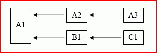

# Recalcul multithread dans Excel

**S’applique à**: Excel 2013 | Office 2013 | Visual Studio 
  
Microsoft Office Excel 2007 a �t� la premi�re version d�Excel � utiliser le recalcul multithread (MTR) de feuilles de calcul. Vous pouvez configurer Excel pour utiliser jusqu�� 1�024�threads simultan�s lors du recalcul, quel que soit le nombre de processeurs ou de c�urs de processeur pr�sents sur l�ordinateur. 
  
> [!NOTE]
> Il existe une surcharge de systéme d�exploitation li�e � chaque thread. �vitez donc de configurer Excel pour qu�il utilise plus de threads que n�cessaire. 
  
Si l�ordinateur dispose de plusieurs processeurs ou c�urs de processeur, le systéme d�exploitation a la responsabilit� d�allouer les threads aux processeurs de la mani�re la plus efficace.
  
## Vue d’ensemble du recalcul multithread Excel

Excel tente d�identifier des parties de la cha�ne de calcul pouvant �tre recalcul�es simultan�ment sur diff�rents threads. L�arborescence tr�s simple suivante (o� x ? y signifie que y d�pend uniquement de x) en pr�sente un exemple.
  
**Figure 1. Calcul simultané sur différents threads**

  
Apr�s avoir calcul� A1, A2 et A3 peuvent �tre calcul�es sur un thread, tandis que B1 et C1 peuvent �tre calcul�es sur un autre, en supposant que toutes les cellules sont thread-safe. 
  
> [!NOTE]
> Le terme cellule thread-safe d�signe une cellule contenant uniquement des fonctions thread-safe. Les �l�ments thread-safe et non thread-safe sont d�taill�s [�l�ments consid�r�s comme thread-safe ou non par Excel](#xl2007xllsdk_threadsafe). 
  
Les classeurs les plus pratiques contiennent des arborescences des d�pendances beaucoup plus complexes que celle de cet exemple. En outre, la dur�e de recalcul d�une cellule ne peut �tre connue qu�une fois le recalcul termin�, et peut varier consid�rablement selon les arguments des fonctions. Pour obtenir les meilleurs r�sultats, Excel essaie d�am�liorer l�ordre de calcul pour chaque calcul jusqu�� ce qu�aucune optimisation suppl�mentaire ne soit possible.
  
Excel utilise un thread principal unique � ex�cuter, ou ex�cute les �l�ments suivants :
  
- commandes int�gr�es�;
    
- Commandes XLL
    
- Fonctions de l’interface du gestionnaire de compléments XLL (fonction **xlAutoOpen** et ainsi de suite) 
    
- Commandes Microsoft Visual Basic pour Applications (VBA) définies par l’utilisateur (souvent appelées macros)
    
- fonctions VBA d�finies par l�utilisateur�;
    
- fonctions de feuille de calcul non thread-safe int�gr�es (voir la section suivante pour obtenir la liste)�;
    
- fonctions et commandes d�finies par l�utilisateur de feuille de macro XLM�;
    
- fonctions et commandes de compl�ment COM�;
    
- fonctions et op�rateurs dans des expressions de mise en forme conditionnelles�;
    
- fonctions et op�rateurs dans des d�finitions de nom d�fini utilis�es dans les formules de feuille de calcul�;
    
- �valuation forc�e d�une expression dans la zone d��dition de formule � l�aide de la touche **F9**. 
    
Toutes les formules de feuille de calcul, que les fonctions soient thread-safe ou non, sont �valu�es sur le thread principal, sauf si Excel est configur� pour utiliser plusieurs threads. Lorsque l�utilisateur indique que plusieurs threads doivent �tre utilis�s, les threads suppl�mentaires sont utilis�s pour les cellules thread-safe. Notez que le thread principal peut encore �tre utilis� pour les cellules thread-safe lorsque cela est pertinent du point de vue d�un �quilibreur de charge.
  
Il est int�ressant de rev�rifier qu�Excel n�ex�cute pas plus d�une commande � la fois, de fa�on � ce que vous n�ayez pas besoin d�utiliser les m�mes pr�cautions que lorsque vous �crivez des fonctions thread-safe, telles que l�utilisation de la m�moire locale de thread et des sections critiques.
  
## Éléments considérés comme thread-safe ou non par Excel

Pour Excel, seuls les �l�ments suivants sont thread-safe :
  
- tous les op�rateurs unaires et binaires dans Excel�;
    
- presque toutes les fonctions de feuille de calcul int�gr�es � partir d�Excel 2007 (voir la liste des exceptions)�;
    
- les fonctions de compl�ment XLL qui ont �t� explicitement enregistr�es comme thread-safe.
    
Les fonctions de feuille de calcul int�gr�es qui ne sont pas thread-safe sont les suivantes :
  
- **PHONETIC**
    
- **CELL** lorsque l�argument « format » ou « adress » est utilis� 
    
- **INDIRECT**
    
- **GETPIVOTDATA**
    
- **CUBEMEMBER**
    
- **CUBEVALUE**
    
- **CUBEMEMBERPROPERTY**
    
- **CUBESET**
    
- **CUBERANKEDMEMBER**
    
- **CUBEKPIMEMBER**
    
- **CUBESETCOUNT**
    
- **ADRESS** où figure le cinquième paramètre (sheet_name) 
    
- Toute fonction de base de données (**DSUM**, **DAVERAGE**, et ainsi de suite) qui fait référence à un tableau croisé dynamique
    
- **ERROR.TYPE**
    
- **HYPERLINK**
    
Pour �tre explicites, les �l�ments suivants sont consid�r�s comme non s�curis�s :
  
- fonctions VBA d�finies par l�utilisateur�;
    
- fonctions d�finies par l�utilisateur de compl�ment COM�;
    
- fonctions d�finies par l�utilisateur de feuille macro XLM�;
    
- fonctions de compl�ment XLL non enregistr�es explicitement comme thread-safe.
    
Les cons�quences sont que les op�rations et fonctions suivantes ne sont pas thread-safe, et �chouent si elles sont appel�es � partir d�une fonction�XLL enregistr�e en tant que thread-safe :
  
- Appels vers les fonctions d’information XLM, par exemple, **xlfGetCell** (**GET.CELL**).
    
- Appels vers des éléments **xlfSetName** (**SET.NAME**) pour définir ou supprimer des noms XLL internes.
    
- Appels vers les fonctions définies par l’utilisateur comme non thread-safe à l’aide d’**xlUDF**.
    
- appels vers la fonction [xlfEvaluate](xlfevaluate.md) pour des expressions contenant des fonctions non thread-safe ou des noms d�finis dont les d�finitions contiennent des fonctions non thread-safe�; 
    
- appels vers la fonction [xlAbort](xlabort.md) pour effacer une condition d�arr�t�; 
    
- appels vers la fonction [xlCoerce](xlcoerce.md) pour obtenir la valeur d�une référence de cellule non calcul�e. 
    
> [!NOTE]
> Les fonctions de feuille de calcul�XLL ne sont pas autoris�es � appeler les commandes d�API C, par exemple **xlcSave**, qu�elles aient �t� enregistr�es en tant que thread-safe ou non. 
  
�tant donn� que les fonctions�XLL d�clar�es comme thread-safe ne peuvent pas appeler les fonctions d�informations XLM ou les cellules non calcul�es de référence, Excel n�autorise pas les fonctions�XLL qui sont enregistr�es comme des �quivalents de feuille macro, pouvant aussi �tre enregistr�es en tant que thread-safe. Par cons�quent, la tentative d�obtention de la valeur d�une référence de cellule non calcul�e � l�aide de l��l�ment **xlCoerce** �choue avec une erreur **xlretUncalced**. L�appel d�une fonction d�information XLM �choue avec une erreur **xlretFailed**. Les autres points r�pertori�s pr�c�demment �chouent avec un code d�erreur introduit dans l�API C Excel : **xlretNotThreadSafe**. 
  
Les fonctions de rappel concernant uniquement l�API C sont toutes thread-safe :
  
- **xlCoerce** (sauf en cas d��chec de for�age de type de références de cellule non calcul�e) 
    
- **xlFree**
    
- **xlStack**
    
- **xlSheetId**
    
- **xlSheetNm**
    
- **xlAbort** (sauf lorsqu�elle est utilis�e pour effacer une condition d�arr�t) 
    
- **xlGetInst**
    
- **xlGetHwnd**
    
- **xlGetBinaryName**
    
- **xlDefineBinaryName**
    
La seule exception est la fonction **xlSet**, qui n�est en aucun cas un �quivalent de la commande, et par cons�quent ne peut pas �tre appel�e � partir de n�importe quelle fonction de feuille de calcul. 
  
Une fonction de feuille de calcul�XLL peut �tre enregistr�e aupr�s d�Excel en tant que thread-safe. Cela indique � Excel que la fonction peut �tre appel�e en toute s�curit� et simultan�ment sur plusieurs threads, mais vous devez tout de m�me vous assurer que c�est bien le cas. Vous pouvez �ventuellement d�stabiliser Excel si une fonction enregistr�e comme thread-safe a un comportement non s�curis� par la suite.
  
## Enregistrement de fonctions XLL comme thread-safe

Les r�gles qu�un d�veloppeur doit respecter lors de l��criture de fonctions thread-safe sont les suivantes :
  
- n�appelez pas de ressources dans d�autres DLL qui ne sont peut-�tre pas thread-safe�;
    
- n��mettez pas d�appels non s�curis�s via l�API C ou COM�;
    
- prot�gez les ressources qui peuvent �tre utilis�es simultan�ment par plusieurs threads � l�aide des sections critiques�;
    
- utilisez la m�moire locale de thread pour le stockage propre au thread et remplacez les variables statiques dans les fonctions par des variables locales de thread.
    
Excel impose une restriction suppl�mentaire : les fonctions thread-safe ne peuvent pas �tre enregistr�es comme des �quivalents de feuilles macro, et par cons�quent ne peuvent pas appeler de fonctions d�informations XLM ou obtenir les valeurs des cellules non recalcul�es.
  
## Contention de mémoire

Les systémes multithread doivent traiter des probl�mes fondamentaux :
  
- comment prot�ger la m�moire utilis�e en lecture et en �criture � l�aide de plusieurs threads�;
    
- comment cr�er et acc�der � une m�moire associ�e et propre au thread en cours d�ex�cution.
    
Le systéme d�exploitation Windows et le kit de d�veloppement logiciel (SDK) Windows fournissent des outils pour ces deux �l�ments : des sections critiques et l�API de stockage local de thread (TLS), respectivement. Pour plus d�informations, voir [Gestion de la m�moire dans Excel](memory-management-in-excel.md).
  
Le premier probl�me peut se produire, par exemple, lorsque deux fonctions de feuille de calcul (ou deux instances de la m�me fonction en cours d�ex�cution simultan�ment) doivent acc�der � ou modifier une variable globale dans un projet DLL. N�oubliez pas qu�une telle variable globale peut �tre masqu�e dans une instance d�objet de classe accessible globalement.
  
Le deuxi�me probl�me peut se produire, par exemple, lorsqu�une fonction de feuille de calcul d�clare une variable ou un objet statique dans le code du corps de fonction. Le compilateur C/C++ cr�e uniquement une copie unique utilis�e par tous les threads. Cela signifie qu�une instance de la fonction peut modifier la valeur, tandis qu�une autre instance sur un autre thread peut supposer que la valeur est celle pr�c�demment d�finie.
  
## Exemple d’applications de recalcul multithread

Tout �l�ment�XLL qui exporte des fonctions de feuille de calcul peut tirer parti du recalcul multithread (MTR) dans Excel, � condition que ces fonctions n�aient pas � effectuer d�actions non thread-safe. Cela permet � Excel de recalculer les classeurs qui d�pendent d�eux-m�mes aussi rapidement que possible. Il s�agit donc d�un �l�ment souhaitable, quelle que soit l�application.
  
Plus pr�cis�ment, le recalcul multithread a un impact consid�rable sur la dur�e de recalcul des classeurs qui appellent des fonctions d�finies par l�utilisateur, qui appellent elles-m�mes des processus externes pour obtenir le r�sultat souhait�. En particulier, envisagez une fonction d�finie par l�utilisateur qui appelle un serveur distant pouvant traiter plusieurs demandes simultan�ment, et un classeur contenant un grand nombre d�appels vers cette fonction. Si le recalcul du classeur est monothread, chaque appel � la fonction d�finie par l�utilisateur, et donc au serveur distant, doit �tre termin� avant de pouvoir r�aliser le suivant. De ce fait, le serveur perd sa capacit� � traiter plusieurs appels � la fois. Si le recalcul du classeur est multithread, Excel peut effectuer plusieurs appels � la fois ou dans un court laps de temps.
  
Si Excel est configur� pour utiliser le m�me nombre de threads que le serveur (appel� N), et que la topologie de l�arborescence des d�pendances du classeur le permet, la dur�e de recalcul totale peut �tre r�duite � une valeur proche de 1/N de la dur�e de calcul monothread. Cette action peut s�av�rer efficace, m�me lorsque l�ordinateur client (sur lequel le classeur est en cours d�ex�cution) n�a qu�un processeur, en particulier lorsque le temps n�cessaire pour effectuer l�appel vers le serveur est court par rapport � la dur�e n�cessaire au serveur pour �mettre l�appel. 
  
Il existe une surcharge du systéme d�exploitation pour chaque thread suppl�mentaire. Par cons�quent, un peu de pratique peut �tre requise pour un classeur donn� et un ordinateur serveur et client donn� pour trouver le nombre optimal de threads qu�Excel doit utiliser. 
  
Par exemple, imaginez un ordinateur monoprocesseur ex�cutant Excel et un classeur contenant 1�000�cellules. Il appelle une fonction d�finie par l�utilisateur, qui � son tour appelle un ou plusieurs serveurs � distance. Supposons que les 1�000�cellules ne d�pendent pas les unes des autres, afin que Microsoft�Excel n�ait pas � attendre la fin d�un appel avant d�effectuer l�appel suivant. (Une relaxation de cette contrainte est possible sans influer cet exemple). Si les serveurs peuvent traiter 100�demandes simultan�ment, et qu�Excel est configur� pour utiliser 100�threads, le temps d�ex�cution peut �tre r�duit � une valeur aussi faible que 1/100e de la valeur lorsqu�un seul thread est utilis�. La surcharge qui est associ�e � Excel allouant des appels � chaque thread et au systéme d�exploitation g�rant 100�threads signifie que, dans la pratique, la r�duction ne sera pas vraiment id�ale. Il existe �galement une hypoth�se implicite selon laquelle le serveur est �volutif, et que le fait de lui demander de traiter 100�t�ches simultan�ment n�aura pas d�impact consid�rable sur les dur�es individuelles de traitement des t�ches.
  
Une application pratique dans laquelle cette technique peut repr�senter des avantages importants est celle des m�thodes Monte�Carlo, ainsi que d�autres t�ches intensives num�riques qui peuvent �tre divis�es en sous-t�ches moins volumineuses pouvant �tre confi�es aux serveurs.
  
## Remarques sur Excel Services

Les services Excel prennent en charge le chargement, le calcul et le rendu des feuilles de calcul Excel sur un serveur. Les utilisateurs peuvent ensuite acc�der aux feuilles de calcul et interagir avec celles-ci � l�aide d�outils de navigateur standard.
  
Les fonctions d�finies par l�utilisateur des services Excel sont cr��es � l�aide du code manag� Microsoft�.NET�Framework et sont disponibles via un assembly�.NET. Les XLL ne sont pas pris en charge par les services Excel. Une ressource de fonction d�finie par l�utilisateur de serveur de code manag� peut appeler un XLL afin qu�il acc�de � ses fonctionnalit�s, de sorte que l�utilisateur peut avoir la m�me fonctionnalit� avec un classeur charg� sur le serveur qu�avec un classeur charg� sur le client.
  
Pour que les fonctions d�un XLL soient disponibles de cette fa�on, elles doivent �tre encapsul�es dans un assembly�.NET qui convertit les arguments et renvoie des valeurs � partir des types de donn�es natives vers des types de donn�es manag�es�.NET�Framework, et qui appelle les fonctions�XLL. Le wrapper�.NET exporte un seul serveur de fonction d�finie par l�utilisateur pour chaque fonction XLL � laquelle l�utilisateur acc�de. Une autre condition requise est que toutes les fonctions XLL appel�es de cette fa�on doivent �tre thread-safe. �tant donn� que les fonctions XLL ne sont pas enregistr�es de la m�me mani�re qu�avec le client Excel, le serveur et le wrapper�.NET n�ont aucun moyen de v�rifier qu�elles sont thread-safe. Il incombe au d�veloppeur XLL de s�en assurer.
  
## Voir aussi

- [Recalcul Excel](excel-recalculation.md)  
- [Gestion de la mémoire dans Excel](memory-management-in-excel.md) 
- [Accés au code XLL dans Excel](accessing-xll-code-in-excel.md)  
- [Concepts de programmation Excel](excel-programming-concepts.md)  
- [Référence des fonctions XLL SDK API Excel 2013](excel-xll-sdk-api-function-reference.md)

