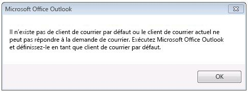
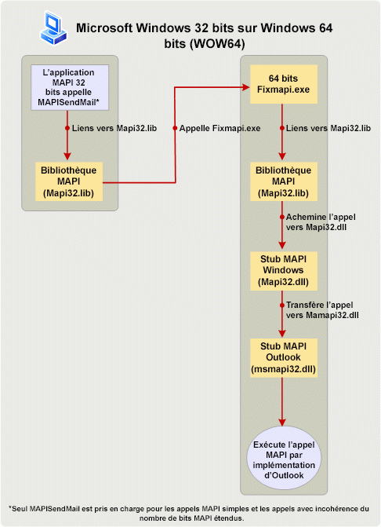

# Création d’applications MAPI sur les plateformes 32 bits et 64 bits

**S’applique à** : Outlook 2013 | Outlook 2016 
  
Cette rubrique décrit les actions à effectuer par les développeurs MAPI pour modifier et régénérer les applications MAPI 32 bits afin qu’elles s’exécutent sur une plateforme 64 bits, et les applications 64 bits afin qu’elles s’exécutent sur une plateforme 32 bits. Dans cette rubrique, une plateforme 64 bits est un ordinateur sur lequel sont installés Microsoft Outlook 64 bits et Windows 64 bits, et une plateforme 32 bits est un ordinateur sur lequel sont installés Outlook 32 bits et Windows 32 bits ou 64 bits. 
  
## Prise en charge du système d’exploitation et d’Office pour Outlook 64 bits

> [!NOTE]
> Le nombre de bits fait référence à la distinction entre les architectures de processeur 32 bits et 64 bits et la compatibilité des applications associée. Dans cette rubrique, le nombre de bits est utilisé pour qualifier la version de Windows, de Microsoft Office, d’Outlook ou d’une application MAPI conçue pour une architecture de processeur 32 bits ou 64 bits d’un ordinateur, et éventuellement d’autres applications qui s’exécutent sur cet ordinateur. 
  
À partir de Microsoft Office 2010, Outlook est disponible comme une application 32 bits et 64 bits. Sur le même ordinateur, le nombre de bits d’Outlook dépend du nombre de bits du système d’exploitation Windows (x86 ou x64) et de Microsoft Office, si Office est déjà installé sur cet ordinateur. Certains des facteurs déterminant la faisabilité de l’installation de la version 32 bits ou 64 bits d’Outlook sont les suivants :
  
- Office 32 bits (et Outlook 32 bits) peuvent être installés sur une version 32 bits ou 64 bits du système d’exploitation Windows. Office 64 bits (Outlook 64 bits) peuvent uniquement être installés sur un système d’exploitation 64 bits.
    
- L'installation par défaut d’Office sur une version 64 bits du système d'exploitation Windows est Office 32 bits.
    
- Le nombre de bits d’une version installée d’Outlook est toujours le même que le nombre de bits d’Office, si Office est installé sur le même ordinateur. Autrement dit, une version 32 bits d’Outlook ne peut pas être installée sur un ordinateur où des versions 64 bits d’autres applications Office sont déjà installées (Microsoft Word 64 bits ou Microsoft Excel 64 bits, par exemple). De même, une version 64 bits d’Outlook ne peut pas être installée sur un ordinateur où des versions 32 bits d’autres applications Office sont déjà installées.
    
## Préparation d’applications MAPI pour des plateformes 32 bits et 64 bits

Les applications MAPI incluent des applications autonomes telles que Microsoft Communicator et MFCMAPI, ainsi que des fournisseurs de services tels que les fournisseurs de carnet d’adresses, de magasins et de transport. Pour que les appels de méthode et de fonction MAPI fonctionnent dans une application MAPI (à l’exception d’une fonction Simple MAPI, MAPISendMail), le nombre de bits de l’application MAPI doit être identique au nombre de bits du sous-système MAPI de l’ordinateur où l’application doit s’exécuter. Le nombre de bits du sous-système MAPI, à son tour, est déterminé par le nombre de bits de la version installée d’Outlook et est toujours identique à ce dernier. Le tableau suivant récapitule les actions nécessaires pour préparer les applications MAPI qui doivent s’exécuter sur des ordinateurs configurés avec Office et Windows avec des nombres de bits différents.
  
|Nombre de bits de l’application MAPI|Nombre de bits d’Outlook sur un ordinateur ciblé|Nombre de bits de Windows sur un ordinateur ciblé|Action nécessaire pour qu’une application puisse s’exécuter sur un ordinateur ciblé|
|:-----|:-----|:-----|:-----|
|32 bits    |32 bits    |32 bits ou 64 bits    |Aucune action n’est nécessaire.    |
|32 bits    |64 bits    |64 bits    |Reconstruire l’application comme une application 64 bits. Sinon, tous les appels de méthode et de fonction MAPI (à l’exception de **MAPISendMail**) échoueront.    |
|64 bits    |64 bits    |64 bits    |Aucune action n’est nécessaire.    |
|64 bits    |32 bits    |32 bits ou 64 bits    |Reconstruire l’application comme une application 32 bits. Sinon, tous les appels de méthode et de fonction MAPI (à l’exception de **MAPISendMail**) échoueront.    |
   
Les sections suivantes expliquent chaque scénario de façon plus détaillée. Pour des scénarios nécessitant la reconstruction de l’application MAPI, reportez-vous à la rubrique [Lien vers les fonctions MAPI](how-to-link-to-mapi-functions.md) pour plus d’informations concernant la liaison aux fonctions MAPI et leur appel. 
  
### Application MAPI 32 bits et Outlook 32 bits

Les applications MAPI compilées pour un sous-système MAPI 32 bits qui est disponible dans des versions 32 bits d’Outlook (y compris les versions antérieures à Microsoft Outlook 2013), continuent à être prises en charge sur les ordinateurs sur lesquels sont installés Outlook 32 bits et un système d’exploitation Windows 32 bits ou 64 bits. Aucune action spécifique n’est nécessaire pour les développeurs d’applications.
  
### Application MAPI 32 bits et Outlook 64 bits

Les applications MAPI 32 bits ne peuvent pas s’exécuter sur un ordinateur sur lequel sont installés Outlook 64 bits et Windows 64 bits. Le développeur d’applications doit mettre à jour et reconstruire l’application comme une application 64 bits pour la plateforme 64 bits. En effet, une application 32 bits ne peut pas charger un fichier Msmapi32.dll 64 bits. Les développeurs d’applications doivent incorporer un petit nombre de modifications d’API pour créer leur code pour un environnement 64 bits. Les fichiers d’en-tête MAPI ont été mis à jour avec ces modifications pour prendre en charge la plateforme 64 bits. Vous pouvez télécharger ces fichiers d’en-tête en vous reportant à la rubrique relative à [Outlook 2010 : fichiers d’en-tête MAPI](https://www.microsoft.com/downloads/details.aspx?FamilyID=f8d01fc8-f7b5-4228-baa3-817488a66db1). Les développeurs peuvent utiliser ce même ensemble de fichiers d’en-tête MAPI pour créer des applications MAPI 32 bits et 64 bits.
  
### Application MAPI 64 bits et Outlook 64 bits

Les applications MAPI 64 bits sont prises en charge sur les ordinateurs sur lesquels sont installés Outlook 64 bits et Windows 64 bits. Aucune action n’est nécessaire pour les développeurs d’applications.
  
### Application MAPI 64 bits et Outlook 32 bits

Les applications MAPI 64 bits ne peuvent pas s’exécuter sur un ordinateur sur lequel sont installés Outlook 32 bits et Windows 32 bits ou 64 bits. Le développeur d’applications doit mettre à jour et reconstruire l’application comme une application 32 bits pour Outlook 32 bits. Utilisez les fichiers d’en-tête MAPI mis à jour, qui peuvent être téléchargés depuis la rubrique relative à [Outlook 2010 : fichiers d’en-tête MAPI](https://www.microsoft.com/downloads/details.aspx?FamilyID=f8d01fc8-f7b5-4228-baa3-817488a66db1). Les développeurs peuvent utiliser ce même ensemble de fichiers d’en-tête MAPI pour créer des applications MAPI 32 bits et 64 bits.
  
### Exception : MAPISendMail

En règle générale, une application MAPI 32 bits ne doit pas s’exécuter sur une plateforme 64 bits (Outlook 64 bits sur Windows 64 bits) sans avoir été reconstruite au préalable comme une application 64 bits, et une application MAPI 64 bits ne doit pas s’exécuter sur un ordinateur sur lequel sont installés Outlook 32 bits et Windows 32 bits ou 64 bits sans avoir été reconstruite au préalable comme une application 32 bits. La figure 1 montre une boîte de dialogue d’alerte qui s’affiche si l’un de ces scénarios se produit.
  
**Figure 1. Message d’erreur pour la plupart des appels MAPI avec incohérence du nombre de bits.**

  
Toutefois, un appel de fonction parmi tous les éléments Simple MAPI et MAPI, **MAPISendMail**, aurait lieu dans un scénario Windows-32-bits-sur-Windows-64-bits (WOW64) ou Windows-64-bits-sur-Windows-32-bits (WOW32) et n’entraînerait pas l’alerte précédente. Ce scénario WOW64 s’applique uniquement à Windows 7. 

La figure 2 illustre un scénario WOW64 dans lequel une application MAPI 32 bits appelle **MAPISendMail** sur un ordinateur sur lequel est installé Windows 7 64 bits. Dans ce scénario, la bibliothèque MAPI effectue un appel COM pour lancer une application Fixmapi 64 bits. L’application Fixmapi établit implicitement un lien vers la bibliothèque MAPI, qui achemine l’appel de fonction au stub MAPI Windows qui, à son tour, transmet l’appel au stub MAPI Outlook, ce qui permet d’effectuer l’appel de fonction **MAPISendMail**. 
  
**Figure 2. Traitement de MAPISendMail dans un scénario WOW64.**

  
## Voir aussi

- [Lien vers les fonctions MAPI](how-to-link-to-mapi-functions.md)

