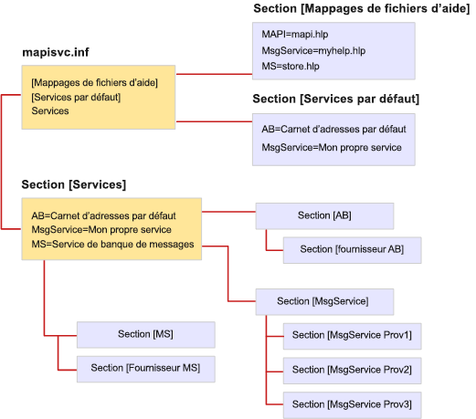

# Format de fichier de MapiSvc.inf

**S’applique à** : Outlook 2013 | Outlook 2016 
  
Le fichier MapiSvc.inf agit comme la base de données centrale pour les informations de configuration du service de messagerie MAPI. MapiSvc.inf contient des informations sur chacun des services de messagerie installés sur les stations de travail, les informations sur les fournisseurs de services appartenant à chaque service de messagerie et les informations sur le sous-système MAPI. MapiSvc.inf est la source principale d’informations pour les profils. Autrement dit, quand un nouveau profil est créé ou qu’un profil existant est modifié, des informations pertinentes pour chaque service de messagerie ou fournisseur de services sont copiées à partir de MapiSvc.inf. 
  
MapiSvc.inf est divisé en sections hiérarchiques liées :
  
1. Section contenant des informations qui s’applique à tous les profils. Cette section se compose de trois parties :
    
   - Section **[Services]** fournissant des liens vers chacune des sections de service de messagerie suivantes. 
    
   - Section **[Help File Mappings]** contenant des informations relatives aux fichiers .HLP fournis par les services de messagerie. 
    
   - Section **[Default Services]** répertoriant les services de messagerie qui composent une installation par défaut. 
    
2. Section contenant des informations qui s’appliquent aux services de messagerie individuels. Les entrées de ces sections fournissent des liens vers les sections de fournisseur de services suivantes.
    
3. Section contenant des informations qui s’appliquent aux fournisseurs de services individuels dans un service de messagerie.
    
L’illustration suivante montre l’organisation d’un fichier MapiSvc.inf classique. Il existe trois services de messagerie : AB, MsgService et MS. Le nom situé à droite du signe égal pour chaque service de messagerie est le nom d’affichage du service. Chaque service de messagerie possède sa propre section quelque part dans le fichier qui est liée à une ou plusieurs sections de fournisseur de services. Il existe une section de fournisseur de service pour chaque fournisseur de services lié au service de messagerie. Les services de messagerie AB et MS sont des services de fournisseur unique tandis que le service MsgService comprend trois fournisseurs de services.
  
**Organisation du fichier MapiSvc.inf**
  

  
MAPI fournit une version squelette du fichier MapiSvc.inf contenant les entrées du sous-système MAPI. Chaque intervenant du service de messagerie ajoute des entrées adaptées à la fois pour leur service et les fournisseurs de services appartenant à leur service. Certaines des entrées sont requises alors que d’autres sont facultatives. Par exemple, MAPI nécessite que vous spécifiiez le nom et le chemin d’accès de chacun des fournisseurs de services dans votre service de messagerie. Sans ces informations, les fournisseurs de services ne peuvent pas être chargés.
  
Vous pouvez ajouter des informations obligatoires et facultatives dans la section de votre service de messagerie ou les sections de fournisseur de services. L’emplacement de stockage des informations décrivant votre service de messagerie dépend du nombre de fournisseurs de services existants dans le service. Étant donné que ces informations s’appliquent à chaque fournisseur de services existants dans le service, vous devez les rendre accessibles à tous les fournisseurs. Stockez-les dans la section de service de messagerie, l’option par défaut, ou dans toutes les sections de fournisseur de services. Stockez les informations une fois pour éviter toute duplication inutile et ne pas conserver des copies multiples synchronisées.
  
Si votre service de messagerie est un service de fournisseur unique, stockez toutes les informations de service de messagerie dans la section du fournisseur de services plutôt que dans la section du service. Accéder à la section du fournisseur de services est plus rapide et plus direct qu’accéder à la section du service de messagerie. 
  
Dans le fichier MapiSvc.inf, ne stockez que les données de configuration publiques. Les informations privées ou qui nécessitent une protection supplémentaire, comme les mots de passe ou d’autres informations d’identification, ne devraient pas être incluses dans ce fichier. Au lieu de cela, choisissez de ne pas stocker les informations de ce type ou de les conserver dans le profil en tant que propriétés sécurisées. Les propriétés sécurisées offrent des fonctionnalités de protection intégrées telles que le chiffrement.
  
## Référence

Pour plus d’informations sur la résolution des erreurs si MAPI bloque une DLL de fournisseur, voir [Comment autoriser MAPI à charger les DLL du fournisseur non enregistré](https://support.microsoft.com/topic/how-to-allow-mapi-to-load-unregistered-provider-dlls-18d9a1cd-d3d7-fa10-473e-5dfd62d38b0d).

