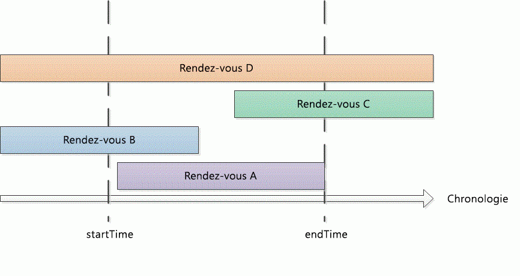

# <a name="search-and-obtain-appointments-in-a-time-range"></a>Effectuer des recherches et obtenir des rendez-vous dans un intervalle de temps

Cet exemple envoie les rendez-vous dans un intervalle de temps spécifique dans le calendrier Microsoft Outlook par défaut.

## <a name="example"></a>Exemple

Cet exemple de code contienne deux méthodes : DemoAppointmentsInRange et GetAppointmentsInRange. DemoAppointmentsInRange a obtenu le calendrier par défaut pour le profil d’Outlook connecté, avec une plage de dates de 5 jours à partir de 00:00. Aujourd'hui, appellez GetAppointmentsInRange pour obtenir des rendez-vous qui se trouvent dans cet intervalle de temps et affiche l’objet et le début de chaque rendez-vous envoyés.

GetAppointmentsInRange accepte un dossier Outlook et les valeurs de début et fin **DateTime** de l’intervalle de temps en tant que paramètres d’entrée. Cette méthode utilise la méthode [Restrict(String)](https://msdn.microsoft.com/library/bb612531\(v=office.15\)) et une chaîne de filtre dans format Jet qui envoie les rendez-vous qui commencent et se terminent au sein de la plage horaire donnée. En supposant que \[début\] et \[fin\] sont l’heure de début et l’heure de fin d’un rendez-vous et startTime et endTime sont l’heure de début et de fin de la plage horaire donnée, GetAppointmentsInRange configure un filtre qui recherche les rendez-vous avec `[Start]>=startTime`, et `[End]<=endTime`. Le code suivant montre le filtre Jet dans C\#.

```csharp
string filter = "[Start] >= '"
    + startTime.ToString("g")
    + "' AND [End] <= '"
    + endTime.ToString("g") + "'";
```

Avant d’appeler la méthode **Items.Restrict** pour rechercher des rendez-vous, GetAppointmentsInRange procède à deux autres actions pour inclure les rendez-vous périodiques qui se produisent dans l’intervalle de temps spécifié :

- Définit la propriété [IncludeRecurrences](https://msdn.microsoft.com/library/bb646522\(v=office.15\)) de la collection [éléments](https://msdn.microsoft.com/library/bb645287\(v=office.15\)).

- Trie les éléments de rendez-vous dans le dossier de calendrier donné par la propriété[Démarrer](https://msdn.microsoft.com/library/bb647263\(v=office.15\)).

Par ailleurs, si vous cherchez également des rendez-vous qui se chevauchent partiellement ou entièrement dans l’intervalle de temps spécifié, vous devez spécifier un filtre différent pour renvoyer les autres types de rendez-vous (comme illustré dans la Figure 1) :

- Rendez-vous qui commencent et se terminent dans l’intervalle de temps spécifié (par exemple, rendez-vous A) :<br/><br/>`[Start]>=startTime and [End]<=endTime`

- Rendez-vous qui commencent avant mais se terminent dans l’intervalle de temps spécifié (par exemple, rendez-vous B) :<br/><br/>`[Start]<startTime and [End]<=endTime`

- Rendez-vous qui commencent dans mais se terminent après l’intervalle de temps spécifié (par exemple, rendez-vous C) :<br/><br/>`[Start]>=startTime and [End]>endTime`

- Rendez-vous qui commencent avant mais se terminent après l’intervalle de temps spécifié (par exemple, rendez-vous D) :<br/><br/>`[Start]<startTime and [End]>endTime`

**Figure 1. Types de rendez-vous qui se produisent au sein d’un intervalle de temps ou se chevauchent dans ce laps de temps**


 

Étant donné que dans n’importe quelle plage horaire `startTime<=endTime`, un filtre avec `[Start]<=endTime` et `[End]>=startTime` capturerait les types de rendez-vous précédents de cette plage horaire.

Dans C\#, vous pouvez exprimer le filtre Jet comme suit.

```csharp
string filter = "[Start] <= '"
    + endTime.ToString("g")
    + "' AND [End] >= '"
    + startTime.ToString("g") + "'";
```

Le code suivant montre l’exemple complet. Si vous utilisez Visual Studio pour tester cet exemple de code, vous devez d’abord ajouter une référence au composant Bibliothèque d’objets Microsoft Outlook 15.0 et spécifier la variable lorsque vous importez l’espace de noms **Microsoft.Office.Interop.Outlook**. L'instruction **Importer** ou **utilisation** ne doit pas se produire juste avant les fonctions de l'exemple de code, mais doit être ajoutée avant la déclaration publique. Les lignes de code suivantes montrent comment effectuer l’importation et l’affectation dans Visual Basic et dans C\#.

```vb
Imports Outlook = Microsoft.Office.Interop.Outlook
```


```csharp
using Outlook = Microsoft.Office.Interop.Outlook;
```


```csharp
private void DemoAppointmentsInRange()
{
    Outlook.Folder calFolder =
        Application.Session.GetDefaultFolder(
        Outlook.OlDefaultFolders.olFolderCalendar)
        as Outlook.Folder;
    DateTime start = DateTime.Now;
    DateTime end = start.AddDays(5);
    Outlook.Items rangeAppts = GetAppointmentsInRange(calFolder, start, end);
    if (rangeAppts != null)
    {
        foreach (Outlook.AppointmentItem appt in rangeAppts)
        {
            Debug.WriteLine("Subject: " + appt.Subject 
                + " Start: " + appt.Start.ToString("g"));
        }
    }
}

/// <summary>
/// Get recurring appointments in date range.
/// </summary>
/// <param name="folder"></param>
/// <param name="startTime"></param>
/// <param name="endTime"></param>
/// <returns>Outlook.Items</returns>
private Outlook.Items GetAppointmentsInRange(
    Outlook.Folder folder, DateTime startTime, DateTime endTime)
{
    string filter = "[Start] >= '"
        + startTime.ToString("g")
        + "' AND [End] <= '"
        + endTime.ToString("g") + "'";
    Debug.WriteLine(filter);
    try
    {
        Outlook.Items calItems = folder.Items;
        calItems.IncludeRecurrences = true;
        calItems.Sort("[Start]", Type.Missing);
        Outlook.Items restrictItems = calItems.Restrict(filter);
        if (restrictItems.Count > 0)
        {
            return restrictItems;
        }
        else
        {
            return null;
        }
    }
    catch { return null; }
}
```

## <a name="see-also"></a>Voir aussi

- [Rechercher et filtrer](search-and-filter.md)

