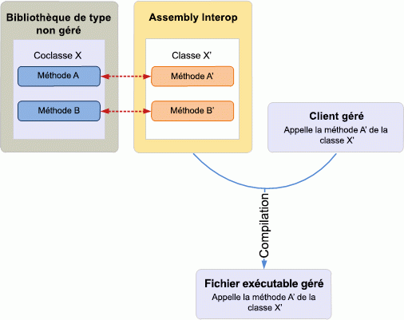
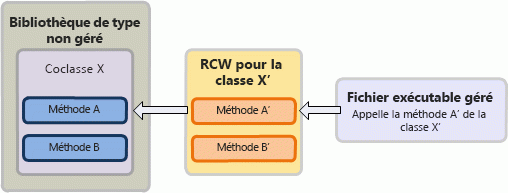

# Introduction à l'interopérabilité entre COM et .NET

Le modèle COM (Component Object Model) et la plateforme .NET utilisent des systèmes et des mécanismes de types extrêmement différents pour la gestion de la durée de vie des objets, ainsi que pour la création et l'héritage d'interfaces. 

Par exemple, un type de **variante** dans COM est un type de données **System.Object** dans l’infrastructure .NET. Pour créer un objet, un client COM appelle [CoCreateInstance](https://docs.microsoft.com/windows/desktop/api/combaseapi/nf-combaseapi-cocreateinstance), alors qu'un client managé peut utiliser des mots clés comme new ou New qui sont intégrés à un langage de programmation managée. 

Alors que le modèle COM ne prend pas en charge l'héritage classique et qu'un client COM gère un décompte de références interne fourni par [IUnknown (éventuellement en anglais)](https://docs.microsoft.com/windows/desktop/api/unknwn/nn-unknwn-iunknown) pour libérer une coclasse, un client managé utilise le récupérateur de mémoire du CLR fourni par .NET Framework pour libérer un objet. 

Étant donné ces différences entre COM et .NET, le développement d'un client managé sur un modèle objet COM requiert un mécanisme pour résoudre ces différences. Le wrapper RCW (Runtime Callable Wrapper) est un mécanisme qui favorise la communication transparente entre COM et le modèle de programmation managée.

Cette rubrique fournit une description détaillée de la manière dont le RCW facilite la communication entre COM et le modèle de programmation géré. Notez que même si Microsoft Visual Studio est utilisé dans cette rubrique pour illustrer le mécanisme RCW, vous pouvez utiliser une assemblée d'interopérabilité en dehors de Visual Studio pour développer un client managé.

## Faciliter l'interopérabilité : assemblée d'interopérabilité et wrapper RCW

### Temps de compilation

Une assemblée d’interopérabilité définit les interfaces gérées qui correspondent à une bibliothèque de types de base COM et avec lesquelles un client géré peut interagir. Pour utiliser une assemblée d’interopérabilité dans Visual Studio, commencer par ajouter une référence au composant COM correspondant. Visual Studio génère automatiquement une copie locale de l’assemblée d’interopérabilité. L’assemblée d’interopérabilité contient un espace de noms, sous lequel figure une interface équivalente gérée de chaque objet COM dans le modèle objet COM. 

Figure 1 illustre un client géré qui veut utiliser une bibliothèque de type COM qui définit la coclasse X. Le client géré appelle la classe X, qui est l’interface équivalente gérée pour la coclasse X, comme défini dans l’assemblée d’interopérabilité. Au moment de la compilation, le projet géré est compilé avec des informations sur la classe X à partir de l’assemblée d’interopérabilité.

**Figure 1. Une application gérée compilée avec une assemblée d’interopérabilité qui interagit avec une bibliothèque de type non gérée**

  
D'une manière générale, dès que vous définissez une référence à une bibliothèque de types, Visual Studio génère une copie d'un assembly d'interopérabilité pour cette bibliothèque. Il peut exister un nombre quelconque d'assemblys d'interopérabilité pour décrire le même type COM. Toutefois, une bibliothèque de types ne peut avoir qu'un seul assembly PIA qui est l'assembly d'interopérabilité publié par elle-même. À la différence des autres assemblys d'interopérabilité, l'assembly PIA n'est pas généré à chaque ajout d'une référence dans Visual Studio. En effet, vous installez l'assembly PIA dans le Global Assembly Cache (GAC) une seule fois sur un ordinateur. Lorsque vous ajoutez une référence à la bibliothèque de types, Visual Studio charge automatiquement l'assembly PIA.

Pour programmer une solution gérée pour Outlook, vous devez utiliser le PIA d’Outlook. Pour incorporer des informations provenant de l'assembly PIA Outlook dans un complément managé, vous devez commencer par installer l'assembly PIA Outlook dans le GAC. Si vous utilisez Visual Studio pour créer le projet managé, après avoir ajouté une référence à la bibliothèque de types Outlook, Visual Studio charge l'assembly PIA. Dans l'Explorateur d'objets, sous l'espace de noms Microsoft.Office.Interop.Outlook, sont affichées les interfaces managées dont les noms correspondent à des objets dans le modèle objet Outlook. Par exemple, l’interface compte correspond à l’objet**compte** dans le modèle objet Outlook. Lorsque vous compilez le projet géré, cette information est incorporée dans votre fichier exécutable.

### Temps d’exécution

Au moment de l'exécution, à partir des informations fournies par un assembly d'interopérabilité, le CLR .NET Framework crée un wrapper RCW pour chaque coclasse avec laquelle le client managé interagit. Notez que le runtime crée un seul wrapper RCW pour chaque coclasse, quel que soit le nombre d'interfaces obtenues par le client à partir de la coclasse. Le wrapper RCW est un type de classe .NET Framework qui enveloppe la coclasse COM. Le wrapper RCW garde une trace des instances de la coclasse et libère les références à celles-ci lorsque le client n'a plus besoin du wrapper RCW. De cette manière, un client managé n'a pas besoin de gérer la durée de vie d'un objet comme le devrait un client non managé sous COM.

La figure 2 illustre un wrapper RCW qui, au moment de l'exécution, intercepte un appel d'API provenant d'un client managé et, à partir des informations de l'assembly d'interopérabilité, mappe de manière transparente l'appel à l'API correspondante dans la coclasse COM. Le processus est décrit ci-dessous :

1.  Le client managé appelle la méthode A' de la X', comme définie dans l'assembly d'interopérabilité d'une bibliothèque de types COM.

2.  Si un wrapper RCW n'existe pas encore pour la classe X', le runtime .NET Framework utilise les informations de l'assembly d'interopérabilité et crée un wrapper RCW pour la classe X'.

3.  Le wrapper RCW intercepte l'appel à la méthode A', traduit les arguments en types COM correspondants et appelle la méthode A de la coclasse X, comme défini dans la bibliothèque de types COM.

**Figure 2. Un RCW intercepte un appel provenant d'un exécutable managé et le mappe à une coclasse dans une bibliothèque de types non managée**

  

## Voir aussi

- [Pourquoi utiliser le PIA d’Outlook](why-use-the-outlook-pia.md)
- [Installation et référencement le PIA Outlook](installing-and-referencing-the-outlook-pia.md)

