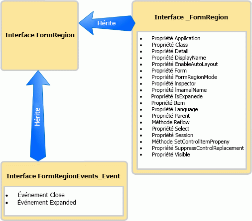

# <a name="methods-and-properties-in-the-outlook-pia"></a>Méthodes et propriétés dans l'assembly PIA Outlook

Cette rubrique décrit comment accéder aux méthodes et propriétés d’un objet dans le code managé à l’aide de l'assembly PIA Outlook (Primary Interop Assembly).

## <a name="where-helper-objects-come-from"></a>D'où viennent les objets d'assistance ?

Pour créer l'assembly PIA Outlook, Outlook utilise l'outil Type Library Importer (TLBIMP) de .NET Framework pour convertir les définitions de types de la bibliothèque de types COM en définitions équivalentes dans un assembly CLR (Common Language Runtime). Dans COM, un objet est une coclasse formée des éléments suivants :

- L'interface principale (par exemple l'interface [\_FormRegion](https://msdn.microsoft.com/library/bb645761\(v=office.15\))).

- L'interface d'événement (par exemple l'interface [FormRegionEvents](https://msdn.microsoft.com/library/bb611940\(v=office.15\))).

L'outil TLBIMP importe l'interface principale et l'interface d'événement pour chaque objet et crée un certain nombre d'interfaces, de délégués et de classes, dont les suivants :

- L'interface d'événement .NET (par exemple l'interface [FormRegionEvents\_Event](https://msdn.microsoft.com/library/bb647619\(v=office.15\))).

- La classe .NET (par exemple, la classe [FormRegionClass](https://msdn.microsoft.com/library/bb624204\(v=office.15\))).

- L'interface .NET principale (par exemple l'interface [FormRegion](https://msdn.microsoft.com/library/bb652633\(v=office.15\))).

## <a name="what-the-helper-objects-are-for"></a>À quoi servent les objets d'assistance ?

En continuant à utiliser l’objet **FormRegion** comme exemple, la liste suivante examine ce que contient chaque interface et classe répertoriées précédemment.

- L'interface \_FormRegion définit toutes les méthodes et propriétés de l'objet FormRegion. Vous n’utiliserez généralement pas cette interface dans le code, à l’exception d’une des conditions décrite ci-dessous.

- L'interface **FormRegionEvents** définit des méthodes qui sont mappées à des événements de FormRegion. Vous n’utiliserez pas cette interface dans le code.

- L'outil TLBIMP approfondit le traitement de l'interface **FormRegionEvents** de manière à créer l'interface **FormRegionEvents**\_Event qui définit tous les événements de FormRegion. Vous n’utiliserez généralement pas cette interface dans le code, à l’exception d’une des conditions décrite ci-dessous.

- La classe FormRegionClass définit tous les membres (méthodes, propriétés et événements) de FormRegion. Il s'agit de la classe qui est associée à l'interface FormRegion en arrière-plan afin que vous puissiez écrire du code pour créer une instance de l'interface FormRegion. Toutefois, vous n'utilisez pas cette interface directement dans le code.

- L'interface FormRegion hérite des interfaces \_FormRegion et **FormRegionEvents**\_Event. La figure 1 illustre cette relation d’héritage.
    
  **Figure 1. L'interface FormRegion hérite des méthodes et des propriétés de l'interface \_FormRegion et hérite des événements de l'interface FormRegionEvents\_Event**

  
    
  D’une manière générale, FormRegion est la seule interface que vous utilisez dans le code managé pour accéder à l’objet et aux membres (méthodes, propriétés et événements) de l’objet **FormRegion**.

Si l'objet **Application** est maintenant utilisé comme exemple, vous accédez aux objets, méthodes, propriétés et événements de l'objet **Application** via l'interface [Application](https://msdn.microsoft.com/library/bb646615\(v=office.15\)) . Il existe néanmoins trois exceptions pour lesquelles vous devez utiliser une autre interface, ou en fonction du langage, vous voudrez utiliser une autre interface :

- Lorsque vous accédez à une méthode qui partage le même nom qu'un événement, il est conseillé d'effectuer un cast en interface principale pour appeler la méthode. Par exemple, l’objet **Application** possède une méthode [Quit](https://msdn.microsoft.com/library/bb646614\(v=office.15\)) et un événement [Quit](https://msdn.microsoft.com/library/bb622595\(v=office.15\)). Dans Visual Basic .NET, vous pouvez accéder à la méthode Quit via l’interface Application. En C\#, vous pouvez éviter un avertissement du compilateur en effectuant un cast de la méthode Quit en interface principale, comme illustré dans l'exemple de code suivant :
    
   ```csharp
      void DemoApp()
      {
          Outlook.Application myApp = new Outlook.Application();
          // Other application code here
          ((Outlook._Application)myApp).Quit();
      }
   ```

- Lorsque vous accédez à un événement qui partage le même nom qu'une méthode de cet objet, vous devez effectuer un cast en interface d'événement appropriée pour vous connecter à l'événement. Comme dans l'exemple ci-dessus, pour vous connecter à l'événement Quit, vous effectuez un cast en interface [ApplicationEvents\_11\_Event](https://msdn.microsoft.com/library/bb622725\(v=office.15\)).

- Si vous vous connectez à une version antérieure d'un événement qui a par la suite été étendu dans une version ultérieure d'Outlook, vous devez vous connecter à la version de l'événement dans l'interface antérieure. Par exemple, si vous voulez vous connecter à la version de l'événement Quit pour l'objet **Application** implémenté pour Outlook 2002 plutôt qu'à la dernière version, connectez-vous à l'événement [Quit](https://msdn.microsoft.com/library/bb609660\(v=office.15\)) défini dans l'interface [ApplicationEvents\_10\_Event](https://msdn.microsoft.com/library/bb610098\(v=office.15\)), au lieu de l'événement Quit défini dans l'interface ApplicationEvents\_11\_Event.

## <a name="see-also"></a>Voir aussi

- [Mise en rapport de l'assembly PIA Outlook avec le modèle objet](relating-the-outlook-pia-with-the-object-model.md)
- [Objets dans l’assembly PIA Outlook](objects-in-the-outlook-pia.md)
- [Événements dans l'assembly PIA Outlook](events-in-the-outlook-pia.md)

