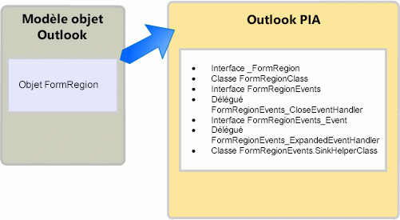

# <a name="objects-in-the-outlook-pia"></a><span data-ttu-id="c6d2d-102">Objets dans l’assembly PIA Outlook</span><span class="sxs-lookup"><span data-stu-id="c6d2d-102">Objects in the Outlook PIA</span></span>

<span data-ttu-id="c6d2d-103">Lors de l'exploration de l'assembly PIA (Primary Interop Assembly) Outlook dans un explorateur d'objets, vous pouvez remarquer que de nombreuses interfaces et classes ont des noms qui font référence à des objets familiers dans le modèle objet Outlook.</span><span class="sxs-lookup"><span data-stu-id="c6d2d-103">When browsing the Outlook Primary Interop Assembly (PIA) in an object browser, you may notice that many interfaces and classes have names referencing familiar objects in the Outlook object model.</span></span> <span data-ttu-id="c6d2d-104">Certains objets du modèle objet ont un mappage un-à-un à des interfaces dans l'assembly PIA.</span><span class="sxs-lookup"><span data-stu-id="c6d2d-104">Some objects in the object model have a one-to-one mapping to interfaces in the PIA.</span></span> 

<span data-ttu-id="c6d2d-105">Par exemple, **AddressEntry** est mappé à l'interface [AddressEntry](https://msdn.microsoft.com/library/bb609728\(v=office.15\)) et l'objet **AddressList** est mappé à l'interface [AddressList](https://msdn.microsoft.com/library/bb623538\(v=office.15\)) dans l'assembly PIA.</span><span class="sxs-lookup"><span data-stu-id="c6d2d-105">For example, the **AddressEntry** is mapped to the [AddressEntry](https://msdn.microsoft.com/library/bb609728\(v=office.15\)) interface and the **AddressList** object is mapped to the [AddressList](https://msdn.microsoft.com/library/bb623538\(v=office.15\)) interface in the PIA.</span></span> 

<span data-ttu-id="c6d2d-106">Cependant, la plupart des autres objets ont un mappage un-à-plusieurs dans l'assembly PIA.</span><span class="sxs-lookup"><span data-stu-id="c6d2d-106">However, most other objects have a one-to-many mapping in the PIA.</span></span> <span data-ttu-id="c6d2d-107">Ce mappage un-à-plusieurs s'applique à certains objets qui existaient avant Microsoft Office Outlook 2007, et à tous les objets ajoutés depuis Outlook 2007.</span><span class="sxs-lookup"><span data-stu-id="c6d2d-107">This one-to-many mapping applies to some objects that existed before Microsoft Office Outlook 2007, and all objects added since Outlook 2007.</span></span> <span data-ttu-id="c6d2d-108">Cette rubrique répertorie les interfaces, classes et délégués .NET par défaut qui sont mappés à un objet COM et décrit comment accéder à un objet dans l'assembly PIA Outlook.</span><span class="sxs-lookup"><span data-stu-id="c6d2d-108">This topic lists the typical .NET interfaces, classes, and delegates that are mapped to a COM object and describes how to access an object in the Outlook PIA.</span></span> <span data-ttu-id="c6d2d-109">Elle décrit également quelques exceptions dans l’assembly PIA Outlook où les objets sont masqués ou obsolètes dans le modèle objet COM.</span><span class="sxs-lookup"><span data-stu-id="c6d2d-109">It also describes a few exceptions in the Outlook PIA where the objects are hidden or deprecated in the COM-based object model.</span></span>

## <a name="helper-objects"></a><span data-ttu-id="c6d2d-110">Objets d’assistance</span><span class="sxs-lookup"><span data-stu-id="c6d2d-110">Helper objects</span></span>

<span data-ttu-id="c6d2d-p103">Cette section illustre les classes d'assistance par défaut pour un objet dans l'assembly PIA Outlook en utilisant l'objet **FormRegion** en guise d'exemple. L'objet **FormRegion** a été ajouté au modèle objet dans Outlook 2007. Les interfaces, classes et délégués illustrés à la Figure 1 sont liés à l'objet **FormRegion** dans l'assembly PIA.</span><span class="sxs-lookup"><span data-stu-id="c6d2d-p103">This section illustrates the typical helper classes for an object in the Outlook PIA by using the **FormRegion** object as an example. The **FormRegion** object was added to the object model in Outlook 2007. Related to the **FormRegion** object in the PIA are the interfaces, classes, and delegates, illustrated in Figure 1.</span></span>

<span data-ttu-id="c6d2d-114">**Figure 1. Objet FormRegion représenté dans le modèle objet Outlook et dans l’assembly PIA Outlook**</span><span class="sxs-lookup"><span data-stu-id="c6d2d-114">**Figure 1. The FormRegion object represented in the Outlook object model and in the Outlook PIA**</span></span>



<span data-ttu-id="c6d2d-116">L'interface que l'on utilise le plus pour accéder à l'objet **FormRegion** et à ses méthodes, propriétés et membres d'événements est l'interface [FormRegion](https://msdn.microsoft.com/library/bb652633\(v=office.15\)) .</span><span class="sxs-lookup"><span data-stu-id="c6d2d-116">The one interface that you most often use to access the **FormRegion** object and its method, property, and event members is the [FormRegion](https://msdn.microsoft.com/library/bb652633\(v=office.15\)) interface.</span></span> <span data-ttu-id="c6d2d-117">Toutefois, il ne faut pas considérer l’interface .NET **FormRegion** comme le miroir exact de l’objet COM **FormRegion**. Si vous observez l’Explorateur d’objets dans Visual Studio, vous remarquerez que l’interface **FormRegion** hérite d’une autre interface, l’interface [\_FormRegion](https://msdn.microsoft.com/library/bb645761\(v=office.15\)).</span><span class="sxs-lookup"><span data-stu-id="c6d2d-117">However, you should not consider the **FormRegion** .NET interface as an exact mirror image of the **FormRegion** COM object; if you look at the Object Browser in Visual Studio, you will find that the **FormRegion** interface inherits from another interface, the [\_FormRegion](https://msdn.microsoft.com/library/bb645761\(v=office.15\)) interface.</span></span> <span data-ttu-id="c6d2d-118">En fait, l'interface **FormRegion** est simplement l'une des quelques interfaces et classes qui résultent de la création de l'assembly PIA Outlook sur la base de la bibliothèque de types COM.</span><span class="sxs-lookup"><span data-stu-id="c6d2d-118">In fact, the **FormRegion** interface is just one of the few interfaces and classes that result from creating the Outlook PIA based on the COM type library.</span></span>

<span data-ttu-id="c6d2d-p105">Pour créer l'assembly PIA Outlook, Outlook utilise l'importateur de bibliothèques de types (TLBIMP) dans le .NET Framework pour convertir les définitions de types dans la bibliothèque de types COM en définitions équivalentes dans un assembly CLR (Common Language Runtime). Dans COM, l'objet **FormRegion** est en fait une coclasse constituée des deux interfaces suivantes définissant les interfaces implémentées par l'objet **FormRegion**:</span><span class="sxs-lookup"><span data-stu-id="c6d2d-p105">To create the Outlook PIA, Outlook uses the Type Library Importer (TLBIMP) in the .NET Framework to convert type definitions in the COM type library into equivalent definitions in a Common Language Runtime assembly. In COM, the **FormRegion** object is actually a coclass that consists of the following two interfaces defining the interfaces that the **FormRegion** object implements:</span></span>

- <span data-ttu-id="c6d2d-121">l’interface principale **\_FormRegion** ;</span><span class="sxs-lookup"><span data-stu-id="c6d2d-121">The primary interface **\_FormRegion**</span></span>

- <span data-ttu-id="c6d2d-122">l’interface d’événement [FormRegionEvents](https://msdn.microsoft.com/library/bb611940\(v=office.15\)).</span><span class="sxs-lookup"><span data-stu-id="c6d2d-122">The event interface [FormRegionEvents](https://msdn.microsoft.com/library/bb611940\(v=office.15\))</span></span>

<span data-ttu-id="c6d2d-123">TLBIMP importe directement **\_FormRegion** et **FormRegionEvents** à partir de la bibliothèque de types.</span><span class="sxs-lookup"><span data-stu-id="c6d2d-123">TLBIMP directly imports **\_FormRegion** and **FormRegionEvents** from the type library.</span></span>

<span data-ttu-id="c6d2d-p106">En plus d'importer l'interface principale et l'interface d'événement, TLBIMP crée une interface .NET portant le même nom que l'objet COM et une classe .NET qui utilise le nom de l'objet et y ajoute le terme « Class ». Dans le cas de l'objet **FormRegion**, TLBIMP crée les éléments suivants :</span><span class="sxs-lookup"><span data-stu-id="c6d2d-p106">Other than importing the primary interface and event interface, TLBIMP creates a .NET interface that has the same name as the COM object, and a .NET class that uses the name of the object and appends it with "Class". In the case of the **FormRegion** object, TLBIMP creates the following:</span></span>

- <span data-ttu-id="c6d2d-126">l'interface .NET **FormRegion**;</span><span class="sxs-lookup"><span data-stu-id="c6d2d-126">The .NET interface **FormRegion**</span></span>

- <span data-ttu-id="c6d2d-127">la classe .NET [FormRegionClass](https://msdn.microsoft.com/library/bb624204\(v=office.15\)) .</span><span class="sxs-lookup"><span data-stu-id="c6d2d-127">The .NET class [FormRegionClass](https://msdn.microsoft.com/library/bb624204\(v=office.15\))</span></span>

<span data-ttu-id="c6d2d-p107">Parmi les interfaces.NET et les classes .NET mentionnées dans cette rubrique, il convient de toujours utiliser l'interface .NET créée par TLBIMP pour accéder à un objet. Par exemple, pour accéder à un objet **FormRegion** en VB, on utilise toujours l'interface **FormRegion**, comme dans l'exemple de code suivant :</span><span class="sxs-lookup"><span data-stu-id="c6d2d-p107">Of the .NET interfaces and .NET class mentioned in this topic, you always use the .NET interface that TLBIMP creates to access an object. For example, to access a **FormRegion** object in VB, you always use the **FormRegion** interface, as in the following code example:</span></span>

```vb
Imports Outlook = Microsoft.Office.Interop.Outlook
Sub DemoFormRegion(ByVal Region As Outlook.FormRegion)
    Dim MyFormRegion As Outlook.FormRegion = Region
    ' Additional method code here
End Sub
```

<br/>

```csharp
using Outlook = Microsoft.Office.Interop.Outlook; 
void DemoFormRegion(Outlook.FormRegion region) 
{
    Outlook.FormRegion myFormRegion = region; 
    // Additional method code here
}
```

<span data-ttu-id="c6d2d-130">Pour plus d’informations sur le rôle de l’interface principale et de la classe .NET importées et créées par TLBIMP, reportez-vous à la rubrique [Méthodes et propriétés dans l’assembly PIA Outlook](methods-and-properties-in-the-outlook-pia.md).</span><span class="sxs-lookup"><span data-stu-id="c6d2d-130">For information about the purpose of the primary interface and the .NET class that TLBIMP imports and creates respectively, see [Methods and properties in the Outlook PIA](methods-and-properties-in-the-outlook-pia.md).</span></span> <span data-ttu-id="c6d2d-131">Pour plus d’informations sur l’objectif des interfaces liées aux événements, les délégués et les récepteurs des classes d’assistance, reportez-vous à l’article relatif aux [événements dans l’assembly PIA Outlook](events-in-the-outlook-pia.md).</span><span class="sxs-lookup"><span data-stu-id="c6d2d-131">For information about the purpose of the event-related interfaces, delegates, and sink helper classes, see [Events in the Outlook PIA](events-in-the-outlook-pia.md).</span></span>

## <a name="deprecated-objects"></a><span data-ttu-id="c6d2d-132">Objets obsolètes</span><span class="sxs-lookup"><span data-stu-id="c6d2d-132">Deprecated objects</span></span>

<span data-ttu-id="c6d2d-133">Les objets obsolètes dans la bibliothèque de types sont exposés dans l’assembly PIA Outlook.</span><span class="sxs-lookup"><span data-stu-id="c6d2d-133">Objects deprecated in the type library are exposed in the Outlook PIA.</span></span> <span data-ttu-id="c6d2d-134">Par exemple, les objets **\_DDocSiteControl** et **\_DRecipientControl** sont masqués dans la bibliothèque de types, mais sont exposés dans l’assembly PIA.</span><span class="sxs-lookup"><span data-stu-id="c6d2d-134">For example, the **\_DDocSiteControl** and **\_DRecipientControl** objects are hidden in the type library but are exposed in the PIA.</span></span>

<span data-ttu-id="c6d2d-135">Un autre exemple d’objet obsolète est l’objet **MAPIFolder**.</span><span class="sxs-lookup"><span data-stu-id="c6d2d-135">Another example of a deprecated object is the **MAPIFolder** object.</span></span> <span data-ttu-id="c6d2d-136">À compter de Outlook 2007, l'objet **Folder** remplace l'objet **MAPIFolder** dans le modèle objet.</span><span class="sxs-lookup"><span data-stu-id="c6d2d-136">Starting in Outlook 2007, the **Folder** object has replaced the **MAPIFolder** object in the object model.</span></span> <span data-ttu-id="c6d2d-137">Les solutions existantes doivent remplacer les références à **MAPIFolder** par **Folder**, et toutes les nouvelles solutions pour Outlook 2007 et versions ultérieures doivent utiliser uniquement l'objet **Folder**.</span><span class="sxs-lookup"><span data-stu-id="c6d2d-137">Existing solutions should replace references to **MAPIFolder** by **Folder**, and all solutions new for Outlook 2007 and after should use only the **Folder** object.</span></span> <span data-ttu-id="c6d2d-138">Pour les solutions non managées, l'Explorateur d'objets de Visual Basic Editor ne mentionne plus l'objet **MAPIFolder**, pas même sous forme masquée.</span><span class="sxs-lookup"><span data-stu-id="c6d2d-138">For unmanaged solutions, the Object Browser of the Visual Basic Editor no longer lists the **MAPIFolder** object, not even as a hidden object.</span></span> 

<span data-ttu-id="c6d2d-139">Pour les solutions managées, bien que l'assembly PIA Outlook expose une interface [Folder](https://msdn.microsoft.com/library/bb645774\(v=office.15\)) par le biais de laquelle vous accédez à l'objet **Folder** et à ses membres, l'assembly Outlook expose également [MAPIFolder](https://msdn.microsoft.com/library/bb624369\(v=office.15\)) en tant qu'interface qui définit les membres de l'objet **Folder**.</span><span class="sxs-lookup"><span data-stu-id="c6d2d-139">For managed solutions, even though the Outlook PIA exposes a [Folder](https://msdn.microsoft.com/library/bb645774\(v=office.15\)) interface through which you access the **Folder** object and its members, the Outlook PIA also exposes [MAPIFolder](https://msdn.microsoft.com/library/bb624369\(v=office.15\)) as an interface that defines the members of the **Folder** object.</span></span>

## <a name="see-also"></a><span data-ttu-id="c6d2d-140">Voir aussi</span><span class="sxs-lookup"><span data-stu-id="c6d2d-140">See also</span></span>

- [<span data-ttu-id="c6d2d-141">Mise en rapport de l’assembly PIA Outlook avec le modèle objet</span><span class="sxs-lookup"><span data-stu-id="c6d2d-141">Relating the Outlook PIA with the object model</span></span>](relating-the-outlook-pia-with-the-object-model.md)


