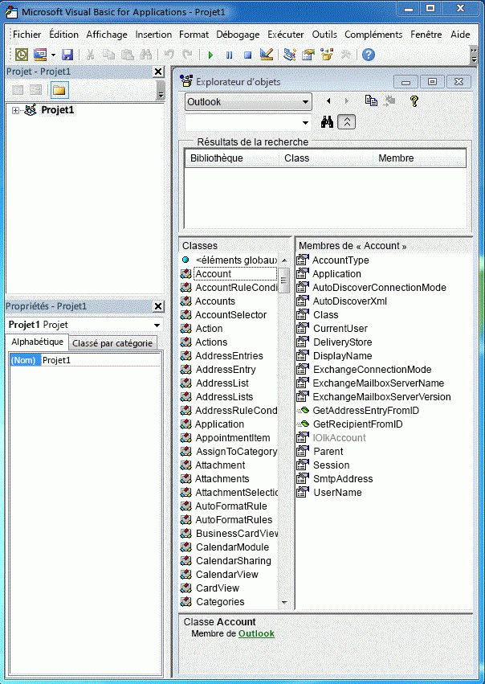
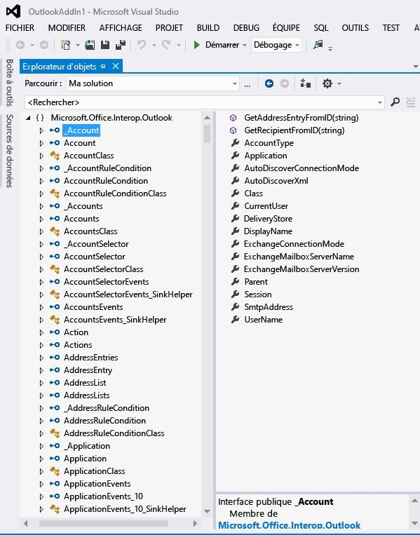

# Liaison de l’assembly PIA Outlook au modèle objetRelating the Outlook PIA with the object model

L’assembly PIA (Primary Interop Assembly) Outlook est un assembly d’interopérabilité officiellement publié par Outlook définissant une interface managée permettant aux compléments managés d’interagir avec le modèle objet COM d’Outlook.The Outlook Primary Interop Assembly (PIA) is an interop assembly officially published by Outlook defining a managed interface for managed add-ins to interact with the COM-based Outlook object model. [Introduction à l’interopérabilité entre COM et .NET](introduction-to-interoperability-between-com-and-net.md) décrit, du point de vue technique, comment un assembly d’interopérabilité prend en charge une programmation client managée sur une bibliothèque de types COM.[Introduction to interoperability between COM and .NET](introduction-to-interoperability-between-com-and-net.md) describes technically how an interop assembly supports a managed client programming against a COM-based type library. Cette rubrique fournit une vue d'ensemble de la façon dont les objets et membres d'un modèle objet COM Outlook sont mappés aux interfaces et classes managées correspondantes dans l'assembly PIA.This topic gives an overview of how objects and members in the COM-based Outlook object model are mapped to corresponding managed interfaces and classes in the PIA.

## Objets d’assistanceHelper objects

Lorsque l’on compare les objets de la bibliothèque d’objets Outlook répertoriés dans l’Explorateur d’objets de Visual Basic Editor, comme à la Figure 1, avec les objets de l’assembly PIA répertoriés dans l’Explorateur d’objets de Visual Studio, comme à la Figure 2, on peut être surpris du très grand nombre d’objets d’assistance supplémentaires qui existent dans l’assembly PIA.When you compare the objects of the Outlook type library listed in the object browser of the Visual Basic Editor, as in Figure 1, with the objects of the PIA listed in the object browser of Visual Studio, as in Figure 2, you might be overwhelmed by the large number of extra helper objects that exist in the PIA. Vous remarquerez peut-être que certains objets, tels l'objet **Action**, sont mappés à une interface, l'interface [Action](https://msdn.microsoft.com/library/bb646971\(v=office.15\)) , tandis que d'autres objets, tels l'objet **Account**, ne sont pas nécessairement mappés à exactement une interface correspondante dans l'assembly PIA.You might notice that some objects, such as the **Action** object, maps to one interface, the [Action](https://msdn.microsoft.com/library/bb646971\(v=office.15\)) interface, but other objects, like the **Account** object, do not necessarily map to exactly one corresponding interface in the PIA.

**Figure 1. Explorateur d’objets montrant les objets de la bibliothèque d’objets COM d’Outlook****Figure 1. Object browser showing objects in the COM-based Outlook type library**

**Figure 2. Explorateur d’objets montrant les objets d’Outlook****Figure 2. Object browser showing objects in Outlook**

Parmi ces interfaces, une grande partie ont des noms qui commencent par un caractère de soulignement (’\_’) suivi d’un nom d’objet.Among these interfaces, many of them have names that begin with an underscore ('\_') followed by an object name. Par exemple, l’objet **Account** est mappé à une interface publique \_Account et à une classe publique Account dans l’Explorateur d’objets de Visual Studio.For example, the **Account** object maps to a public interface \_Account and a public class Account in the Visual Studio object browser. En fait, bien que cela ne soit pas affiché de manière explicite dans l’Explorateur d’objets de Visual Studio, l’objet **Account** est mappé à deux interfaces et à une classe dans l’assembly PIA : une interface [\_Account](https://msdn.microsoft.com/library/bb609471\(v=office.15\)), une coclasse [Account](https://msdn.microsoft.com/library/bb645103\(v=office.15\)) et une classe [AccountClass](https://msdn.microsoft.com/library/bb645768\(v=office.15\)).In fact, though not shown explicitly in the Visual Studio object browser, the **Account** object is mapped to two interfaces and one class in the PIA: an [\_Account](https://msdn.microsoft.com/library/bb609471\(v=office.15\)) interface, an [Account](https://msdn.microsoft.com/library/bb645103\(v=office.15\)) coclass, and an [AccountClass](https://msdn.microsoft.com/library/bb645768\(v=office.15\)) class. 

Pour plus d'informations sur ces interfaces, coclasses et classes, sur leur provenance et sur la façon dont les objets sont mappés de la bibliothèque de types vers l'assembly PIA, voir [Objets dans l'assembly PIA Outlook](objects-in-the-outlook-pia.md).For more information about these interfaces, coclasses and classes, where they come from, and how objects are mapped from the type library to the PIA, see [Objects in the Outlook PIA](objects-in-the-outlook-pia.md).

## Interfaces d’événements distinctesSeparate event interfaces

Si l'on examine les objets qui ont des événements, on constate que les événements de l'assembly PIA ne sont pas groupés avec d'autres membres de méthodes et propriétés de cet objet, mais sont plutôt regroupés de façon à former leurs propres interfaces, gestionnaires d'événements et classes.If you examine objects that have events, events in the PIA are not grouped together with other method and property members of that object, but are grouped to form their own interfaces, event handlers, and classes. 

Pour plus d’informations sur la façon dont les méthodes et propriétés sont mappées de la bibliothèque de types vers l’assembly PIA, reportez-vous à la rubrique [Méthodes et propriétés dans l’assembly PIA Outlook](methods-and-properties-in-the-outlook-pia.md).For more information about how methods and properties are mapped from the type library to the PIA, see [Methods and properties in the Outlook PIA](methods-and-properties-in-the-outlook-pia.md). Pour plus d’informations sur les interfaces d’événements, les délégués et les classes, reportez-vous à la rubrique [Événements dans l’assembly PIA Outlook](events-in-the-outlook-pia.md).For more information about event interfaces, delegates, and classes, see [Events in the Outlook PIA](events-in-the-outlook-pia.md).

## Objets masqués et obsolètesHidden and deprecated objects

L’assembly PIA contient aussi des objets, membres et énumérations qui ont été déconseillés et éventuellement marqués comme masqués dans le modèle objet COM.The PIA also contains objects, members, and enumerations that have been deprecated and optionally marked as hidden in the COM object model. La plupart de ces objets, membres et énumérations sont exposés dans l'assembly PIA.Most of these objects, members, and enumerations are exposed in the PIA. Toutefois, ils sont exposés uniquement à des fins d'exhaustivité de l'assembly PIA ; ils ne sont plus censés être utilisés par les développeurs de solutions et sont par conséquent très peu documentés.However, they are exposed for the completeness of the PIA; they are no longer intended to be used by solution developers and are therefore minimally documented. Il existe quelques exceptions telles que les objets **\_DocSiteControl** et **\_RecipientControl**, qui sont masqués dans la bibliothèque de types mais sont exposés et documenté comme objets de première classe dans la référence de l’assembly PIA.A few exceptions exist such as the **\_DocSiteControl** and **\_RecipientControl** objects, which are hidden in the type library but are exposed and documented as first class objects in the PIA reference. 

Pour plus d’informations sur l’objet **\_DocSiteControl**, reportez-vous à [\_DDocSiteControl](https://msdn.microsoft.com/library/bb609520\(v=office.15\)).For more information about the **\_DocSiteControl** object, see [\_DDocSiteControl](https://msdn.microsoft.com/library/bb609520\(v=office.15\)). Pour plus d’informations sur l’objet **\_RecipientControl**, reportez-vous à [\_DRecipientControl](https://msdn.microsoft.com/library/bb609501\(v=office.15\)).For more information about the **\_RecipientControl** object, see [\_DRecipientControl](https://msdn.microsoft.com/library/bb609501\(v=office.15\)).

