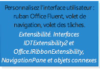
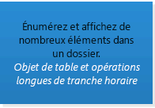
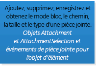
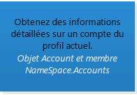
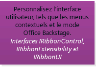
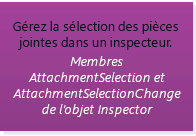
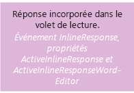
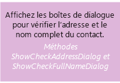
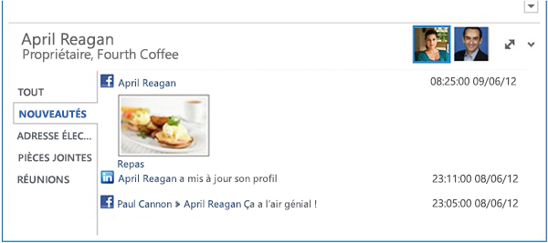
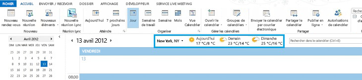

# Sélection d’une API ou d’une technologie pour le développement de solutions pour OutlookSelecting an API or technology for developing solutions for Outlook

Cet article décrit les API et technologies que vous pouvez utiliser pour étendre Outlook 2013 et vous aide à choisir l'API ou la technologie adaptée à votre scénario.This article describes the APIs and technologies you can use to extend Outlook 2013, and helps you decide the appropriate API or technology for your scenario.
  
Microsoft prend en charge diverses API et des technologies qui étendent Outlook :Microsoft supports various APIs and technologies that extend Outlook: 
  
- Nouveauté dans Office 2013 : la plateforme d'applications pour Office offre des possibilités d'extension des fonctionnalités Outlook dans les clients Outlook sur ordinateur de bureau, tablette et smartphone. La plateforme comprend une interface API JavaScript pour Office et un schéma pour les manifestes d'application.Starting in Office 2013, the apps for Office platform opens up opportunities to extend Outlook functionality across Outlook clients on the desktop, tablet and smart phone. The platform includes a JavaScript API for Office and a schema for app manifests.
    
- Le modèle objet, l'assembly PIA (Primary Interop Assembly) d'Outlook correspondant et l'API de messagerie (MAPI) sont les API les plus couramment utilisées dans les solutions Outlook.The object model, the corresponding Outlook Primary Interop Assembly (PIA), and the Messaging API (MAPI) have been the most commonly used APIs in Outlook solutions.
    
- Les API auxiliaires complètent MAPI dans certains scénarios.The auxiliary APIs complement MAPI in a few scenarios.
    
- L'extensibilité du fournisseur Outlook Social Connector (OSC) et l'extensibilité de la barre météorologique sont utilisées dans des scénarios propres à leurs marchés ciblés.Outlook Social Connector (OSC) provider extensibility and the Weather Bar extensibility serve specific scenarios of their niche markets.
    
Cet article explique les critères de sélection de la plateforme Compléments Office, du modèle objet, de l'assembly PIA et de MAPI. Compléments Office utilisent l'interface API JavaScript pour Office et n'appellent pas le modèle objet, et vice-versa. Les solutions qui utilisent d'autres API peuvent utiliser une ou plusieurs API. Par exemple, un complément COM écrit en C++ peut utiliser le modèle objet, MAPI et les API auxiliaires dans la même solution.This article explains the selection criteria for the Office Add-ins platform, the object model, PIA, and MAPI. Note that Office Add-ins use the JavaScript API for Office and do not call into the object model, and vice versa. Solutions that use the other APIs can use one or more APIs. For example, a COM add-in written in C++ can use the object model, MAPI, and auxiliary APIs in the same solution.
  
Pour profiter pleinement de cet article, vous devez connaître Outlook au niveau utilisateur et posséder des connaissances générales en matière de développement logiciel. Toutefois, il n'est pas nécessaire que vous maîtrisiez complètement toutes les fonctionnalités prises en charge par ces API ou technologies. L'article vous permet de répondre aux questions suivantes :To get the most benefit from this article, you should be familiar with Outlook at the user level and have general software development knowledge. However, you do not need to have a comprehensive understanding of the features that these APIs or technologies support. The article helps answer the following questions:
  
- Si vous avez seulement une idée des objectifs de votre solution, du marché cible et des ressources disponibles, de quels autres critères devez-vous tenir compte pour choisir une API ?If you have only an idea about the goals of your solution, the target market, and available resources, what other criteria should you consider to select an API?
    
- Pourquoi envisageriez-vous d'utiliser les Compléments Office, et à quel moment choisiriez-vous de créer des applications au lieu de compléments ?Why would you consider Office Add-ins, and when would you choose to create apps as opposed to add-ins?
    
- Si votre solution doit être exécutée sur des versions antérieures d'Outlook, notamment Outlook 2003, en quoi cela a-t-il une incidence sur le choix de votre API ?If your solution has to run on earlier versions of Outlook, including Outlook 2003, how does that affect your API choice?
    
- Si votre solution doit itérer dans des dossiers Outlook qui contiennent des milliers d'éléments, et que vous devez pouvoir modifier ces derniers, quelle serait l'API la plus adaptée ?If your solution has to iterate through Outlook folders that contain thousands of items, and you need to be able to modify those items, which API would work best?
    
- Si votre solution dépend significativement de la logique métier Outlook et interagit avec d'autres applications Office, le modèle objet Outlook est-il le meilleur choix ?If your solution relies heavily on Outlook business logic and interacts with other Office applications, is the Outlook object model the best choice?
    
- Quels éléments le modèle objet et MAPI vous permettent-ils d'étendre dans Outlook ?What do the object model and MAPI allow you to extend in Outlook?
    
- Si vous pouvez utiliser le modèle objet ou MAPI pour obtenir votre tâche, comment choisir l’API à utiliser ?If you can use either the object model or MAPI to achieve your task, how should you decide which API to use?
    
## Déterminer les critères d’évaluationObjective evaluation criteria

Cette section décrit les critères que vous pouvez utiliser pour comparer la plateforme des Compléments Office, le modèle objet, l'assembly PIA et MAPI pour déterminer lequel correspond le mieux à vos besoins. Les différents critères peuvent avoir plus ou moins d'importance, en fonction de vos projets et des ressources disponibles.This section describes criteria that you can use to compare the Office Add-ins platform, object model, PIA, and MAPI to determine which better meets your needs. Different criteria can be more or less important, depending on your projects and available resources.
  
Les tableaux de cette section définissent les critères d'évaluation dans les catégories suivantes :The tables in this section define evaluation criteria in the following categories:
  
- Critères fonctionnels : décrit les opérations que vous pouvez et ne pouvez pas effectuer avec la technologie.Functional criteria—Describes the things you can and cannot do with the technology.
    
- Critères de développement : décrit les outils de développement ou les informations nécessaires pour utiliser la technologie.Development criteria—Describes the development tools or information you need to use the technology
    
- Critères de sécurité : décrit les problèmes de sécurité et d'autorisations liés à la technologie.Security criteria—Describes the security and permissions issues related to the technology.
    
- Critères de déploiement : décrit les méthodes de déploiement et de distribution recommandées pour la technologie.Deployment criteria—Describes the recommended deployment and distribution methods for the technology.
    
### Critères d'évaluation objectifs pour la plateforme des applications pour OfficeObjective evaluation criteria for the apps for Office platform

Depuis la version Office 2013, les développeurs peuvent utiliser la plateforme des Compléments Office afin d'étendre le contenu et les services web dans le contexte de clients riches et web Office. Une Complément Office est une page web développée à l'aide des technologies web courantes, hébergée dans une application cliente Office (telle qu'Outlook) et qui peut être exécutée en local ou dans le cloud. Parmi les quelques types d'Compléments Office, celui pris en charge par Outlook est nommé applications de messagerie. Si le modèle objet, l'assembly PIA et MAPI sont souvent utilisés pour automatiser Outlook au niveau de l'application, vous pouvez utiliser l'interface API JavaScript pour Office afin d'interagir à un niveau d'élément avec le contenu et les propriétés du message électronique, de la demande de réunion ou du rendez-vous. Vous pouvez publier des applications de messagerie dans l'Office Store ou un catalogue Exchange interne.Starting in Office 2013, developers can use the Office Add-ins platform to extend web services and content into the context of Office rich and web clients. An Office Add-in is a web page that is developed using common web technologies, hosted inside an Office client application (such as Outlook), and can run on-premises or in the cloud. Of the few types of Office Add-ins, the type that Outlook supports is called mail apps. While the object model, PIA, and MAPI are often used to automate Outlook at an application level, you can use the JavaScript API for Office to interact at an item level with the content and properties of an email message, meeting request, or appointment. You can publish mail apps to the Office Store or an internal Exchange catalog. 
  
Les utilisateurs finals et les administrateurs peuvent installer des applications de messagerie sur une boîte aux lettres Exchange et les utiliser dans le client riche Outlook, ainsi que dans Outlook Web App. En tant que développeur, vous pouvez choisir de rendre votre application de messagerie disponible uniquement sur ordinateur de bureau, ou également sur tablette et smartphone. La figure 1 montre un exemple d'une application de messagerie YouTube, qui est décrite en détail dans l'article [Exemple : Créer une application de messagerie pour visualiser des vidéos YouTube dans Outlook](http://msdn.microsoft.com/library/bfde1d24-2c13-4798-9b13-5f307d49370f%28Office.15%29.aspx). Cette application de messagerie permet aux utilisateurs finals de sélectionner l'URL d'une vidéo YouTube et de regarder la vidéo dans Outlook ou Outlook Web App sur ordinateur de bureau ou tablette.End users and administrators can install mail apps on an Exchange mailbox, and use mail apps in the Outlook rich client as well as Outlook Web App. As a developer, you can choose to make your mail app available on only the desktop, or also on the tablet or smart phone. Figure 1 shows an example of a YouTube mail app, which is described in detail in [Sample: Create a mail add-in to view YouTube videos in Outlook](http://msdn.microsoft.com/library/bfde1d24-2c13-4798-9b13-5f307d49370f%28Office.15%29.aspx). The YouTube mail app allows end users select a URL for a YouTube video and watch the video within Outlook or Outlook Web App, on the desktop or tablet.
  
**Figure 1. L'application de messagerie YouTube est active pour le message sélectionné, qui contient une URL vers une vidéo sur YouTube.com****Figure 1. YouTube mail app is active for the selected message, which contains a URL to a video on YouTube.com**

  
Après avoir été installée, l'application de messagerie peut être utilisée dans la barre de l'application lorsque le contexte actuel correspond aux conditions d'activation spécifiées par cette dernière. Une application de messagerie vous permet d'indiquer des règles concernant l'élément actuellement sélectionné qui active une application de messagerie dans certaines conditions uniquement. Par exemple, l'application de messagerie YouTube, qui vous permet de lire une vidéo YouTube dans Outlook est utile uniquement lorsque l'élément Outlook sélectionné contient une URL vers une vidéo sur YouTube.com. Dans ce cas, vous devez indiquer que l'application doit être active uniquement lorsque le message sélectionné contient une URL de ce type.After a user installs a mail app, the app is available for use in the app bar when the current context matches the activation conditions that the app specifies. A mail apps allows you to specify rules about the currently selected item that activate a mail app only if certain conditions are met. For example, the YouTube mail app that lets you play a YouTube video within Outlook is relevant only when the selected Outlook item contains a URL to a video on YouTube.com. In this case, you would specify that the app should be active only when the selected message contains such a URL.
  
Les tableaux suivants présentent les critères d'évaluation de la plateforme des Compléments Office.The following tables show the evaluation criteria for the Office Add-ins platform.
  
#### Critères fonctionnelsFunctional criteria

|**Critères****Criteria**|**Prise en charge des applications de messagerie dans la plateforme des applications pour Office****Mail apps support in apps for Office platform**|
|:-----|:-----|
|Domaine d'applicationApplication domain    |L'étendue d'activité d'une application de messagerie comporte pratiquement tout élément de message ou de rendez-vous pris en charge dans la boîte aux lettres Exchange sélectionnée par l'utilisateur et qui remplit les conditions d'activation. Les autorisations d'une application de messagerie déterminent son accès aux propriétés et entités spécifiques (telles qu'une adresse électronique ou un numéro de téléphone) existantes pour cet élément. Par exemple, une application de messagerie demandant l'autorisation **boîte aux lettres en lecture-écriture** peut lire et écrire toutes les propriétés de tout élément figurant dans la boîte aux lettres de l'utilisateur ; créer, lire et écrire dans tout dossier ou élément ; et envoyer un élément à partir de cette boîte aux lettres.  The scope of activity of a mail app is virtually any supported message or appointment item in the user's Exchange mailbox that the user has selected and that satisfies the activation conditions. The permissions of a mail app determine its access to the properties and specific entities (such as an email address or telephone number) that exist for that item. For example, a mail app requesting the **read/write mailbox** permission can read and write all the properties of any item in the user's mailbox; create, read, and write to any folder or item; and send an item from that mailbox.    |
|Objets principauxMajor objects    |L'interface API JavaScript pour Office fournit quelques objets au niveau supérieur partagés par tous les types d'Compléments Office : [Office](http://msdn.microsoft.com/library/c490b13d-ee52-4291-af5d-f4a5a11d3af0%28Office.15%29.aspx), [Context](http://msdn.microsoft.com/library/662883d5-b86f-4bdc-99f0-9ee9129ed16c%28Office.15%29.aspx) et [AysncResult](http://msdn.microsoft.com/library/540c114f-0398-425c-baf3-7363f2f6bc47%28Office.15%29.aspx). Le prochain niveau dans l'API applicable et propre aux applications de messagerie comprend les objets [Mailbox](http://msdn.microsoft.com/library/a3880d3b-8a09-4cf9-9274-f2682cb3b769%28Office.15%29.aspx), [Item](http://msdn.microsoft.com/library/ad288df1-3ca2-474c-bea4-c51f46e6fc43%28Office.15%29.aspx) et [UserProfile](http://msdn.microsoft.com/library/6d0a36ec-0d5c-40e3-9f6f-9a7fcf0ac3d8%28Office.15%29.aspx), qui prennent en charge l'accès aux informations relatives à l'utilisateur et à l'élément actuellement sélectionnés dans la boîte aux lettres de l'utilisateur. Au niveau des données, les objets [CustomProperties](http://msdn.microsoft.com/library/95a69bd6-c4dc-429a-8b27-e2b68f74f3e3%28Office.15%29.aspx) et [RoamingSettings](http://msdn.microsoft.com/library/cf21bb08-7274-4ad6-ae9e-b2c12f92abc9%28Office.15%29.aspx) prennent en charge les propriétés persistantes configurées par l'application de messagerie pour l'élément sélectionné et pour la boîte aux lettres de l'utilisateur, respectivement. Les objets de niveau élément comprennent les objets [Appointment](http://msdn.microsoft.com/library/08ebffff-eb52-4e21-9d4e-8f79e426f992%28Office.15%29.aspx) et [Message](http://msdn.microsoft.com/library/909ad9eb-a1bc-4caa-b51e-fd59a02b9569%28Office.15%29.aspx) qui héritent de l'objet **Item**, ainsi que l'objet [MeetingRequest](http://msdn.microsoft.com/library/c658fa3d-1138-4a67-9a4b-c9edd11f8385%28Office.15%29.aspx) qui hérite de l'objet **Message**. Ces objets représentent les types d'éléments Outlook qui prennent en charge les applications de messagerie : éléments de calendrier de rendez-vous et réunions, et éléments de message tels que les messages électroniques, les demandes de réunion, les réponses et les annulations. Au-delà de ce niveau dans l'API, il s'agit de propriétés de niveau élément (telles que [Appointment.subject](http://msdn.microsoft.com/library/ffa6812c-34b8-4b0a-8f92-22c3580c8379%28Office.15%29.aspx)), ainsi que d'objets et de propriétés qui prennent en charge certains objets [Entities](http://msdn.microsoft.com/library/1a06c8d1-dafe-46f4-967e-dd9b1d5b20e9%28Office.15%29.aspx) connus (par exemple [Contact](http://msdn.microsoft.com/library/2604b44c-7b79-47f0-ac3e-7d99bc9e6751%28Office.15%29.aspx), [MeetingSuggestion](http://msdn.microsoft.com/library/9726fbff-0f4f-4b70-8deb-effc14607d4e%28Office.15%29.aspx), [PhoneNumber](http://msdn.microsoft.com/library/cc86426a-2730-4774-9067-0611e5c8e9c1%28Office.15%29.aspx) et [TaskSuggestion](http://msdn.microsoft.com/library/16b0c3d6-adf4-4a88-ad09-4bb5565816b1%28Office.15%29.aspx)).  The JavaScript API for Office provides a few objects at the top level that are shared by all the types of Office Add-ins: [Office](http://msdn.microsoft.com/library/c490b13d-ee52-4291-af5d-f4a5a11d3af0%28Office.15%29.aspx), [Context](http://msdn.microsoft.com/library/662883d5-b86f-4bdc-99f0-9ee9129ed16c%28Office.15%29.aspx), and [AysncResult](http://msdn.microsoft.com/library/540c114f-0398-425c-baf3-7363f2f6bc47%28Office.15%29.aspx). The next level in the API that is applicable and specific to mail apps includes the [Mailbox](http://msdn.microsoft.com/library/a3880d3b-8a09-4cf9-9274-f2682cb3b769%28Office.15%29.aspx), [Item](http://msdn.microsoft.com/library/ad288df1-3ca2-474c-bea4-c51f46e6fc43%28Office.15%29.aspx), and [UserProfile](http://msdn.microsoft.com/library/6d0a36ec-0d5c-40e3-9f6f-9a7fcf0ac3d8%28Office.15%29.aspx) objects, which support accessing information about the user and the item currently selected in the user's mailbox. At the data level, the [CustomProperties](http://msdn.microsoft.com/library/95a69bd6-c4dc-429a-8b27-e2b68f74f3e3%28Office.15%29.aspx) and [RoamingSettings](http://msdn.microsoft.com/library/cf21bb08-7274-4ad6-ae9e-b2c12f92abc9%28Office.15%29.aspx) objects support persisting properties set up by the mail app for the selected item and for the user's mailbox, respectively. Item-level objects include the [Appointment](http://msdn.microsoft.com/library/08ebffff-eb52-4e21-9d4e-8f79e426f992%28Office.15%29.aspx) and [Message](http://msdn.microsoft.com/library/909ad9eb-a1bc-4caa-b51e-fd59a02b9569%28Office.15%29.aspx) objects that inherit from **Item**, and the [MeetingRequest](http://msdn.microsoft.com/library/c658fa3d-1138-4a67-9a4b-c9edd11f8385%28Office.15%29.aspx) object that inherits from **Message**. These represent the types of Outlook items that support mail apps: calendar items of appointments and meetings, and message items such as email messages, meeting requests, responses, and cancellations. Beyond this level in the API are item-level properties (such as [Appointment.subject](http://msdn.microsoft.com/library/ffa6812c-34b8-4b0a-8f92-22c3580c8379%28Office.15%29.aspx)) as well as objects and properties that support certain known [Entities](http://msdn.microsoft.com/library/1a06c8d1-dafe-46f4-967e-dd9b1d5b20e9%28Office.15%29.aspx) objects (for example [Contact](http://msdn.microsoft.com/library/2604b44c-7b79-47f0-ac3e-7d99bc9e6751%28Office.15%29.aspx), [MeetingSuggestion](http://msdn.microsoft.com/library/9726fbff-0f4f-4b70-8deb-effc14607d4e%28Office.15%29.aspx), [PhoneNumber](http://msdn.microsoft.com/library/cc86426a-2730-4774-9067-0611e5c8e9c1%28Office.15%29.aspx), and [TaskSuggestion](http://msdn.microsoft.com/library/16b0c3d6-adf4-4a88-ad09-4bb5565816b1%28Office.15%29.aspx)).    [Vue d'ensemble de l'architecture et des fonctionnalités des compléments Outlook](http://msdn.microsoft.com/library/2cd5641b-492b-4431-8388-7fc589163e9c%28Office.15%29.aspx) pour obtenir un résumé des fonctionnalités prises en charge pour les applications de messagerie.See [Overview of Outlook add-ins architecture and features](http://msdn.microsoft.com/library/2cd5641b-492b-4431-8388-7fc589163e9c%28Office.15%29.aspx) for a summary of the features supported for mail apps.    |
|Modèle d'accès aux donnéesData-access model    |L'interface API JavaScript pour Office représente les fonctionnalités suivantes sous la forme d'un ensemble hiérarchique d'objets : l'environnement d'exécution de l'application, la boîte aux lettres et le profil de l'utilisateur et les données relatives à un élément.The JavaScript API for Office represents the following features as a hierarchical set of objects: the app's runtime environment, user's mailbox and profile, and data about an item.    |
|Modèles de threadThreading models    |Chaque application de messagerie s'exécute dans son propre processus distinct du processus Outlook.Each mail app executes in its own process separate from the Outlook process.    |
|Architectures d'applicationApplication architectures    |Dans Outlook, une application de messagerie est un ensemble de pages web HTML et JavaScript hébergées en tant que processus distinct dans un contrôle de navigateur web qui, à son tour, est hébergé dans un processus d'exécution d'application qui offre une séparation de la sécurité et des performances.In Outlook, a mail app is a set of HTML and JavaScript web pages hosted as a separate process inside a web browser control which, in turn, is hosted inside an app runtime process that provides security and performance isolation.    |
|Utilisation à distanceRemote usage    |Les applications de messagerie utilisent l'interface API JavaScript pour Office pour accéder aux données relatives à l'utilisateur actuel, à la boîte aux lettres et à l'élément sélectionné stocké sur le serveur Exchange Server correspondant. Si elles disposent des autorisations appropriées et qu'elles utilisent la technique appropriée pour l'accès inter-domaines, les applications de messagerie peuvent également appeler les services web Exchange, ainsi que d'autres services web tiers pour étendre leurs fonctionnalités.Mail apps use the JavaScript API for Office to access data about the current user, mailbox, and selected item stored on the corresponding Exchange Server. Provided that they have the appropriate permissions and use the appropriate technique for cross-domain access, mail apps can also call Exchange Web Services and other third-party web services to extend their functionality.    |
|TransactionsTransactions    |L'interface API JavaScript pour Office ne prend pas en charge les transactions.The JavaScript API for Office does not support transactions.    |
|DisponibilitéAvailability    |L'interface API JavaScript pour Office est disponible pour les boîtes aux lettres sur Exchange Server 2013, à partir de la version Outlook 2013.The JavaScript API for Office is available for mailboxes on Exchange Server 2013, starting in Outlook 2013.    |
   
#### Critères de développementDevelopment criteria

|**Critères****Criteria**|**Prise en charge des applications de messagerie dans la plateforme des applications pour Office****Mail apps support in apps for Office platform**|
|:-----|:-----|
|Langages et outilsLanguages and tools    |Vous pouvez implémenter des applications de messagerie à l'aide de n'importe quelle technologie web courante, notamment HTML5, JavaScript, CSS3, XML et les API REST. Vous pouvez utiliser votre outil de développement web par défaut. Vous pouvez également utiliser Outils de développement Office 365 « Napa », Visual Studio 2012 ou une version ultérieure de ces outils et bénéficier de leurs avantages pour gagner du temps dans votre développement.You can implement mail apps using any common web technology, including HTML5, JavaScript, CSS3, XML, and REST APIs. You can use your preferred web development tool. Alternatively, using Napa, Visual Studio 2012, or a later version of these tools provides conveniences that save you time in development.    |
|Implémentation managéeManaged implementation    |Si nécessaire dans votre scénario, vous pouvez utiliser des pages .aspx managées pour implémenter du code sur le serveur pour vos applications de messagerie.Where appropriate in your scenario, you can use managed .aspx pages to implement server-side code for your mail apps.    |
|Peut contenir des scriptsScriptable    |L'interface API JavaScript pour Office est directement utilisée dans les scripts.The JavaScript API for Office is directly used in scripts.    |
|Outils de test et de débogageTest and debug tools    |Vous pouvez utiliser les outils de développement que vous préférez. Outils de développement Office 365 « Napa » et Visual Studio fournissent un environnement de développement intégré qui facilite le test et le débogage d'applications. [Résoudre les problèmes d'activation des compléments Outlook](http://msdn.microsoft.com/library/da5b56c9-7fd1-4556-8c0e-f489c4c9e9b6%28Office.15%29.aspx) et [Exemple : Propriétés de débogage des éléments Outlook](http://msdn.microsoft.com/library/e3f14f07-cf35-4896-aab0-cb7625ca09b5%28Office.15%29.aspx) vous offrent une aide supplémentaire concernant la résolution des problèmes et le débogage des applications de messagerie.  You can use any web development tools you prefer. Napa and Visual Studio provide an integrated development environment that facilitates app testing and debugging. [Troubleshoot Outlook add-in activation](http://msdn.microsoft.com/library/da5b56c9-7fd1-4556-8c0e-f489c4c9e9b6%28Office.15%29.aspx) and [Sample: Debug properties of Outlook items](http://msdn.microsoft.com/library/e3f14f07-cf35-4896-aab0-cb7625ca09b5%28Office.15%29.aspx) provide further help in troubleshooting and debugging mail apps.    |
|Disponibilité des expertsExpert availability    |Il est assez aisé de trouver des programmeurs possédant le niveau requis d'expertise de développement web pour les Compléments Office. La plateforme est destinée aux développeurs professionnels et non professionnels.Programmers who have the required level of web development expertise for Office Add-ins are relatively easy to find. The platform is intended for both professional and non-professional developers.    |
|Informations disponiblesAvailable information    |Des informations relatives au développement et à la publication d'Compléments Office sont disponibles sur la page [Centre pour développeurs Office](http://msdn.microsoft.com/fr-FR/office/apps/fp160950.aspx). La page [Compléments Outlook](http://msdn.microsoft.com/library/71e64bc9-e347-4f5d-8948-0a47b5dd93e6%28Office.15%29.aspx) contient de la documentation spécifique concernant les applications de messagerie.  Information about developing and posting Office Add-ins is available at [Build apps for Office and SharePoint](http://msdn.microsoft.com/fr-FR/office/apps/fp160950.aspx). Specific documentation for mail apps is available at [Outlook add-ins](http://msdn.microsoft.com/library/71e64bc9-e347-4f5d-8948-0a47b5dd93e6%28Office.15%29.aspx).    |
|Gestion des licences de développeur et de déploiementDeveloper and deployment licensing    |Reportez-vous à [Gérer les licences de compléments pour Office et SharePoint](http://msdn.microsoft.com/library/3e0e8ff6-66d6-44ff-b0c2-59108ebd9181%28Office.15%29.aspx) pour plus d'informations sur l'infrastructure de gestion de licences d'application pour les Compléments Office.Refer to [License your Office and SharePoint Add-ins](http://msdn.microsoft.com/library/3e0e8ff6-66d6-44ff-b0c2-59108ebd9181%28Office.15%29.aspx) for information about the app license framework for Office Add-ins.    |
   
#### Critères de sécuritéSecurity criteria

|**Critères****Criteria**|**Prise en charge des applications de messagerie dans la plateforme des applications pour Office****Mail apps support in apps for Office platform**|
|:-----|:-----|
|Autorisations attribuées au moment de la conceptionDesign-time permissions    |Aucune autorisation spéciale n'est requise pour développer des applications de messagerie.No special permissions are required to develop mail apps.    |
|Autorisations d'installationSetup permissions    |Par défaut, les utilisateurs finals et les administrateurs peuvent installer des applications de messagerie à faible niveau de confiance qui nécessitent l'autorisation **élément restreint** ou **élément lu**. Les administrateurs peuvent installer des applications de messagerie à niveau de confiance élevé qui nécessitent l'autorisation **boîte aux lettres en lecture-écriture**.  By default, end users and administrators can install low-trust mail apps that require **restricted** or **read item** permission, and administrators can install high-trust mail apps that require **read/write mailbox** permission.    |
|Autorisations d'exécutionRun-time permissions    |Les applications de messagerie nécessitent un niveau d'autorisation spécifique fondé sur un modèle d'autorisations à trois niveaux : **élément restreint**, **élément lu** et **boîte aux lettres en lecture-écriture**.Mail apps request a specific level of permission that is based on a three-tier permissions model: **restricted**, **read item**, and **read/write mailbox**.    |
|Fonctionnalités de sécurité intégréesBuilt-in security features    | L'exécution des Compléments Office offre les avantages suivants permettant d'empêcher qu'une application endommage l'environnement de l'utilisateur final :The Office Add-ins runtime provides the following benefits to prevent an app from damaging the end user's environment:     Isole le processus dans lequel s'exécute l'application.Isolates the process that the app runs in.     Ne nécessite pas de remplacements de .dll ou de .exe, ni de composants ActiveX.Doesn't involve .dll or .exe replacement or ActiveX components.     Facilite l'installation ou la désinstallation des applications par l'utilisateur final.Makes apps easy to install or uninstall by the end user.     L'administrateur et les utilisateurs finals contrôlent les applications de messagerie rendues disponibles et peuvent décider d'accorder l'autorisation demandée avant l'installation d'une application de messagerie.The administrator and end users have control over the mail apps that are made available and whether to grant the requested permission before installing a mail app.     Dans le cas de clients riches, régit l'utilisation de la mémoire et de l'UC pour empêcher des attaques malveillantes par déni de service.In the case of rich clients, governs the use of memory and CPU to prevent denial of service malicious attacks.    |
|Fonctionnalités de surveillance de la sécuritéSecurity monitoring features    | Pour les applications de messagerie, les ressources suivantes sont surveillées :For mail apps, the following resources are monitored:     Utilisation principale de l'UC.CPU core usage.     Utilisation de la mémoire.Memory usage.     Nombre d'incidents.Number of crashes.     Durée du blocage d'une application.Length of time blocking an application.     Temps de réponse d'expression régulière.Regular expression response time.     Nombre de réévaluations d'expressions régulières.Number of times re-evaluating regular expressions.     Les administrateurs peuvent écraser les paramètres par défaut qui régissent l'utilisation des ressources.Administrators can override default settings that govern the resource usage.    |
   
#### Critères de déploiementDeployment criteria

|**Critères****Criteria**|**Prise en charge des applications de messagerie dans la plateforme des applications pour Office****Mail apps support in apps for Office platform**|
|:-----|:-----|
|Exigences en matière de plateforme de serveurServer platform requirements    |La boîte aux lettres de l'utilisateur pour laquelle une application de messagerie est installée doit se trouver sur Exchange Server 2013 ou une version ultérieure.The user's mailbox for which a mail app is installed must be on Exchange Server 2013 or a later version.    |
|Exigences en matière de plateforme clienteClient platform requirements    |Outlook 2013 et Internet Explorer 9, ou une version ultérieure de ces applications, doivent être installés sur l'ordinateur local pour qu'une application de messagerie puisse s'exécuter sur le client riche Outlook.For a mail app to run on the Outlook rich client, Outlook 2013 and Internet Explorer 9, or a later version of these applications, must be installed on the local computer.    |
|Méthodes de déploiementDeployment methods    |Vous pouvez publier des applications de messagerie dans l'Office Store ou un catalogue Exchange qui met l'application à disposition des utilisateurs sur ce serveur Exchange Server. Les administrateurs ou utilisateurs peuvent ensuite choisir d'installer une application de messagerie à partir de l'Office Store ou d'un catalogue Exchange, en utilisant le centre d'administration Exchange ou en exécutant les cmdlets Windows PowerShell distantes. Vous pouvez accéder au centre d'administration Exchange à partir du mode Backstage d'Outlook ou d'Outlook Web App, ou en vous connectant directement au centre d'administration Exchange pour votre boîte aux lettres.  You can publish mail apps to the Office Store or to an Exchange catalog that makes the app available to users on that Exchange Server. Administrators or users can then choose to install a mail app from the Office Store or Exchange catalog, by using either the Exchange Admin Center (EAC) or by running remote Windows PowerShell cmdlets. You can access the EAC from the Outlook Backstage view or Outlook Web App, or by directly signing into the EAC for your mailbox.    Pour plus d'informations, voir [Déployer et installer des compléments Outlook à des fins de test](http://msdn.microsoft.com/library/d6eea4c4-bb21-4f24-bcba-1eccbb4e12dd%28Office.15%29.aspx).For more information, see [Deploy and install Outlook add-ins for testing](http://msdn.microsoft.com/library/d6eea4c4-bb21-4f24-bcba-1eccbb4e12dd%28Office.15%29.aspx).    |
|Remarques relatives au déploiementDeployment notes    |Après avoir installé une application de messagerie sur Outlook ou Outlook Web App, celle-ci est disponible pour cette boîte aux lettres sur les deux clients Outlook.Once you install a mail app on Outlook or Outlook Web App, the mail app is available for that mailbox on both Outlook clients.    |
   
### Critères d'évaluation objectifs pour le modèle objet et l'assembly PIAObjective evaluation criteria for the object model and PIA

Les solutions qui sont exécutées sur l'ordinateur client peuvent utiliser le modèle objet ou l'assembly PIA d'Outlook pour accéder à des éléments Outlook par programmation, tels que les contacts, messages, éléments de calendrier, demandes de réunion et tâches. Contrairement à MAPI, le modèle objet ou l'assembly PIA d'Outlook peut fournir des notifications d'événements concernant des modifications apportées à l'interface utilisateur d'Outlook, telles que la modification du dossier actuel ou l'affichage d'un inspecteur Outlook.Solutions that run on the client computer can use the Outlook object model or PIA to programmatically access Outlook items, such as contacts, messages, calendar items, meeting requests, and tasks. Unlike MAPI, the Outlook object model and PIA can provide event notifications for Outlook user-interface changes, such as changing the current folder or displaying an Outlook inspector.
  
> [!NOTE]
> Outlook doit être installé et configuré sur l'ordinateur client sur lequel est exécutée l'application pour qu'une solution puisse accéder à des données stockées dans une boîte aux lettres Microsoft Exchange ou un fichier (.pst) de dossiers personnels. > Le modèle objet et l'assembly PIA d'Outlook prennent en charge les mêmes fonctionnalités pour étendre Outlook. L'assembly PIA définit les interfaces gérées qui correspondent au modèle objet COM et avec lesquelles une solution gérée peut interagir. Dans les discussions restantes de cette section, la plupart des critères fonctionnels, de sécurité et de déploiement s'appliquent de la même façon au modèle objet et à l'assembly PIA. Pour plus d'informations sur la façon dont l'assembly PIA facilite l'interopérabilité entre COM et .NET Framework, voir [Introduction à l'interopérabilité entre COM et .NET](http://msdn.microsoft.com/library/6b2d099a-ec6f-4099-aaf6-e61003fe5a32%28Office.15%29.aspx) et [Architecture de l'assembly PIA Outlook](http://msdn.microsoft.com/library/89577d14-e6e2-4270-8e72-b0adba378667%28Office.15%29.aspx).For a solution to access data that is stored in a Microsoft Exchange mailbox or a personal folders (.pst) file, Outlook must be installed and configured on the client computer on which the application is running. > The Outlook object model and PIA support the same functionality to extend Outlook. The PIA defines managed interfaces that map to the COM-based object model and that a managed solution can interact with. In the remaining discussions in this section, most of the functional, security, and deployment criteria apply to the object model and the PIA in the same way. For more information about how the PIA facilitates interoperability between COM and the .NET Framework, see [Introduction to Interoperability Between COM and .NET](http://msdn.microsoft.com/library/6b2d099a-ec6f-4099-aaf6-e61003fe5a32%28Office.15%29.aspx) and [Architecture of the Outlook PIA](http://msdn.microsoft.com/library/89577d14-e6e2-4270-8e72-b0adba378667%28Office.15%29.aspx). 
  
Les tableaux suivants présentent les critères d'évaluation pour le modèle objet Outlook et un assembly PIA.The following tables show evaluation criteria for the Outlook object model and PIA.
  
#### Critères fonctionnelsFunctional criteria

|**Critères****Criteria**|**Modèle objet Outlook ou assembly PIA****Outlook object model or PIA**|
|:-----|:-----|
|Domaine d'applicationApplication domain    |En règle générale, les compléments ou applications autonomes qui utilisent l'objet modèle ou l'assembly PIA d'Outlook gèrent des messages propres à un utilisateur, personnalisent l'interface utilisateur Outlook, ou créent des types d'éléments personnalisés pour des solutions spécialisées, telles que des solutions de gestion de la relation client (CRM) qui s'intègrent à Outlook. Le modèle objet ou l'assembly PIA d'Outlook est parfois utilisé pour le traitement de messages dans un processus de flux de travail informel, surtout lorsque le développement d'applications sur le serveur Microsoft Exchange Server n'est pas autorisé. Contrairement aux clients basés sur le navigateur, l'opération en mode mis en cache permet aux solutions Outlook de fonctionner lorsque l'utilisateur est hors ligne ou déconnecté du réseau d'entreprise.Add-ins or standalone applications that use the Outlook object model or PIA typically handle user-specific messages, customize the Outlook user interface, or create custom item types for specialized solutions such as customer relationship management (CRM) solutions that integrate with Outlook. The Outlook object model or PIA is sometimes used for message processing in an informal workflow process, especially where application development on the Microsoft Exchange Server is not permitted. Unlike browser-based clients, cached-mode operation allows Outlook solutions to work when the user is offline or disconnected from the corporate network.    |
|Objets principauxMajor objects    |L'objet de niveau supérieur dans le modèle objet et l'assembly PIA d'Outlook est l'objet [Application](http://msdn.microsoft.com/library/797003e7-ecd1-eccb-eaaf-32d6ddde8348%28Office.15%29.aspx) d'Outlook. Les objets [Explorers](http://msdn.microsoft.com/library/8398532a-1fad-7390-6778-109ac5e6c67c%28Office.15%29.aspx), [Conversation](http://msdn.microsoft.com/library/2705d38a-ebc0-e5a7-208b-ffe1f5446b1b%28Office.15%29.aspx), [Inspectors](http://msdn.microsoft.com/library/b65475d6-a212-fc96-459d-47390dfe5ee5%28Office.15%29.aspx), [Views](http://msdn.microsoft.com/library/5dd7edc2-12a2-f4c2-d158-8053d80e8dc9%28Office.15%29.aspx), [NavigationPane](http://msdn.microsoft.com/library/b6538c72-6115-99fc-c926-e0532a747823%28Office.15%29.aspx), [SolutionsModule](http://msdn.microsoft.com/library/4597765e-a95d-bf07-2ac4-103218ebc696%28Office.15%29.aspx), [FormRegion](http://msdn.microsoft.com/library/3a0b83eb-4076-9cb3-86a9-68f9e44df89f%28Office.15%29.aspx) et les objets liés représentent des éléments de l'interface utilisateur Outlook. Les objets [NameSpace](http://msdn.microsoft.com/library/f0dcaa19-07f5-5d42-a3bf-2e42b7885644%28Office.15%29.aspx), [Stores](http://msdn.microsoft.com/library/8915a8e4-9c22-21d5-c492-051d393ce5f7%28Office.15%29.aspx), [Folders](http://msdn.microsoft.com/library/0c814c3c-74fc-414c-982d-a0097fcb35c2%28Office.15%29.aspx), [Accounts](http://msdn.microsoft.com/library/2510b7d7-5062-8ea3-dda4-b544d2882a2b%28Office.15%29.aspx), [AccountSelector](http://msdn.microsoft.com/library/846f176e-5680-a214-7624-75f3a524c989%28Office.15%29.aspx), [AddressEntries](http://msdn.microsoft.com/library/db91b717-07c6-d1f2-c545-b766ee1f0c6b%28Office.15%29.aspx), [ExchangeUser](http://msdn.microsoft.com/library/6ec117d1-7fdb-aa36-b567-1242f8238df0%28Office.15%29.aspx) et objets liés prennent en charge l'extension de sessions, profils, comptes d'utilisateur, banques de messages et dossiers Outlook. Au niveau des données, un nombre d'objets de niveau élément, tels que [MailItem](http://msdn.microsoft.com/library/14197346-05d2-0250-fa4c-4a6b07daf25f%28Office.15%29.aspx), [AppointmentItem](http://msdn.microsoft.com/library/204a409d-654e-27aa-643a-8344c631b82d%28Office.15%29.aspx), [ContactItem](http://msdn.microsoft.com/library/8e32093c-a678-f1fd-3f35-c2d8994d166f%28Office.15%29.aspx) et [TaskItem](http://msdn.microsoft.com/library/5df8cfa5-5460-a5a1-a130-ba5bca1a0091%28Office.15%29.aspx) représentent les types d'éléments Outlook intégrés. Les objets [PropertyAccessor](http://msdn.microsoft.com/library/2fc91e13-703c-3ec9-9066-ffee7144306c%28Office.15%29.aspx), [Table](http://msdn.microsoft.com/library/0affaafd-93fe-227a-acee-e09a86cadc20%28Office.15%29.aspx), [Search](http://msdn.microsoft.com/library/226a5d49-3caf-90dd-725c-265404d1939f%28Office.15%29.aspx), [ItemProperties](http://msdn.microsoft.com/library/34a110ed-6617-72da-1e98-a9773c705b40%28Office.15%29.aspx), [UserDefinedProperties](http://msdn.microsoft.com/library/196e5d4c-22be-02d3-95e0-3ea7594c2e4b%28Office.15%29.aspx), [Attachments](http://msdn.microsoft.com/library/4cc96a5f-a822-8ad5-6f61-e996bee8ba22%28Office.15%29.aspx), [Categories](http://msdn.microsoft.com/library/319efa26-269d-9f2f-c8ec-33082e80a9e2%28Office.15%29.aspx), [Recipients](http://msdn.microsoft.com/library/774f56b7-4de8-9584-60cd-4fbf361f4c85%28Office.15%29.aspx), [RecurrencePattern](http://msdn.microsoft.com/library/36c098f7-59fb-879a-5173-ed0260d13fa4%28Office.15%29.aspx), [Reminders](http://msdn.microsoft.com/library/66b94251-7fe4-886b-7c29-7feac4440dee%28Office.15%29.aspx), [Rules](http://msdn.microsoft.com/library/dd41b4de-bf5f-5532-46c9-394a5d078bec%28Office.15%29.aspx) et objets liés prennent en charge la personnalisation et la manipulation d'objets de niveau élément.  The top-level object in the Outlook object model and PIA is the Outlook [Application](http://msdn.microsoft.com/library/797003e7-ecd1-eccb-eaaf-32d6ddde8348%28Office.15%29.aspx) object. [Explorers](http://msdn.microsoft.com/library/8398532a-1fad-7390-6778-109ac5e6c67c%28Office.15%29.aspx), [Conversation](http://msdn.microsoft.com/library/2705d38a-ebc0-e5a7-208b-ffe1f5446b1b%28Office.15%29.aspx), [Inspectors](http://msdn.microsoft.com/library/b65475d6-a212-fc96-459d-47390dfe5ee5%28Office.15%29.aspx), [Views](http://msdn.microsoft.com/library/5dd7edc2-12a2-f4c2-d158-8053d80e8dc9%28Office.15%29.aspx), [NavigationPane](http://msdn.microsoft.com/library/b6538c72-6115-99fc-c926-e0532a747823%28Office.15%29.aspx), [SolutionsModule](http://msdn.microsoft.com/library/4597765e-a95d-bf07-2ac4-103218ebc696%28Office.15%29.aspx), [FormRegion](http://msdn.microsoft.com/library/3a0b83eb-4076-9cb3-86a9-68f9e44df89f%28Office.15%29.aspx), and related objects represent elements of the Outlook user interface. The [NameSpace](http://msdn.microsoft.com/library/f0dcaa19-07f5-5d42-a3bf-2e42b7885644%28Office.15%29.aspx), [Stores](http://msdn.microsoft.com/library/8915a8e4-9c22-21d5-c492-051d393ce5f7%28Office.15%29.aspx), [Folders](http://msdn.microsoft.com/library/0c814c3c-74fc-414c-982d-a0097fcb35c2%28Office.15%29.aspx), [Accounts](http://msdn.microsoft.com/library/2510b7d7-5062-8ea3-dda4-b544d2882a2b%28Office.15%29.aspx), [AccountSelector](http://msdn.microsoft.com/library/846f176e-5680-a214-7624-75f3a524c989%28Office.15%29.aspx), [AddressEntries](http://msdn.microsoft.com/library/db91b717-07c6-d1f2-c545-b766ee1f0c6b%28Office.15%29.aspx), [ExchangeUser](http://msdn.microsoft.com/library/6ec117d1-7fdb-aa36-b567-1242f8238df0%28Office.15%29.aspx), and related objects support extending Outlook sessions, profiles, user accounts, message stores, and folders. At the data level, a number of item-level objects, such as [MailItem](http://msdn.microsoft.com/library/14197346-05d2-0250-fa4c-4a6b07daf25f%28Office.15%29.aspx), [AppointmentItem](http://msdn.microsoft.com/library/204a409d-654e-27aa-643a-8344c631b82d%28Office.15%29.aspx), [ContactItem](http://msdn.microsoft.com/library/8e32093c-a678-f1fd-3f35-c2d8994d166f%28Office.15%29.aspx), and [TaskItem](http://msdn.microsoft.com/library/5df8cfa5-5460-a5a1-a130-ba5bca1a0091%28Office.15%29.aspx), represent the built-in Outlook item types. The [PropertyAccessor](http://msdn.microsoft.com/library/2fc91e13-703c-3ec9-9066-ffee7144306c%28Office.15%29.aspx), [Table](http://msdn.microsoft.com/library/0affaafd-93fe-227a-acee-e09a86cadc20%28Office.15%29.aspx), [Search](http://msdn.microsoft.com/library/226a5d49-3caf-90dd-725c-265404d1939f%28Office.15%29.aspx), [ItemProperties](http://msdn.microsoft.com/library/34a110ed-6617-72da-1e98-a9773c705b40%28Office.15%29.aspx), [UserDefinedProperties](http://msdn.microsoft.com/library/196e5d4c-22be-02d3-95e0-3ea7594c2e4b%28Office.15%29.aspx), [Attachments](http://msdn.microsoft.com/library/4cc96a5f-a822-8ad5-6f61-e996bee8ba22%28Office.15%29.aspx), [Categories](http://msdn.microsoft.com/library/319efa26-269d-9f2f-c8ec-33082e80a9e2%28Office.15%29.aspx), [Recipients](http://msdn.microsoft.com/library/774f56b7-4de8-9584-60cd-4fbf361f4c85%28Office.15%29.aspx), [RecurrencePattern](http://msdn.microsoft.com/library/36c098f7-59fb-879a-5173-ed0260d13fa4%28Office.15%29.aspx), [Reminders](http://msdn.microsoft.com/library/66b94251-7fe4-886b-7c29-7feac4440dee%28Office.15%29.aspx), [Rules](http://msdn.microsoft.com/library/dd41b4de-bf5f-5532-46c9-394a5d078bec%28Office.15%29.aspx), and related objects support customizing and manipulating item-level objects.    |
|Modèle d'accès aux donnéesData-access model    |Le modèle objet et l'assembly PIA d'Outlook représentent toutes les données sous la forme d'un ensemble hiérarchique d'objets et de collections.The Outlook object model and PIA represent all data as a hierarchical set of objects and collections.    |
|Modèles de threadThreading models    |Tous les appels vers le modèle objet et l'assembly PIA d'Outlook s'exécutent sur le thread principal au premier plan d'Outlook. Le modèle de thread unique pris en charge par le modèle objet Outlook est un thread unique cloisonné (STA). L'appel d'un modèle objet ou de l'assembly PIA d'Outlook à partir d'un thread d'arrière-plan n'est pas pris en charge et peut être à l'origine d'erreurs et de résultats inattendus dans votre solution.All calls to the Outlook object model and PIA execute on Outlook's main foreground thread. The only threading model that the Outlook object model supports is single-threaded apartment (STA). Calling the Outlook object model or PIA from a background thread is not supported and can lead to errors and unexpected results in your solution.    |
|Architectures d'applicationApplication architectures    |En général, les compléments COM et autres applications Office utilisent le modèle objet Outlook pour étendre Outlook. Les solutions gérées peuvent utiliser l'assembly PIA d'Outlook et la couche d'interopérabilité COM de Visual Studio et .NET Framework pour accéder au modèle objet Outlook. Visual Studio fournit des modèles, ainsi que des bibliothèques de classes et des manifestes supplémentaires pour faciliter les personnalisations de documents et d'applications Office. Pour plus d'informations sur l'utilisation de Visual Studio dans le but de développer des compléments pour Outlook, voir [Architecture of Application-Level Add-Ins](http://msdn.microsoft.com/library/978f102f-15c6-44e4-84e8-80b161408324.aspx) et [Outlook Solutions](http://msdn.microsoft.com/library/2ae3cd9c-bf31-4efa-8b18-b6b1c34a8d93.aspx). Le modèle objet Outlook prend également en charge les macros Visual Basic pour Applications (VBA) macros et Windows Scripting Host (WSH), mais ne prend pas en charge les applications de service Windows.  Typically, COM add-ins and other Office applications use the Outlook object model to extend Outlook. Managed solutions can use the Outlook PIA and the COM interoperability layer of Visual Studio and the .NET Framework to access the Outlook object model. Visual Studio provides templates and additional class libraries and manifests to facilitate Office document and application customizations. For more information about using Visual Studio to develop managed add-ins for Outlook, see [Architecture of Application-Level Add-Ins](http://msdn.microsoft.com/library/978f102f-15c6-44e4-84e8-80b161408324.aspx) and [Outlook Solutions](http://msdn.microsoft.com/library/2ae3cd9c-bf31-4efa-8b18-b6b1c34a8d93.aspx). The Outlook object model also supports Visual Basic for Applications (VBA) macros and Windows Scripting Host (WSH), but does not support Windows Service applications.    |
|Utilisation à distanceRemote usage    |Le modèle objet et l'assembly PIA d'Outlook peuvent être uniquement utilisés sur un ordinateur sur lequel Outlook est installé. Le modèle objet Outlook peut être utilisé pour accéder à des informations stockées dans Exchange disponibles dans l'application Outlook.The Outlook object model and PIA can be used only on a computer on which Outlook is installed. The Outlook object model can be used to access information stored in Exchange that is available in the Outlook application.    |
|TransactionsTransactions    |Le modèle objet et l'assembly PIA d'Outlook ne prennent pas en charge les transactions.The Outlook object model and PIA do not support transactions.    |
|DisponibilitéAvailability    |Le modèle objet Outlook est actuellement disponible dans toutes les versions d'Outlook. L'assembly PIA est disponible dans les versions d'Outlook depuis Outlook 2003. Des extensions et des améliorations ont été apportées à chaque nouvelle version d'Outlook.The Outlook object model is currently available in all versions of Outlook. The PIA is available in versions of Outlook since Outlook 2003. There have been extensions and improvements with each new version of Outlook.    |
   
#### Critères de développementDevelopment criteria

|**Critères****Criteria**|**Modèle objet Outlook ou assembly PIA****Outlook object model or PIA**|
|:-----|:-----|
|Langages et outilsLanguages and tools    |Vous pouvez implémenter des applications de modèle objet Outlook à l'aide d'un langage COM ou compatible avec Automation, tel que Visual Basic ou C#, ainsi que des langages autres que COM, tels que native C ou C++. Les Outils de développement Microsoft Office dans Microsoft Visual Studio 2010 sont les outils préférés pour le développement de compléments gérés pour Outlook 2010 et Outlook 2007. Les outils Microsoft Visual Studio 2005 Tools pour Microsoft Office System sont les outils préférés pour Outlook 2003. Vous pouvez également utiliser Outils de développement Office dans Visual Studio 2010 pour créer des solutions pour les versions 32 bits et 64 bits d'Outlook. Lors de la création d'une solution dans Outils de développement Office dans Visual Studio 2010 ou dans Microsoft Visual Studio Tools pour Microsoft Office System, l'indication de l'option **N'importe quelle UC** pour la plateforme cible permet d'avoir des solutions gérées fonctionnant pour les versions 32 bits et 64 bits d'Outlook 2010.  You can implement Outlook object model applications by using any COM or automation-compatible language, such as Visual Basic or C#, as well as non-COM languages, such as native C or C++. Microsoft Office development tools in Microsoft Visual Studio 2010 are the preferred tools for development of managed add-ins for Outlook 2010 and Outlook 2007. Microsoft Visual Studio 2005 Tools for the Microsoft Office System are the preferred tools for Outlook 2003. You can also use Office development tools in Visual Studio 2010 to create solutions for 32-bit and 64-bit versions of Outlook. When you build a solution in Office development tools in Visual Studio 2010 or Microsoft Visual Studio Tools for the Microsoft Office System, specifying the **Any CPU** option for the target platform results in managed solutions that work for both 32-bit and 64-bit versions of Outlook 2010.    |
|Implémentation managéeManaged implementation    |L'assembly PIA d'Outlook permet l'utilisation du modèle objet Outlook dans un environnement de code managé, pris en charge par un ensemble riche de bibliothèques de classes et technologies de prise en charge qui répondent à de nombreuses limitations des compléments VBA et COM. L'assembly PIA est un wrapper COM qui sert de pont entre les environnements gérés et les environnements COM. Pour plus d'informations, voir [Pourquoi utiliser l'assembly PIA Outlook PIA ?](http://msdn.microsoft.com/library/5cc9085e-7c97-4698-8cb9-e33e427c02e7%28Office.15%29.aspx).  The Outlook PIA enables the Outlook object model to be used in a managed-code environment, which is supported by a rich set of class libraries and support technologies that address many limitations of VBA and COM add-ins. The PIA is a COM wrapper that acts as a bridge between the managed and COM environments. For more information, see [Why Use the Outlook PIA](http://msdn.microsoft.com/library/5cc9085e-7c97-4698-8cb9-e33e427c02e7%28Office.15%29.aspx).    |
|Peut contenir des scriptsScriptable    |Le modèle objet Outlook peut être utilisé dans des scripts.The Outlook object model can be used in scripts.    |
|Outils de test et de débogageTest and debug tools    |Aucun outil de débogage spécial n'est nécessaire pour utiliser le modèle objet ou l'assembly PIA d'Outlook. En revanche, vous pouvez utiliser Visual Studio pour fournir un environnement de développement intégré qui facilite le test et le débogage d'applications.No special debugging tools are needed to use the Outlook object model or PIA. On the other hand, you can use Visual Studio to provide an integrated development environment that facilitates application testing and debugging.    |
|Disponibilité des expertsExpert availability    |Il est assez aisé de trouver des développeurs qui peuvent développer des applications à l'aide du modèle objet ou de l'assembly PIA d'Outlook. Ces derniers sont conçus pour des compléments créés à l'aide d'outils de développement disponibles à grande échelle, tels que Visual Studio. Ces outils fournissent des environnements au moment de la conception qui simplifient le processus de développement.Developers who can successfully develop applications by using the Outlook object model or PIA are relatively easy to find. The Outlook object model and PIA are intended for add-ins created by using widely available development tools, such as Visual Studio. These tools provide design-time environments that simplify the development process.    |
|Informations disponiblesAvailable information    |Des informations relatives à la programmation à l'aide du modèle objet Outlook sont disponibles dans des ressources Microsoft et tierces. Pour plus d'informations sur le modèle objet Outlook, voir [Référence pour le développeur Outlook 2010](http://msdn.microsoft.com/library/75e4ad96-62a2-49d2-bc51-48ceab50634c%28Office.15%29.aspx). Pour plus d'informations sur l'assembly PIA d'Outlook, voir [Référence pour l'assembly PIA (Primary Interop Assembly) d'Outlook 2010](http://msdn.microsoft.com/library/54bdde85-8dc9-4498-a1ac-f72eaf8f0cd3%28Office.15%29.aspx). Pour des exemples de solutions Outlook gérées développées à l'aide des outils de développement Office dans Visual Studio, voir [Outlook pour les développeurs](http://msdn.microsoft.com/fr-FR/vsto/dd162450.aspx).  Information about programming by using the Outlook object model is available in both Microsoft and third-party resources. For more information about the Outlook object model, see the [Outlook 2010 Developer Reference](http://msdn.microsoft.com/library/75e4ad96-62a2-49d2-bc51-48ceab50634c%28Office.15%29.aspx). For more information about the Outlook PIA, see the [Outlook 2010 Primary Interop Assembly Reference](http://msdn.microsoft.com/library/54bdde85-8dc9-4498-a1ac-f72eaf8f0cd3%28Office.15%29.aspx). For examples of managed Outlook solutions developed by using Office development tools in Visual Studio, see [Outlook Solutions with Visual Studio](http://msdn.microsoft.com/fr-FR/vsto/dd162450.aspx).    |
|Gestion des licences de développeur et de déploiementDeveloper and deployment licensing    |Reportez-vous au contrat de licence de vos abonnements Exchange et Microsoft Developer Network (MSDN) pour déterminer si des licences supplémentaires sont nécessaires pour l'utilisation d'Outlook et du modèle objet Outlook dans vos applications.Refer to your Exchange and Microsoft Developer Network (MSDN) subscription licensing agreements to determine whether additional licenses are required for Outlook and Outlook object model use in your applications.    |
   
#### Critères de sécuritéSecurity criteria

|**Critères****Criteria**|**Modèle objet Outlook ou assembly PIA****Outlook object model or PIA**|
|:-----|:-----|
|Autorisations attribuées au moment de la conceptionDesign-time permissions    |Aucune autorisation spéciale n'est nécessaire pour développer des applications à l'aide du modèle objet ou de l'assembly PIA d'Outlook.No special permissions are required to develop applications by using the Outlook object model or PIA.    |
|Autorisations d'installationSetup permissions    |Aucune autorisation spéciale n'est nécessaire pour installer des applications qui utilisent le modèle objet ou l'assembly PIA d'Outlook. Toutefois, les droits d'administrateur local sont requis pour installer Office et Outlook.No special permissions are required to install applications that use the Outlook object model or PIA. However, local administrator rights are required to install Office and Outlook.    |
|Autorisations d'exécutionRun-time permissions    |Aucune autorisation spéciale n'est nécessaire pour exécuter des applications qui utilisent le modèle objet ou l'assembly PIA d'Outlook.No special permissions are required to run applications that use the Outlook object model or PIA.    |
|Fonctionnalités de sécurité intégréesBuilt-in security features    |Le modèle objet et l'assembly PIA d'Outlook communiquent avec Exchange à l'aide de MAPI et avec Active Directory à l'aide des interfaces ADSI (Active Directory Service Interfaces). Le contexte de sécurité actuel de l'utilisateur exécutant l'application est utilisé pour déterminer les ressources auxquelles le code peut accéder. Par défaut, l'accès total est accordé aux compléments pour tous les objets, propriétés et méthodes dans le modèle objet ou l'assembly PIA d'Outlook. Les administrateurs informatiques peuvent choisir les compléments et objets pouvant accéder au modèle objet ou à l'assembly PIA d'Outlook. Ces derniers empêchent du code exécuté hors du processus Outlook d'accéder aux objets et méthodes sécurisés.The Outlook object model and PIA communicate with Exchange by using MAPI and with Active Directory by using Active Directory Service Interfaces (ADSI). The current security context of the user who is running the application is used to determine what resources that code can access. By default, add-ins are trusted for full access to all objects, properties, and methods in the Outlook object model or PIA. IT administrators can exercise control over which add-ins and objects can access the Outlook object model or PIA. The Outlook object model and PIA prevent code that is run outside the Outlook process from accessing secure objects and methods.    |
|Fonctionnalités de surveillance de la sécuritéSecurity monitoring features    | Outlook surveille les mesures suivantes d'un complément pour déterminer si celui-ci doit être désactivé :Outlook monitors the following metrics of an add-in to determine whether it should disable the add-in:     DémarrageStartup     ArrêtShutdown     Changement de dossierFolder switch     Élément ouvertItem open    Fréquence **Invoke****Invoke** frequency     Les administrateurs peuvent utiliser une stratégie de groupe pour écraser les paramètres utilisateur et contrôler les compléments exécutés sur les ordinateurs des utilisateurs.Administrators can use group policy to override user settings and control the add-ins that run on the user's computers.     Pour plus d'informations, voir [Critères de performances pour maintenir les compléments activés](https://msdn.microsoft.com/fr-FR/library/office/4c6d44d2-238b-42d8-896b-51d513c9e14c#ol15WhatsNew_AddinDisabling).For more information, see [Performance criteria for keeping add-ins enabled](https://msdn.microsoft.com/fr-FR/library/office/4c6d44d2-238b-42d8-896b-51d513c9e14c#ol15WhatsNew_AddinDisabling).    |
   
#### Critères de déploiementDeployment criteria

|**Critères****Criteria**|**Modèle objet Outlook ou assembly PIA****Outlook object model or PIA**|
|:-----|:-----|
|Exigences en matière de plateforme de serveurServer platform requirements    |Le modèle objet et l'assembly PIA d'Outlook sont des technologies côté client.The Outlook object model and PIA are client-side technologies.    |
|Exigences en matière de plateforme clienteClient platform requirements    |Les applications qui utilisent le modèle objet et l'assembly PIA d'Outlook pour accéder à des données Exchange requièrent l'installation d'Outlook sur l'ordinateur local.Applications that use the Outlook object model or PIA to access Exchange data require that Outlook be installed on the local computer.    |
|Méthodes de déploiementDeployment methods    |Les applications qui utilisent le modèle objet et l'assembly PIA d'Outlook sont distribuées à l'aide d'un logiciel d'installation d'application standard.Applications that use the Outlook object model or PIA are distributed by using standard application installation software.    |
|Remarques relatives au déploiementDeployment notes    |Outlook ne devant pas être installé sur Exchange Server, les applications qui utilisent le modèle objet ou l'assembly PIA d'Outlook ne peuvent pas être exécutées sur Exchange Server.Because Outlook should not be installed on the Exchange Server, applications that use the Outlook object model or PIA cannot be run on the Exchange Server.    |
   
### Critères d'évaluation objectifs pour MAPIObjective evaluation criteria for MAPI

Vous pouvez utiliser MAPI pour accéder à des éléments et dossiers dans des banques publiques et privées, ainsi que pour accéder aux propriétés stockées avec chaque élément. Toutes les versions d'Outlook utilisent l'interface MAPI. Vous pouvez créer des clients qui utilisent MAPI, ainsi que des serveurs MAPI et des programmes de traitement de formulaires MAPI. Les informations contenues dans cette section s'appliquent uniquement aux applications clientes MAPI.You can use MAPI to access items and folders in public and private stores, as well as to access the properties stored with each item. All versions of Outlook use MAPI. You can create clients that use MAPI, and can create MAPI servers and MAPI forms handlers, as well. The information in this section applies only to MAPI client applications.
  
> [!NOTE]
> MAPI est un mécanisme mature qui permet d'accéder à des informations dans Exchange ou dans un fichier (.pst) de dossiers personnels, et qui fournit certaines fonctionnalités non disponibles dans les autres API. Toutefois, l'interface MAPI ne fonctionne pas correctement en dehors d'un réseau intranet, maintient une connexion ouverte pendant la durée de la session MAPI et peut être difficile à maîtriser. L'interface MAPI ne met pas en place la logique métier Outlook. Par conséquent, vous devez veiller à ce que la logique métier Outlook soit maintenue.MAPI is a mature mechanism used to access information in Exchange or in a personal folders (.pst) file, and MAPI provides some capabilities that are not available in any other API. However, MAPI does not work well outside an intranet, maintains an open connection for the duration of the MAPI session, and can be difficult to learn. MAPI does not enforce Outlook business logic, so you must take special care to ensure that Outlook business logic is maintained. 
  
Les tableaux suivants présentent les critères d'évaluation pour MAPI.The following tables show evaluation criteria for MAPI.
  
#### Critères fonctionnelsFunctional criteria

|**Critères****Criteria**|**MAPI****MAPI**|
|:-----|:-----|
|Domaine d'applicationApplication domain    |Les applications clientes qui utilisent MAPI accèdent à des informations de boîte aux lettres d'utilisateur ou de dossier public stockées dans Exchange, ainsi qu'à des informations d'annuaire d'utilisateurs stockées dans Active Directory. Ces applications sont généralement des clients de messagerie, tels qu'Outlook, et des applications qui nécessitent un traitement du courrier électronique complexe.Client applications that use MAPI access a user mailbox or public folder information stored in Exchange, and user directory information stored in Active Directory. Client applications that use MAPI are typically email clients, such as Outlook, and applications that require complex email processing.    |
|Objets principauxMajor objects    |Les objets MAPI sont tous obtenus par le biais de l'interface [IMAPISession : IUnknown](http://msdn.microsoft.com/library/5650fa2a-6e62-451c-964e-363f7bee2344%28Office.15%29.aspx). L'objet Session permet au client d'accéder à des objets permettant de travailler avec des profils, des statuts et une administration de fournisseur de services de messagerie, des tableaux de banque de messages et des carnets d'adresses MAPI. Le tableau de la banque de messages contient des objets pour la banque de messages, les dossiers, les messages, les pièces jointes et les destinataires. Les tableaux de carnet d'adresses contiennent des objets pour les utilisateurs de messagerie et les listes de distribution.  MAPI objects are all obtained through the [IMAPISession : IUnknown](http://msdn.microsoft.com/library/5650fa2a-6e62-451c-964e-363f7bee2344%28Office.15%29.aspx) interface. The session object provides the client access to objects for working with MAPI profiles, status, message service provider administration, message store tables, and address books. The message store table contains objects for the message store, folders, messages, attachments, and recipients. The address book tables contain objects for messaging users and distribution lists.    |
|Modèle d'accès aux donnéesData-access model    |MAPI représente les messages et les utilisateurs sous la forme d'un ensemble hiérarchique d'objets.MAPI represents messages and users as a hierarchical set of objects.    |
|Modèles de threadThreading models    |Il n'existe aucune interdiction de thread spécifique. Toutefois, les applications qui utilisent un modèle de thread libre doivent éviter de partager des objets MAPI dans les threads en raison des coûts élevés liés au marshaling de l'objet. L'interface MAPI et les fournisseurs de service MAPI utilisent un modèle de thread libre.There are no specific threading prohibitions. However, applications that use free-threading should avoid sharing MAPI objects among threads due to the high costs of marshaling the object. MAPI and MAPI service providers use free-threading.    |
|Architectures d'applicationApplication architectures    |Les applications clientes MAPI sont généralement des applications clientes basées sur les formulaires Windows. Toutefois, vous pouvez utiliser MAPI pour écrire des applications multiniveaux.MAPI client applications are typically Windows Forms-based client applications. However, you can use MAPI to write N-tier applications.    |
|Utilisation à distanceRemote usage    |MAPI utilise des appels de procédure distante (RPC) pour communiquer avec Exchange Server. Généralement, le passage des RPC via les pare-feu Internet est intentionnellement bloqué.MAPI uses remote procedure calls (RPCs) to communicate with the Exchange Server. Typically RPCs are intentionally blocked from passing through Internet firewalls.    |
|TransactionsTransactions    |MAPI ne prend pas en charge les transactions.MAPI does not support transactions.    |
|DisponibilitéAvailability    |Un stub MAPI est actuellement livré avec toutes les versions de Windows. Office installe son propre sous-système MAPI lors de l'installation d'Outlook. Aucune modification de l'interface MAPI n'est prévue pour le moment.A MAPI stub currently ships with all versions of Windows. Office installs its own MAPI subsystem when it installs Outlook. No changes to MAPI are anticipated at this time.    |
   
#### Critères de développementDevelopment criteria

|**Critères****Criteria**|**MAPI****MAPI**|
|:-----|:-----|
|Langages et outilsLanguages and tools    |Vous pouvez accéder directement à MAPI à l'aide du langage C ou C++. Les autres langages pouvant accéder à la convention d'appel C/C++ peuvent être en mesure d'accéder à MAPI. L'utilisation de langages managés, tels que Visual Basic ou C#, n'est pas prise en charge. Vous devez compiler des solutions MAPI distinctes pour les versions 32 bits et 64 bits d'Outlook.You can directly access MAPI by using C or C++. Other languages that can access the C/C++ calling convention may be able to access MAPI. The use of managed languages, such as Visual Basic or C#, is not supported. You must compile separate MAPI solutions for 32-bit and 64-bit versions of Outlook.    |
|Implémentation managéeManaged implementation    |MAPI est un composant non managé. L'utilisation de MAPI n'est pas prise en charge dans le cadre de la couche d'interopérabilité COM de Visual Studio et .NET Framework. Pour plus d'informations sur la prise en charge de MAPI pour les composants managés, voir l'article de la base de connaissances n° [266353 : Règles de prise en charge pour le développement de la messagerie côté client](http://go.microsoft.com/fwlink/?LinkId=133254).  MAPI is an unmanaged component. Use of MAPI is not supported under the COM interoperability layer of Visual Studio and the .NET Framework. For more information about MAPI support for managed components, see Knowledge Base article [266353: The support guidelines for client-side messaging development](http://go.microsoft.com/fwlink/?LinkId=133254).    |
|Peut contenir des scriptsScriptable    |MAPI ne peut pas être utilisé directement dans des scripts.MAPI cannot be directly used in scripts.    |
|Outils de test et de débogageTest and debug Tools    |Aucun outil de débogage spécial n'est nécessaire pour déboguer des applications qui utilisent l'interface MAPI. En revanche, vous pouvez utiliser [MFCMAPI](http://mfcmapi.codeplex.com/). MFCMAPI utilise MAPI pour fournir un accès aux banques MAPI par le biais d'une interface utilisateur graphique, et facilite l'analyse de problèmes lors de l'extension d'Outlook à l'aide de MAPI.  No special debugging tools are needed to debug applications that use MAPI. On the other hand, you can use [MFCMAPI](http://mfcmapi.codeplex.com/). MFCMAPI uses MAPI to provide access to MAPI stores through a graphical user interface, and facilitates investigation of issues when you extend Outlook by using MAPI.    |
|Disponibilité des expertsExpert availability    |Il peut être difficile de trouver des programmeurs MAPI experts, et la formation à la technologie peut être longue. En plus des communautés Microsoft, seul un petit nombre de sites web tiers de haute qualité fournissent des informations utiles sur le développement de MAPI.Expert MAPI programmers can be difficult to find, and learning the technology can take a significant amount of time. In addition to the Microsoft communities, there are only a small number of high-quality third-party websites that provide helpful MAPI development information.    |
|Informations disponiblesAvailable information    |De la documentation Microsoft et de tiers décrivant la programmation MAPI est disponible.Both Microsoft and third-party books that describe MAPI programming are available.    |
|Gestion des licences de développeur et de déploiementDeveloper and deployment licensing    |Aucune licence spéciale n'est nécessaire pour développer des applications qui utilisent l'interface MAPI.No special licensing is required for developing applications that use MAPI.    |
   
#### Critères de sécuritéSecurity criteria

|**Critères****Criteria**|**MAPI****MAPI**|
|:-----|:-----|
|Autorisations attribuées au moment de la conceptionDesign-time permissions    |Le développeur doit disposer des autorisations d'accès aux données dans la banque Exchange. Exchange stocke des informations sur l'utilisateur et la liste de distribution dans Active Directory. Par conséquent, les développeurs qui créent des applications clientes MAPI accédant à ces informations doivent être en mesure d'extraire et de configurer ces informations.The developer must have permissions to access the data in the Exchange store. Exchange stores user and distribution list information in Active Directory, so developers who create MAPI client applications that access that information must have the ability to retrieve and set that information.    |
|Autorisations d'installationSetup permissions    |En règle générale, pour l'installation d'applications basées sur MAPI, l'utilisateur doit être un administrateur local ou disposer des droits requis pour l'installation de logiciels.Setting up MAPI-based applications typically requires the user to be a local administrator, or to have rights to install software.    |
|Autorisations d'exécutionRun-time permissions    |En règle générale, l'exécution d'une application basée sur MAPI nécessite uniquement que l'utilisateur dispose des autorisations suffisantes pour accéder aux données sur une banque Exchange ou un fichier (.pst) de dossiers personnels.Running a MAPI-based application usually requires only that the user has sufficient permissions to access the data on an Exchange store or personal folders (.pst) file.    |
|Fonctionnalités de sécurité intégréesBuilt-in security features    |Les profils MAPI peuvent être protégés par mot de passe sur la plupart des plateformes.MAPI profiles can be password protected on most platforms.    |
   
#### Critères de déploiementDeployment criteria

|**Critères****Criteria**|**MAPI****MAPI**|
|:-----|:-----|
|Exigences en matière de plateforme de serveurServer platform requirements    |Le serveur Exchange Server sur lequel les données utilisateur sont stockées pour les utilisateurs de l'application cliente MAPI doivent être correctement configurées pour permettre aux clients MAPI d'y accéder.The Exchange Server on which user data is stored for users of the MAPI client application must be properly configured to allow access by MAPI clients.    |
|Exigences en matière de plateforme clienteClient platform requirements    |Le programme d'installation de l'application cliente doit vérifier que la version correcte de MAPI est disponible sur l'ordinateur, et que l'interface est correctement configurée à l'aide du fichier Mapisvc.inf.The client application installer should verify that the proper version of MAPI is available on the computer, and that it is properly configured by using the Mapisvc.inf file.    |
|Méthodes de déploiementDeployment methods    |Les applications qui utilisent MAPI peuvent être déployées sur des ordinateurs client à l'aide de technologies de distribution de logiciels standard.Applications that use MAPI can be deployed to client computers by using standard software distribution technologies.    |
|Remarques relatives au déploiementDeployment notes    |Le programme d'installation doit vérifier que la version correcte de MAPI est disponible.The installer should verify that the correct version of MAPI is available.    |
   
## Facteurs de décision pour la plateforme des applications pour OfficeDecision factors for the apps for Office platform

Les Compléments Office utilisant des technologies web, elles sont les plus adaptées pour assurer la connexion à des services dans le cloud ou en local et fournir les services dans le contexte du client riche et du client web. En demandant les autorisations appropriées, les applications de messagerie permettent également la lecture, l'écriture ou l'envoi d'éléments dans une boîte aux lettres.Because Office Add-ins use web technologies, they are best for connecting to services in the cloud or on-premises, and bringing the services into the context of the rich client and web client. By requesting appropriate permissions, mail apps also allow reading, writing, or sending items in a mailbox.
  
Les raisons fréquentes pour lesquelles les applications de messagerie représentent un meilleur choix que les compléments pour les développeurs sont indiquées ci-dessous :The following are common reasons why mail apps are a better choice for developers than add-ins:
  
- Vous pouvez utiliser votre connaissance des technologies web (HTML, JavaScript et CSS) et leurs avantages existants. Pour les utilisateurs avancés et les nouveaux développeurs, XML, HTML et JavaScript nécessitent une durée de démarrage moins importante que les API de base COM, notamment le modèle objet et MAPI.You can use existing knowledge of and the benefits of web technologies such as HTML, JavaScript, and CSS. For power users and new developers, XML, HTML, and JavaScript require less significant ramp-up time than COM-based APIs, including the object model and MAPI.
    
- Vous pouvez utiliser un modèle de déploiement web simple pour mettre à jour votre application de messagerie (notamment les services web utilisés par l'application) sur votre serveur web sans aucune installation complexe sur le client Outlook. En fait, toute mise à jour de l'application de messagerie, à l'exception du manifeste de l'application, ne nécessite pas de mise à jour sur le client Office. Vous pouvez facilement mettre à jour le code ou l'interface utilisateur de l'application de messagerie sur le serveur web. Cela présente un avantage significatif sur la surcharge administrative entraînée par la mise à jour de compléments.You can use a simple web deployment model to update your mail app (including the web services that the app uses) on your web server without any complex installation on the Outlook client. In fact, any updates to the mail app, with the exception of the app manifest, do not require any updating on the Office client. You can update the code or user interface of the mail app conveniently just on the web server. This presents a significant advantage over the administrative overhead involved in updating add-ins.
    
- Vous pouvez utiliser une plateforme de développement web courante pour les applications de messagerie pouvant être itinérantes dans le client riche Outlook et Outlook Web App sur ordinateur de bureau, tablette et smartphone. En revanche, les compléments utilisent le modèle objet pour le client riche Outlook, et par conséquent, peuvent uniquement s'exécuter sur ce client riche sur un facteur de forme de bureau.You can use a common web development platform for mail apps that can roam across the Outlook rich client and Outlook Web App on the desktop, tablet, and smartphone. On the other hand, add-ins use the object model for the Outlook rich client and, hence, can run on only that rich client on a desktop form factor.
    
- Vous pouvez profiter des délais rapides de création et de publication d'applications via l'Office Store.You can enjoy rapid turnaround of building and releasing apps via the Office Store.
    
- En raison du modèle d'autorisations à trois niveaux, les utilisateurs et administrateurs perçoivent mieux la sécurité et la confidentialité dans des applications de messagerie que dans des compléments, qui disposent d'un accès total au contenu de chaque compte dans le profil utilisateur. Cet élément favorise à son tour la consommation d'applications par les utilisateurs.Because of the three-tier permissions model, users and administrators perceive better security and privacy in mail apps than add-ins, which have full access to the content of each account in the user's profile. This, in turn, encourages user consumption of apps.
    
- En fonction de vos scénarios, vous pouvez bénéficier de fonctionnalités propres aux applications de messagerie qui ne sont pas prises en charge par les compléments :Depending on your scenarios, there are features unique to mail apps that you can take advantage of and that are not supported by add-ins:
    
  - Vous pouvez configurer une application de messagerie de façon à ce qu'elle ne s'active que dans certains contextes (par exemple, Outlook affiche l'application dans la barre de l'application uniquement si la classe du message de rendez-vous sélectionné par l'utilisateur est IPM.Appointment.Contoso, ou si le corps d'un courrier électronique contient un numéro de suivi de package ou un identificateur client).You can specify a mail app to activate only for certain contexts (for example, Outlook displays the app in the app bar only if the message class of the user-selected appointment is IPM.Appointment.Contoso, or if the body of an email contains a package tracking number or a customer identifier).
    
  - Vous pouvez activer une application de messagerie si le message sélectionné contient certaines entités connues, telles qu'une adresse, un contact, une adresse électronique ou une suggestion de réunion ou de tâche.You can activate a mail app if the selected message contains some known entities, such as an address, contact, email address, meeting suggestion, or task suggestion.
    
  - Vous pouvez tirer parti de l'authentification par jetons d'identité, ainsi que des services web Exchange.You can take advantage of authentication by identity tokens, and of Exchange Web Services.
    
Toutefois, les fonctionnalités suivantes sont propres aux compléments et peuvent en faire un choix plus approprié que les applications de messagerie dans certaines circonstances :However, the following features are unique to add-ins and may make them a more appropriate choice than mail apps in some circumstances:
  
- Vous pouvez utiliser des compléments pour étendre ou automatiser Outlook au niveau d'une application, car le modèle objet et l'assembly PIA disposent d'une intégration étendue avec les fonctionnalités Outlook (comme tous les types d'éléments, l'interface utilisateur, les sessions et les règles). Au niveau de l'élément, les compléments peuvent interagir avec un élément en mode lecture ou composition. Avec les applications de messagerie, vous ne pouvez pas automatiser Outlook au niveau de l'application, et vous pouvez étendre les fonctionnalités d'Outlook uniquement dans le contexte du mode lecture des éléments pris en charge (messages et rendez-vous) dans la boîte aux lettres de l'utilisateur.You can use add-ins to extend or automate Outlook at an application-level, because the object model and PIA have extensive integration with Outlook features (such as all Outlook item types, user interface, sessions, and rules). At the item-level, add-ins can interact with an item in read or compose mode. With mail apps, you cannot automate Outlook at the application level, and you can extend Outlook's functionality in the context of only the read-mode of the supported items (messages and appointments) in the user's mailbox.
    
- Vous pouvez spécifier une logique métier personnalisée pour un nouveau type d'élément.You can specify custom business logic for a new item type.
    
- Vous pouvez modifier et ajouter des commandes personnalisées dans le ruban et le mode Backstage.You can modify and add custom commands in the ribbon and Backstage view.
    
- Vous pouvez afficher une page de formulaire ou une zone de formulaire personnalisée.You can display a custom form page or form region.
    
- Vous pouvez détecter des événements, tels que l'envoi d'un élément ou la modification des propriétés d'un élément.You can detect events such as sending an item or modifying properties of an item.
    
- Vous pouvez utiliser des compléments sur Outlook 2013 et Exchange Server 2013, ainsi que sur les versions antérieures d'Outlook et d'Exchange. En revanche, les applications de messagerie fonctionnent sur Outlook et Exchange à partir des versions Outlook 2013 et Exchange Server 2013, et non sur les versions antérieuresYou can use add-ins on Outlook 2013 and Exchange Server 2013, as well as earlier versions of Outlook and Exchange. On the other hand, mail apps work with Outlook and Exchange starting in Outlook 2013 and Exchange Server 2013, but not earlier versions
    
Pour plus d'informations sur les scénarios pris en charge par le modèle objet et l'assembly PIA, voir la section suivante, [Facteurs de décision pour le modèle objet ou l'assembly PIA](#OLSelectAPI_FactorsOM). Pour obtenir une comparaison de la plateforme des Compléments Office avec d'autres technologies d'extensibilité pour Office, voir [Arrière-plan des applications pour Office et SharePoint](http://blogs.msdn.com/b/officeapps/archive/2012/07/23/introducing-apps-for-the-new-office-and-sharepoint.aspx).For more information about scenarios that the object model and PIA support, see the next section, [Decision factors for the object model or PIA](#OLSelectAPI_FactorsOM). For a comparison of the Office Add-ins platform with other extensibility technologies for Office, see [The background on apps for Office and SharePoint](http://blogs.msdn.com/b/officeapps/archive/2012/07/23/introducing-apps-for-the-new-office-and-sharepoint.aspx).
  
## Facteurs de décision pour le modèle objet ou l'assembly PIADecision factors for the object model or PIA

En règle générale, utilisez le modèle objet ou l'assembly PIA si votre solution personnalise l'interface utilisateur Outlook ou dépend de la logique métier d'Outlook. La figure 2 présente les principaux scénarios de référence dans lesquels les solutions Outlook utilisent le modèle objet ou l'assembly PIA.In general, use the object model or the PIA if your solution customizes the Outlook user interface or relies on Outlook's business logic. Figure 2 shows the major baseline scenarios for which Outlook solutions use the object model or the PIA. 
  
> [!NOTE]
> Pour plus d'informations sur les scénarios, cliquez sur les cases dans les figures suivantes.For more information about the scenarios, click the boxes in the following figures. 
  
Figure 2. Principaux scénarios de base pris en charge par le modèle d'objet Outlook ou PIAFigure 2. Major baseline scenarios supported by the Outlook object model or PIA
  
[
  
](selecting-an-api-or-technology-for-developing-solutions-for-outlook.md#OLSelectAPI_CustomizeTheOutlookInterface)[](selecting-an-api-or-technology-for-developing-solutions-for-outlook.md#OLSelectAPI_CustomizeTheOutlookInterface)[
  
](http://msdn.microsoft.com/library/6ea4babf-facf-4018-ef5a-4a484e55153a%28Office.15%29.aspx)[
  
](selecting-an-api-or-technology-for-developing-solutions-for-outlook.md#OLSelectAPI_ItemPropFieldsForms)](selecting-an-api-or-technology-for-developing-solutions-for-outlook.md#OLSelectAPI_ItemPropFieldsForms)
  
[
  
](selecting-an-api-or-technology-for-developing-solutions-for-outlook.md#OLSelectAPI_Events)[](selecting-an-api-or-technology-for-developing-solutions-for-outlook.md#OLSelectAPI_Events)[
  
](selecting-an-api-or-technology-for-developing-solutions-for-outlook.md#OLSelectAPI_AutomateOutlook)](selecting-an-api-or-technology-for-developing-solutions-for-outlook.md#OLSelectAPI_AutomateOutlook)
  
En plus des scénarios de référence, si votre solution Outlook prend en charge l'un des scénarios indiqués dans la figure 3, et que vous prévoyez d'exécuter votre solution sur Outlook 2007 ou version ultérieure, mais pas sur des versions antérieures, vous pouvez également utiliser le modèle objet ou l'assembly PIA. La figure 3 indique les principaux objets ou membres que vous pouvez utiliser dans le modèle objet Outlook pour étendre chaque scénario (à l'exception de l'interface [IDTExtensibility2](https://msdn.microsoft.com/library/Extensibility.IDTExtensibility2.aspx) dans le modèle objet Automation de Visual Studio, et l'interface [IRibbonExtensibility](http://msdn.microsoft.com/library/b27a7576-b6f5-031e-e307-78ef5f8507e0%28Office.15%29.aspx) dans le modèle objet Office, que vous pouvez intégrer au modèle objet Outlook).In addition to the baseline scenarios, if your Outlook solution supports any of the scenarios shown in Figure 3, and your solution is intended to run on Outlook 2007 or a later version but not earlier versions, you can use the object model or the PIA, as well. Figure 3 specifies the main objects or members you can use in the Outlook object model to extend each scenario (with the exception of the [IDTExtensibility2](https://msdn.microsoft.com/library/Extensibility.IDTExtensibility2.aspx) interface in the Visual Studio automation object model, and the [IRibbonExtensibility](http://msdn.microsoft.com/library/b27a7576-b6f5-031e-e307-78ef5f8507e0%28Office.15%29.aspx) interface in the Office object model, which you can integrate with the Outlook object model). 
  
Figure 3. Autres scénarios pris en charge par le modèle d'objet ou PIA depuis Outlook 2007Figure 3. Additional scenarios supported by the object model or PIA since Outlook 2007
  
[
  
](selecting-an-api-or-technology-for-developing-solutions-for-outlook.md#OLSelectAPI_CustomizeTheOutlookInterface)[](selecting-an-api-or-technology-for-developing-solutions-for-outlook.md#OLSelectAPI_CustomizeTheOutlookInterface)[
  
](selecting-an-api-or-technology-for-developing-solutions-for-outlook.md#OLSelectAPI_CustomFormRegions)[](selecting-an-api-or-technology-for-developing-solutions-for-outlook.md#OLSelectAPI_CustomFormRegions)[
  
](selecting-an-api-or-technology-for-developing-solutions-for-outlook.md#OLSelectAPI_CustomizingProperties)](selecting-an-api-or-technology-for-developing-solutions-for-outlook.md#OLSelectAPI_CustomizingProperties)
  
[
  
](selecting-an-api-or-technology-for-developing-solutions-for-outlook.md#OLSelectAPI_Enumerating)[](selecting-an-api-or-technology-for-developing-solutions-for-outlook.md#OLSelectAPI_Enumerating)[
  
](selecting-an-api-or-technology-for-developing-solutions-for-outlook.md#OLSelectAPI_ItemsFlag)[](selecting-an-api-or-technology-for-developing-solutions-for-outlook.md#OLSelectAPI_ItemsFlag)[
  
](selecting-an-api-or-technology-for-developing-solutions-for-outlook.md#OLSelectAPI_Sharing)](selecting-an-api-or-technology-for-developing-solutions-for-outlook.md#OLSelectAPI_Sharing)
  
[
  
](selecting-an-api-or-technology-for-developing-solutions-for-outlook.md#OLSelectAPI_Attachments)[](selecting-an-api-or-technology-for-developing-solutions-for-outlook.md#OLSelectAPI_Attachments)[
  
](selecting-an-api-or-technology-for-developing-solutions-for-outlook.md#OLSelectAPI_Misc)[](selecting-an-api-or-technology-for-developing-solutions-for-outlook.md#OLSelectAPI_Misc)[
  
](selecting-an-api-or-technology-for-developing-solutions-for-outlook.md#OLSelectAPI_Categories)](selecting-an-api-or-technology-for-developing-solutions-for-outlook.md#OLSelectAPI_Categories)
  
[
  
](selecting-an-api-or-technology-for-developing-solutions-for-outlook.md#OLSelectAPI_PrimaryAccount)[](selecting-an-api-or-technology-for-developing-solutions-for-outlook.md#OLSelectAPI_PrimaryAccount)[
  
](selecting-an-api-or-technology-for-developing-solutions-for-outlook.md#OLSelectAPI_AddressBook)[](selecting-an-api-or-technology-for-developing-solutions-for-outlook.md#OLSelectAPI_AddressBook)[
  
](selecting-an-api-or-technology-for-developing-solutions-for-outlook.md#OLSelectAPI_StoringData)](selecting-an-api-or-technology-for-developing-solutions-for-outlook.md#OLSelectAPI_StoringData)
  
Si vous prévoyez d'exécuter votre solution Outlook sur Outlook 2010, et non sur les versions antérieures, vous pouvez choisir d'utiliser le modèle objet ou l'assembly PIA pour prendre en charge les scénarios indiqués dans la figure 4. Celle-ci indique les objets ou membres principaux que vous pouvez utiliser dans le modèle objet Outlook pour étendre chaque scénario (à l'exception des interfaces [IRibbonControl](http://msdn.microsoft.com/library/63aef709-e1d3-b1a6-76af-b568ad0e69ae%28Office.15%29.aspx), [IRibbonExtensibility](http://msdn.microsoft.com/library/b27a7576-b6f5-031e-e307-78ef5f8507e0%28Office.15%29.aspx) et [IRibbonUI](http://msdn.microsoft.com/library/d323aa21-de74-e821-c914-db71ef3b9c5e%28Office.15%29.aspx) qui se trouvent dans le modèle objet Office, que vous pouvez intégrer au modèle objet Outlook).If your Outlook solution is intended to run on Outlook 2010 and not earlier versions, you can choose to use the object model or the PIA to support the scenarios shown in Figure 4. Figure 4 specifies the main objects or members you can use in the Outlook object model to extend each scenario (with the exception of the [IRibbonControl](http://msdn.microsoft.com/library/63aef709-e1d3-b1a6-76af-b568ad0e69ae%28Office.15%29.aspx), [IRibbonExtensibility](http://msdn.microsoft.com/library/b27a7576-b6f5-031e-e307-78ef5f8507e0%28Office.15%29.aspx), and [IRibbonUI](http://msdn.microsoft.com/library/d323aa21-de74-e821-c914-db71ef3b9c5e%28Office.15%29.aspx) interfaces that are in the Office object model, which you can integrate with the Outlook object model). 
  
Figure 4. Autres scénarios pris en charge par le modèle d'objet ou PIA depuis Outlook 2010Figure 4. More scenarios supported by the object model or PIA since Outlook 2010
  
[
  
](selecting-an-api-or-technology-for-developing-solutions-for-outlook.md#OLSelectAPI_CustomizingUIOutlook2010)[](selecting-an-api-or-technology-for-developing-solutions-for-outlook.md#OLSelectAPI_CustomizingUIOutlook2010)[
  
](selecting-an-api-or-technology-for-developing-solutions-for-outlook.md#OLSelectAPI_Conversations)[](selecting-an-api-or-technology-for-developing-solutions-for-outlook.md#OLSelectAPI_Conversations)[
  
](selecting-an-api-or-technology-for-developing-solutions-for-outlook.md#OLSelectAPI_ItemSelection)](selecting-an-api-or-technology-for-developing-solutions-for-outlook.md#OLSelectAPI_ItemSelection)
  
[
  
](selecting-an-api-or-technology-for-developing-solutions-for-outlook.md#OLSelectAPI_AttachmentSelection)[](selecting-an-api-or-technology-for-developing-solutions-for-outlook.md#OLSelectAPI_AttachmentSelection)[
  
](selecting-an-api-or-technology-for-developing-solutions-for-outlook.md#OLSelectAPI_MultipleAccounts)[](selecting-an-api-or-technology-for-developing-solutions-for-outlook.md#OLSelectAPI_MultipleAccounts)[
  
](http://msdn.microsoft.com/library/d050e0e3-3c0d-bd01-f008-2628056625d1%28Office.15%29.aspx)
  
[
  
](selecting-an-api-or-technology-for-developing-solutions-for-outlook.md#OLSelectAPI_Folders)](selecting-an-api-or-technology-for-developing-solutions-for-outlook.md#OLSelectAPI_Folders)
  
Si vous prévoyez d'exécuter votre solution sur Outlook 2013, et non sur les versions antérieures, vous pouvez utiliser le modèle objet ou l'assembly PIA afin qu'il prenne en charge les scénarios indiqués dans la figure 5.And if your solution is intended to run on Outlook 2013 and not any earlier version, you can use the object model or the PIA to support the scenarios shown in Figure 5.
  
Figure 5. Autres scénarios pris en charge par le modèle d'objet ou PIA depuis Outlook 2013Figure 5. Additional scenarios supported by the object model or PIA since Outlook 2013
  
[
  
](http://msdn.microsoft.com/library/7b569709-5da8-a950-a0fb-9d64b520a21b%28Office.15%29.aspx)[
  
](selecting-an-api-or-technology-for-developing-solutions-for-outlook.md#OLSelectAPI_InlineResponse)[](selecting-an-api-or-technology-for-developing-solutions-for-outlook.md#OLSelectAPI_InlineResponse)[
  
](selecting-an-api-or-technology-for-developing-solutions-for-outlook.md#OLSelectAPI_ContactCheckDialogs)](selecting-an-api-or-technology-for-developing-solutions-for-outlook.md#OLSelectAPI_ContactCheckDialogs)
  
[
  
](http://msdn.microsoft.com/library/6ea4babf-facf-4018-ef5a-4a484e55153a%28Office.15%29.aspx)
  
## Facteurs de décision pour MAPIDecision factors for MAPI

En règle générale, vous utilisez MAPI pour accéder aux données sur un serveur basé sur MAPI, tel que le serveur Microsoft Exchange, ainsi que pour effectuer des tâches comme les suivantes :In general, you use MAPI to access data on a MAPI-based server such as the Microsoft Exchange server, and to do tasks such as the following:
  
- Créer un fournisseur de services personnalisé, tel qu'un fournisseur de carnets d'adresses, de transports ou de banques.Create a custom service provider such as an address book provider, transport provider, or store provider.
    
- Créer un processus de récepteur.Create a sink process.
    
- Créer ou manipuler un profil.Create or manipulate a profile.
    
- Exécuter une application en tant que service Windows NT.Run an application as a Windows NT service.
    
- Exécuter des tâches sur un thread d'arrière-plan. Par exemple, l'énumération de nombreux éléments dans un dossier et la modification des propriétés des éléments dans un thread d'arrière-plan peuvent optimiser les performances.Run tasks on a background thread. For example, enumerating numerous items in a folder and modifying the items' properties in a background thread can optimize performance.
    
Pour plus d'informations et d'exemples de code, voir [Référence MAPI Outlook](http://msdn.microsoft.com/library/3d980b86-7001-4869-9780-121c6bfc7275%28Office.15%29.aspx) et [MFCMAPI](http://mfcmapi.codeplex.com/).For more information and code samples, see the [Outlook MAPI Reference](http://msdn.microsoft.com/library/3d980b86-7001-4869-9780-121c6bfc7275%28Office.15%29.aspx) and [MFCMAPI](http://mfcmapi.codeplex.com/).
  
En outre, si votre solution est exécutée sur une version antérieure à Outlook 2007, et que des scénarios comme le suivant s'appliquent à votre solution, vous devez utiliser MAPI pour étendre ces scénarios.In addition, if your solution runs on a version of Outlook earlier than Outlook 2007, and scenarios such as the following apply to your solution, you should use MAPI to extend those scenarios.
  
- Définir et obtenir des propriétés de niveau élément intégrées qui ne sont pas exposées dans le modèle objet.Set and get built-in item-level properties that are not exposed in the object model.
    
- Gérer des comptes, pièces jointes, listes de distribution Exchange, utilisateurs Exchange ou banques.Manage accounts, attachments, Exchange distribution lists, Exchange users, or stores.
    
- Stocker des données privées pour des solutions.Store private data for solutions.
    
- Gérer une banque de messages pour un compte.Manage a message store for an account.
    
Depuis Outlook 2007, le modèle objet prend en charge une gamme de fonctionnalités que les développeurs, avant cette version, devaient résoudre via MAPI ou d'autres API, telles que Microsoft Collaboration Data Objects (CDO) 1.2.1 et les extensions du client Microsoft Exchange. Par conséquent, si l'un des scénarios de la liste précédente s'applique à votre solution, mais que votre solution est exécutée sur Outlook 2007 ou Outlook 2010, vous pouvez et devez utiliser le modèle objet ou l'assembly PIA d'Outlook pour prendre en charge ces scénarios. Pour plus d'informations sur les améliorations d'Outlook 2007 qui unifient les technologies de développement Outlook, voir [What's New for Developers in Outlook 2007 (Part 1 of 2)](http://msdn.microsoft.com/library/76e3f0b7-ef2b-4e9f-8515-3002d75d7721%28Office.15%29.aspx).Since Outlook 2007, the object model has supported a range of features that, prior to Outlook 2007, developers had to resort to MAPI or other APIs such as Microsoft Collaboration Data Objects (CDO) 1.2.1 and Microsoft Exchange Client Extensions. So if any of the scenarios in the previous list applies to your solution, but your solution runs on Outlook 2007 or Outlook 2010, you can and should use the Outlook object model or PIA to support these scenarios. For more information about Outlook 2007 enhancements that unify Outlook development technologies, see [What's New for Developers in Outlook 2007 (Part 1 of 2)](http://msdn.microsoft.com/library/76e3f0b7-ef2b-4e9f-8515-3002d75d7721%28Office.15%29.aspx).
  
## Facteurs de décision pour les API auxiliairesDecision factors for the Auxiliary APIs

Les API auxiliaires Outlook peuvent s'intégrer à la logique métier Outlook ou MAPI dans certains scénarios dans lesquels le modèle objet ou MAPI ne fournit pas de solution. Utilisez les API auxiliaires Outlook dans les scénarios suivants :The Outlook auxiliary APIs can integrate with Outlook business logic or MAPI in some scenarios where the object model or MAPI does not provide a solution. Use the Outlook auxiliary APIs in the following scenarios:
  
- Gestion de compte : gérez des informations de compte, manipulez des comptes, envoyez des notifications sur les modifications apportées à un compte et protégez les comptes du courrier indésirable.Account management: Manage account information, manipulate accounts, provide notification on account changes, and protect accounts from spam. 
    
- Dégradation de données : incluez dans un wrapper un objet dans un format de caractères préféré plutôt que de l'exposer dans son format natif.Data degradation: Wrap an object in a preferred character format rather than exposing the object in its native format.
    
- Redéfinition des calendriers et de la prise en charge du fuseau horaire : redéfinissez les calendriers Outlook pour qu'ils prennent en charge l'heure d'été.Rebasing calendars and time zone support: Rebase Outlook calendars to support daylight saving time.
    
- Disponibilité : indiquez des informations de disponibilité sur des calendriers.Free/busy status: Provide free/busy information on calendars.
    
- Images des contacts : déterminez l'affichage de l'image d'un contact dans Outlook.Contact pictures: Determine the display of a contact's picture in Outlook.
    
- Devise de l'élément : déterminez si un élément Outlook comporte des modifications non enregistrées.Item currency: Determine whether an Outlook item has unsaved changes.
    
- Catégorisation d'un article : catégorisez un élément Outlook après son envoi.Categorizing an item: Categorize an Outlook item after sending the item.
    
Pour plus d'informations sur les API auxiliaires, voir la section [Ressources supplémentaires : API auxiliaires](#OLSelectAPI_AdditionalResourcesAuxAPIs).For more information about the auxiliary APIs, see the [Additional resources—Auxiliary APIs](#OLSelectAPI_AdditionalResourcesAuxAPIs) section. 
  
## Automatisation d'Outlook par solutions in-process par rapport à des solutions hors processusAutomating Outlook by in-process vs. out-of-process Solutions

> [!NOTE]
> La discussion portant sur l'automatisation d'Outlook dans cette section et la suivante ne relève pas des Compléments Office, qui sont prévues pour étendre les fonctionnalités de l'application cliente ou web Office, et non pour l'automatiser.The discussion of automating Outlook in this section and the next is outside the scope of Office Add-ins, which are intended to extend the functionality of the Office client or web application but not to automate it. 
  
Outlook prend en charge l'automatisation à l'aide de compléments exécutés dans le même processus de premier plan, et par des solutions autonomes exécutées dans leur propre processus distinct en dehors du processus Outlook. En règle générale, pour automatiser Outlook, utilisez un complément pour interagir avec Outlook via le modèle objet, l'assembly PIA ou MAPI, et dans des scénarios moins courants, via une API auxiliaire (telle que [HrProcessConvActionForSentItem](auxiliary/hrprocessconvactionforsentitem.md)). Utilisez une solution hors processus uniquement lorsque cela est nécessaire (par exemple, lors de l'écriture d'une application cliente MAPI qui utilise le fichier Tzmovelib.dll pour redéfinir des calendriers Outlook pour les clients, ou lors de l'énumération de nombreux éléments dans un dossier et de la modification des propriétés des éléments dans un thread d'arrière-plan pour optimiser les performances).Outlook supports automation by using add-ins that run in the same foreground process as the Outlook process, and by standalone solutions that run in their own separate process outside of the Outlook process. Generally, to automate Outlook, use an add-in to interact with Outlook through the object model, PIA, or MAPI, and in less common scenarios, through an auxiliary API (such as [HrProcessConvActionForSentItem](auxiliary/hrprocessconvactionforsentitem.md)). Use an out-of-process solution only when it's necessary (for example, when you're writing a MAPI client application that uses the Tzmovelib.dll file to rebase Outlook calendars for customers, or enumerating numerous items in a folder and modifying the items' properties in a background thread to optimize performance). 
  
Les compléments sont la solution de choix de l'automatisation d'Outlook car, ce dernier approuve uniquement l'objet [Application](http://msdn.microsoft.com/library/797003e7-ecd1-eccb-eaaf-32d6ddde8348%28Office.15%29.aspx) transmis au complément lors de l'événement [OnConnection(Object, ext_ConnectMode, Object, Array)](https://msdn.microsoft.com/library/Extensibility.IDTExtensibility2.OnConnection.aspx) du complément. Vous pouvez éviter l'affichage des avertissements de sécurité de la protection du modèle objet en dérivant tous les objets, ainsi que toutes les propriétés et méthodes de cet objet **Application**. Si le complément crée une instance de l'objet **Application**, Outlook ne l'approuve pas, même si le complément figure dans la liste des compléments approuvés. Tout objet, ainsi que toute propriété et méthode dérivés d'un tel objet **Application** ne seront pas approuvés et les propriétés et méthodes bloquées appelleront des avertissements de sécurité. Pour plus d'informations sur la protection du modèle objet, voir [Comportement de sécurité du modèle objet Outlook (en anglais)](http://msdn.microsoft.com/library/4aa3b7c7-5f3f-41ce-bbf3-75d8ecbd6d4f%28Office.15%29.aspx).Add-ins are the preferred solution to automate Outlook, because Outlook trusts only the [Application](http://msdn.microsoft.com/library/797003e7-ecd1-eccb-eaaf-32d6ddde8348%28Office.15%29.aspx) object passed to the add-in during the [OnConnection(Object, ext_ConnectMode, Object, Array)](https://msdn.microsoft.com/library/Extensibility.IDTExtensibility2.OnConnection.aspx) event of the add-in. You can avoid the display of security warnings of the Object Model Guard by deriving all objects, properties, and methods from this **Application** object. If the add-in creates a new instance of the **Application** object, Outlook does not trust that object, even if the add-in is on the list of trusted add-ins. Any objects, properties, and methods derived from such an **Application** object will not be trusted and the blocked properties and methods will invoke security warnings. For more information about the Outlook Object Model Guard, see [Security Behavior of the Outlook Object Model](http://msdn.microsoft.com/library/4aa3b7c7-5f3f-41ce-bbf3-75d8ecbd6d4f%28Office.15%29.aspx).
  
## Automatisation d'Outlook par des solutions gérées par rapport à des solutions non géréesAutomating Outlook by managed vs. unmanaged solutions

Outlook prend en charge l'automatisation par des compléments et des applications autonomes, écrites dans des langages managés ou non managés. C# et Visual Basic sont les langages managés les plus couramment utilisés. Les outils C++ et Delphi sont plus courants dans le développement non managé. L'expertise disponible est un élément à prendre en compte lors du choix entre développement managé et non managé.Outlook supports automation by add-ins and standalone applications, written in managed or unmanaged languages. The more commonly used managed languages are C# and Visual Basic. C++ and Delphi tools are more common in unmanaged development. Available expertise is one consideration when choosing between managed and unmanaged development. 
  
Si votre solution utilise uniquement le modèle objet, vous pouvez envisager de développer une solution gérée à l'aide de l'assembly PIA ou des outils de développement Office dans Visual Studio. Ces derniers fournissent des modèles de projet et des concepteurs visuels qui simplifient la création d'interfaces utilisateur personnalisées et le développement de solutions Office.If your solution uses only the object model, you can consider developing a managed solution by using the PIA, or Office development tools in Visual Studio. The Office development tools in Visual Studio provide project templates and visual designers that simplify creating custom user interfaces and developing Office solutions.
  
En revanche, Microsoft ne prend pas en charge MAPI dans du code managé car MAPI a été développé avant .NET Framework et que Microsoft ne fournit pas de wrappers managés pour MAPI. Si vous utilisez MAPI, vous devez développer une solution non gérée. Pour plus d'informations, voir [Règles de prise en charge pour le développement de messagerie côté client ](http://support.microsoft.com/kb/266353/en-us).On the other hand, because MAPI was developed years before the .NET Framework, and Microsoft does not provide managed wrappers for MAPI, Microsoft does not support using MAPI in managed code. If you are using MAPI, you must develop an unmanaged solution. For more information, see [The support guidelines for client-side messaging development](http://support.microsoft.com/kb/266353/en-us).
  
## API et technologies cibléesNiche APIs and technologies

Outlook Social Connector (OSC) et la barre météorologique prennent en charge l'extension de scénarios très spécifiques dans Outlook.The Outlook Social Connector (OSC) and Weather Bar support extending very specific scenarios in Outlook. 
  
### Extensibilité du fournisseur Outlook Social Connector (OSC)Outlook Social Connector (OSC) provider extensibility

L'extensibilité du fournisseur Outlook Social Connector (OSC) prend en charge le développement d'un fournisseur pour un réseau social qui permet aux utilisateurs d'afficher, dans Outlook ou autres applications clients Office, des mises à jour concernant les amis et activités sur ce réseau social. La figure 6 présente l'OSC qui affiche dans le volet Contacts les activités d'une personne sur des sites de réseaux sociaux.The Outlook Social Connector (OSC) provider extensibility supports developing a provider for a social network to allow users to view, in Outlook and other Office client applications, friends and activities updates on that social network. Figure 6 shows the OSC displaying in the People Pane the activities of a person in social network sites.
  
**Figure 6. OSC affichant des données de réseau social dans le volet Contacts****Figure 6. The OSC displaying social network data in the People Pane**

  
OSC dans Outlook permet aux utilisateurs d'afficher, dans le volet Contacts, un regroupement de courriers électroniques, pièces jointes et demandes de réunion d'une personne dans Outlook. Dans un environnement organisationnel, les utilisateurs qui collaborent sur un site SharePoint peuvent voir des mises à jour de documents et d'autres activités de site de cette personne sur le site SharePoint. L'extensibilité du fournisseur Outlook Social Connector prend en charge le développement d'un fournisseur pour OSC afin de synchroniser et d'exposer des mises à jour de réseau social dans Outlook. Les fournisseurs d'OSC courants (tels que Facebook et LinkedIn) sont installés par défaut avec Outlook. En fonction des sites de réseau social auquel un utilisateur Outlook est connecté, l'utilisateur peut voir, dans le volet Contacts, des mises à jour, telles que des photos, statuts et activités sur les réseaux sociaux correspondants.The OSC in Outlook allows users to view, in the People Pane, an aggregation of emails, attachments, and meeting requests from a person in Outlook. In an organizational environment, users who collaborate on a SharePoint site can see document updates and other site activities of this person on the SharePoint site. Outlook Social Connector provider extensibility supports developing a provider for the OSC to synchronize and surface social network updates in Outlook. Common OSC providers (such as Facebook and LinkedIn) are installed by default with Outlook. Depending on the social network sites that an Outlook user has signed into, the user can see, in the People Pane, updates such as photos, status, and activities on the corresponding social networks. 
  
### Extensibilité de la barre météorologiqueWeather Bar extensibility

À partir de la version Outlook 2013, la barre météorologique permet aux développeurs de connecter un service web de météorologie tiers dans la barre météorologique, afin d'indiquer des données de conditions météorologiques pour un emplacement choisi par l'utilisateur. La barre météorologique dans Outlook affiche les conditions et prévisions météorologiques pour un emplacement géographique. Un utilisateur peut choisir un ou plusieurs emplacements, et visualiser facilement les données météorologiques dans la barre météorologique dans le module de calendrier. La figure 7 présente la barre météorologique affichant une prévision sur trois jours pour New York, NY.Starting in Outlook 2013, the Weather Bar allows developers to plug in a third-party weather web service for the Weather Bar, to provide weather conditions data for a user-chosen location. The Weather Bar in Outlook displays weather conditions and forecast for a geographic location. A user can choose one or multiple locations, and conveniently see weather data in the Weather Bar in the calendar module. Figure 7 shows the Weather Bar displaying a three-day forecast for New York, NY. 
  
**Figure 7. Barre météorologique dans Outlook****Figure 7. Weather Bar in Outlook**

  
Par défaut, Outlook utilise les données météorologiques fournies par MSN Météo. La barre météorologique prend en charge des services web de données météorologiques tiers qui suivent un protocole défini pour communiquer avec Outlook. Tant que le service de données météorologiques tiers prend en charge ce protocole, les utilisateurs peuvent le choisir afin d'obtenir des données météorologiques dans la barre météorologique.By default, Outlook uses weather data provided by MSN Weather. The Weather Bar supports third-party weather data web services which follow a defined protocol to communicate with Outlook. As long as a third-party weather data service supports this protocol, users can choose that weather data service to provide weather data in the Weather Bar.
  
Voir la section [Ressources supplémentaires : références principales, ressources et exemples de code](#OLSelectAPI_AdditionalResourcesRefCode) pour plus d'informations sur l'utilisation de l'extensibilité du fournisseur OSC et l'extensibilité de la barre météorologique.See the [Additional resources—primary references, resources, and code samples](#OLSelectAPI_AdditionalResourcesRefCode) section for more information about using OSC provider extensibility and the Weather Bar extensibility. 
  
## ConclusionConclusion

Pour déterminer l'API ou la technologie la mieux adaptée à votre solution, vous devez d'abord définir les objectifs de votre solution :To determine the best API or technology for your solution, you must first define the goals of your solution: 
  
- Les versions d'Outlook que votre solution va prendre en charge.The versions of Outlook you intend your solution to support.
    
- Les scénarios de priorité élevée de votre solution. Est-ce que votre solution interagit principalement avec le contenu et les propriétés d'élément de message ou de rendez-vous ? Ou est-ce que votre solution automatise Outlook au niveau de l'application ? Si tel est le cas, est-ce que ces scénarios impliquent l'énumération, le filtrage ou la modification de dossiers contenant de nombreux éléments Outlook ?The high-priority scenarios of your solution. Does your solution mainly interact with the content and properties of a message or appointment item? Or does your solution automate Outlook at an application level? If so, do these scenarios involve enumerating, filtering, or modifying folders that contain many Outlook items?
    
Tout d'abord, vérifiez si la prise en charge de l'application de messagerie dans la plateforme des Compléments Office répond à vos besoins. Voir la section Critères fonctionnels de [Critères d'évaluation objectifs pour la plateforme des applications pour Office](#OLSelectAPI_ObjectiveEvalCritApps) afin de déterminer si les objets et fonctionnalités principaux prennent en charge vos scénarios. Voir la section [Facteurs de décision pour la plateforme des applications pour Office](#OLSelectAPI_FactorsApps) afin de vérifier si les applications de messagerie constituent un meilleur choix que les compléments pour vos scénarios. En général, développez votre solution en tant qu'application, si possible, pour bénéficier de la prise en charge de la plateforme dans les clients Outlook sur différents facteurs de forme.First, verify whether the mail app support in the Office Add-ins platform meets your needs. See the Functional Criteria section of [Objective evaluation criteria for the apps for Office platform](#OLSelectAPI_ObjectiveEvalCritApps) to determine whether the major objects and features support your scenarios. See the section [Decision factors for the apps for Office platform](#OLSelectAPI_FactorsApps) to verify whether mail apps are a better choice than add-ins for your scenarios. In general, develop your solution as an app, if possible, to take advantage of the platform's support across Outlook clients over different form factors. 
  
Si vos scénarios exigent que vous étendiez au-delà des éléments de message ou de rendez-vous, ou que vous automatisiez Outlook au niveau de l'application, essayez de faire correspondre vos scénarios avec ceux présentés dans la section [Facteurs de décision pour le modèle objet ou l'assembly PIA](#OLSelectAPI_FactorsOM). Si le modèle objet (ou l'assembly PIA) de vos versions Outlook cible prend en charge vos scénarios, et que votre solution ne manipule pas de dossiers contenant un grand nombre d'éléments, vous devez implémenter votre solution en tant que complément, dans un langage managé ou non managé.If your scenarios require you to extend beyond message and appointment items, or require you to automate Outlook at an application level, try to match your scenarios with those outlined in the section [Decision factors for the object model or PIA](#OLSelectAPI_FactorsOM). If the object model (or PIA) of your target Outlook versions supports your scenarios, and your solution does not manipulate folders with many items, you should implement your solution as an add-in, in either a managed or unmanaged language. 
  
Si le modèle objet (ou l'assembly PIA) de la version Outlook cible ne prend pas en charge certains de vos scénarios, vérifiez si les scénarios dans la section [Facteurs de décision pour MAPI](#OLSelectAPI_FactorsMAPI) ou [Facteurs de décision pour les API auxiliaires](#OLSelectAPI_FactorsAux) répondent à vos besoins. Si MAPI répond à vos besoins, vous devez implémenter votre solution en code non managé. Si une API auxiliaire résout l'un de vos scénarios, vous pouvez utiliser du code managé ou non managé.If the object model (or PIA) of a target Outlook version does not support some of your scenarios, verify whether the scenarios in the [Decision factors for MAPI](#OLSelectAPI_FactorsMAPI) or [Decision factors for the Auxiliary APIs](#OLSelectAPI_FactorsAux) section meet your needs. If MAPI meets your needs, you should implement your solution in unmanaged code. If an auxiliary API solves one of your scenarios, you can use managed or unmanaged code. 
  
Si votre solution utilise l'interface MAPI, vous devez l'implémenter dans du code non managé, tel que C++. Sinon, la décision d'utiliser du code managé ou non managé pour créer la solution dépend en général de vos ressources disponibles et de leur expertise. Quant à la décision d'implémenter la solution en tant que complément ou application autonome, choisissez un complément afin d'éviter que l'utilisateur n'appelle constamment la protection du modèle objet Outlook, à moins que la manipulation de dossiers contenant de nombreux éléments soit nécessaire dans votre scénario. Dans le dernier scénario, l'implémentation de la solution en vue d'une exécution en tant que thread d'arrière-plan peut optimiser les performances d'Outlook.If your solution uses MAPI, you must implement it in unmanaged code, such as C++. Otherwise, the decision to use managed or unmanaged code to create the solution generally depends on your available resources and their expertise. As for deciding whether to implement the solution as an add-in or standalone application, choose an add-in to avoid the user constantly invoking the Outlook Object Model Guard, unless your scenario requires manipulation of folders that contain numerous items. In the latter scenario, implementing the solution to run as a background thread can optimize Outlook performance.
  
Si vos scénarios ne comprennent pas l'affichage d'informations ou de mises à jour de réseau social dans Outlook, vous devez utiliser l'extensibilité du fournisseur OSC afin de créer une DLL visible par COM. Vous pouvez faire cela dans un langage managé ou non managé.If your scenarios include showing social network information or updates in Outlook, you should use the OSC provider extensibility to create a COM-visible DLL. You can do this in either a managed or unmanaged language.
  
Si vous souhaitez connecter un service de données météorologiques tiers à la barre météorologique, vous pouvez suivre le protocole défini par l'extensibilité de la barre météorologique et indiquer les services web appropriés. Vous pouvez créer ces services web dans un langage managé.If you are interested in plugging in a third-party weather data service to the Weather Bar, you can follow the protocol defined by Weather Bar extensibility and provide the appropriate web services. You can create these web services in a managed language.
  
Après avoir choisi les API ou technologies à utiliser dans votre solution, vous pouvez consulter la documentation et les exemples de code supplémentaires dans la section [Ressources supplémentaires : références principales, ressources et exemples de code](#OLSelectAPI_AdditionalResourcesRefCode) pour plus d'informations.Once you have decided on the APIs or technologies to use in your solution, you can refer to additional documentation and code samples in the [Additional resources—primary references, resources, and code samples](#OLSelectAPI_AdditionalResourcesRefCode) section for more information. 
  
## Voir aussi : compléments OfficeSee also: Office Add-ins

[Vue d'ensemble de la plateforme des compléments pour Office](http://msdn.microsoft.com/library/e64de870-ce22-4331-92e7-76d35279bf91%28Office.15%29.aspx) fournit une bonne introduction sur les Compléments Office, notamment l'architecture et le cycle de vie de développement.[Office Add-ins platform overview](http://msdn.microsoft.com/library/e64de870-ce22-4331-92e7-76d35279bf91%28Office.15%29.aspx) provides a good introduction of Office Add-ins, including the architecture and development life cycle. 
  
Consultez l’article [Compléments Outlook](http://msdn.microsoft.com/library/71e64bc9-e347-4f5d-8948-0a47b5dd93e6%28Office.15%29.aspx) pour une feuille de route détaillée des ressources concernant le développement d’applications de courrier.See [Outlook add-ins](http://msdn.microsoft.com/library/71e64bc9-e347-4f5d-8948-0a47b5dd93e6%28Office.15%29.aspx) for a detailed roadmap of resources about developing mail apps. 
  
## Voir aussi : modèle objet et PIA See also: Object model and PIA

Les ressources suivantes fournissent plus d'informations sur l'utilisation du modèle objet et de l'assembly PIA.The following resources provide more information about using the object model and PIA.
  
### Comptes : compte Exchange principal dans le profilAccounts—primary Exchange account in profile

- Objet [Account](http://msdn.microsoft.com/library/f624438c-4e45-2822-18b6-bfe8074a33c0%28Office.15%29.aspx)[Account](http://msdn.microsoft.com/library/f624438c-4e45-2822-18b6-bfe8074a33c0%28Office.15%29.aspx) object 
    
- Propriété [NameSpace.Accounts](http://msdn.microsoft.com/library/80e969ea-d2cc-966d-5fe4-68d59951b5c9%28Office.15%29.aspx)[NameSpace.Accounts](http://msdn.microsoft.com/library/80e969ea-d2cc-966d-5fe4-68d59951b5c9%28Office.15%29.aspx) property 
    
### Comptes : plusieurs comptes dans le profilAccounts—multiple accounts in profile

- Objet [Account](http://msdn.microsoft.com/library/f624438c-4e45-2822-18b6-bfe8074a33c0%28Office.15%29.aspx)[Account](http://msdn.microsoft.com/library/f624438c-4e45-2822-18b6-bfe8074a33c0%28Office.15%29.aspx) object 
    
- [Utiliser plusieurs comptes pour le même profil dans OutlookUsing Multiple Accounts for the Same Profile on Outlook](http://msdn.microsoft.com/library/9e06e076-d62a-37c8-4502-709da5a0b104%28Office.15%29.aspx)
    
- [Obtenir des informations sur plusieurs comptesObtain Information for Multiple Accounts](http://msdn.microsoft.com/library/af587ee2-429a-252f-ecb6-2f058b9a37a8%28Office.15%29.aspx)
    
- [Gérer plusieurs comptes Exchange dans Outlook 2010Manipulating Multiple Exchange Accounts in Outlook 2010](http://msdn.microsoft.com/library/b5a80da9-102d-4617-8a06-49ded01a237a%28Office.15%29.aspx)
    
### Carnet d'adresses et utilisateurs ExchangeAddress book and Exchange users

- [Afficher les noms du Carnet d'adressesDisplay Names from the Address Book](http://msdn.microsoft.com/library/32e7179c-8133-ee20-ecf6-52c9275f205f%28Office.15%29.aspx)
    
- [Accéder à l’utilisateur Exchange ou aux informations de la liste de distribution du carnet d’adressesAccess Exchange User or Distribution List Information from the Address Book](http://msdn.microsoft.com/library/077a8666-09c5-e641-0b9b-7d83133d931f%28Office.15%29.aspx)
    
- [Répertorier les groupes auxquels mon responsable appartientList the Groups that My Manager Belongs to](http://msdn.microsoft.com/library/2f0ff92c-e026-4f62-c039-fbda9aaf1546%28Office.15%29.aspx)
    
- [Répertorier le nom et l’emplacement du bureau de chaque responsable appartenant à une liste de distribution ExchangeList the Name and Office Location of Each Manager Belonging to an Exchange Distribution List](http://msdn.microsoft.com/library/abc26854-62db-be7f-4025-46acbcb42541%28Office.15%29.aspx)
    
- Objet [AddressEntries](http://msdn.microsoft.com/library/db91b717-07c6-d1f2-c545-b766ee1f0c6b%28Office.15%29.aspx)[AddressEntries](http://msdn.microsoft.com/library/db91b717-07c6-d1f2-c545-b766ee1f0c6b%28Office.15%29.aspx) object 
    
- Objet [AddressLists](http://msdn.microsoft.com/library/b8c5ce75-3030-0179-45bb-f44fe6628074%28Office.15%29.aspx)[AddressLists](http://msdn.microsoft.com/library/b8c5ce75-3030-0179-45bb-f44fe6628074%28Office.15%29.aspx) object 
    
- Objet [ExchangeDistributionList](http://msdn.microsoft.com/library/2830dfba-6c0a-a81f-6b98-92ac2aafb59d%28Office.15%29.aspx)[ExchangeDistributionList](http://msdn.microsoft.com/library/2830dfba-6c0a-a81f-6b98-92ac2aafb59d%28Office.15%29.aspx) object 
    
- Objet [ExchangeUser](http://msdn.microsoft.com/library/6ec117d1-7fdb-aa36-b567-1242f8238df0%28Office.15%29.aspx)[ExchangeUser](http://msdn.microsoft.com/library/6ec117d1-7fdb-aa36-b567-1242f8238df0%28Office.15%29.aspx) object 
    
- Objet [SelectNamesDialog](http://msdn.microsoft.com/library/1522736a-3cad-9f1c-4da9-b52a3a01731c%28Office.15%29.aspx)[SelectNamesDialog](http://msdn.microsoft.com/library/1522736a-3cad-9f1c-4da9-b52a3a01731c%28Office.15%29.aspx) object 
    
### AttachmentsAttachments

- [Joindre un fichier à un élément de courrierAttach a File to a Mail Item](http://msdn.microsoft.com/library/1d94629b-e713-92cb-32de-c8910612e861%28Office.15%29.aspx)
    
- [Types de pièces jointes limités par Outlook 2010Attachment file types restricted by Outlook 2010](http://technet.microsoft.com/fr-FR/library/cc179163.aspx)
    
- Objet [Attachment](http://msdn.microsoft.com/library/3e11582b-ac90-0948-bc37-506570bb287b%28Office.15%29.aspx)[Attachment](http://msdn.microsoft.com/library/3e11582b-ac90-0948-bc37-506570bb287b%28Office.15%29.aspx) object 
    
- Objet [AttachmentSelection](http://msdn.microsoft.com/library/398cf106-a904-9048-e627-e47aaadf1105%28Office.15%29.aspx)[AttachmentSelection](http://msdn.microsoft.com/library/398cf106-a904-9048-e627-e47aaadf1105%28Office.15%29.aspx) object 
    
- Événement **AttachmentAdd** par objet d'élément**AttachmentAdd** event per item object 
    
- Événement **AttachmentRead** par objet d'élément**AttachmentRead** event per item object 
    
- Événement **AttachmentRemove** par objet d'élément**AttachmentRemove** event per item object 
    
- Événement **BeforeAttachmentAdd** par objet d'élément**BeforeAttachmentAdd** event per item object 
    
- Événement **BeforeAttachmentPreview** par objet d'élément**BeforeAttachmentPreview** event per item object 
    
- Événement **BeforeAttachmentRead** par objet d'élément**BeforeAttachmentRead** event per item object 
    
- Événement **BeforeAttachmentSave** par objet d'élément**BeforeAttachmentSave** event per item object 
    
- Événement **BeforeAttachmentWrite** par objet d'élément**BeforeAttachmentWrite** event per item object 
    
### Pièces jointes : sélection dans l'inspecteurAttachments: selection in inspector

- Propriété [Inspector.AttachmentSelection](http://msdn.microsoft.com/library/19466ce7-def8-4cce-1776-dcea1df9f15d%28Office.15%29.aspx)[Inspector.AttachmentSelection](http://msdn.microsoft.com/library/19466ce7-def8-4cce-1776-dcea1df9f15d%28Office.15%29.aspx) property 
    
- Événement [Inspector.AttachmentSelectionChange](http://msdn.microsoft.com/library/1250045d-bcb3-b823-31d5-ec31c64ad59e%28Office.15%29.aspx)[Inspector.AttachmentSelectionChange](http://msdn.microsoft.com/library/1250045d-bcb3-b823-31d5-ec31c64ad59e%28Office.15%29.aspx) event 
    
### Automatisation d'OutlookAutomating Outlook

- [Personnalisation de Microsoft Outlook à l'aide de compléments COMCustomizing Outlook using COM add-ins](http://msdn.microsoft.com/library/84a4f616-3ace-0139-57d5-f0c070064ab2%28Office.15%29.aspx)
    
- [Génération d'un complément C++ pour Outlook 2010Building a C++ Add-in for Outlook 2010](http://msdn.microsoft.com/library/70b308e7-d713-4a26-9892-5021f7320674%28Office.15%29.aspx)
    
- [Introduction à l'interopérabilité entre COM et .NETIntroduction to Interoperability Between COM and .NET](http://msdn.microsoft.com/library/6b2d099a-ec6f-4099-aaf6-e61003fe5a32%28Office.15%29.aspx)
    
- [Pourquoi utiliser Outlook PIAWhy Use the Outlook PIA](http://msdn.microsoft.com/library/5cc9085e-7c97-4698-8cb9-e33e427c02e7%28Office.15%29.aspx)
    
- [Méthodes conseillées pour le développement de compléments Outlook gérésBest Practices in Developing Managed Outlook Add-ins](http://msdn.microsoft.com/library/a03246f6-2ca5-4fcb-8e63-a11cfbc8d9a0%28Office.15%29.aspx)
    
- [Obtenir une instance d’Outlook et s’y connecterObtain and Log On to an Instance of Outlook](http://msdn.microsoft.com/library/ef369364-6500-2759-3ef4-ed4411112e96%28Office.15%29.aspx)
    
- [Automatiser Outlook à partir d’une application Visual BasicAutomating Outlook from a Visual Basic Application](http://msdn.microsoft.com/library/623f91af-cd50-1ff0-9519-5a39cbcf5d18%28Office.15%29.aspx)
    
- [Automatisation d'Outlook à partir d'autres applications OfficeAutomating Outlook from Other Office Applications](http://msdn.microsoft.com/library/d3e44f80-df67-2d28-94dc-14d7a8c8c26c%28Office.15%29.aspx)
    
### CategoriesCategories

- [Classer vos éléments OutlookCategorize Your Outlook Items](http://msdn.microsoft.com/library/e8cfb450-b8b0-bee6-fdf0-d0a92bf9af56%28Office.15%29.aspx)
    
- Objet [Category](http://msdn.microsoft.com/library/143ef095-54b0-cbe2-e356-632029061ac2%28Office.15%29.aspx)[Category](http://msdn.microsoft.com/library/143ef095-54b0-cbe2-e356-632029061ac2%28Office.15%29.aspx) object 
    
- Propriété [NameSpace.Categories](http://msdn.microsoft.com/library/3963afca-3a7e-38d7-1347-7e1467be3a10%28Office.15%29.aspx)[NameSpace.Categories](http://msdn.microsoft.com/library/3963afca-3a7e-38d7-1347-7e1467be3a10%28Office.15%29.aspx) property 
    
### Contacts : vérifiez l'adresse et le nom completContacts: check address and full name

- Méthode [ContactItem.ShowCheckAddressDialog](http://msdn.microsoft.com/library/773a1a3c-1247-fd48-399a-728766e56570%28Office.15%29.aspx)[ContactItem.ShowCheckAddressDialog](http://msdn.microsoft.com/library/773a1a3c-1247-fd48-399a-728766e56570%28Office.15%29.aspx) method 
    
- Méthode [ContactItem.ShowCheckFullNameDialog](http://msdn.microsoft.com/library/d42632e3-6f50-cce7-80c6-cf846be1f925%28Office.15%29.aspx)[ContactItem.ShowCheckFullNameDialog](http://msdn.microsoft.com/library/d42632e3-6f50-cce7-80c6-cf846be1f925%28Office.15%29.aspx) method 
    
### ConversationsConversations

- [Gérer des éléments Outlook sous forme de conversationsManaging Outlook Items as Conversations](http://msdn.microsoft.com/library/d91959d7-07b2-7952-8e6d-a39422d355e0%28Office.15%29.aspx)
    
- [Obtenir et énumérer les conversations sélectionnéesObtain and Enumerate Selected Conversations](http://msdn.microsoft.com/library/3bba1e98-b2eb-c53d-354a-bdd899b65a59%28Office.15%29.aspx)
    
- Objet [Conversation](http://msdn.microsoft.com/library/2705d38a-ebc0-e5a7-208b-ffe1f5446b1b%28Office.15%29.aspx)[Conversation](http://msdn.microsoft.com/library/2705d38a-ebc0-e5a7-208b-ffe1f5446b1b%28Office.15%29.aspx) object 
    
- Objet [ConversationHeader](http://msdn.microsoft.com/library/5142d5f7-55c1-4d9d-3a11-d25c8763fcb7%28Office.15%29.aspx)[ConversationHeader](http://msdn.microsoft.com/library/5142d5f7-55c1-4d9d-3a11-d25c8763fcb7%28Office.15%29.aspx) object 
    
- Objet [SimpleItems](http://msdn.microsoft.com/library/b929ae28-fe5f-607e-37b5-ed6a304d4896%28Office.15%29.aspx)[SimpleItems](http://msdn.microsoft.com/library/b929ae28-fe5f-607e-37b5-ed6a304d4896%28Office.15%29.aspx) object 
    
- Propriété **ConversationID** par objet d'élément**ConversationID** property per item object 
    
### ÉvénementsEvents

- [Utiliser des événements OutlookWorking with Outlook Events](http://msdn.microsoft.com/library/514f8f31-8047-2a9f-cbac-d0a23218f49c%28Office.15%29.aspx)
    
- [Mettre en œuvre un wrapper pour les inspecteurs et suivre les événements au niveau des éléments dans chaque inspecteurHow to: Implement a Wrapper for Inspectors and Track Item-Level Events in Each Inspector](http://msdn.microsoft.com/library/8021dd2b-c36c-492b-b281-783e85140ad8%28Office.15%29.aspx)
    
### Explorateur : réponse incluseExplorer: inline response

- Propriété [Explorer.ActiveInlineResponse](http://msdn.microsoft.com/library/fc38314d-7cff-44f4-9151-6129f918a721%28Office.15%29.aspx)[Explorer.ActiveInlineResponse](http://msdn.microsoft.com/library/fc38314d-7cff-44f4-9151-6129f918a721%28Office.15%29.aspx) property 
    
- Propriété [Explorer.ActiveInlineResponseWordEditor](http://msdn.microsoft.com/library/b9058694-ab8f-4962-ab7d-afac1704dd29%28Office.15%29.aspx)[Explorer.ActiveInlineResponseWordEditor](http://msdn.microsoft.com/library/b9058694-ab8f-4962-ab7d-afac1704dd29%28Office.15%29.aspx) property 
    
- Propriété [Explorer.InlineResponse](http://msdn.microsoft.com/library/5dbaddbd-e6cd-4776-b417-c67f51b12812%28Office.15%29.aspx)[Explorer.InlineResponse](http://msdn.microsoft.com/library/5dbaddbd-e6cd-4776-b417-c67f51b12812%28Office.15%29.aspx) event 
    
### Éléments : propriétés, champs et formulaires de baseItems: basic properties, fields, and forms

- [Éléments OutlookOutlook Item Objects](http://msdn.microsoft.com/library/6ea4babf-facf-4018-ef5a-4a484e55153a%28Office.15%29.aspx)
    
- Objet [ItemProperties](http://msdn.microsoft.com/library/34a110ed-6617-72da-1e98-a9773c705b40%28Office.15%29.aspx)[ItemProperties](http://msdn.microsoft.com/library/34a110ed-6617-72da-1e98-a9773c705b40%28Office.15%29.aspx) object 
    
- Objet [UserProperties](http://msdn.microsoft.com/library/20b49c86-d74f-9bda-382c-559af278c148%28Office.15%29.aspx)[UserProperties](http://msdn.microsoft.com/library/20b49c86-d74f-9bda-382c-559af278c148%28Office.15%29.aspx) object 
    
- [Vue d'ensemble des champs standardStandard Fields Overview](http://msdn.microsoft.com/library/f0d903a3-f404-8511-af3d-d4f3e30f0779%28Office.15%29.aspx)
    
- [Champs Outlook et propriétés équivalentesOutlook Fields and Equivalent Properties](http://msdn.microsoft.com/library/acc5d2c5-f579-0a60-5676-3faa63f26c0e%28Office.15%29.aspx)
    
- [Vue d'ensemble des Types de données et de champs personnalisésCustom Fields and Data Types Overview](http://msdn.microsoft.com/library/a85a7bc2-2b85-1782-04a3-0104e0df32aa%28Office.15%29.aspx)
    
- [Personnalisation de pages et de zones de formulaireCustomizing Form Pages and Form Regions](http://msdn.microsoft.com/library/c8c2d080-66a8-b761-bdc0-527b209e0bd1%28Office.15%29.aspx)
    
### Éléments : personnalisation des propriétésItems: customizing properties

- [Présentation des propriétésProperties Overview](http://msdn.microsoft.com/library/242c9e89-a0c5-ff89-0d2a-410bd42a3461%28Office.15%29.aspx)
    
- [Efficacement obtention et définition des propriétés personnalisées dans un dossier de contacts dans Outlook 2010 (traduction automatique)Efficiently Getting and Setting Custom Properties in a Contact Folder in Outlook 2010](http://msdn.microsoft.com/library/bb49f7a6-ec0a-483a-a27e-e843c6af781b%28Office.15%29.aspx)
    
- Objet [PropertyAccessor](http://msdn.microsoft.com/library/2fc91e13-703c-3ec9-9066-ffee7144306c%28Office.15%29.aspx)[PropertyAccessor](http://msdn.microsoft.com/library/2fc91e13-703c-3ec9-9066-ffee7144306c%28Office.15%29.aspx) object 
    
### Éléments : énumération, filtrage et triItems: enumerating, filtering, and sorting

- [Stockage des éléments OutlookStoring Outlook Items](http://msdn.microsoft.com/library/e4a639a4-10b2-7665-9261-19d6e7707e48%28Office.15%29.aspx)
    
- [Propriétés par défaut affichées dans un objet TableDefault Properties Displayed in a Table Object](http://msdn.microsoft.com/library/649c64f3-2d1e-23f1-bf13-3368da79e62b%28Office.15%29.aspx)
    
- [Filtrage efficace des éléments de Contact dans un dossier de contacts dans Outlook 2010 (traduction automatique)Efficiently Filtering Contact Items in a Contact Folder in Outlook 2010](http://msdn.microsoft.com/library/b8dd39e7-d716-4acd-873b-d2b0faaff30d%28Office.15%29.aspx)
    
- [Énumération, recherche et filtrage d'éléments dans un dossierEnumerating, Searching, and Filtering Items in a Folder](http://msdn.microsoft.com/library/d786d292-7a0e-0e1a-e132-affbfde37744%28Office.15%29.aspx)
    
- [Tri des éléments d'un dossierSorting Items in a Folder](http://msdn.microsoft.com/library/bc3651da-cfdb-4301-4034-bb848f371e55%28Office.15%29.aspx)
    
- Objet [Table](http://msdn.microsoft.com/library/0affaafd-93fe-227a-acee-e09a86cadc20%28Office.15%29.aspx)[Table](http://msdn.microsoft.com/library/0affaafd-93fe-227a-acee-e09a86cadc20%28Office.15%29.aspx) object 
    
### Éléments : indiquer en tant que tâchesItems: flag as tasks

Consultez les propriétés suivantes liées aux tâches dans certains objets d'élément, tel que l'objet [MailItem](http://msdn.microsoft.com/library/14197346-05d2-0250-fa4c-4a6b07daf25f%28Office.15%29.aspx) :See the following task-related properties in some item objects such as the [MailItem](http://msdn.microsoft.com/library/14197346-05d2-0250-fa4c-4a6b07daf25f%28Office.15%29.aspx) object: 
  
- Propriété [TaskCompleteDate](http://msdn.microsoft.com/library/4bee35d4-1f1e-0b77-2021-84d4916bef8e%28Office.15%29.aspx)[TaskCompleteDate](http://msdn.microsoft.com/library/4bee35d4-1f1e-0b77-2021-84d4916bef8e%28Office.15%29.aspx) property 
    
- Propriété [TaskDueDate](http://msdn.microsoft.com/library/161ed0ed-0e3f-2e4c-7e63-daad4e918dd6%28Office.15%29.aspx)[TaskDueDate](http://msdn.microsoft.com/library/161ed0ed-0e3f-2e4c-7e63-daad4e918dd6%28Office.15%29.aspx) property 
    
- Propriété [TaskStartDate](http://msdn.microsoft.com/library/76b7109f-55fc-b7e2-63dc-bf7804a709f5%28Office.15%29.aspx)[TaskStartDate](http://msdn.microsoft.com/library/76b7109f-55fc-b7e2-63dc-bf7804a709f5%28Office.15%29.aspx) property 
    
- Propriété [TaskSubject](http://msdn.microsoft.com/library/f7e4629f-ad47-b455-9fee-b5e537602a34%28Office.15%29.aspx)[TaskSubject](http://msdn.microsoft.com/library/f7e4629f-ad47-b455-9fee-b5e537602a34%28Office.15%29.aspx) property 
    
- Propriété [ToDoTaskOrdinal](http://msdn.microsoft.com/library/d1ccb01a-0792-3779-3f94-eb5195a39bb0%28Office.15%29.aspx)[ToDoTaskOrdinal](http://msdn.microsoft.com/library/d1ccb01a-0792-3779-3f94-eb5195a39bb0%28Office.15%29.aspx) property 
    
### Éléments : sélection dans l'explorateurItems: selection in explorer

- Méthode [Selection.GetSelection](http://msdn.microsoft.com/library/c6af6665-d97d-3833-1014-5b43282bafc2%28Office.15%29.aspx)[Selection.GetSelection](http://msdn.microsoft.com/library/c6af6665-d97d-3833-1014-5b43282bafc2%28Office.15%29.aspx) method 
    
- Propriété [Selection.Location](http://msdn.microsoft.com/library/8a2db72a-8db0-840e-349e-5d9d22f3affb%28Office.15%29.aspx)[Selection.Location](http://msdn.microsoft.com/library/8a2db72a-8db0-840e-349e-5d9d22f3affb%28Office.15%29.aspx) property 
    
### Divers : cartes de visite, règles et vues d'entrepriseMiscellaneous: business cards, rules, and views

- [Personnaliser et partager des cartes de visiteCustomize and Share Business Cards](http://msdn.microsoft.com/library/d29fd962-ea5f-040d-e9af-e8ab70595832%28Office.15%29.aspx)
    
- [Gérer les règles dans le modèle d’objet OutlookManaging Rules in the Outlook Object Model](http://msdn.microsoft.com/library/05ddd643-e9bd-a37d-b680-b8519960a5f6%28Office.15%29.aspx)
    
- [Créer une règle pour déplacer des courriers spécifiques vers un dossierCreate a Rule to Move Specific E-mails to a Folder](http://msdn.microsoft.com/library/e72fa307-8224-c2d2-1318-a18cd8e9f22f%28Office.15%29.aspx)
    
- Objet [Rules](http://msdn.microsoft.com/library/dd41b4de-bf5f-5532-46c9-394a5d078bec%28Office.15%29.aspx)[Rules](http://msdn.microsoft.com/library/dd41b4de-bf5f-5532-46c9-394a5d078bec%28Office.15%29.aspx) object 
    
- Objet [RuleActions](http://msdn.microsoft.com/library/82ba76cd-86a4-3372-cb51-2df1d58c8b71%28Office.15%29.aspx)[RuleActions](http://msdn.microsoft.com/library/82ba76cd-86a4-3372-cb51-2df1d58c8b71%28Office.15%29.aspx) object 
    
- Objet [RuleConditions](http://msdn.microsoft.com/library/b2af6ebf-f9f8-8106-20a3-1725c3b78174%28Office.15%29.aspx)[RuleConditions](http://msdn.microsoft.com/library/b2af6ebf-f9f8-8106-20a3-1725c3b78174%28Office.15%29.aspx) object 
    
- Objet [TimeZones](http://msdn.microsoft.com/library/c68f8589-44e9-3c12-45c1-96943fa9bcb7%28Office.15%29.aspx)[TimeZones](http://msdn.microsoft.com/library/c68f8589-44e9-3c12-45c1-96943fa9bcb7%28Office.15%29.aspx) object 
    
- [Affichages d'OutlookOutlook Views](http://msdn.microsoft.com/library/cbaa3192-6c27-26c0-ebd6-f6489c2e812e%28Office.15%29.aspx)
    
- Objet [Views](http://msdn.microsoft.com/library/5dd7edc2-12a2-f4c2-d158-8053d80e8dc9%28Office.15%29.aspx)[Views](http://msdn.microsoft.com/library/5dd7edc2-12a2-f4c2-d158-8053d80e8dc9%28Office.15%29.aspx) object 
    
### SécuritéSecurity

- [Comportement de sécurité du modèle objet Outlook (en anglais)Security Behavior of the Outlook Object Model](http://msdn.microsoft.com/library/4aa3b7c7-5f3f-41ce-bbf3-75d8ecbd6d4f%28Office.15%29.aspx)
    
- [Modifications de l'arrêt d'Outlook 2010Shutdown Changes for Outlook 2010](http://msdn.microsoft.com/library/1b154d46-8d13-4c65-91e3-180b22603d03%28Office.15%29.aspx)
    
- [Types de fichiers de pièces jointes restreints par Outlook 2010Attachment file types restricted by Outlook 2010](http://technet.microsoft.com/fr-FR/library/cc179163.aspx)
    
- [Application Shutdown Changes in Outlook 2007 SP2Application Shutdown Changes in Outlook 2007 SP2](http://msdn.microsoft.com/library/795a8237-7804-4da4-9d04-2bb663d300d9%28Office.15%29.aspx)
    
- [Code Security Changes in Outlook 2007Code Security Changes in Outlook 2007](http://msdn.microsoft.com/library/26a9fd8f-6277-48ac-a92f-3ff46e1d883a%28Office.15%29.aspx)
    
### PartageSharing

- [Partage de calendriersSharing Calendars](http://msdn.microsoft.com/library/03e0b693-5446-ca62-f868-69a583087966%28Office.15%29.aspx)
    
- [Partage de calendriers en ligne, de flux RSS, de dossiers Microsoft SharePoint Foundation et de dossiers ExchangeSharing Online Calendars, RSS Feeds, Microsoft SharePoint Foundation Folders, and Exchange Folders](http://msdn.microsoft.com/library/e579e026-bd10-37bb-eb3e-5c9f042fa0fa%28Office.15%29.aspx)
    
- Objet [SharingItem](http://msdn.microsoft.com/library/63dd3451-44f3-7cc4-c6e2-7dad5835a7d2%28Office.15%29.aspx)[SharingItem](http://msdn.microsoft.com/library/63dd3451-44f3-7cc4-c6e2-7dad5835a7d2%28Office.15%29.aspx) object 
    
### Solutions : dossiers propres à la solutionSolutions: solution-specific folders

- [ Programmation du module Solutions d'Outlook 2010 Programming the Outlook 2010 Solutions Module](http://msdn.microsoft.com/library/5989a3da-2f2a-4abd-87b0-cc0e1560dd59%28Office.15%29.aspx)
    
- Objet [SolutionsModule](http://msdn.microsoft.com/library/4597765e-a95d-bf07-2ac4-103218ebc696%28Office.15%29.aspx)[SolutionsModule](http://msdn.microsoft.com/library/4597765e-a95d-bf07-2ac4-103218ebc696%28Office.15%29.aspx) object 
    
### Solutions : stockage de donnéesSolutions: storing data

- [Stockage des données de solutionsStoring Data for Solutions ](http://msdn.microsoft.com/library/58e69983-5718-4dde-64fc-858abd80c9e5%28Office.15%29.aspx)
    
- Objet [StorageItem](http://msdn.microsoft.com/library/41776bc3-b838-2755-fd6b-3b5012fb9ae5%28Office.15%29.aspx)[StorageItem](http://msdn.microsoft.com/library/41776bc3-b838-2755-fd6b-3b5012fb9ae5%28Office.15%29.aspx) object 
    
### Interface utilisateur : personnalisation des zones de formulaireUser interface: customizing form regions

- [Personnalisation de pages et de zones de formulaireCustomizing Form Pages and Form Regions](http://msdn.microsoft.com/library/c8c2d080-66a8-b761-bdc0-527b209e0bd1%28Office.15%29.aspx)
    
- [Zones de formulaireForm Regions](http://msdn.microsoft.com/library/66e80f83-60db-e3b1-47e9-097f855f6512%28Office.15%29.aspx)
    
- [Créer une zone de formulaireCreate a Form Region](http://msdn.microsoft.com/library/695b95a5-c795-cb4a-8d35-ba12b0007b1f%28Office.15%29.aspx)
    
- [Procédure pas à pas : ajouter une zone de formulaire à une page existante d’un formulaireWalkthrough: Add a Form Region to an Existing Page on a Form ](http://msdn.microsoft.com/library/3c988dac-f171-966d-cf9a-17139353d604%28Office.15%29.aspx)
    
- [Building an Outlook 2007 Form Region with a Managed Add-InBuilding an Outlook 2007 Form Region with a Managed Add-In](http://msdn.microsoft.com/library/cc8503c2-9e17-4718-a757-9f0b7d42f0ee%28Office.15%29.aspx)
    
- [Implémentation d'une zone de formulaire pour afficher les en-têtes de messagerie dans Outlook 2010 (traduction automatique)Implementing a Form Region to Display Email Headers in Outlook 2010](http://msdn.microsoft.com/library/243a4e64-d4ea-4cfc-871e-af19d622fb1b%28Office.15%29.aspx)
    
- Objet [FormRegion](http://msdn.microsoft.com/library/3a0b83eb-4076-9cb3-86a9-68f9e44df89f%28Office.15%29.aspx)[FormRegion](http://msdn.microsoft.com/library/3a0b83eb-4076-9cb3-86a9-68f9e44df89f%28Office.15%29.aspx) object 
    
- Objet [FormRegionStartup](http://msdn.microsoft.com/library/948ea6b7-2962-57e7-618d-fa0977b65651%28Office.15%29.aspx)[FormRegionStartup](http://msdn.microsoft.com/library/948ea6b7-2962-57e7-618d-fa0977b65651%28Office.15%29.aspx) object 
    
### Interface utilisateur : personnalisation depuis Outlook 2007User interface: customizing since Outlook 2007

- [Présentation de la personnalisation du RubanOverview of Customizing the Ribbon](http://msdn.microsoft.com/library/ee49751d-9eae-357c-5fa9-0b2dd4ff0890%28Office.15%29.aspx)
    
- [Customizing the Ribbon in Outlook 2007Customizing the Ribbon in Outlook 2007](http://msdn.microsoft.com/library/946e97ea-f556-4e84-8fac-01cd9214e170%28Office.15%29.aspx)
    
- [Developing Interfaces in Outlook 2007Developing Interfaces in Outlook 2007](http://msdn.microsoft.com/library/e50257a3-98dd-498f-b9ff-dbfb6705a95a%28Office.15%29.aspx)
    
- [Custom Task Panes OverviewCustom Task Panes Overview](http://msdn.microsoft.com/library/9a415109-5333-433e-95c6-3d59ce9c4d02.aspx)
    
- [Ciblage de solutions d'interface utilisateur pour les versions 2007 et 2010 de Microsoft OfficeTargeting User Interface Solutions to the 2007 and 2010 Releases of Microsoft Office](http://msdn.microsoft.com/library/98726fb2-5d5c-44be-80c3-cfef926471f9%28Office.15%29.aspx)
    
- [Personnalisation du volet de navigationCustomizing the Navigation Pane](http://msdn.microsoft.com/library/426c3d1c-13b5-cac5-702d-87dfe71f2478%28Office.15%29.aspx)
    
- [Référence du modèle d'objet Affichage OutlookOutlook View Control Object Model Reference](http://msdn.microsoft.com/library/36fa9303-2135-6fcc-b93c-05eef37af3ec%28Office.15%29.aspx)
    
- Interface [IDTExtensibility2](https://msdn.microsoft.com/library/Extensibility.IDTExtensibility2.aspx)[IDTExtensibility2](https://msdn.microsoft.com/library/Extensibility.IDTExtensibility2.aspx) interface 
    
- Objet [IRibbonExtensibility](http://msdn.microsoft.com/library/b27a7576-b6f5-031e-e307-78ef5f8507e0%28Office.15%29.aspx)[IRibbonExtensibility](http://msdn.microsoft.com/library/b27a7576-b6f5-031e-e307-78ef5f8507e0%28Office.15%29.aspx) object 
    
- Objet [NavigationPane](http://msdn.microsoft.com/library/b6538c72-6115-99fc-c926-e0532a747823%28Office.15%29.aspx)[NavigationPane](http://msdn.microsoft.com/library/b6538c72-6115-99fc-c926-e0532a747823%28Office.15%29.aspx) object 
    
### Interface utilisateur : personnalisation depuis Outlook 2010User interface: customizing since Outlook 2010

- [Extension de l'interface utilisateur dans Outlook 2010Extending the User Interface in Outlook 2010](http://msdn.microsoft.com/library/00b504b0-e897-43b9-8615-44276166823f%28Office.15%29.aspx)
    
- [Extensibilité de l'interface utilisateur Office Fluent pour OutlookOffice Fluent User Interface Extensibility for Outlook](http://msdn.microsoft.com/library/8496c52e-1f9d-16ef-2fd8-c1bca1a96816%28Office.15%29.aspx)
    
- [ Programmation du module Solutions d'Outlook 2010 Programming the Outlook 2010 Solutions Module](http://msdn.microsoft.com/library/5989a3da-2f2a-4abd-87b0-cc0e1560dd59%28Office.15%29.aspx)
    
- [Personnalisation du Menu contextuel d'une fiche Contact Outlook 2010 (traduction automatique)Customizing the Context Menu of a Contact Card in Outlook 2010](http://msdn.microsoft.com/library/8513c8de-15d7-4396-8ced-f5f56f4cd9b3%28Office.15%29.aspx)
    
- Objet [IRibbonControl](http://msdn.microsoft.com/library/63aef709-e1d3-b1a6-76af-b568ad0e69ae%28Office.15%29.aspx)[IRibbonControl](http://msdn.microsoft.com/library/63aef709-e1d3-b1a6-76af-b568ad0e69ae%28Office.15%29.aspx) object 
    
- Objet [IRibbonExtensibility](http://msdn.microsoft.com/library/b27a7576-b6f5-031e-e307-78ef5f8507e0%28Office.15%29.aspx)[IRibbonExtensibility](http://msdn.microsoft.com/library/b27a7576-b6f5-031e-e307-78ef5f8507e0%28Office.15%29.aspx) object 
    
- Objet [IRibbonUI](http://msdn.microsoft.com/library/d323aa21-de74-e821-c914-db71ef3b9c5e%28Office.15%29.aspx)[IRibbonUI](http://msdn.microsoft.com/library/d323aa21-de74-e821-c914-db71ef3b9c5e%28Office.15%29.aspx) object 
    
### Interface utilisateur : dossiers propres aux solutionsUser interface: solutions-specific folders

- [ Programmation du module Solutions d'Outlook 2010 Programming the Outlook 2010 Solutions Module](http://msdn.microsoft.com/library/5989a3da-2f2a-4abd-87b0-cc0e1560dd59%28Office.15%29.aspx)
    
- [Ajouter des dossiers spécifiques à la Solution au Module de Solutions Outlook 2010 (traduction automatique)Adding Solution-Specific Folders to the Solutions Module in Outlook 2010](http://msdn.microsoft.com/library/9709af57-1577-4497-8c9c-3d239353e2ed%28Office.15%29.aspx)
    
- Objet [SolutionsModule](http://msdn.microsoft.com/library/4597765e-a95d-bf07-2ac4-103218ebc696%28Office.15%29.aspx)[SolutionsModule](http://msdn.microsoft.com/library/4597765e-a95d-bf07-2ac4-103218ebc696%28Office.15%29.aspx) object 
    
## Voir aussi : API auxiliairesSee also: Auxiliary APIs

Les ressources suivantes fournissent plus d'informations sur les API auxiliaires d'Outlook.The following resources provide more information about the Outlook auxiliary APIs.
  
### Gestion des comptesAccount management

- [À propos de l'API de gestion de compteAbout the Account Management API](auxiliary/about-the-account-management-api.md)
    
- [Référence des API de gestion des comptesAccount management API reference](auxiliary/account-management-api-reference.md)
    
- [À propos des paramètres anti-spamAbout anti-spam settings](auxiliary/about-anti-spam-settings.md)
    
### Catégorisation des élémentsCategorizing items

- [HrProcessConvActionForSentItemHrProcessConvActionForSentItem](auxiliary/hrprocessconvactionforsentitem.md)
    
### Photos des contactsContact pictures

- [Spécifier si vous souhaitez afficher l'image d'un contact dans Outlook (référence auxiliaire d'Outlook)How to: Specify whether to display a contact's picture in Outlook (Outlook Auxiliary Reference)](https://msdn.microsoft.com/fr-FR/library/office/gg262879.aspx)
    
### Dégradation des donnéesData degradation

- [À propos de la couche de dégradation de données APIAbout the Data Degradation Layer API](auxiliary/about-the-data-degradation-layer-api.md)
    
- [Références de couche API de dégradation de donnéesData degradation layer API reference](auxiliary/data-degradation-layer-api-reference.md)
    
### Informations de disponibilitéFree/busy status

- [À propos de l’API DisponibilitéAbout the Free/Busy API](auxiliary/about-the-free-busy-api.md)
    
- [Utiliser l’heure relative pour accéder aux données de disponibilitéHow to: Use relative time to access free/busy data](auxiliary/how-to-use-relative-time-to-access-free-busy-data.md)
    
- [Référence de l’API de disponibilitéFree/busy API reference](auxiliary/free-busy-api-reference.md)
    
### Devise de l’élémentItem currency

- [Déterminer si un élément Outlook a été modifié mais pas enregistré (référence auxiliaire d'Outlook)How to: Determine whether an Outlook item has been modified but not saved (Outlook Auxiliary Reference)](auxiliary/how-to-determine-if-outlook-item-has-been-modified-but-not-saved.md)
    
### Relocaliser les calendriersRebase calendars

- [À propos de la relocalisation des calendriers par programme à l'heureAbout rebasing calendars programmatically for Daylight Saving Time](auxiliary/about-rebasing-calendars-programmatically-for-daylight-saving-time.md)
    
- [À propos de la persistance de TZDEFINITION dans un flux de validation dans une propriété binaireAbout persisting TZDEFINITION to a stream to commit to a binary property](auxiliary/about-persisting-tzdefinition-to-a-stream-to-commit-to-a-binary-property.md)
    
- [Analyser un flux de données à partir d’une propriété binaire pour lire la structure TZDEFINITIONHow to: Parse a stream from a binary property to read the TZDEFINITION structure](auxiliary/how-to-parse-stream-from-binary-property-to-read-tzdefinition-structure.md)
    
- [Analyser un flux de données à partir d’une propriété binaire pour lire la structure TZREGHow to: Parse a stream from a binary property to read the TZREG structure](auxiliary/how-to-parse-a-stream-from-a-binary-property-to-read-the-tzreg-structure.md)
    
- [Lire les propriétés de fuseau horaire à partir d’un rendez-vousHow to: Read time zone properties from an appointment](auxiliary/how-to-read-time-zone-properties-from-an-appointment.md)
    
## Voir aussi : exemples de code, ressources et références principalesSee also: Primary references, resources, and code samples

Les ressources suivantes fournissent plus d'informations sur les références principales, les ressources et les exemples de code d'Outlook.The following resources provide more information about the primary Outlook references, resources, and code samples.
  
### Références et ressources principalesMajor references and resources

- [Compléments OfficeOffice Add-ins](http://msdn.microsoft.com/library/1e123201-6e70-45c1-a48c-d5b955896ddb%28Office.15%29.aspx)
    
- [Référence pour développeur Outlook 2013Outlook 2013 developer reference](http://msdn.microsoft.com/library/75e4ad96-62a2-49d2-bc51-48ceab50634c%28Office.15%29.aspx)
    
- [Référence pour l'assembly PIA (Primary Interop Assembly) d'Outlook 2010Outlook 2010 Primary Interop Assembly Reference](http://msdn.microsoft.com/library/54bdde85-8dc9-4498-a1ac-f72eaf8f0cd3%28Office.15%29.aspx)
    
- [Référence MAPI OutlookOutlook MAPI Reference](http://msdn.microsoft.com/library/3d980b86-7001-4869-9780-121c6bfc7275%28Office.15%29.aspx)
    
- [Référence auxiliaire d'Outlook 2013Outlook 2013 Auxiliary Reference](auxiliary/welcome-to-the-outlook-auxiliary-reference.md)
    
- [Référence du fournisseur Outlook Social ConnectorOutlook Social Connector provider reference](social-connector/outlook-social-connector-provider-reference.md)
    
- [Extension de la barre météorologique dans OutlookExtending the Weather Bar in Outlook](weather/extending-the-weather-bar-in-outlook.md)
    
- [Outlook Weather Information XML SchemaOutlook Weather Information XML Schema](weather/outlook-weather-information-xml-schema.md)
    
- [Outlook Weather Location XML SchemaOutlook Weather Location XML Schema](weather/outlook-weather-location-xml-schema.md)
    
- [Nouveautés dans les schémas XML pour Outlook 2010What's New in XML Schemas for Outlook 2010](http://msdn.microsoft.com/library/52f91e6f-a774-488c-8e55-111ae8f68f8a%28Office.15%29.aspx)
    
- [Outlook 2010 : référence pour le schéma XMLOutlook 2010: XML Schema Reference](http://www.microsoft.com/downloads/en/details.aspx?FamilyID=10ca414a-6cff-46a1-a521-e42c25f079d3&amp;displaylang=en)
    
- [Développement de solutions Outlook 2010 pour des systèmes 32 bits et 64 bitsDeveloping Outlook 2010 Solutions for 32-Bit and 64-Bit Systems](http://msdn.microsoft.com/library/076753e1-6252-4189-843c-7b1be1967176%28Office.15%29.aspx)
    
### Exemples de codeCode samples

- [Exemples d'applications de messagerieMail apps samples](http://code.msdn.microsoft.com/officeapps/site/search?f%5B0%5D.Type=Technology&amp;f%5B0%5D.Value=Outlook%202013)
    
- Exemples de code de modèle objet : [Comment faire... (Référence du développeur outlook 2013)](http://msdn.microsoft.com/library/3c33646d-e5c2-3103-b219-487ffe23357f%28Office.15%29.aspx)Object model code samples: [How Do I ... in Outlook](http://msdn.microsoft.com/library/3c33646d-e5c2-3103-b219-487ffe23357f%28Office.15%29.aspx)
    
- Exemples de code d'assembly PIA : [Comment faire... dans Outlook 2010](http://msdn.microsoft.com/library/ff647d52-bd32-4945-afa4-5b97d9a0d7dd%28Office.15%29.aspx)PIA code samples: [How Do I... (Outlook Reference)](http://msdn.microsoft.com/library/ff647d52-bd32-4945-afa4-5b97d9a0d7dd%28Office.15%29.aspx)
    
- [Exemples MAPI (en anglais)MAPI Samples](http://msdn.microsoft.com/library/641659f2-3c0a-43af-96f1-2521b4b06680%28Office.15%29.aspx)
    
- Exemples de code d'API auxiliaire : [Exemples de tâches (en anglais)](auxiliary/sample-tasks.md)Auxiliary API code samples: [Sample tasks](auxiliary/sample-tasks.md)
    

