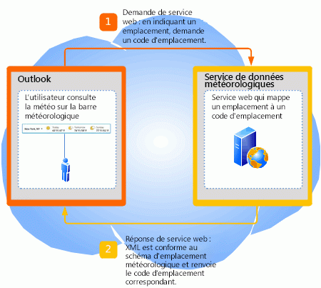
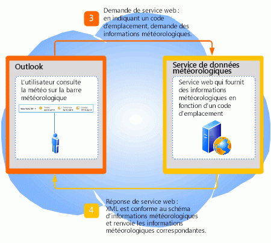

# <a name="extending-the-weather-bar-in-outlook"></a>Extension de la barre météorologique dans Outlook

Découvrez comment ajouter un service web météorologique tiers à la barre météorologique dans Outlook 2013, afin de fournir des données de conditions météorologiques pour un lieu choisi par l'utilisateur.
  
## <a name="weather-bar-overview"></a>Présentation de la barre météorologique
<a name="ol15_weatherbar_overview"> </a>

La barre météorologique d'Outlook affiche les conditions et prévisions météorologiques relatives à un lieu géographique. Un utilisateur peut choisir un ou plusieurs lieux et consulter facilement les données météorologiques affichées dans la barre météorologique du module de calendrier. La figure 1 présente la barre météorologique affichant une prévision sur trois jours de la météo à New York. 
  
**Figure 1. Barre météorologique dans Outlook**


  
Les paramètres de la barre météorologique sont enregistrés avec le profil utilisateur. Selon le type de compte Outlook, les paramètres peuvent suivre l'utilisateur vers tous les ordinateurs sur lesquels l'utilisateur ouvre une session à l'aide du même profil, comme c'est le cas pour les comptes Exchange. Sinon, l'utilisateur peut personnaliser ses paramètres sur chaque ordinateur, comme pour les comptes IMAP/POP.
  
Par défaut, Outlook utilise les données météorologiques fournies par MSN Météo. La barre météorologique prend en charge les services web de données météorologiques tiers qui suivent un protocole défini pour communiquer avec Outlook. Tant qu'un service de données météorologiques tiers prend en charge ce protocole, les utilisateurs peuvent choisir que ce service de données météorologiques fournisse les données météorologiques de la barre météorologique. Cet article décrit le protocole visant à intégrer les services météorologiques tiers à la barre météorologique Outlook.
  
## <a name="weather-bar-protocol"></a>Protocole de la barre météorologique
<a name="ol15_weatherbar_theprotocol"> </a>

Un utilisateur peut indiquer un autre service de données météorologiques pour la barre météorologique, tant que ce service implémente un service web qui prend en charge le protocole suivant pour communiquer avec Outlook :
  
1. Le service de données météorologique prend en charge une URL de base d'un service web. Par exemple, un service web Contoso Météo peut avoir une URL de base correspondant à https://service.contoso.com/data.aspx.
    
2. Pour demander un code d’emplacement, le service web autorise Outlook à ajouter les paramètres suivants à l’URL de base : 
    
   - outputview=search : ce paramètre indique que la demande est une recherche d’emplacement.
    
   - weasearchstr=_city_ : ce paramètre indique le lieu (_ville_), pour lequel l'utilisateur souhaite recevoir des prévisions météorologiques (par exemple, Londres).
    
   - culture=_LCID_ : ce paramètre indique la culture de la version d’Office installée pour l’utilisateur sur cet ordinateur. La valeur LCID est définie dans les balises [[ RFC4646] qui permettent d’identifier les langues](https://www.ietf.org/rfc/rfc4646.txt)
    
   - src=outlook : ce paramètre indique qu’Outlook est l’application cliente demandant le service.
    
   Ces paramètres permettent à Outlook de connaître le lieu qui intéresse l'utilisateur et de rechercher le code d'emplacement associé pris en charge par le service de données météorologiques. Le service web doit répondre à Outlook avec un code d'emplacement sous la forme d'un code XML conforme au [Outlook Weather Location XML Schema](outlook-weather-location-xml-schema.md). La figure 2 récapitule la demande et la réponse du service web relatives à un code d'emplacement.
    
   **Figure 2. Demande de service web et réponse pour un code d'emplacement**

   
  
3. Pour demander un code de lieu, le service web autorise également Outlook à ajouter les paramètres suivants à l’URL de base :
    
   - wealocations=_code_ : « _code_ » dans ce paramètre représente le code de lieu qu'Outlook obtient lors de l’étape 2. Ce code permet d'identifier le lieu qui intéresse l'utilisateur. 
    
   - weadegreetype=_degreetype_ : ce paramètre spécifie si vous souhaitez utiliser les unités de mesure métriques ou impériales pour la température. Pour _degreetype_, spécifiez c pour métrique, f pour impérial. Ce paramètre est facultatif et n’est pas toujours disponible dans la demande de service web.
    
   - culture=_LCID_ : ce paramètre indique la culture de la version d’Office installée pour l’utilisateur sur cet ordinateur. La valeur LCID est définie dans les balises [[ RFC4646] qui permettent d’identifier les langues](https://www.ietf.org/rfc/rfc4646.txt)
    
   - src=outlook : ce paramètre indique qu’Outlook est l’application cliente demandant le service.
    
   Ces paramètres permettent à Outlook de prendre le code d'emplacement renvoyé à l'étape 2 et de demander des prévisions météorologiques au service de données. Le service web doit répondre à Outlook avec les données météorologiques correspondantes sous la forme d'un code XML conforme au [Outlook Weather Information XML Schema](outlook-weather-information-xml-schema.md). La figure 3 récapitule la demande et la réponse du service web relatives à un code d'emplacement.
    
   **Figure 3. Demande de service web et réponse pour des informations météorologiques**

   
  
## <a name="setting-the-weather-bar-to-use-a-weather-service"></a>Définition de la barre météorologique afin d'utiliser un service météo
<a name="ol15_weatherbar_setting"> </a>

L'administrateur ou l'utilisateur avancé peut utiliser la clé de Registre **WeatherServiceUrl** pour personnaliser la barre météorologique afin d'utiliser un service météo spécifique. Par exemple, si l'URL de base pour un service météo Contoso est https://service.contoso.com/data.aspx, vous pouvez définir la clé **WeatherServiceUrl** sur cette URL. 
  
Le tableau suivant décrit la clé **WeatherServiceUrl**. 
  
|||
|:-----|:-----|
|**Clé** <br/> |HKCU\Software\Microsoft\Office\15.0\Outlook\Options\Calendar  <br/> |
|**Nom de valeur** <br/> |**WeatherServiceUrl** <br/> |
|**Type de valeur** <br/> |REG_SZ  <br/> |
|**Valeur par défaut** <br/> |EMPTY_STRING  <br/> |
|**Description** <br/> |URL d'un service de données météorologiques.  <br/> |
   
## <a name="dependent-conditions"></a>Conditions dépendantes
<a name="ol15_weatherbar_dependentconditions"> </a>

Outlook 2013 affiche la barre météorologique par défaut. Cette section décrit quelques raisons pour lesquelles la barre météorologique pourrait ne pas être visible.
  
### <a name="weather-bar-is-disabled"></a>La barre météorologique est désactivée

Tout d'abord, vérifiez que l'option **Afficher la météo sur le calendrier** est sélectionnée dans l'onglet **Calendrier** de la boîte de dialogue **Options Outlook**. 
  
Notez qu'un administrateur peut également utiliser la stratégie de groupe pour complètement désactiver la barre météorologique dans Outlook 2013 en définissant la clé suivante dans le Registre Windows :
  
|||
|:-----|:-----|
|**Clé** <br/> |HKCU\Software\Microsoft\Office\15.0\Outlook\Options\Calendar  <br/> |
|**Nom de valeur** <br/> |**DisableWeather** <br/> |
|**Type de valeur** <br/> |REG_DWORD  <br/> |
|**Valeur par défaut** <br/> |0  <br/> |
|**Description** <br/> |Une valeur de 0 active la barre météorologique. Toute autre valeur la désactive.  <br/> |
   
Si la fonctionnalité de barre météorologique a été désactivée par la stratégie de groupe, l'onglet **Calendrier** ne comprend pas la case à cocher **Afficher la météo sur le calendrier**. Consultez l'administrateur pour réactiver la fonctionnalité. 
  
### <a name="office-is-disconnected-from-the-internet"></a>Office est déconnecté d'Internet

Vérifiez qu'Office est en mesure de se connecter à Internet. Pour ce faire, accédez à l'onglet **Options de confidentialité** du **Centre de gestion de la confidentialité** en mode Backstage et assurez-vous que l'option **Autoriser Office à se connecter à Internet** est activée. 
  
Si l'utilisateur a choisi de ne pas recevoir les mises à jour pour Office, la barre météorologique est également désactivée.
  
Un administrateur peut également utiliser la stratégie de groupe pour désactiver tous les contenus en ligne, y compris la barre météorologique, en définissant la clé suivante dans le Registre Windows :
  
|||
|:-----|:-----|
|**Clé** <br/> |HKCU\Software\Microsoft\Office\15.0\Common\Internet  <br/> |
|**Nom de valeur** <br/> |**UseOnlineContent** <br/> |
|**Type de valeur** <br/> |REG_DWORD  <br/> |
|**Valeur par défaut** <br/> |2  <br/> |
|**Description** <br/> |Une valeur de 2 active la barre météorologique. Toute autre valeur la désactive.  <br/> |
   
Si la fonctionnalité de barre météorologique a été désactivée par la stratégie de groupe, l'onglet **Calendrier** ne comprend pas la case à cocher **Afficher la météo sur le calendrier**. Consultez l'administrateur pour réactiver la fonctionnalité. 
  
## <a name="weather-bar-example"></a>Exemple de barre météorologique
<a name="ol15_weatherbar_example"> </a>

Cette section présente un exemple d'un service météo Contoso qui suit le protocole mentionné précédemment pour communiquer avec Outlook. Pour tout emplacement que l'utilisateur sélectionne, Outlook obtient d'abord un code d'emplacement de la part de Contoso Météo, puis ce code est utilisé pour appeler le service Contoso Météo afin d'obtenir les données météorologiques.
  
### <a name="base-url"></a>URL de base

Contoso Météo fournit l'URL de base suivante pour leur service de données météorologiques :
  
https://service.contoso.com/data.aspx
  
### <a name="getting-a-location-code"></a>Obtention d'un code d'emplacement

Outlook ajoute les paramètres décrits lors de l'étape 2 à l'URL de base afin d'obtenir le code d'emplacement d'un lieu géographique ( _city_) :
  
https://service.contoso.com/data.aspx?outputview=search&amp;weasearchstr= _city_
  
À titre d'exemple, si l'utilisateur a sélectionné Tokyo dans la barre météorologique, Outlook utilise l'URL suivante pour obtenir le code d'emplacement de Tokyo auprès de Contoso Météo : 
  
https://weather.service.contoso.com/data.aspx?outputview=search&amp;weasearchstr=tokyo
  
Contoso Météo répond avec le code XML suivant pour fournir le code d'emplacement de Tokyo. Le code XML est conforme au schéma XML d'emplacement météorologique d'Outlook. Notez que les services météorologiques renvoient souvent des données correspondant à plus d'un emplacement (par exemple, si l'emplacement choisi est une grande zone métropolitaine). Dans cet exemple, la réponse pour Tokyo comprend deux emplacements, chacun compris dans un élément [weather](weather-element-weatherdata-elementoutlook-weather-location-schema.md). Les codes d'emplacement correspondants sont les suivants : 
  
- wc:JAXX0085 si l'attribut **weatherlocationname** est  `Tokyo, JPN`
    
- wc:10038604 si l'attribut **weatherlocationname** est  `Shinjuku-ku, Tokyo, Japan`
    
```XML
<?xml version="1.0" ?>
<weatherdata>
  <weather weatherlocationcode="wc:JAXX0085" 
    weatherlocationname="Tokyo, JPN">
  </weather>
  <weather weatherlocationcode="wc:10038604" 
    weatherlocationname="Shinjuku-ku, JPN">
  </weather>
</weatherdata>

```

### <a name="getting-weather-information-for-a-location-code"></a>Obtention d'informations météorologiques pour un code d'emplacement

Après avoir obtenu le code d'emplacement pour un lieu donné, Outlook ajoute les paramètres décrits lors de l'étape 3 à l'URL de base afin d'obtenir des informations météorologiques relatives au code d'emplacement.
  
https://service.contoso.com/data.aspx?wealocations= _code_
  
À titre d'exemple, si Outlook a obtenu le code d'emplacement wc:JAXX0085 auprès de Contoso Météo pour Tokyo, Outlook utilise ce code d'emplacement dans l'URL suivante pour obtenir les informations météorologiques.
  
https://service.contoso.com/data.aspx?wealocations=wc:JAXX0085
  
Contoso Météo répond avec le code XML suivant afin de fournir les informations météorologiques correspondant au code d'emplacement de Tokyo. Le code XML est conforme au schéma XML des informations météorologiques d'Outlook.
  
```XML
<?xml version="1.0"?>
<weatherdata>
  <weather timezone="9" attribution="Data provided by Trey Research" 
    degreetype="F" imagerelativeurl="https://contoso.com/images/" 
    url="https://contoso.com/weather.aspx?eid=33568&amp;q=Tokyo-JPN" 
    weatherlocationname="Tokyo, JPN" 
    weatherlocationcode="wc:JAXX0085">
      <current winddisplay="9 mph NNW" windspeed="9" humidity="90" feelslike="44" 
        observationpoint="Tokyo" observationtime="06:00:00" 
        shortday="Sat" day="Saturday" date="2012-04-14" skytext="Rain" skycode="11" 
        temperature="48"/>
      <forecast shortday="Sat" day="Saturday" date="2012-04-14" precip="95" skytextday="Rain"
        skycodeday="11" high="55" low="47"/>
      <forecast shortday="Sun" day="Sunday" date="2012-04-15" precip="5" skytextday="Partly Cloudy" 
        skycodeday="30" high="65" low="43"/>
      <forecast shortday="Mon" day="Monday" date="2012-04-16" precip="5" skytextday="Partly Cloudy" 
        skycodeday="30" high="64" low="52"/>
      <forecast shortday="Tue" day="Tuesday" date="2012-04-17" precip="70" skytextday="Showers / Clear" 
        skycodeday="39" high="66" low="53"/>
      <forecast shortday="Wed" day="Wednesday" date="2012-04-18" precip="55" skytextday="Showers / Clear" 
        skycodeday="39" high="68" low="51"/>
  </weather>
</weatherdata>

```

### <a name="resetting-outlook-to-use-msn-weather"></a>Réinitialisation d'Outlook pour utiliser MSN Météo

Bien qu'Outlook utilise MSN Météo par défaut, si un utilisateur a personnalisé la barre météorologique afin d'utiliser un autre service météo mais par la suite souhaite réutiliser MSN Météo, il peut simplement supprimer la clé **WeatherServiceUrl** du Registre Windows. La suppression de cette clé de Registre réinitialise Outlook afin qu'il utilise MSN Météo. 
  
## <a name="conclusion"></a>Conclusion
<a name="ol15_weatherbar_conclusion"> </a>

La barre météorologique du calendrier Outlook utilise MSN Météo par défaut pour fournir les prévisions météo d'un emplacement donné. Les utilisateurs peuvent facilement voir les informations relatives à la météo des lieux qui les intéressent. Les services de données météorologiques tiers peuvent également être intégrés à la barre météorologique s'ils prennent en charge le schéma XML d'emplacement météorologique d'Outlook et le schéma des informations météorologiques d'Outlook, et s'ils suivent un protocole de service web simple avec Outlook.
  
## <a name="see-also"></a>Voir aussi

- [Schéma XML de lieu météorologique d’Outlook](outlook-weather-location-xml-schema.md)   
- [Outlook Weather Information XML Schema](outlook-weather-information-xml-schema.md)
    

