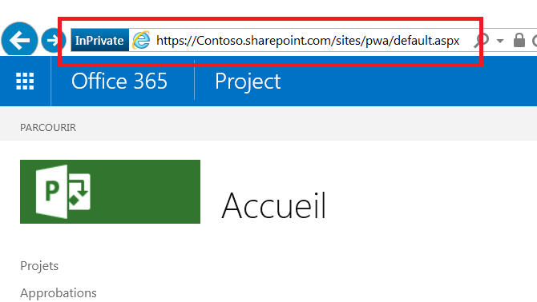

# <a name="developing-a-project-online-application-using-the-client-side-object-model-csom"></a>Développement d’une application Microsoft Project Online à l’aide du modèle objet côté client (CSOM)

>[!NOTE]
>Cet article décrit le développement d’applications Microsoft Project Online pour utiliser le CSOM. Nous vous recommandons de découvrir le développement d’applications à l’aide d’un [nouveau projet pour le web](https://developer.microsoft.com/office/blogs/developing-applications-and-reports-using-the-new-project/).
  
## <a name="background"></a>Arrière-plan

L’application Microsoft Project a été créée comme application de bureau au début des années 1990. Aujourd’hui, Project est beaucoup plus que ça, comme en témoignent ses nombreuses versions :
  
- Project Standard Edition est une application de bureau qui s’exécute comme une application autonome.

- Project Professional Edition est une application de bureau capable d’interagir et de partager des données avec un serveur plus important, ainsi que d’exécuter les fonctionnalités disponibles dans Project Standard Edition.

- Microsoft Project Online est un service hébergé par Microsoft qui fournit aux sociétés une solution de bureau de gestion des projets (PMO) afin de coordonner et de gérer des projets, des programmes et des portefeuilles. Différent des éditions de bureau, Microsoft Project Online peut conserver et effectuer le suivi des détails des projets tout au long de la vie de ces derniers.

- Project Server est un service hébergé par l’entreprise grâce auquel l’entreprise gère et sécurise le serveur contenant les informations relatives aux projets, aux programmes et aux portefeuilles. Afin de sécuriser le serveur interne, Project Server offre les fonctionnalités orientées projet, programme et portefeuille de l’application Microsoft Project Online hébergée en externe avec une plus grande capacité de personnalisation.

Microsoft Project Online dispose de trois ensembles d’API en ligne : modèle objet côté client (CSOM), objet modèle JavaScript (JSOM) et Representational State Transfer (REST).
  
- L’implémentation .NET CSOM est l’interface par défaut lorsque vous développez des applications Windows qui interagissent avec des clients Microsoft Project Online. Les environnements classiques pour les applications centrées sur l’utilisateur incluent les bureaux Windows et les appareils Microsoft Surface. Les applications principales écrites avec .NET CSOM peuvent se connecter à d’autres serveurs pour la logique métier et les sources de données externes à Microsoft Project Online. Les demandes de récupération sur Microsoft Project Online utilisent un système de requête similaire à LINQ qui propose plusieurs améliorations par rapport aux fonctions de récupération de base.

- L’interface de modèle objet JavaScript (JSOM) fournit une prise en charge multinavigateur pour les compléments Microsoft Project Online. Un complément est une application web stockée dans le client Microsoft Project Online. Lorsqu’un utilisateur souhaite exécuter un complément, le code du complément se télécharge et s’exécute dans le navigateur de l’ordinateur de l’utilisateur.

- Le modèle REST/Odata assure la communication basée sur HTTP. Cette interface est recommandée pour les applications dans les environnements non Windows. Les points de terminaison de communication correspondent aux objets du site Project Web Application (PWA). Les résultats fournissent des codes d’état HTTP normaux.

Cet article traite d’une application qui utilise l’interface .NET CSOM.
  
## <a name="prerequisites"></a>Conditions requises

Commencez avec un système de base exécutant Windows 10 et ajoutez les éléments suivants :
  
- .Net Framework 4.0 ou version ultérieure : utilisez l’infrastructure complète. Le site de téléchargement est <https://msdn.microsoft.com/vstudio/aa496123.aspx>.

- Visual Studio 2013 ou version ultérieure : toutes les éditions sont acceptées. L’édition Community Edition de Visual Studio 2015 a été utilisée pour développer l’exemple d’application. L’édition Community Edition est disponible à l’adresse suivante <https://www.visualstudio.com/products/visual-studio-community-vs.aspx>.

- Kit de développement logiciel (SDK) des composants clients de SharePoint : les applications Microsoft Project Online et Project Server sont supérieures à SharePoint et aux assemblys SharePoint. Les composants client de SharePoint sont inclus dans les éditions Visual Studio Professional et Enterprise. Si vous utilisez Visual Studio Community Edition, la dernière version du kit de développement logiciel des outils de développement Office est disponible sur le site suivant : <https://www.microsoft.com/download/details.aspx?id=35585>.

- Compte Microsoft Project Online : permet d’accéder au site d’hébergement. Pour plus d’informations sur l’obtention d’un compte Microsoft Project Online, visitez le site <https://products.office.com/en-gb/project/project-portfolio-management>.

- Projets sur le site d’hébergement alimentés avec des informations

> [!NOTE]
> La structure .NET Framework standard (4.0 ou version ultérieure) est la structure correcte à utiliser. N’utilisez pas le profil client .NET Framework 4.
  
## <a name="develop-the-application"></a>Développer l’application

Dans le cadre du développement d’une application de bureau pour SharePoint, l’interface par défaut est le modèle objet côté client (CSOM) Project.
  
Vous pouvez télécharger des [exemples de projet CSOM](https://developer.microsoft.com/project/gallery/?filterBy=Samples,Project) depuis la galerie de ressources du Développeur Project dans le Centre de développement Office.
  
Les deux premières rubriques traitent des questions de base : créer un projet Visual Studio avec des assemblys et des espaces de noms appropriés, et accéder au serveur d’hébergement. Les rubriques restantes traitent de la récupération des informations à l’aide du modèle CSOM, à partir d’un ou de plusieurs objets.
  
La récupération des informations à partir de l’hôte est un processus en deux actions des applications clientes. Tout d’abord, l’application spécifie et envoie une ou plusieurs demandes de récupération au serveur. Ensuite, l’application transmet une notification au serveur pour exécuter les requêtes soumises. Le serveur répond en envoyant les résultats des requêtes au client.
  
### <a name="set-up-the-visual-studio-project"></a>Configurer le projet Visual Studio

La configuration de l’application consiste à créer un nouveau projet, lier les assemblys appropriés et déclarer les espaces de noms nécessaires. Visual Studio présente plusieurs types de projets de développement.
  
#### <a name="select-a-visual-studio-project"></a>Sélectionner un projet Visual Studio

1. Démarrez Visual Studio et sélectionnez **Démarrer un nouveau projet** sur la page de démarrage.

   La boîte de dialogue Nouveau projet affiche les modèles d’application disponibles et les champs de données pour n’importe quel modèle sélectionné.

2. Pour cette application, spécifiez les éléments indiqués ci-après. Les mots-clés rencontrés à l’écran ont un attribut gras :

   1. À partir des modèles installés dans le volet gauche, sélectionnez **C#** => **Windows** => **Bureau classique**.

   2. En haut du volet central, sélectionnez **.NET Framework 4**.

   3. Dans les types d’application situés dans le volet central, sélectionnez **Application console**.

   4. Dans la section inférieure, spécifiez un nom et un emplacement pour le projet et un nom de solution.

   5. Dans la section inférieure, cochez la case **Créer le répertoire pour la solution**.

3. Cliquez sur **OK** pour créer le projet initial.

#### <a name="add-assemblies"></a>Ajouter des assemblys

La solution VS a besoin de l’assembly ProjectServerClient du kit de développement logiciel (SDK) Project 2103, deux assemblys du kit de développement logiciel (SDK) SharePoint et l’assembly .NET Framework System.Security.
  
1. Dans l’Explorateur de solutions VS, cliquez avec le bouton droit sur l’entrée Références, puis sélectionnez **Ajouter une référence...**

2. Sélectionnez **Microsoft.ProjectServer.Client.dll**.

   Si nécessaire, cliquez sur le bouton **Parcourir…** en bas de la boîte de dialogue et accédez au répertoire d’installation du Kit de développement logiciel (SDK) Project 2013 pour localiser l’assembly.

3. Cliquez sur **OK**.

4. Ajoutez l’espace de noms ProjectServerClient au fichier .cs.

   ```cs
    using Microsoft.ProjectServer.Client;
   ```

Ajoutez les assemblys du kit de développement logiciel (SDK) SharePoint 2013 à l’aide de la console du Gestionnaire de package NuGet.
  
1. Dans le menu Outils VS, cliquez sur les menus suivants : **Outils =\> Gestionnaire de package NuGet =\> Console du Gestionnaire de package**.

2. Dans la console Gestionnaire de package, entrez la commande suivante et appuyez sur \<ENTER\> :

   ```cs
    Install-Package Microsoft.SharePointOnline.CSOM
   ```

   La **Console du Gestionnaire de package** fournit une description des résultats de la commande ; et l’Explorateur de solutions VS affiche les assemblys SharePoint dans les références de projet.

3. Ajoutez les espaces de noms dans le fichier .cs :

   ```cs
    using Microsoft.SharePoint.Client;
   ```

L’assembly System.Security fait partie du .NET Framework et a été installé avec l’infrastructure. L’exemple d’application a besoin d’un autre espace de noms qui fournit une chaîne chiffrée au système d’hébergement pour l’authentification. Une fois authentifiée, l’application peut accéder aux projets sur le système d’hébergement. Ajoutez l’espace de noms System.Security au fichier .cs comme suit :
  
1. Dans l’Explorateur de solutions VS, cliquez avec le bouton droit sur l’entrée Références, puis sélectionnez **Ajouter une référence...**

2. Sélectionnez **Assemblys =\> Framework** dans le volet gauche de la boîte de dialogue Gestionnaire de références, puis cliquez sur **System.Security**.

3. Cliquez sur **OK**.

4. Ajoutez l’espace de noms System.Security au fichier .cs :

   ```cs
    using System.Security;
   ```

Le début du fichier .cs doit contenir les espaces de noms suivants :
  
- Système

- System.Collections.Generic

- System.Linq

- System.Test

- Microsoft.ProjectServer.Client

- Microsoft.SharePoint.Client

- System.Security

### <a name="connect-to-the-host-system"></a>Se connecter au système hôte

Étant donné que Microsoft Project Online est une application SharePoint, utiliser l’authentification SharePoint est l’approche correcte. Le fragment de code suivant prépare l’accès à l’environnement hébergé.
  
```cs
    class Program
    {
        private static ProjectContext projContext;
        static void Main (string[] args)
        {
            using (ProjectContext projContext = new ProjectContext("https://Contoso.sharepoint.com/sites/pwa"))
            {
                SecureString password - new SecureString();
                foreach (char c in "password".ToCharArray()) password.AppendChar(c);
                //Using SharePoint method to load Credentials
                projContext.Credentials = new SharePointOnlineCredentials("sarad@Contoso.onmicrosoft.com", password);

```

Pour préparer l’accès à l’environnement hébergé, effectuez les actions suivantes :
  
1. Créez un objet de contexte pour les projets : il est inclus dans le code suivant du fragment de code précédent.

   ```cs
    private static ProjectContext projContext;
    
   ```

   Le contexte est hérité par d’autres composants autorisant le système à gérer le contexte du modèle objet Project.

2. Identifiez le site hôte : cette opération est effectuée dans le code suivant à partir du fragment de code précédent.

   ```cs
    using (ProjectContext projContext = new ProjectContext("https://Contoso.sharepoint.com/sites/pwa"))
   ```

   Dans le cadre de l’initialisation du contexte de projets, l’application doit fournir la racine de la collection de sites de projets. L’application utilise une sous-chaîne de l’URL de la racine des projets. Une capture instantanée de cet emplacement est mise en évidence par un rectangle rouge dans l’illustration suivante. L’authentification a besoin de la chaîne à partir du début jusqu’à la sous-chaîne « pwa ». Dans la liste de code, l’application utilise la chaîne « https://XXXXXXXX.sharepoint.com/sites/pwa ».

   
  
3. Placez le mot de passe dans une chaîne sûre : cette opération est effectuée dans le code suivant à partir du fragment de code précédent.

   ```cs
    SecureString password - new SecureString();
    foreach (char c in "password".ToCharArray()) password.AppendChar(c);
    
   ```

   Le mot de passe et le compte d’utilisateur sont les informations d’identification d’accès au site hôte.

4. Ajoutez le compte d’utilisateur et le mot de passe dans la partie des informations d’identification de l’objet de contexte : cette opération est effectuée dans le code suivant à partir du fragment de code précédent.

   ```cs
    projContext.Credentials = new SharePointOnlineCredentials("sarad@Contoso.onmicrosoft.com", password);
   ```

Le contexte de projet instancié est prêt à être utilisé.
  
### <a name="list-all-published-projects"></a>Répertorier tous les projets publiés

Microsoft Project Online et ProjectServer utilisent des proxys pour communiquer avec le serveur afin d’exécuter les opérations créer, signaler, mettre à jour et supprimer (CRUD). L’hôte/le serveur gère les demandes efficacement et permet au client d’effectuer les actions suivantes quand il communique avec le serveur :
  
1. Établir un contexte pour la communication.

   Le contexte est utilisé par la collection de projets, ainsi que par d’autres objets et collections via l’héritage, notamment la collection de tâches, la collection d’affectations, l’objet étape et les champs personnalisés.

2. Utilisez le modèle objet pour spécifier un objet, la collection ou les données à récupérer.

   Cette étape utilise LINQ comme une requête ou comme une méthode. La spécification contrôle ce que vous recevez. Cette étape est souvent incorporée en tant que corps de la méthode de chargement (étape 3).

3. Chargez la spécification de récupération à partir de l’étape précédente en utilisant la méthode Load() ou LoadQuery().

   Pour charger des collections et des objets, utilisez Load(). Pour les requêtes avec des clauses telles que « where » et « group », utilisez LoadQuery().

4. Exécutez la demande à l’aide de la méthode ExecuteQuery().

   La méthode ExecuteQuery() avertit l’hôte que les requêtes sont prêtes à être exécutées. Une fois que l’hôte a reçu la notification, il exécute les requêtes et envoie les résultats au client.

Lorsque le client dispose des informations, l’application peut les utiliser. Le fragment de code suivant passe dans les projets publiés et imprime l’ID et le nom de chaque projet publié sur l’hôte.
  
```cs
// Get the list of projects in Project Web App.
var projects = projContext.Projects;
projContext.Load(projects);
projcontext.ExecuteQuery();
foreach (PublishedProject pubProj in projContext.Projects)
{
    Console.WriteLine("\n{0}. {1}   {2} \t{3} \n", j++, pubProj.Id, pubProj.Name, pubProj.CreatedDate);
}

```

Résultat :
  
```cs
Published Project count:2
1. be80a848-b2ef-e511-80f4-00155dc84e01   A second Project     3/21/2016 10:14:40 PM
2. 9d730a1a-60ed-e511-80f6-00155dc87d01   Ent_Proj_1   3/18/2016 11:21:14 PM

```

### <a name="make-a-request"></a>Faire une demande

En utilisant les actions du fragment de code précédent, l’application récupère la liste des projets dans le compte spécifié sur le site d’hébergement.
  
1. L’élément ProjectContext est spécifié pour les projets à répertorier.

   ```cs
    var projects = projContext.Projects;
   ```

2. Spécifiez l’élément à récupérer.

   ```cs
    projContext.Load(projects);
   ```

   En indiquant uniquement la collection, le serveur récupère la collection de projets, renseignant chaque projet avec les valeurs pour l’ensemble des propriétés par défaut. Accéder aux propriétés qui font partie de l’ensemble de propriétés par défaut donne des résultats positifs. Accéder à des propriétés qui ne font pas partie de l’ensemble par défaut renvoie une exception « Non initialisé ».

3. Chargez la demande (projContext.Load).

   Cette opération fait partie de l’étape précédente.

4. Exécutez la requête (ExecuteQuery).

   ```cs
    projContext.ExecuteQuery();
   ```

### <a name="retrieve-high-level-project-information"></a>Récupérer des informations de projet de niveau élevé

Les propriétés qui ne sont pas des propriétés par défaut doivent être spécifiées dans la demande au serveur. Le fragment de code suivant charge le contexte de collection de projets comme dans l’exemple précédent. Ensuite, la spécification requiert des propriétés supplémentaires non définies par défaut à inclure dans le résultat.
  
```cs
var projects = projContext.Projects;
projContext.Load(projects,
    ps => ps.IncludeWithDefaultProperties(
        p => p.StartDate, p => p.Phase, p => p.Stage));
projContext.ExecuteQuery();

```

L’instruction de chargement spécifie le contexte de la collection de projets, et ajoute les objets StartDate, Phase et Stage au résultat de la requête. Les propriétés supplémentaires peuvent être scalaires, des objets ou des collections. Les éléments scalaires sont directement accessibles. Les objets et les collections nécessitent un traitement supplémentaire, comme illustré dans le fragment de code suivant.
  
```cs
// Using the previous definition and Load statement …
projContext.ExecuteQuery();
foreach (PublishedProject pubProj in projContext.Projects)
{
Console.WriteLine("\n\t{0}. \t{1} \n\t{2} \n\t{3} \n", j++, pubProj.Id, pubProj.Name,
    pubProj.CreatedDate);
             // The following statement generates an exception about the object 
             // reference not being set to an instance on the server. 
             // Console.WriteLine("\tCurrent Phase:\t{0}", pubProj.Phase.Name);
             // Phase and Stage are not published with the rest of the data. Need to pull these objects from the server.
             Phase oPhase = pubProj.Phase;
             projContext.Load(oPhase);
             projContext.ExecuteQuery();
             //if-else fails because the else case fails with "Microsoft.SharePoint.Client.ServerObjectNullReferenceException".
             //if (oPhase.ServerObjectIsNull != null)
             //Using try-catch instead
             try
             {
                  Console.WriteLine("\tCurrent Phase:\t{0}", oPhase.Name);
             }
             
             catch
             {
                  Console.WriteLine("\tCurrent Phase:\t Not available");
             }
             
             Stage oStage = pubProj.Stage;
             projContext.Load(oStage);
             projContext.ExecuteQuery();
             //Again, not using if-else combination for the same reason as above.
             try
             {
                  Console.WriteLine("\tCurrent Stage:\t{0}", oStage.Name);
             }
             
             catch
             {
                  Console.WriteLine("\tCurrent Stage:\t Not available");
    }

```

Résultat des trois premiers projets :
  
```cs
Project counts:31
1. Project ID:  957d5fcd-5cbf-e111-9f1e-00155d022681
        Name:           Acquisition Target Analysis
        CreatedDate:            3/22/2016 5:14:34 PM
        Current Phase:  3. Plan
        Current Stage:  6. Plan
2. Project ID:  16905202-5fbf-e111-9f1e-00155d022681
        Name:           Apparel ERP Upgrade
        CreatedDate:            3/22/2016 5:36:40 PM
        Current Phase:  3. Plan
        Current Stage:  6. Plan
3. Project ID:  dce23152-63bf-e111-9f1e-00155d022681
        Name:           Audit Tracking Solution
        CreatedDate:            3/22/2016 5:02:24 PM
        Current Phase:  2. Select
        Current Stage:  4. Select Gate

```

### <a name="retrieve-all-tasks-in-a-project"></a>Récupérer toutes les tâches dans un projet

Chaque projet a plusieurs tâches. Par conséquent, pour extraire les tâches d’un projet spécifique, effectuez les actions suivantes :
  
1. Établir le contexte de la collection de projets.

   ```cs
    var projects = projContext.Projects;
   ```

2. Récupérez les informations de projet, y compris les propriétés de la tâche.

   ```cs
    projContext.Load(projects);
    ProjContext.ExecuteQuery();
    foreach (PublishedProject pubProj in projContext.Projects){
    
   ```

    Notez que l’application traite les projets publiés. Le contexte du projet publié actuel est pubProj.

3. Établir le contexte de la collection de tâches.

   ```cs
    PublishedTaskCollection collTask = pubProj.Tasks;
   ```

   La propriété `pubProj.Tasks` fait référence aux tâches du projet publié actuel.

4. Chargez la spécification pour récupérer la collection de tâches, y compris les propriétés par défaut appropriées.

   ```cs
    projContext.Load(collTask,
        tsk => tsk.IncludeWithDefaultProperties(
            t => t.Id, t => t.Name, t => t.Start,
            t => t.ScheduledStart, t => t.Completion));
    
   ```

5. Exécutez la requête pour récupérer la collection de tâches dotées des propriétés appropriées.

   ```cs
    projContext.ExecuteQuery();
   ```

Les informations sont désormais locales. Le fragment de code suivant traite la collection de tâches publiées en écrivant les informations sur la console.
  
```cs
    Console.WriteLine("Task collection count: {0}", collTask.Count.ToString());
    if (collTask.Count > 0)
    {
        int k = 1;    //Task counter.
        foreach (PublishedTask t in collTask)
        {
            Console.WriteLine("{0}. Id:{1} \tName:{2}", k++, t.Id, t.Name);
            Console.WriteLine("\t ScheduledStart:{0} \tStart:{1} \tCompletion:{2}", k, t.ScheduledStart, t.Start, t.Completion);
        }
    }

```

Résultat des tâches pour un projet :
  
```cs
Task collection count: 5
1. Id:256fa850-b2ef-e511-80f6-00155dc87d01      Name:Load software onto computer
         ScheduledStart:2       Start:4/4/2016 8:00:00 AM       Completion:4/4/2016 8:00:00 AM
2. Id:266fa850-b2ef-e511-80f6-00155dc87d01      Name:Locate and load Project Online SDK
         ScheduledStart:3       Start:4/5/2016 8:00:00 AM       Completion:4/5/2016 8:00:00 AM
3. Id:276fa850-b2ef-e511-80f6-00155dc87d01      Name:Locate and load SP SDK
         ScheduledStart:4       Start:4/5/2016 1:00:00 PM       Completion:4/5/2016 1:00:00 PM
4. Id:286fa850-b2ef-e511-80f6-00155dc87d01      Name:Build app that accesses Proj Online
         ScheduledStart:5       Start:4/6/2016 8:00:00 AM       Completion:4/6/2016 8:00:00 AM
5. Id:296fa850-b2ef-e511-80f6-00155dc87d01      Name:Build app that accesses task assignments
         ScheduledStart:6       Start:4/7/2016 8:00:00 AM       Completion:4/7/2016 8:00:00 AM

```

### <a name="access-information-at-multiple-levels"></a>Accéder aux informations à plusieurs niveaux

Pour chaque tâche, une ou plusieurs personnes (ou ressource) peuvent contribuer à son exécution. Les collections d’affectations et de ressources contiennent ces informations pour chaque tâche.
  
Pour assurer le traitement, procédez comme suit :
  
1. Obtenez un contexte pour la tâche de projet.

2. Créez une demande et chargez-la pour les affectations liées à la tâche.

3. Exécutez la requête pour les affectations.

4. Créez une demande et chargez-la pour la ressource associée à une affectation individuelle.

5. Exécutez la requête pour la ressource.

> [!NOTE]
>
> - La collection d’affectations est demandée explicitement dans les informations du serveur, car il ne s’agit pas d’une propriété définie par défaut de la collection de tâches. En tant que collection, une requête ultérieure est faite pour extraire la collection du serveur.
> - La ressource est un objet. La requête associée à une affectation inclut le nom de la ressource associé à l’affectation.

```cs
PublishedTaskCollection collTask = pubProj.Tasks;
    projContext.Load(collTask,
        tsk => tsk.IncludeWithDefaultProperties(
            t => t.Id, t => t.Name, 
            t => t.Assignments));
    projContext.Load(collTask);
    projContext.ExecuteQuery();
    Console.WriteLine("Task collection count: {0}", collTask.Count.ToString());
    if (collTask.Count > 0)
    {
        int k = 1;    //Task counter.
        //Processing task list for current project
        foreach (PublishedTask t in collTask)
        {
            Console.WriteLine("{0}. Id:{1} \tName:{2}", k, t.Id, t.Name);
            k++;
            //Define and retrieve Assignments for current task
            PublishedAssignmentCollection collAssgns = t.Assignments;
            projContext.Load(collAssgns);
            projContext.ExecuteQuery();
            Console.WriteLine("    Assignment collection count: {0}", collAssgns.Count);
            if (collAssgns.Count > 0)
            {
                //Output string for resources assigned to task
                StringBuilder output = new StringBuilder();
                output.AppendFormat("\t Assignments: ");
                foreach (PublishedAssignment a in collAssgns)
                {
                    //Define and retrieve resource name for current assignment 
                    //(an object)
                    projContext.Load(a,
                        b => b.Resource.Name);
                    projContext.ExecuteQuery();
                    output.AppendFormat("{0}, ", a.Resource.Name);
                }
                Console.WriteLine(output);
            }
            else
            {
                Console.WriteLine("\t Assignments: None");
            }
        }
    }   // endif

```

Résultat pour les tâches 52, 75 et 76 d’un projet :
  
```cs
52. Id:2c729e96-54f0-e511-80c6-000d3a33235f     Name:Develop training materials
    Assignment collection count: 1
         Assignments: Robert Lyon,
75. Id:43729e96-54f0-e511-80c6-000d3a33235f     Name:Determine final deployment strategy
    Assignment collection count: 0
         Assignments: None
76. Id:44729e96-54f0-e511-80c6-000d3a33235f     Name:Develop deployment methodology
    Assignment collection count: 4
         Assignments: Molly Dempsey, Sara Davis, Shammi Mohamed, Zainal Arifin, 

```

### <a name="access-custom-enterprise-level-fields"></a>Accéder aux champs de niveau entreprise personnalisés

Des champs personnalisés existent pour Microsoft Project Online. Il s’agit de champs de niveau entreprise qui peuvent être associés à des projets individuels. Cette section explique comment accéder à ces champs.
  
Les champs personnalisés ne sont pas inclus dans l’ensemble de propriétés par défaut associées à un projet. Par conséquent, ils doivent être identifiés explicitement dans le cadre de la spécification de récupération. La vue d’ensemble du processus comprend les actions suivantes :
  
1. Naviguer jusqu’au champ personnalisé à l’aide de son nom commun.

2. Récupérer le nom interne du champ personnalisé.

3. Revenir au contexte général et interroger le système en utilisant le nom interne du champ personnalisé.

#### <a name="tunnel-to-the-custom-field-retrieve-its-internal-name-and-used-it-to-query-the-system"></a>Naviguer jusqu’au champ personnalisé, récupérer son nom interne et l’utiliser pour interroger le système

Cette tâche spécifie une récupération qui utilise une propriété non définie par défaut avec un détail en plus.
  
1. Commencez en utilisant le contexte de projets, comme décrit au début de cet article.

   ```cs
    // Get the list of published projects in Project Web App.
    var projects = projContext.Projects;
    
   ```

2. Ajoutez deux éléments à la demande de récupération de collection de projets en plus de toute autre propriété non définie par défaut à récupérer :

   ```cs
    projContext.Load(projects,
        ps => ps.IncludeWithDefaultProperties(
            p => p.Phase, p => p.Stage,                  // Other nondefault properties
            p => p.IncludeCustomFields,                  // Gets PublishedProject object 
                                                        // that contains custom fields
            p => p.IncludeCustomFields.CustomFields));   // Populates the custom fields
                    projContext.ExecuteQuery();
    
   ```

   La clause `p => p.IncludeCustomFields` identifie la nécessité d’utiliser un objet projet qui prend en charge les champs personnalisés.

   La clause `p => p.IncludeCustomFields.CustomFields` demande l’inclusion de données de champ personnalisées dans le résultat de la requête. Ces informations sont utilisées une fois que le nom interne du champ personnalisé est récupéré.

3. Rechargez la demande.

   Cette opération fait partie de l’étape précédente.

4. Exécutez la requête.

   ```cs
    projContext.ExecuteQuery()
   ```

5. À l’aide des informations sur le client, créez une demande pour récupérer les champs personnalisés associés au projet actuel.

   ```cs
    foreach (PublishedProject pubProj in projContext.Projects)
    {
        //Console.WriteLine("\n\t{0}. \t{1} \n\t\t{2} \n\t\t{3} \n", 
                j++, pubProj.Id, pubProj.Name, pubProj.CreatedDate);
        CustomFieldCollection collCustF = pubProj.CustomFields;
                        
        projContext.Load(collCustF);
        projContext.ExecuteQuery();
    
   ```

6. Recherchez le champ personnalisé approprié et récupérez le nom interne du champ.

   ```cs
        foreach (CustomField oCF in collCustF)
        {
            if (oCF.Name == "Project Health")
            {
                Console.WriteLine("Name: {0}", oCF.Name);
                Console.WriteLine("InternalName: {0}", oCF.InternalName);
    
   ```

   Le nom interne du champ personnalisé est récupéré. Les actions 1 et 2 sont désormais terminées.

7. Revenez au contexte de projet et récupérez la valeur du champ personnalisé.

   ```cs
    Console.WriteLine("Value: {0}", 
        pubProj.IncludeCustomFields.FieldValues[oCF.InternalName]);
    
   ```

   > [!NOTE]
   > La valeur du champ personnalisé est récupérée en utilisant le nom interne comme un index.
  
Résultat de trois projets composés de l’ID du projet, du nom du projet, du nom du champ personnalisé, du nom interne du champ personnalisé et de la valeur du champ personnalisé.
  
```cs
Project counts:31
1. Project ID:  957d5fcd-5cbf-e111-9f1e-00155d022681
        Name:           Acquisition Target Analysis
Name: Project Health
InternalName: Custom_745de6dfcfb4e11195dc00155d02c97f
Value: Green
2. Project ID:  16905202-5fbf-e111-9f1e-00155d022681
        Name:           Apparel ERP Upgrade
Name: Project Health
InternalName: Custom_745de6dfcfb4e11195dc00155d02c97f
Value: Green
3. Project ID:  dce23152-63bf-e111-9f1e-00155d022681
        Name:           Audit Tracking Solution
Name: Project Health
InternalName: Custom_745de6dfcfb4e11195dc00155d02c97f
Value: Red

```

## <a name="see-also"></a>Voir aussi

Pour obtenir de la documentation et des exemples relatifs à Microsoft Project Online et au développement d’applications à l’aide de CSOM, consultez le [Portail de développement Project](https://developer.microsoft.com/project) dans le Centre de développement Office.
