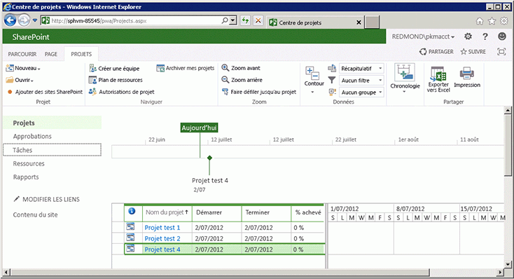

# <a name="getting-started-with-the-project-server-csom-and-net"></a><span data-ttu-id="69050-105">Prise en main du modèle CSOM Project Server et de .NET</span><span class="sxs-lookup"><span data-stu-id="69050-105">Getting started with the Project Server CSOM and .NET</span></span>

<span data-ttu-id="69050-106">Utilisez le modèle objet côté client (CSOM) Project Server 2013 pour développer Project Online et des solutions locales avec .NET Framework 4.</span><span class="sxs-lookup"><span data-stu-id="69050-106">You can use the Project Server 2013 client-side object model (CSOM) to develop Project Online and on-premises solutions with the .NET Framework 4.</span></span> <span data-ttu-id="69050-107">Cet article décrit comment créer une application de console qui utilise CSOM pour créer et publier des projets.</span><span class="sxs-lookup"><span data-stu-id="69050-107">This article describes how to create a console application that uses the CSOM to create and publish projects.</span></span> <span data-ttu-id="69050-108">Après la publication d’un projet, l’application attend que le service de File d’attente de Project Server se termine avec l’action de publication, puis répertorie les projets publiés.</span><span class="sxs-lookup"><span data-stu-id="69050-108">After publishing a project, the application waits for the Project Server Queue Service to finish with the publish action, and then lists the published projects.</span></span>
  
<span data-ttu-id="69050-109">Pour obtenir une présentation générale de CSOM pour Project Server, consultez la rubrique sur les [mises à jour pour les développeurs dans Project 2013](updates-for-developers-in-project-2013.md).</span><span class="sxs-lookup"><span data-stu-id="69050-109">For a general introduction to the Project Server CSOM, see [Updates for developers in Project 2013](updates-for-developers-in-project-2013.md).</span></span> <span data-ttu-id="69050-110">Pour les rubriques de référence dans l’espace de noms CSOM, consultez [Microsoft.ProjectServer.Client](https://msdn.microsoft.com/library/Microsoft.ProjectServer.Client.aspx).</span><span class="sxs-lookup"><span data-stu-id="69050-110">For reference topics in the CSOM namespace, see [Microsoft.ProjectServer.Client](https://msdn.microsoft.com/library/Microsoft.ProjectServer.Client.aspx) .</span></span> 
  
## <a name="creating-a-csom-project-in-visual-studio"></a><span data-ttu-id="69050-111">Création d’un projet CSOM dans Visual Studio</span><span class="sxs-lookup"><span data-stu-id="69050-111">Creating a CSOM project in Visual Studio</span></span>
<span data-ttu-id="69050-112"><a name="pj15_GettingStartedCSOM_CreatingVSProject"> </a></span><span class="sxs-lookup"><span data-stu-id="69050-112"></span></span>

<span data-ttu-id="69050-113">Vous pouvez utiliser Visual Studio 2010 ou Visual Studio 2012 pour développer des solutions qui utilisent le modèle CSOM Project Server.</span><span class="sxs-lookup"><span data-stu-id="69050-113">You can use Visual Studio 2010 or Visual Studio 2012 to develop solutions that use the Project Server CSOM.</span></span> <span data-ttu-id="69050-114">Le modèle CSOM Project Server comprend trois assemblys pour le développement d’applications clientes, d’applications Microsoft Silverlight et d’applications Windows Phone 8 à l’aide de .NET Framework 4.</span><span class="sxs-lookup"><span data-stu-id="69050-114">The Project Server CSOM includes three assemblies for development of client applications, Microsoft Silverlight applications, and Windows Phone 8 applications by using the .NET Framework 4.</span></span> <span data-ttu-id="69050-115">Le modèle CSOM comprend également un fichier JavaScript pour le développement d’applications web, comme décrit dans [Microsoft.ProjectServer.Client](https://msdn.microsoft.com/library/Microsoft.ProjectServer.Client.aspx).</span><span class="sxs-lookup"><span data-stu-id="69050-115">The CSOM also includes a JavaScript file for development of web applications, as described in [Microsoft.ProjectServer.Client](https://msdn.microsoft.com/library/Microsoft.ProjectServer.Client.aspx) .</span></span> 
  
<span data-ttu-id="69050-116">Vous pouvez copier l’assembly CSOM dont vous avez besoin pour l’ordinateur Project Server ou pour le téléchargement de Kit de développement logiciel (SDK) Project 2013 vers un ordinateur de développement distant.</span><span class="sxs-lookup"><span data-stu-id="69050-116">You can copy the CSOM assembly that you need from the Project Server computer or from the Project 2013 SDK download to a remote development computer.</span></span> <span data-ttu-id="69050-117">L’application console **QueueCreateProject** décrite dans cette rubrique n’est pas une application Silverlight ou une application Windows Phone 8. Vous avez donc besoin de l’assembly Microsoft.ProjectServer.Client.dll.</span><span class="sxs-lookup"><span data-stu-id="69050-117">The **QueueCreateProject** console application that is described in this topic is not a Silverlight application or a Windows Phone 8 application, so you need the Microsoft.ProjectServer.Client.dll assembly.</span></span> <span data-ttu-id="69050-118">Comme le modèle CSOM est indépendant de l’interface PSI (Project Server Interface) WCF ou ASMX, vous ne devez pas définir de références de service pour l’interface PSI ni utiliser l’espace de noms **Microsoft.Office.Project.Server.Library**.</span><span class="sxs-lookup"><span data-stu-id="69050-118">Because the CSOM is independent of the WCF-based or ASMX-based Project Server Interface (PSI), you do not have to set service references for the PSI or use the **Microsoft.Office.Project.Server.Library** namespace.</span></span> 
  
<span data-ttu-id="69050-p106">L’application **QueueCreateProject** utilise des arguments de ligne de commande pour le nom du projet à créer et pour le délai d’expiration de la file d’attente. Dans la procédure 1, vous créez l’application console de base, ajoutez une routine pour analyser la ligne de commande et ajoutez un message d’utilisation s’il existe des erreurs dans la ligne de commande.</span><span class="sxs-lookup"><span data-stu-id="69050-p106">The **QueueCreateProject** application uses command-line arguments for the name of the project to create and for the queue timeout limit. In Procedure 1, you create the basic console application, add a routine to parse the command line, and add a usage message if there are errors in the command line.</span></span> 
  
### <a name="procedure-1-to-create-a-csom-project-in-visual-studio"></a><span data-ttu-id="69050-p107">Procédure 1. Pour créer un projet SCOM dans Visual Studio</span><span class="sxs-lookup"><span data-stu-id="69050-p107">Procedure 1. To create a CSOM project in Visual Studio</span></span>

1. <span data-ttu-id="69050-123">Copiez l’assembly Microsoft.ProjectServer.Client.dll du dossier `%ProgramFiles%\Common Files\Microsoft Shared\Web Server Extensions\15\ISAPI\` vers votre ordinateur de développement.</span><span class="sxs-lookup"><span data-stu-id="69050-123">Copy the Microsoft.ProjectServer.Client.dll assembly from the  `%ProgramFiles%\Common Files\Microsoft Shared\Web Server Extensions\15\ISAPI\` folder to your development computer.</span></span> <span data-ttu-id="69050-124">Copiez l’assembly dans un dossier pratique pour les autres assemblys de référence Project Server et SharePoint que vous utiliserez, tel que `C:\Project\Assemblies`.</span><span class="sxs-lookup"><span data-stu-id="69050-124">Copy the assembly to a convenient folder for other Project Server and SharePoint reference assemblies that you will use, such as  `C:\Project\Assemblies`.</span></span>
    
2. <span data-ttu-id="69050-p109">Copiez l’assembly Microsoft.SharePoint.Client.dll et l’assembly Microsoft.SharePoint.Client.Runtime.dll du même dossier source vers votre ordinateur de développement. L’assembly Microsoft.ProjectServer.Client.dll possède des dépendances sur les assemblys SharePoint associés.</span><span class="sxs-lookup"><span data-stu-id="69050-p109">Copy the Microsoft.SharePoint.Client.dll assembly and the Microsoft.SharePoint.Client.Runtime.dll assembly from the same source folder to your development computer. The Microsoft.ProjectServer.Client.dll assembly has dependencies on the related SharePoint assemblies.</span></span>
    
3. <span data-ttu-id="69050-127">Dans Visual Studio, créez une application console Windows et définissez l’infrastructure cible sur .NET Framework 4.</span><span class="sxs-lookup"><span data-stu-id="69050-127">In Visual Studio, create a Windows console application, and set the target framework to .NET Framework 4.</span></span> <span data-ttu-id="69050-128">Par exemple, nommez l’application QueueCreateProject.</span><span class="sxs-lookup"><span data-stu-id="69050-128">For example, name the application QueueCreateProject.</span></span>
    
   > [!NOTE]
   > <span data-ttu-id="69050-p111">Si vous oubliez de définir la cible correcte, une fois que Visual Studio crée le projet, ouvrez **QueueCreateProject propriétés** dans le menu **Projet**. Sous l’onglet **Application**, dans la liste déroulante **Framework cible**, choisissez **.NET Framework 4**. N’utilisez pas le **profil client .NET Framework 4**.</span><span class="sxs-lookup"><span data-stu-id="69050-p111">If you forget to set the correct target, after Visual Studio creates the project, open **QueueCreateProject Properties** in the **Project** menu. On the **Application** tab, in the **Target framework** drop-down list, choose **.NET Framework 4**. Do not use the **.NET Framework 4 Client Profile**.</span></span> 
  
4. <span data-ttu-id="69050-132">Dans l’Explorateur de solutions, définissez des références aux assemblys suivants :</span><span class="sxs-lookup"><span data-stu-id="69050-132">In Solution Explorer, set references to the following assemblies:</span></span>
    
   - <span data-ttu-id="69050-133">Microsoft.ProjectServer.Client.dll</span><span class="sxs-lookup"><span data-stu-id="69050-133">Microsoft.ProjectServer.Client.dll</span></span>
   - <span data-ttu-id="69050-134">Microsoft.SharePoint.Client.dll</span><span class="sxs-lookup"><span data-stu-id="69050-134">Microsoft.SharePoint.Client.dll</span></span>
   - <span data-ttu-id="69050-135">Microsoft.SharePoint.Client.Runtime.dll</span><span class="sxs-lookup"><span data-stu-id="69050-135">Microsoft.SharePoint.Client.Runtime.dll</span></span>
    
5. <span data-ttu-id="69050-136">Dans le fichier Program.cs, modifiez les instructions `using`, comme suit.</span><span class="sxs-lookup"><span data-stu-id="69050-136">In the Program.cs file, edit the  `using` statements, as follows.</span></span> 
    
   ```cs
    using System;
    using System.Collections.Generic;
    using System.Linq;
    using System.Text;
    using Microsoft.ProjectServer.Client;
   ```

6. <span data-ttu-id="69050-p112">Ajoutez des méthodes pour analyser les arguments de ligne de commande pour le nom du projet et le nombre de secondes du délai d’expiration de la file d’attente, afficher les informations sur l’utilisation et quitter l’application. Remplacez le corps principal du code du fichier Program.cs par le code suivant.</span><span class="sxs-lookup"><span data-stu-id="69050-p112">Add methods to parse the command-line arguments for the project name and the number of seconds for queue timeout, show usage information, and exit the application. Replace the main body of code in the Program.cs file with the following code.</span></span>
    
   ```cs
    namespace QueueCreateProject
    {
        class Program
        {
            static void Main(string[] args)
            {
                if (!ParseCommandLine(args))
                {
                    Usage();
                    ExitApp();
                }
                /* Add calls to methods here to get the project context and create a project. */
                ExitApp();
            }
            // Parse the command line. Return true if there are no errors.
            private static bool ParseCommandLine(string[] args)
            {
                bool error = false;
                int argsLen = args.Length;
                try
                {
                    for (int i = 0; i < argsLen; i++)
                    {
                        if (error) break;
                        if (args[i].StartsWith("-") || args[i].StartsWith("/"))
                            args[i] = "*" + args[i].Substring(1).ToLower();
                        switch (args[i])
                        {
                            case "*projname":
                            case "*n":
                                if (++i >= argsLen) return false;
                                projName = args[i];
                                break;
                            case "*timeout":
                            case "*t":
                                if (++i >= argsLen) return false;
                                timeoutSeconds = Convert.ToInt32(args[i]);
                                break;
                            case "*?":
                            default:
                                error = true;
                                break;
                        }
                    }
                }
                catch (FormatException)
                {
                    error = true;
                }
                if (string.IsNullOrEmpty(projName)) error = true;
                return !error;
            }
            private static void Usage()
            {
                string example = "Usage: QueueCreateProject -projName | -n \"New project name\" [-timeout | -t sec]";
                example += "\nExample: QueueCreateProject -n \"My new project\"";
                example += "\nDefault timeout seconds = " + timeoutSeconds.ToString();
                Console.WriteLine(example);
            }
            private static void ExitApp()
            {
                Console.Write("\nPress any key to exit... ");
                Console.ReadKey(true);
                Environment.Exit(0);
            }
        }
    }
   ```

## <a name="getting-the-project-context"></a><span data-ttu-id="69050-139">Obtenir le contexte de projet</span><span class="sxs-lookup"><span data-stu-id="69050-139">Getting the project context</span></span>
<span data-ttu-id="69050-140"><a name="pj15_GettingStartedCSOM_GettingContext"> </a></span><span class="sxs-lookup"><span data-stu-id="69050-140"></span></span>

<span data-ttu-id="69050-141">Le développement CSOM nécessite l’objet **ProjectContext** à initialiser avec l’URL Project Web App.</span><span class="sxs-lookup"><span data-stu-id="69050-141">CSOM development requires the **ProjectContext** object to be initialized with the Project Web App URL.</span></span> <span data-ttu-id="69050-142">Le code de la procédure 2 utilise la constante **pwaPath**.</span><span class="sxs-lookup"><span data-stu-id="69050-142">The code in Procedure 2 uses the **pwaPath** constant.</span></span> <span data-ttu-id="69050-143">Si vous prévoyez d’utiliser l’application pour plusieurs instances de Project Web App, vous pouvez définir une variable **pwaPath** et ajouter un autre argument de ligne de commande.</span><span class="sxs-lookup"><span data-stu-id="69050-143">If you plan to use the application for multiple instances of Project Web App, you could make **pwaPath** a variable and add another command-line argument.</span></span> 
  
### <a name="procedure-2-to-get-the-project-context"></a><span data-ttu-id="69050-p114">Procédure 2. Pour obtenir le contexte de projet</span><span class="sxs-lookup"><span data-stu-id="69050-p114">Procedure 2. To get the project context</span></span>

1. <span data-ttu-id="69050-146">Ajoutez les variables et constantes de classe **Program** que l’application **QueueCreateProject** utilise.</span><span class="sxs-lookup"><span data-stu-id="69050-146">Add **Program** class constants and variables that the **QueueCreateProject** application will use.</span></span> <span data-ttu-id="69050-147">Outre l’URL Project Web App, l’application utilise le nom du type de projet d’entreprise par défaut (EPT), le nom du projet à créer et un délai d’expiration de la file d’attente maximal (qui est de quelques secondes).</span><span class="sxs-lookup"><span data-stu-id="69050-147">In addition to the Project Web App URL, the application uses the name of the default enterprise project type (EPT), the name of the project to create, and a maximum queue timeout in seconds.</span></span> <span data-ttu-id="69050-148">Dans ce cas, la variable **timeoutSeconds** vous permet de tester la manière dont différentes valeurs du délai d’expiration affectent l’application.</span><span class="sxs-lookup"><span data-stu-id="69050-148">In this case, the **timeoutSeconds** variable enables you to test how various values for the timeout affect the application.</span></span> <span data-ttu-id="69050-149">L’objet **ProjectContext** est l’objet principal pour l’accès au modèle CSOM.</span><span class="sxs-lookup"><span data-stu-id="69050-149">The **ProjectContext** object is the primary object for access to the CSOM.</span></span> 
    
   ```cs
    private const string pwaPath = "https://ServerName /pwa/"; // Change the path to your Project Web App instance.
    private static string basicEpt = "Enterprise Project";   // Basic enterprise project type.
    private static string projName = string.Empty;
    private static int timeoutSeconds = 10;  // The maximum wait time for a queue job, in seconds.
    private static ProjectContext projContext;
   ```

2. <span data-ttu-id="69050-150">Remplacez le commentaire `/* Add calls to methods here to get the project context and create a project. */` par le code suivant.</span><span class="sxs-lookup"><span data-stu-id="69050-150">Replace the  `/* Add calls to methods here to get the project context and create a project. */` comment with the following code.</span></span> <span data-ttu-id="69050-151">L’objet **Microsoft.ProjectServer.Client.ProjectContext** est initialisé avec l’URL Project Web App.</span><span class="sxs-lookup"><span data-stu-id="69050-151">The **Microsoft.ProjectServer.Client.ProjectContext** object is initialized with the Project Web App URL.</span></span> <span data-ttu-id="69050-152">La méthode **CreateTestProject** et la méthode **ListPublishedProjects** sont illustrées dans la procédure 4 et la procédure 5.</span><span class="sxs-lookup"><span data-stu-id="69050-152">The **CreateTestProject** method and the **ListPublishedProjects** method are shown in Procedure 4 and Procedure 5.</span></span> 
    
   ```cs
    projContext = new ProjectContext(pwaPath);
    if (CreateTestProject())
        ListPublishedProjects();
    else
        Console.WriteLine("\nProject creation failed: {0}", projName);
   ```

## <a name="getting-an-enterprise-project-type"></a><span data-ttu-id="69050-153">Obtenir un type de projet d’entreprise</span><span class="sxs-lookup"><span data-stu-id="69050-153">Getting an enterprise project type</span></span>
<span data-ttu-id="69050-154"><a name="pj15_GettingStartedCSOM_GettingEPT"> </a></span><span class="sxs-lookup"><span data-stu-id="69050-154"></span></span>

<span data-ttu-id="69050-p117">L’exemple d’application **QueueCreateProject** sélectionne explicitement le type de projet d’entreprise (EPT), pour représenter la manière dont une application peut sélectionner le type d’un projet. Si les informations de création du projet ne spécifient pas le GUID EPT, une application utilise la valeur EPT par défaut. La méthode **GetEptUid** est utilisée par la méthode **CreateTestProject** décrite dans la procédure 4.</span><span class="sxs-lookup"><span data-stu-id="69050-p117">The **QueueCreateProject** sample application explicitly selects the Enterprise Project EPT, to show how an application can select the EPT for a project. If the project creation information does not specify the EPT GUID, an application would use the default EPT. The **GetEptUid** method is used by the **CreateTestProject** method that is described in Procedure 4.</span></span> 
  
<span data-ttu-id="69050-p118">La méthode **GetEptUid** interroge l’objet **ProjectContext** pour la collection de **EnterpriseProjectTypes** où le nom EPT est égal au nom spécifié. Après l’exécution de la requête, la variable **eptUid** est définie sur le GUID du premier objet **EnterpriseProjectType** de la collection **eptList**. Étant donné que les noms EPT sont uniques, un seul objet **EnterpriseProjectType** a le nom spécifié.</span><span class="sxs-lookup"><span data-stu-id="69050-p118">The **GetEptUid** method queries the **ProjectContext** object for the collection of **EnterpriseProjectTypes** where the EPT name equals the specified name. After executing the query, the **eptUid** variable is set to the GUID of the first **EnterpriseProjectType** object in the **eptList** collection. Because EPT names are unique, there is only one **EnterpriseProjectType** object that has the specified name.</span></span> 
  
### <a name="procedure-3-to-get-the-guid-of-an-ept-for-a-new-project"></a><span data-ttu-id="69050-p119">Procédure 3. Pour obtenir le GUID d’un EPT pour un nouveau projet</span><span class="sxs-lookup"><span data-stu-id="69050-p119">Procedure 3. To get the GUID of an EPT for a new project</span></span>

- <span data-ttu-id="69050-163">Ajoutez la méthode **GetEptUid** à la classe **Program**.</span><span class="sxs-lookup"><span data-stu-id="69050-163">Add the **GetEptUid** method to the **Program** class.</span></span> 
    
   ```cs
    // Get the GUID of the specified enterprise project type.
    private static Guid GetEptUid(string eptName)
    {
        Guid eptUid = Guid.Empty;
        try
        {
            // Get the list of EPTs that have the specified name. 
            // If the EPT name exists, the list will contain only one EPT.
            var eptList = projContext.LoadQuery(
                projContext.EnterpriseProjectTypes.Where(
                    ept => ept.Name == eptName));
            projContext.ExecuteQuery();
            eptUid = eptList.First().Id;
        }
        catch (Exception ex)
        {
            string msg = string.Format("GetEptUid: eptName = \"{0}\"\n\n{1}",
                eptName, ex.GetBaseException().ToString());
            throw new ArgumentException(msg);
        }
        return eptUid;
    }
   ```

<span data-ttu-id="69050-p120">Vous pouvez trouver le GUID EPT de plusieurs manières. La requête affichée dans la méthode **GetEptUid** est efficace , car elle télécharge uniquement l’objet **EnterpriseProjectType** qui correspond au nom EPT. La routine secondaire suivante est moins efficace, car elle télécharge la liste complète des EPT dans l’application cliente et parcourt la liste.</span><span class="sxs-lookup"><span data-stu-id="69050-p120">There are several ways to find the EPT GUID. The query shown in the **GetEptUid** method is efficient because it downloads only the one **EnterpriseProjectType** object that matches the EPT name. The following alternate routine is less efficient, because it downloads the complete list of EPTs to the client application and iterates through the list.</span></span> 

```cs
foreach (EnterpriseProjectType ept in projSvr.EnterpriseProjectTypes)
{
    if (ept.Name == eptName)
    {
        eptUid = ept.Id;
        break;
    }
}
```

<span data-ttu-id="69050-167">La routine suivante utilise une requête LINQ et une expression lambda pour sélectionner l’objet EPT, mais télécharge toujours tous les objets **EnterpriseProjectType**.</span><span class="sxs-lookup"><span data-stu-id="69050-167">The following routine uses a LINQ query and lambda expression to select the EPT object, but still downloads all of the **EnterpriseProjectType** objects.</span></span> 

```cs
var eptList = projContext.LoadQuery(projContext.EnterpriseProjectTypes);
projContext.ExecuteQuery();
eptUid = eptList.First(ept => ept.Name == eptName).Id;
```

## <a name="setting-the-creation-information-and-publishing-the-project"></a><span data-ttu-id="69050-168">Définir les informations de création et publier le projet</span><span class="sxs-lookup"><span data-stu-id="69050-168">Setting the creation information and publishing the project</span></span>
<span data-ttu-id="69050-169"><a name="pj15_GettingStartedCSOM_ProjectCreation"> </a></span><span class="sxs-lookup"><span data-stu-id="69050-169"></span></span>

<span data-ttu-id="69050-p121">La méthode **CreateTestProject** crée un objet **ProjectCreationInformation** et spécifie les informations nécessaires pour créer un projet. Le nom et le GUID du projet sont requis. La date de début, la description du projet et le GUID EPT sont facultatifs.</span><span class="sxs-lookup"><span data-stu-id="69050-p121">The **CreateTestProject** method creates a **ProjectCreationInformation** object and specifies the information that is required to create a project. The project GUID and name are required; the start date, project description, and EPT GUID are optional.</span></span> 
  
<span data-ttu-id="69050-p122">Après avoir défini les nouvelles propriétés de projet, la méthode **Projects.Add** ajoute le projet à la collection **Projects**. Pour enregistrer et publier le projet, vous devez appeler la méthode **Projects.Update** pour envoyer un message dans la file d’attente Project Server et créer le projet.</span><span class="sxs-lookup"><span data-stu-id="69050-p122">After setting the new project properties, the **Projects.Add** method adds the project to the **Projects** collection. To save and publish the project, you must call the **Projects.Update** method to send a message to the Project Server queue and create the project.</span></span> 
  
### <a name="procedure-4-to-set-the-new-project-properties-create-the-project-and-publish-the-project"></a><span data-ttu-id="69050-p123">Procédure 4. Pour définir les nouvelles propriétés du projet, créez et publiez le projet.</span><span class="sxs-lookup"><span data-stu-id="69050-p123">Procedure 4. To set the new project properties, create the project, and publish the project</span></span>

1. <span data-ttu-id="69050-p124">Ajoutez la méthode **CreateTestProject** à la classe **Program**. Le code suivant crée et publie un projet, mais n’attend pas la fin du travail de file d’attente.</span><span class="sxs-lookup"><span data-stu-id="69050-p124">Add the **CreateTestProject** method to the **Program** class. The following code creates and publishes a project, but does not wait for the queue job to complete.</span></span> 
    
   ```cs
    // Create a project.
    private static bool CreateTestProject()
    {
        bool projCreated = false;
        try
        {
            Console.Write("\nCreating project: {0} ...", projName);
            ProjectCreationInformation newProj = new ProjectCreationInformation();
            newProj.Id = Guid.NewGuid();
            newProj.Name = projName;
            newProj.Description = "Test creating a project with CSOM";
            newProj.Start = DateTime.Today.Date;
            // Setting the EPT GUID is optional. If no EPT is specified, Project Server  
            // uses the default EPT. 
            newProj.EnterpriseProjectTypeId = GetEptUid(basicEpt);
            PublishedProject newPublishedProj = projContext.Projects.Add(newProj);
            QueueJob qJob = projContext.Projects.Update();
            /* Add code here to wait for the queue. */
        }
        catch(Exception ex)
        {
            Console.ForegroundColor = ConsoleColor.Red;
            Console.WriteLine("\nError: {0}", ex.Message);
            Console.ResetColor();
        }
        return projCreated;
    }
   ```

2. <span data-ttu-id="69050-178">Remplacez le commentaire `/* Add code here to wait for the queue. */` par le code suivant pour attendre le travail de file d’attente.</span><span class="sxs-lookup"><span data-stu-id="69050-178">Replace the  `/* Add code here to wait for the queue. */` comment with the following code to wait for the queue job.</span></span> <span data-ttu-id="69050-179">La routine attend au maximum le nombre **timeoutSeconds** spécifié de secondes ou continue si le travail de file d’attente se termine avant le délai d’expiration.</span><span class="sxs-lookup"><span data-stu-id="69050-179">The routine waits a maximum of the specified **timeoutSeconds** number of seconds, or proceeds if the queue job completes before the timeout.</span></span> <span data-ttu-id="69050-180">Pour consulter les états éventuels du travail de file d’attente, reportez-vous à [Microsoft.ProjectServer.Client.JobState](https://msdn.microsoft.com/library/Microsoft.ProjectServer.Client.JobState.aspx).</span><span class="sxs-lookup"><span data-stu-id="69050-180">For possible queue job states, see [Microsoft.ProjectServer.Client.JobState](https://msdn.microsoft.com/library/Microsoft.ProjectServer.Client.JobState.aspx) .</span></span> 
    
   <span data-ttu-id="69050-p126">L’appel de la méthode **Load** et de la méthode **ExecuteQuery** pour l’objet **QueueJob** est facultatif. Si l’objet **QueueJob** n’est pas initialisé lorsque vous appelez la méthode **WaitForQueue**, Project Server l’initialise.</span><span class="sxs-lookup"><span data-stu-id="69050-p126">Calling the **Load** method and the **ExecuteQuery** method for the **QueueJob** object is optional. If the **QueueJob** object is not initialized when you call the **WaitForQueue** method, Project Server initializes it.</span></span> 
    
   ```cs
    // Calling Load and ExecuteQuery for the queue job is optional.
    // projContext.Load(qJob);
    // projContext.ExecuteQuery();
    JobState jobState = projContext.WaitForQueue(qJob, timeoutSeconds);
    if (jobState == JobState.Success)
    {
        projCreated = true;
    }
    else
    {
        Console.ForegroundColor = ConsoleColor.Yellow;
        Console.WriteLine("\nThere is a problem in the queue. Timeout is {0} seconds.", 
            timeoutSeconds);
        Console.WriteLine("\tQueue JobState: {0}", jobState.ToString());
        Console.ResetColor();
    }
    Console.WriteLine();
   ```

## <a name="listing-the-published-projects"></a><span data-ttu-id="69050-183">Liste des projets publiés</span><span class="sxs-lookup"><span data-stu-id="69050-183">Listing the published projects</span></span>
<span data-ttu-id="69050-184"><a name="pj15_GettingStartedCSOM_ListingPublished"> </a></span><span class="sxs-lookup"><span data-stu-id="69050-184"></span></span>

<span data-ttu-id="69050-185">La méthode **ListPublishedProjects** obtient la collection de tous les projets publiés dans Project Web App.</span><span class="sxs-lookup"><span data-stu-id="69050-185">The **ListPublishedProjects** method gets the collection of all projects that are published in Project Web App.</span></span> <span data-ttu-id="69050-186">Si le travail de file d’attente qui crée un projet dans la procédure 4 ne se termine pas correctement ou expire, le nouveau projet ne figure pas dans la collection **Projects**.</span><span class="sxs-lookup"><span data-stu-id="69050-186">If the queue job that creates a project in Procedure 4 does not complete successfully or times out, the new project is not included in the **Projects** collection.</span></span> 
  
### <a name="procedure-5-to-list-the-published-projects"></a><span data-ttu-id="69050-p128">Procédure 5. Pour répertorier les projets publiés</span><span class="sxs-lookup"><span data-stu-id="69050-p128">Procedure 5. To list the published projects</span></span>

1. <span data-ttu-id="69050-189">Ajoutez la méthode **ListPublishedProjects** à la classe **Program**.</span><span class="sxs-lookup"><span data-stu-id="69050-189">Add the **ListPublishedProjects** method to the **Program** class.</span></span> 
    
   ```cs
    // List the published projects.
    private static void ListPublishedProjects()
    {
        // Get the list of projects on the server.
        projContext.Load(projContext.Projects);
        projContext.ExecuteQuery();
        Console.WriteLine("\nProject ID : Project name : Created date");
        foreach (PublishedProject pubProj in projContext.Projects)
        {
            Console.WriteLine("\n\t{0} :\n\t{1} : {2}", pubProj.Id.ToString(), pubProj.Name,
                pubProj.CreatedDate.ToString());
        }
    }
   ```

2. <span data-ttu-id="69050-190">Définissez la valeur correcte de votre URL Project Web App, compilez l’application **QueueCreateProject**, puis testez l’application comme dans la procédure 6.</span><span class="sxs-lookup"><span data-stu-id="69050-190">Set the correct value for your Project Web App URL, compile the **QueueCreateProject** application, and then test the application as in Procedure 6.</span></span> 
    
## <a name="testing-the-queuecreateproject-application"></a><span data-ttu-id="69050-191">Test de l’application QueueCreateProject</span><span class="sxs-lookup"><span data-stu-id="69050-191">Testing the QueueCreateProject application</span></span>
<span data-ttu-id="69050-192"><a name="pj15_GettingStartedCSOM_Testing"> </a></span><span class="sxs-lookup"><span data-stu-id="69050-192"></span></span>

<span data-ttu-id="69050-193">Lorsque vous exécutez l’application **QueueCreateProject** sur une instance de test Project Web App, en particulier si Project Server est installé sur un ordinateur virtuel, l’exécution de l’application peut nécessiter plus de temps que le délai d’expiration de file d’attente par défaut qui est de dix secondes.</span><span class="sxs-lookup"><span data-stu-id="69050-193">When you first run the **QueueCreateProject** application on a test instance of Project Web App, especially if Project Server is installed on a virtual machine, the application may require more time to run than the default queue timeout of ten seconds.</span></span> 
  
### <a name="procedure-6-to-test-the-queuecreateproject-application"></a><span data-ttu-id="69050-p129">Procédure 6. Pour tester l’application QueueCreateProject</span><span class="sxs-lookup"><span data-stu-id="69050-p129">Procedure 6. To test the QueueCreateProject application</span></span>

1. <span data-ttu-id="69050-196">Ouvrez la fenêtre **Propriétés QueueCreateProject**, sélectionnez l’onglet **Déboguer**, puis ajoutez les arguments de ligne de commande suivants dans la section **Options de démarrage** : `-n "Test proj 1" -t 20`</span><span class="sxs-lookup"><span data-stu-id="69050-196">Open the **QueueCreateProject Properties** window, select the **Debug** tab, and then add the following command-line arguments in the **Start Options** section:  `-n "Test proj 1" -t 20`</span></span>
    
   <span data-ttu-id="69050-197">Exécutez l’application (par exemple, en appuyant sur la touche **F5**).</span><span class="sxs-lookup"><span data-stu-id="69050-197">Run the application (for example, press **F5**).</span></span> <span data-ttu-id="69050-198">Si la valeur du délai d’expiration est assez longue, l’application affiche le résultat suivant (s’il existe d’autres projets publiés dans votre instance Project Web App, ils sont également affichés) :</span><span class="sxs-lookup"><span data-stu-id="69050-198">If the timeout value is long enough, the application shows the following output (if other published projects exist in your Project Web App instance, they will also be shown):</span></span>
    
   ```MS-DOS
    Creating project: Test proj 1 ...
    Project ID : Project name : Created date
            b34d7009-753f-4abb-9191-f4b15a82aac3 :
            Test proj 1 : 9/22/2011 11:27:57 AM
    Press any key to exit...
   ```

2. <span data-ttu-id="69050-199">Exécutez un autre test avec les arguments de ligne de commande suivants pour utiliser le délai d’expiration de file d’attente de 10 secondes par défaut : `-n "Test proj 1"`</span><span class="sxs-lookup"><span data-stu-id="69050-199">Run another test with the following command-line arguments, to use the default 10-second queue timeout: `-n "Test proj 1"`</span></span>
    
   <span data-ttu-id="69050-200">Étant donné que le projet de test 1 existe déjà, l’application affiche le résultat suivant.</span><span class="sxs-lookup"><span data-stu-id="69050-200">Because Test proj 1 already exists, the application shows the following output.</span></span>
    
   ```MS-DOS
    Creating project: Test proj 1 ...
    Error: PJClientCallableException: ProjectNameAlreadyExists
    ProjectNameAlreadyExists
    projName = Test proj 1
    Project creation failed: Test proj 1
    Press any key to exit...
   ```

3. <span data-ttu-id="69050-201">Exécutez un autre test avec les arguments de ligne de commande suivants pour utiliser le délai d’expiration de file d’attente de 10 secondes par défaut : `-n "Test proj 2"`</span><span class="sxs-lookup"><span data-stu-id="69050-201">Run another test with the following command-line arguments, to use the default 10-second queue timeout:  `-n "Test proj 2"`</span></span>
    
   <span data-ttu-id="69050-202">L’application **QueueCreateProject** crée et publie le projet nommé Projet de test 2.</span><span class="sxs-lookup"><span data-stu-id="69050-202">The **QueueCreateProject** application creates and publishes the project named Test proj 2.</span></span> 
    
4. <span data-ttu-id="69050-203">Exécutez un autre test avec les arguments de ligne de commande suivants, puis définissez un délai d’expiration trop court pour que le travail de file d’attente puisse se terminer : `-n "Test proj 3" -t 1`</span><span class="sxs-lookup"><span data-stu-id="69050-203">Run another test with the following command-line arguments, and set the timeout to be too short for the queue job to finish:  `-n "Test proj 3" -t 1`</span></span>
    
   <span data-ttu-id="69050-p131">Étant donné que le délai d’expiration de file d’attente est trop court, le projet n’est pas créé. L’application affiche le résultat suivant.</span><span class="sxs-lookup"><span data-stu-id="69050-p131">Because the queue timeout is too short, the project is not created. The application shows the following output.</span></span>
    
   ```MS-DOS
    Creating project: Test proj 3 ...
    There is a problem in the queue. Timeout is 1 seconds.
            Queue JobState: Unknown
    Project creation failed: Test proj 3
    Press any key to exit...
   ```

5. <span data-ttu-id="69050-206">Modifiez le code afin que l’application n’attende pas le travail de file d’attente.</span><span class="sxs-lookup"><span data-stu-id="69050-206">Modify the code so that the application does not wait for the queue job.</span></span> <span data-ttu-id="69050-207">Par exemple, commentez le code qui attend la file d’attente, à l’exception de la ligne `projCreated = true`, comme suit.</span><span class="sxs-lookup"><span data-stu-id="69050-207">For example, comment out the code that waits for the queue, except for the  `projCreated = true` line, as follows.</span></span> 
    
   ```cs
    //JobState jobState = projContext.WaitForQueue(qJob, timeoutSeconds);
    //if (jobState == JobState.Success)
    //{
    projCreated = true;
    //}
    //else
    //{
    //    Console.ForegroundColor = ConsoleColor.Yellow;
    //    Console.WriteLine("\nThere is a problem in the queue. Timeout is {0} seconds.",
    //        timeoutSeconds);
    //    Console.WriteLine("\tQueue JobState: {0}", jobState.ToString());
    //    Console.ResetColor();
    //}
    
   ```

6. <span data-ttu-id="69050-208">Recompilez l’application et exécutez un autre test avec les arguments de ligne de commande suivants : `-n "Test proj 4"`</span><span class="sxs-lookup"><span data-stu-id="69050-208">Recompile the application and run another test with the following command-line arguments:  `-n "Test proj 4"`</span></span>
    
   <span data-ttu-id="69050-p133">Étant donné que la routine **WaitForQueue** est commentée, l’application n’utilise pas la valeur de délai d’expiration par défaut. Bien que l’application n’attende pas la file d’attente, elle peut afficher Projet de test 4 si l’action de publication dans Project Server est suffisamment rapide.</span><span class="sxs-lookup"><span data-stu-id="69050-p133">Because the **WaitForQueue** routine is commented out, the application does not use the default timeout value. Even though the application does not wait for the queue, it may show Test proj 4, if the publish action in Project Server is fast enough.</span></span> 
    
   ```MS-DOS
    Creating project: Test proj 4 ...
    Project ID : Project name : Created date
            cdd54103-082f-425c-b075-9ff52ac7d4e6 :
            Test proj 2 : 9/25/2011 4:28:55 PM
            b34d7009-753f-4abb-9191-f4b15a82aac3 :
            Test proj 1 : 9/22/2011 11:27:57 AM
            5c0c73f2-f5dd-499b-8bd8-ebb74bf8c122 :
            Test proj 4 : 9/25/2011 4:39:21 PM
    Press any key to exit...
   ```

<span data-ttu-id="69050-211">Actualisez la page Centre de projets dans Project Web App (`https://ServerName/ProjectServerName/Projects.aspx`) pour afficher les projets publiés.</span><span class="sxs-lookup"><span data-stu-id="69050-211">Refresh the Project Center page in Project Web App (`https://ServerName/ProjectServerName/Projects.aspx`), to show the published projects.</span></span> <span data-ttu-id="69050-212">La figure suivante indique que les projets de test sont publiés.</span><span class="sxs-lookup"><span data-stu-id="69050-212">The following figure shows that the test projects are published.</span></span>

<span data-ttu-id="69050-213">**Vérification des projets publiés dans Project Web App**</span><span class="sxs-lookup"><span data-stu-id="69050-213">**Checking the published projects in Project Web App**</span></span>

<span data-ttu-id="69050-214"></span><span class="sxs-lookup"><span data-stu-id="69050-214"></span></span>
  
<span data-ttu-id="69050-215">L’exemple d’application **QueueCreateProject** montre un exemple classique de création d’une entité de projet avec le modèle CSOM à l’aide de la classe **ProjectCreationInformation**, d’ajout du projet à la collection publiée, d’attente d’un travail de file d’attente à l’aide de la méthode **WaitForQueue** et d’énumération de la collection de projets publiés.</span><span class="sxs-lookup"><span data-stu-id="69050-215">The **QueueCreateProject** sample application shows a typical example of how to create a project entity with the CSOM by using the **ProjectCreationInformation** class, how to add the project to the published collection, how to wait for a queue job by using the **WaitForQueue** method, and how to enumerate the collection of published projects.</span></span> 
  
## <a name="complete-code-example"></a><span data-ttu-id="69050-216">Exemple de code complet</span><span class="sxs-lookup"><span data-stu-id="69050-216">Complete code example</span></span>
<span data-ttu-id="69050-217"><a name="pj15_GettingStartedCSOM_CompleteCode"> </a></span><span class="sxs-lookup"><span data-stu-id="69050-217"></span></span>

<span data-ttu-id="69050-218">Voici le code complet de l’exemple d’application **QueueCreateProject**.</span><span class="sxs-lookup"><span data-stu-id="69050-218">The following is the complete code for the **QueueCreateProject** sample application.</span></span> <span data-ttu-id="69050-219">La référence de classe [Microsoft.ProjectServer.Client.ProjectCreationInformation](https://msdn.microsoft.com/library/Microsoft.ProjectServer.Client.ProjectCreationInformation.aspx) inclut également le code dans cette rubrique.</span><span class="sxs-lookup"><span data-stu-id="69050-219">The [Microsoft.ProjectServer.Client.ProjectCreationInformation](https://msdn.microsoft.com/library/Microsoft.ProjectServer.Client.ProjectCreationInformation.aspx) class reference also includes the code in this topic.</span></span> 
  
```cs
using System;
using System.Collections.Generic;
using System.Linq;
using System.Text;
using Microsoft.ProjectServer.Client;
namespace QueueCreateProject
{
    class Program
    {
        private const string pwaPath = "https://ServerName /pwa/"; // Change the path to your Project Web App instance.
        private static string basicEpt = "Enterprise Project";   // Basic enterprise project type.
        private static string projName = string.Empty;
        private static int timeoutSeconds = 10;  // The maximum wait time for a queue job, in seconds.
        private static ProjectContext projContext;
        static void Main(string[] args)
        {
            if (!ParseCommandLine(args))
            {
                Usage();
                ExitApp();
            }
            projContext = new ProjectContext(pwaPath);
            if (CreateTestProject())
                ListPublishedProjects();
            else
                Console.WriteLine("\nProject creation failed: {0}", projName);
            ExitApp();
        }
        // Create a project.
        private static bool CreateTestProject()
        {
            bool projCreated = false;
            try
            {
                Console.Write("\nCreating project: {0} ...", projName);
                ProjectCreationInformation newProj = new ProjectCreationInformation();
                newProj.Id = Guid.NewGuid();
                newProj.Name = projName;
                newProj.Description = "Test creating a project with CSOM";
                newProj.Start = DateTime.Today.Date;
                // Setting the EPT GUID is optional. If no EPT is specified, Project Server uses 
                // the default EPT. 
                newProj.EnterpriseProjectTypeId = GetEptUid(basicEpt);
                PublishedProject newPublishedProj = projContext.Projects.Add(newProj);
                QueueJob qJob = projContext.Projects.Update();
                // Calling Load and ExecuteQuery for the queue job is optional. If qJob is 
                // not initialized when you call WaitForQueue, Project Server initializes it.
                // projContext.Load(qJob);
                // projContext.ExecuteQuery();
                JobState jobState = projContext.WaitForQueue(qJob, timeoutSeconds);
                if (jobState == JobState.Success)
                {
                    projCreated = true;
                }
                else
                {
                    Console.ForegroundColor = ConsoleColor.Yellow;
                    Console.WriteLine("\nThere is a problem in the queue. Timeout is {0} seconds.", 
                        timeoutSeconds);
                    Console.WriteLine("\tQueue JobState: {0}", jobState.ToString());
                    Console.ResetColor();
                }
                Console.WriteLine();
            }
            catch(Exception ex)
            {
                Console.ForegroundColor = ConsoleColor.Red;
                Console.WriteLine("\nError: {0}", ex.Message);
                Console.ResetColor();
            }
            return projCreated;
        }
        // Get the GUID of the specified enterprise project type.
        private static Guid GetEptUid(string eptName)
        {
            Guid eptUid = Guid.Empty;
            try
            {
                // Get the list of EPTs that have the specified name. 
                // If the EPT name exists, the list will contain only one EPT.
                var eptList = projContext.LoadQuery(
                    projContext.EnterpriseProjectTypes.Where(
                        ept => ept.Name == eptName));
                projContext.ExecuteQuery();
                eptUid = eptList.First().Id;
                // Alternate routines to find the EPT GUID. Both (a) and (b) download the entire list of EPTs.
                // (a) Using a foreach block:
                //foreach (EnterpriseProjectType ept in projSvr.EnterpriseProjectTypes)
                //{
                //    if (ept.Name == eptName)
                //    {
                //        eptUid = ept.Id;
                //        break;
                //    }
                //}
                // (b) Querying for the EPT list, and then using a lambda expression to select the EPT:
                //var eptList = projContext.LoadQuery(projContext.EnterpriseProjectTypes);
                //projContext.ExecuteQuery();
                //eptUid = eptList.First(ept => ept.Name == eptName).Id;
            }
            catch (Exception ex)
            {
                string msg = string.Format("GetEptUid: eptName = \"{0}\"\n\n{1}",
                    eptName, ex.GetBaseException().ToString());
                throw new ArgumentException(msg);
            }
            return eptUid;
        }
        // List the published projects.
        private static void ListPublishedProjects()
        {
            // Get the list of projects on the server.
            projContext.Load(projContext.Projects);
            projContext.ExecuteQuery();
            Console.WriteLine("\nProject ID : Project name : Created date");
            foreach (PublishedProject pubProj in projContext.Projects)
            {
                Console.WriteLine("\n\t{0} :\n\t{1} : {2}", pubProj.Id.ToString(), pubProj.Name,
                    pubProj.CreatedDate.ToString());
            }
        }
        // Parse the command line. Return true if there are no errors.
        private static bool ParseCommandLine(string[] args)
        {
            bool error = false;
            int argsLen = args.Length;
            try
            {
                for (int i = 0; i < argsLen; i++)
                {
                    if (error) break;
                    if (args[i].StartsWith("-") || args[i].StartsWith("/"))
                        args[i] = "*" + args[i].Substring(1).ToLower();
                    switch (args[i])
                    {
                        case "*projname":
                        case "*n":
                            if (++i >= argsLen) return false;
                            projName = args[i];
                            break;
                        case "*timeout":
                        case "*t":
                            if (++i >= argsLen) return false;
                            timeoutSeconds = Convert.ToInt32(args[i]);
                            break;
                        case "*?":
                        default:
                            error = true;
                            break;
                    }
                }
            }
            catch (FormatException)
            {
                error = true;
            }
            if (string.IsNullOrEmpty(projName)) error = true;
            return !error;
        }
        private static void Usage()
        {
            string example = "Usage: QueueCreateProject -projName | -n \"New project name\" [-timeout | -t sec]";
            example += "\nExample: QueueCreateProject -n \"My new project\"";
            example += "\nDefault timeout seconds = " + timeoutSeconds.ToString();
            Console.WriteLine(example);
        }
        private static void ExitApp()
        {
            Console.Write("\nPress any key to exit... ");
            Console.ReadKey(true);
            Environment.Exit(0);
        }
    }
}
```

## <a name="see-also"></a><span data-ttu-id="69050-220">Voir aussi</span><span class="sxs-lookup"><span data-stu-id="69050-220">See also</span></span>

- [<span data-ttu-id="69050-221">Mises à jour pour les développeurs dans Project 2013</span><span class="sxs-lookup"><span data-stu-id="69050-221">Updates for developers in Project 2013</span></span>](updates-for-developers-in-project-2013.md) 
- [<span data-ttu-id="69050-222">Modèle objet côté client (CSOM) pour Project 2013</span><span class="sxs-lookup"><span data-stu-id="69050-222">Client-side object model (CSOM) for Project 2013</span></span>](client-side-object-model-csom-for-project-2013.md)
    

