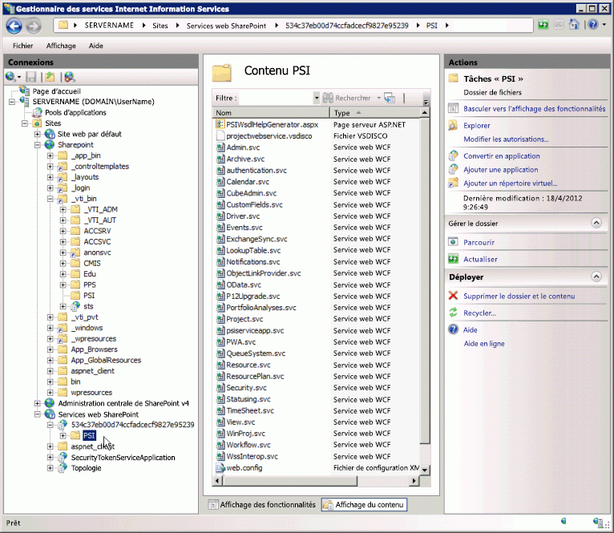

# <a name="project-psi-reference-overview"></a>Vue d’ensemble de la référence PSI

Project Server Interface (PSI) est l’API à utiliser pour le développement d’applications qui s’intègre avec Project Server 2013 en local.
Cet article est une vue d’ensemble des assemblages documentés dans l’Explorateur, les espaces de noms et les services dans le programme PSI. La[référence service Project Server 2013 pour la bibliothèque de classe et web](https://docs.microsoft.com/previous-versions/office/project-class/ee767707(v=office.15)) dans le SDK contient l’ensemble de la documentation du code managé pour la PSI et l’espace[Microsoft.ProjectServer.Client](https://docs.microsoft.com/previous-versions/office/dn529530(v=office.15))de noms dans Project Server 2013. Pour développer des applications pour Project Online, vous devez utiliser l’espace **Microsoft.ProjectServer.Client** de noms au lieu de la PSI.

La PSI dans Project Server 2013 présente une double interface. L'interface ASMX pour les services web est définie par des fichiers de découverte et de langage de description des services web (disco et WSDL) dans le répertoire virtuel `https://ServerName/ProjectServerName/_vti_bin/psi/` (par exemple, Projectdisco.aspx et Projectwsdl.aspx). Vous pouvez accéder à l’interface ASMX uniquement par le biais de l’URL d’une installation locale de Project Web App (par exemple, `https://ServerName/ProjectServerName/_vti_bin/psi/project.asmx?wsdl)`. Pour afficher le service web dans un navigateur, vous devez inclure l’option URL `?wsdl`. Étant donné que l’interface ASMX créé à l’aide de l’infrastructure Windows Communication Foundation (WCF), les fichiers .asmx pour les services web Project Server n’existent pas réellement dans le répertoire PSI virtuel.

L'interface des services WCF est définie par des fichiers .svc dans le répertoire virtuel `https://ServerName:32843/GUID/PSI/` de l'application Services web SharePoint. L'URL des services PSI dans le répertoire virtuel Application de Service Project (par exemple, `https://ServerName:32843/GUID/PSI/project.svc`) inclut les fichiers .svc. Mais vous ne pouvez pas utiliser directement l’URL principale pour définir une référence de service WCF. Pour développer une application ou un composant qui utilise les services WCF de la PSI, vous pouvez utiliser un assemblage de proxy ou un fichier de proxy. Le téléchargement de Project 2013 SDK inclut les fichiers de proxy pour les services WCF dans Project Server 2013 et les scripts pour obtenir la mise à jour des fichiers proxy WCF et compiler les fichiers dans un assemblage de proxy pour Project Server plus récent.

Le nom du répertoire Application de Service Project est une valeur GUID, qui est identique au GUID de l’instance Project Web App en local. Dans la fenêtre **Gestionnaire de Services Internet (IIS)**, développez le nœud **Services Web SharePoint**, sélectionnez le nom du répertoire GUID, puis **paramètres avancés** pour copier la valeur **chemin d’accès virtuel**.

> [!IMPORTANT]
> L’interface de service web ASMX de la PSI déconseillé dans Project Server 2013, mais est toujours prise en charge. Les nouvelles applications doivent utiliser l’interface WCF de la PSI ou le CSOM. Pour plus d’informations sur les fonctionnalités déconseillées, consultez [Mises à jour pour les développeurs dans Project 2013](updates-for-developers-in-project-2013.md).
>
> Les nouvelles applications et composants logiciels intermédiaires s’exécutent uniquement sur une installation locale de Project Server qui doit utiliser l’interface WCF, c'est-à-dire la technologie que nous vous recommandons pour les communications de réseau. Les anciennes applications qui utilisent l’interface ASMX doivent utiliser l’URL via Project Web App, qui vérifie les autorisations de Project Server.
>
> Pour plus d’informations sur l’interface ASMX et comment utiliser l’interface WCF, voir [conditions préalables pour les exemples de code base ASMX dans Project](prerequisites-for-asmx-based-code-samples-in-project.md) et [conditions préalables pour les exemples de code base WCF dans Project](prerequisites-for-wcf-based-code-samples-in-project.md).

Pour le développement d’applications qui utilisent l’interface WCF, vous pouvez utiliser Visual Studio 2010 ou Visual Studio 2012. Pour la création de flux de travail Project Server déclarative, vous pouvez utiliser SharePoint Designer 2013. Les flux de travail Project Server qui nécessitent l’accès à la PSI ou le CSOM peuvent être développés avec Visual Studio 2012.

## <a name="use-the-psi-reference"></a>Utiliser la référence PSI

Le modèle objet PSI est volumineux et plusieurs classes et des membres sont uniquement pour un usage interne. Par conséquent, il peut être difficile de trouver les rubriques que vous souhaitez dans la[référence service Project Server 2013 pour la bibliothèque de classe et web](https://msdn.microsoft.com/library/ef1830e0-3c9a-4f98-aa0a-5556c298e7d1%28Office.15%29.aspx). La plupart des rubriques de référence que vous utiliserez pour le développement apparaissent dans les groupes suivants:

- **Méthodes de classe principal :** chaque service dans le programme PSI comprend une classe principale qui porte le nom du service. Par exemple, le service **Ressource** contient la catégorie [ressource](https://msdn.microsoft.com/library/WebSvcResource.Resource.aspx), ce qui se trouve dans l’espace de noms [WebSvcResource](https://msdn.microsoft.com/library/WebSvcResource.aspx). Pour afficher la liste des méthodes qui sont disponibles dans la catégorie **ressource**, développez le nœud pour la catégorie dans le volet de contenu, puis sélectionnez la rubrique **ressource méthodes**.
- **Propriétés DataRow :** de nombreuses méthodes pour la catégorie principale utilisez ou renvoyez un **jeu de données**. Chaque objet **table de données** dans un **jeu de données** contient des données dans un ou plusieurs objets **DataRow**. Dans la plupart des cas, vous avez besoin d’afficher uniquement les propriétés de ligne, tous les autres membres des catégories **jeu de données**, **table de données**, ou **DataRow**. Par exemple, la catégorie **ResourceAssignmentDataSet** inclut des sous-catégories pour la catégorie **ResourceAssignmentDataTable** et la catégorie [ResourceAssignmentDataSet.ResourceAssignmentRow](https://msdn.microsoft.com/library/WebSvcResource.ResourceAssignmentDataSet.ResourceAssignmentRow.aspx). Pour afficher la liste des propriétés qui se trouvent dans la catégorie **ResourceAssignmentRow**, développez le nœud pour la catégorie dans le volet de contenu, puis sélectionnez la rubrique **ResourceAssignmentDataSet.ResourceAssignmentRow propriétés**.

Outre les espaces de noms de service, la rubrique[référence service Project Server 2013 pour la classe bibliothèque et web](https://msdn.microsoft.com/library/ef1830e0-3c9a-4f98-aa0a-5556c298e7d1%28Office.15%29.aspx)est reliée aux trois assemblages de Project Server qui sont utilisés en cours de développement de solutions logicielles tierces pour la version locale d’installations. Nous fournissons uniquement la documentation minimale pour ces assemblages. La référence PSI documente les catégories principales et les membres des services publics 23. Six services PSI sont pour usage interne uniquement et ne sont pas documentées.

> [!NOTE]
> Les catégories dans le modèle objet côté client (CSOM) peuvent être utilisées de manière indépendante à partir d’autres assemblages de Project Server et services. Vous pouvez utiliser l’espace de noms **Microsoft.ProjectServer.Client** dans un environnement de développement à distance de l’ordinateur Project Server et développez des applications qui s’intègrent avec Project Online ou avec une installation locale de Project Serveur. En revanche, le CSOM contient un sous-ensemble de fonctionnalités de PSI complètes. Le CSOM permet le développement de scénarios les plus courants pour l’intégration de Project Server. Pour plus d’informations, consultez [Fonctionnalités du modèle CSOM](what-the-csom-does-and-does-not-do.md) et [Microsoft.ProjectServer.Client](https://msdn.microsoft.com/library/Microsoft.ProjectServer.Client.aspx).

Pour le développement de la plupart des applications qui utilisent la PSI, vous n’avez pas de développer sur un ordinateur de Project Server ou définir les références aux assemblages de Project Server dans le cache d’assemblage global. Vous pouvez copier les assemblages de Project Server nécessaires sur votre ordinateur de développement. Project Server 2013 installe assemblages suivants dans _[Program Files]_ `\Microsoft Office Servers\15.0\Bin` :

- Microsoft.Office.Project.Server.Events.Receivers.dll
- Microsoft.Office.Project.Server.Library.dll
- Microsoft.Office.Project.Server.Workflow.dll

Les Espaces de noms pour les services PSI portent des noms arbitraires créés pour un assemblage de proxy PSI ProjectServerServices.dll, est généré aux fins de documentation. Dans la référence PSI, chaque espace de nom de service a un nom générique (par exemple, _[Service web du projet]_) et une référence web (par exemple, `https://ServerName/ProjectServerName/_vti_bin/psi/Project.asmx?wsdl`).

## <a name="project-server-assemblies-and-namespaces"></a>Espaces de noms et assemblages de Project Server

De nombreux assemblages sont installés lors de l’installation de Project Server ; Seuls quatre des assemblages de Project Server sont présentés. Des développeurs tiers utilisent généralement uniquement quelques catégories et des membres dans ces assemblages. Les assemblages de Project Server documentés incluent les espaces de noms et les catégories Project Server utilisés en interne, tels que des catégories pour Project Web App, entités professionnelles, et les accès aux données couche (DAL). Lorsque vous définissez une référence dans Visual Studio vers l’une des document dans l’Explorateur assemblages de Project Server, vous pouvez voir tous des espaces de noms, des catégories et des membres dans l’Explorateur d’objets Visual Studio.

> [!NOTE]
> De nombreux membres des espaces de noms Project Server documentés sont utilisés uniquement en interne et disposent de documentation minimale.

Lorsque vous développez pour Project Online, vous pouvez utiliser uniquement le CSOM pour accéder aux fonctionnalités de Project Server. Vous n’avez pas accès aux services PSI ou aux autres assemblages de Project Server.

La[référence service Project Server 2013 pour la classe bibliothèque et web](https://msdn.microsoft.com/library/ef1830e0-3c9a-4f98-aa0a-5556c298e7d1%28Office.15%29.aspx) pour la PSI inclut des espaces de noms à partir d’assemblages suivants:

- **Microsoft.Office.Project.Server.Library.dll** cet assemblage contient un espace de noms de document dans l’Explorateur et trois espaces de noms documentés, comme suit :

- L’espace de noms[Microsoft.Office.Project.Server.Library](https://msdn.microsoft.com/library/Microsoft.Office.Project.Server.Library.aspx) inclut de nombreuses énumérations et les champs de la catégorie ainsi que les propriétés fréquemment utilisées dans les applications pour Project Server en local. Par exemple, les développeurs utilisent généralement les énumérations comme **CustomField.Type** et les catégories **PSClientError**, **PSErrorInfo**, et **filtrer**.

L’ espace de noms **Microsoft.Office.Project.Server.Library** inclut également les catégories des sept propriété suivantes, lesquelles incluent plus de 3 200 sous-catégories:

- **AssignmentProperties**
- **CalendarProperties**
- **ConstraintProperties**
- **LookupTableProperties**
- **ProjectProperties**
- **ResourceProperties**
- **TaskProperties**

Les catégories de propriétés sont utilisées en interne et ne sont pas documentées. Les catégories de propriétés sont utilisés pour sérialisation entre Project Professionnel 2013 et Project Server. Lorsque vous travaillez avec l’espace de noms **Microsoft.Office.Project.Server.Library** dans Visual Studio, l’Explorateur d’objets affiche toutes les catégories de propriété, ce qui rend plus difficile à trouver les catégories qui sont utiles pour un développement tiers. Étant donné que des développeurs tiers n’ont pas à utiliser les catégories de propriétés, le SDK ne les documente pas.

- **Microsoft.Office.Project.Server.DataServices** Les catégories et les membres de cet espace de noms utilisés en interne par le service **OData** dans Project Online pour l’accès à la création de rapports des tableaux dans la base de données de Projet. Les catégories **DataServices** sont présentées pas.

- **Microsoft.Office.Project.Server.Administration** la catégorie et les membres de cet espace de noms utilisés en interne pour la journalisation de diagnostic ne sont pas documentés.

- **Microsoft.Office.Project.Server.Base** la catégorie et les membres de cet espace de noms utilisés en interne pour les catégories de base ne sont pas documentés.

- **Microsoft.Office.Project.Server.Library.FilterSchema** cet espace de noms est utilisé en interne pour générer des schémas de filtre et n’est pas documenté.

- **Microsoft.Office.Project.Server.Workflow.dll** cet assemblage sert d’anciens flux de travail Project Server 2010 qui continuent de fonctionner dans Project Server 2013. Pour la création de nouveaux flux de travail, vous devez utiliser SharePoint Designer 2013, ou vous pouvez également utiliser Visual Studio 2012 avec la catégorie[Microsoft.ProjectServer.Client.WorkflowActivities](https://msdn.microsoft.com/library/Microsoft.ProjectServer.Client.WorkflowActivities.aspx). L’assemblage Microsoft.Office.Project.Server.Workflow.dll inclut les trois espaces de noms suivants :

- [Microsoft.Office.Project.Server.Workflow](https://msdn.microsoft.com/library/Microsoft.Office.Project.Server.Workflow.aspx) cet espace de noms inclut des catégories qui sont utilisées pour les activités de flux de travail de Project Server workflow. Les activités incluent la lecture, la comparaison et la mise à jour des propriétés du projet. Les autres catégories gèrent des flux de travail et incluent des flux de travail appel-verso cas de modification des projets.

- **Microsoft.Office.Project.PWA** cet espace de noms inclut un proxy interne pour PSI, pour une utilisation avec Project Web App et des activités de flux de travail personnalisé ; il n’est pas documenté.

    Une activité de flux de travail personnalisés nécessite une référence à **Microsoft.Office.Project.PWA** pour accéder à toutes les catégories dans les services PSI. Par exemple, la catégorie **Microsoft.Office.Project.PWA.PSI** inclut la propriété **ProjectWebService**, qui obtient un proxy pour l’espace de noms [WebSvcProject](https://msdn.microsoft.com/library/WebSvcProject.aspx).

- **Microsoft.Office.Project.Server.WebServiceProxy** cet espace de noms inclut des catégories proxy internes pour la catégorie principale dans chaque service PSI. En utilisant des autorisations élevées de l’utilisateur de flux de travail, le flux de travail peut d’appeler méthodes PSI via les catégories proxy. Les catégories proxy ne sont pas documentées.

- **Microsoft.Office.Project.Server.Events.Receivers.dll**[Microsoft.Office.Project.Server.Events](https://msdn.microsoft.com/library/Microsoft.Office.Project.Server.Events.aspx) est l’espace de noms uniquement dans cet assemblage. Il inclut le récepteur d’événements et les catégories d’argument d’événement pour les services PSI et d’autres catégories internes.

Les développeurs écrivent les gestionnaires d’événements qui dérivent des catégories de récepteur d’événement. La plupart des catégories principales dans les services PSI disposent déjà d’une catégorie récepteur d’événements correspondante. Par exemple, la catégorie **ProjectEventReceiver** contient des méthodes d’événement avant et après l’événement récepteur correspondant à des méthodes dans la catégorie **Project** dans le programme PSI. La méthode **OnCreating** et la méthode **OnCreated** la méthode est composée des méthodes récepteur avant événement et après l’événement pour la méthode **QueueCreateProject**.

Les développeurs utilisent généralement les catégories de récepteur événement suivantes :

- [AdminEventReceiver](https://msdn.microsoft.com/library/Microsoft.Office.Project.Server.Events.AdminEventReceiver.aspx)
- [CalendarEventReceiver](https://msdn.microsoft.com/library/Microsoft.Office.Project.Server.Events.CalendarEventReceiver.aspx)
- [CubeAdminEventReceiver](https://msdn.microsoft.com/library/Microsoft.Office.Project.Server.Events.CubeAdminEventReceiver.aspx)
- [CustomFieldsEventReceiver](https://msdn.microsoft.com/library/Microsoft.Office.Project.Server.Events.CustomFieldsEventReceiver.aspx)
- [LookupTableEventReceiver](https://msdn.microsoft.com/library/Microsoft.Office.Project.Server.Events.LookupTableEventReceiver.aspx)
- [ProjectEventReceiver](https://msdn.microsoft.com/library/Microsoft.Office.Project.Server.Events.ProjectEventReceiver.aspx)
- [OptimizerEventReceiver](https://msdn.microsoft.com/library/Microsoft.Office.Project.Server.Events.OptimizerEventReceiver.aspx)
- [ReportingEventReceiver](https://msdn.microsoft.com/library/Microsoft.Office.Project.Server.Events.ReportingEventReceiver.aspx)
- [ResourceEventReceiver](https://msdn.microsoft.com/library/Microsoft.Office.Project.Server.Events.ResourceEventReceiver.aspx)
- [SecurityEventReceiver](https://msdn.microsoft.com/library/Microsoft.Office.Project.Server.Events.SecurityEventReceiver.aspx)
- [StatusingEventReceiver](https://msdn.microsoft.com/library/Microsoft.Office.Project.Server.Events.StatusingEventReceiver.aspx)
- [TimesheetEventReceiver](https://msdn.microsoft.com/library/Microsoft.Office.Project.Server.Events.TimesheetEventReceiver.aspx)
- [UserDelegationEventReceiver](https://msdn.microsoft.com/library/Microsoft.Office.Project.Server.Events.UserDelegationEventReceiver.aspx)
- [WorkflowEventReceiver](https://msdn.microsoft.com/library/Microsoft.Office.Project.Server.Events.WorkflowEventReceiver.aspx)
- [WssInteropEventReceiver](https://msdn.microsoft.com/library/Microsoft.Office.Project.Server.Events.WssInteropEventReceiver.aspx)

La catégorie **RulesEventReceiver** et la catégorie **StatusReportsEventReceiver** sont utilisées en interne dans l’application Project Web.

- **Microsoft.ProjectServer.Client.dll** Cet assemblage contient le CSOM pour le développement avec le .NET Framework 4. L’assemblage est localisé dans`%ProgramFiles%\Common Files\Microsoft Shared\Web Server Extensions\15\ISAPI\Microsoft.ProjectServer.Client.dll`. Le développement des applications avec l’espace de noms **Microsoft.ProjectServer.Client** est indépendant des APIs et les services Project Server en local, bien que les applications peuvent fonctionner avec soit une installation en local ou en ligne du Project Server. Pour les assemblages CSOM associés qui peuvent être utilisés pour Windows Phone 8, Microsoft Silverlight, ou JavaScript avec des applications web, Consultez [Microsoft.ProjectServer.Client](https://msdn.microsoft.com/library/Microsoft.ProjectServer.Client.aspx).

- **Microsoft.Office.Project.Server.Schema.dll** le Project 2013 SDK ne documente pas l’espace de noms **Microsoft.Office.Project.Server.Schema**, qui se trouve dans l’`[Windows]\Microsoft.NET\assembly\GAC_MSIL\Microsoft.Office.Project.Schema\v4.0_15.0.0.0__71e9bce111e9429c\Microsoft.Office.Project.Schema.dll` assemblage. L’espace de noms contient les définitions de toutes les catégories **DataSet**, **table de données**, et **DataRow** utilisées dans la PSI, ainsi que de nombreuses autres catégories similaires utilisent Project Server en interne. Les catégories publiques dans chaque service PSI sont présentées dans la référence de service spécifique. Par exemple, la catégorie **DriverDataSet.DriverRow** est présentée dans l’espace de noms [WebSvcDriver](https://msdn.microsoft.com/library/WebSvcDriver.aspx).

> [!NOTE]
> Les applications qui utilisent le CSOM utilisent les gestionnaires d’événements à distance ou l’accès au Project Online n’utilise pas l’espace de noms **Microsoft.Office.Project.Server.Schema**.

Dans certaines applications qui utilisent des gestionnaires d’événements de confiance totale, où les gestionnaires d’événements sont installés sur l’ordinateur de Project Server, il est nécessaire de définir une référence à l’assembly Microsoft.Office.Project.Schema.dll. Vous trouverez deux exemples ci-dessous :

- Dans une confiance totale **OnCreated** Gestionnaire d’événements après des champs personnalisés, vous pouvez utiliser l’ argument événement **e.CustomFieldInformation** avec une référence à l’espace de noms **Microsoft.Office.Project.Server.Schema** pour les définitions **CustomFieldDataSet** et **CustomFieldsRow**.

```cs
  using PSLibrary = Microsoft.Office.Project.Server.Library;
  using Microsoft.Office.Project.Server.Schema;
  . . .
  // Event handler for the OnCreated event of a custom field.
  public override void OnCreated(
      PSLibrary.PSContextInfo contextInfo, 
      CustomFieldsPostEventArgs e)
  {
      // Get information from the event arguments. 
      string userName = contextInfo.UserName.ToString();
      CustomFieldDataSet customFieldDs = e.CustomFieldInformation;
      CustomFieldsRow customFieldRow = customFieldDs.CustomFields.Rows[0];
      string customFieldName = customFieldRow["MD_PROP_NAME"].ToString();
      byte customFieldType = (byte)customFieldRow["MD_PROP_TYPE_ENUM"];
      Guid customFieldUid = (Guid)customFieldRow["MD_PROP_UID"];
      . . .
  }
```

- Une activité de flux de travail personnalisé peut exiger qu’une référence aux définitions **Microsoft.Office.Project.Server.Schema** pour **DataSet**.

## <a name="psi-services"></a>Services PSI

La PSI est un ensemble de services WCF et les services web ASMX identiques pour Project Server 2013. Pour utiliser un service dans un projet Visual Studio, vous définissez une référence à l'URL du fichier `.svc` ou du service `.asmx?wsdl` en utilisant un nom arbitraire pour le service de nom. L’utilitaire wsdl.exe ou l’utilitaire svcutil.exe génère ensuite le code source proxy pour cet espace de noms et le compilateur crée un assemblage de service proxy à inclure dans votre application.

> [!NOTE]
> La référence PSI inclut des noms de service d’espaces réservés pour les services PSI tels que _[Service web d’administration]_, _[Service web de pilote]_, et _[Service web du projet]_. Chaque PSI nameservice inclut une catégorie principale qui contient les méthodes web pour le service concerné. Par exemple, si vous définissez une référence le service **administrateur** et nommez-le **WebSvcAdmin**, puis dans votre application de le nameservice **WebSvcAdmin** inclut la catégorie principale **Administrateur** contenant les méthodes web **GetServerCurrency**, **ListInstalledLanguages**, **ReadServerVersion**, et ainsi de suite. Voir [Mises à jour pour les développeurs dans Project 2013](updates-for-developers-in-project-2013.md) pour obtenir la liste des services PSI obsolètes.

Des 30 services PSI au total, **authentification**, **ExchangeSync**, **OData**, **P12Upgrade**, **psiserviceapp**, **PWA**, **Affichage**, et **WinProj** sont pour un usage interne par Project Web App et Project Professionnel et ne sont pas documentés. Bien que vous pouvez créer des fichiers de proxy ou un assemblage de proxy incluant les services PSI internes, les services internes ne sont pas d’utilisation tierce; la référence PSI document pas ces services. La figure suivante montre l’emplacement des services PSI principaux dans Internet Information Services Manager.

### <a name="locate-the-psi-services-in-iis"></a>Localiser les services PSI dans les services IIS (Internet Information Services)



Toutes les catégories qui contiennent des méthodes web dans les services PSI sont les suivantes:

- [Administrateur](https://msdn.microsoft.com/library/WebSvcAdmin.Admin.aspx) inclut des méthodes qui sont utilisés dans les pages **Administration de Project Server** dans Project Web App. Définit les années fiscales, gère les paramètres États d’avancement et devise, la création de rapports périodes, le journal d’audit et des paramètres pour Active Directory.
- [Archive](https://msdn.microsoft.com/library/WebSvcArchive.Archive.aspx) inclut des méthodes pour la gestion de sauvegarde et restauration de projets, les catégories de sécurité, les champs personnalisés, ressources, paramètres système, les vues et le projet global d’entreprise. Lit et met à jour le planning d’archivage. Archive tous les projets ou supprime les projets archivés spécifiés. Enregistre les objets de sauvegarde dans les tableaux de base de données Archive et restaure les objets sauvegardés dans les tables de base de données publié.
- **authentification** inclut des méthodes pour un usage interne uniquement par Project Professionnel et Project Web App.
- [Calendrier](https://msdn.microsoft.com/library/WebSvcCalendar.Calendar.aspx) gère les exceptions de calendrier d’entreprise. Extrait et la recherche dans les calendriers des ressources. Crée, supprime, répertorie tout, mises à jour ou renvoie des exceptions de calendrier.
- [CubeAdmin](https://msdn.microsoft.com/library/WebSvcCubeAdmin.CubeAdmin.aspx) gère les paramètres du cube OLAP. Obtient Analysis Server, l’état de base de données et la liste des cubes. Place une demande de Service Build Cube dans la file d’attente. Lit et met à jour des définitions de membre calculé et les paramètres des champs pour les dimensions et mesures dans le cube.
- [CustomFields](https://msdn.microsoft.com/library/WebSvcCustomFields.CustomFields.aspx) gère les champs personnalisés d’entreprise. Inclut l’extraction et la vérification dans les méthodes et les méthodes créer, lire, mettre à jour ainsi que les méthodes de suppression de champs personnalisés d’entreprise.
- [Pilote](https://msdn.microsoft.com/library/WebSvcDriver.Driver.aspx) gère les pilotes d’analyse de portefeuille et hiérarchisation pilote pour la création de projets et de gestion de la demande. Inclut les méthodes CRUD pour les pilotes de projet.
- [Événements](https://msdn.microsoft.com/library/WebSvcEvents.Events.aspx)gère les associations Gestionnaire d’événements Project Server. Inclut les méthodes CRUD pour les associations Gestionnaire de Project Server événement pour un événement spécifique ou pour tous les associations Gestionnaire d’événements.
- **ExchangeSync** il s’agit d’un service Project Server interne qui gère les événements d’Exchange Server. Project Web App utilise **ExchangeSync** pour synchroniser les affectations entre Project Server et Exchange Server, au lieu de la synchronisation directement avec le client Outlook comme dans Office Project Server 2007.
L’accès au service **ExchangeSync** est disponible uniquement par le biais du **ProjectServiceApplication** URL. Les catégories **ExchangeSync** et des membres ne sont pas pris en charge pour le développement de tiers.
- [LoginForms](https://msdn.microsoft.com/library/WebSvcLoginForms.LoginForms.aspx) fournit les méthodes **connexion** et la **fermeture de session** avec l’authentification de formulaires. L’accès au service **LoginForms** est disponible uniquement sur un site Project Web App frontaux.
- [LoginWindows](https://msdn.microsoft.com/library/WebSvcLoginWindows.LoginWindows.aspx) fournit les méthodes **connexion** et **fermeture de session** qui sont utilisés pour l’authentification Windows avec les applications ASMX pour l’authentification plusieurs (revendications basées sur les formulaires et) Projet installations Server 2013. L’accès au service **LoginWindows** est disponible uniquement sur un site Project Web App frontaux.

> [!CAUTION]
> Le service **LoginWindows** n’est pas utilisé dans les applications WCF ou pour les applications qui s’exécutent sur les installations de Project Server dont l’utilisation déclare uniquement l’authentification ou **OAuth**; dans ce cas, la **Connexion** méthode retourne toujours **faux**. L’authentification des déclarations gère l’authentification Windows intégrée.

- [LookupTable](https://msdn.microsoft.com/library/WebSvcLookupTable.LookupTable.aspx) gère les tableaux de recherche, les tableaux de recherche multilingues ainsi que leurs masques de code correspondants. Extrait, archive, lit, crée, supprime et met à jour.
- [Notifications](https://msdn.microsoft.com/library/WebSvcNotifications.Notifications.aspx) gère les alertes et les rappels. Inclut des méthodes pour obtenir, définir, enregistrer et annuler les résultats d’alerte.
- [ObjectLinkProvider](https://msdn.microsoft.com/library/WebSvcObjectLinkProvider.ObjectLinkProvider.aspx) gère les objets web ainsi que des liens pour les documents et éléments de liste sur les sites SharePoint. Crée, supprime ou lit le projet lié au projet, une tâche ou les objets web liés aux tâches.

  > [!NOTE]
  > Le service **ObjectLinkProvider** est déconseillé dans Project Server 2013. Pour plus d'informations, consultez la section *Fonctionnalités déconseillés* dans [Mises à jour pour les développeurs dans Project 2013](updates-for-developers-in-project-2013.md).

- **OData** fournit l’interface interne **OData** pour la création de tableaux et consultations de rapports. L’accès au service **OData** est disponible uniquement par le biais de l’URL **ProjectServiceApplication**. Le service privé **OData** dans le programme PSI fournit une méthode **ODataClient.ProcessOdataMessage**, que Project Server utilise en interne pour traiter les demandes de données de rapport. Les demandes HTTP passent en revue le service de serveur frontal **ProjectData**. Pour plus d’informations sur le service **ProjectData** et le protocole OData à lire les rapports de données, voir [ProjectData-référence service OData Project](https://msdn.microsoft.com/library/office/jj163015.aspx).
- **P12Upgrade** offre des méthodes internes pour le programme d’installation de Project Server 2013 pour mettre à niveau une installation d’Office Project Server 2007. L’accès au service **P12Upgrade** est disponible uniquement par le biais de l’URL **ProjectServiceApplication**. Les méthodes **P12Upgrade** ne sont pas pris en charge pour le développement de tiers.
- [PortfolioAnalyses](https://msdn.microsoft.com/library/WebSvcPortfolioAnalyses.PortfolioAnalyses.aspx) inclut les méthodes CRUD pour des dépendances de projet et les solutions optimiseur, le planificateur et les solutions d’analyse.
- [Projet](https://msdn.microsoft.com/library/WebSvcProject.Project.aspx) gère les projets. Extrait, archive, crée, supprime, lit ou met à jour des projets dans le brouillon de projet de tableaux de base de données ou des tableaux publiés. Place un message dans la file d’attente pour la publication.
  - Crée ou supprime les entités au sein de projets (les tâches, les ressources, les affectations et ainsi de suite). Récupère des informations ou met à jour de l’équipe de projet ou l’adresse de site de projet. Obtient l’état du projet, une liste des projets dans les tables brouillon, toutes les tâches récapitulatives, les tâches sont disponibles pour l’affectation à une ressource spécifiée ou tous les projets dans lesquels une ressource a des affectations.
  - Crée et gère les engagements, crée des propositions de projets et des projets à partir de listes de tâches SharePoint et trouve relations projet project/masque des diapositives.
- **psiserviceapp** utilisé en interne par Project Online. Les catégories **psiserviceapp** et des membres ne sont pas pris en charge pour le développement de tiers.
- **PWA** contient de nombreuses méthodes qui sont optimisées pour Project Web App, comprenant les méthodes pour les règles d’approbation de mise à jour de tâche et pour la gestion des rapports d’état. Les méthodes **PWA** sont souvent spécialisées et légèrement redondantes par rapport aux méthodes équivalentes dans d’autres services PSI. **PWA** les méthodes utilisent ou retournent beaucoup d’autres jeux de données comme es autres méthodes PSI.
  L’accès au service **PWA** est disponible uniquement par le biais de l’URL **ProjectServiceApplication**. Les catégories **PWA** et des membres ne sont pas pris en charge pour le développement de tiers.
- [QueueSystem](https://msdn.microsoft.com/library/WebSvcQueueSystem.QueueSystem.aspx) gère la file d’attente de Project Server. Obtient le nombre de tâches, travail et temps d’attente de groupe de travail, l’état de tous les travaux, les travaux spécifiés, les travaux appartenant à l’appelant ou travaux pour les projets spécifiés. Gère la corrélation du travail et configure la file d’attente.
- [Resource](https://msdn.microsoft.com/library/WebSvcResource.Resource.aspx) Gère des ressources d’entreprise. Extrait, archive, met à jour ou crée des ressources ou les utilisateurs de Project Server et leurs paramètres d’autorisation ; recherche des ressources par nom ou GUID ; lit ressource ou données utilisateur et les ressources RBS (breakdown structure) et les informations de sécurité associés ; Obtient toutes les affectations pour une ressource ; et mots de passe utilisateur réinitialisation. La catégorie **Ressource** inclut des méthodes CRUD de délégation utilisateur.
- [ResourcePlan](https://msdn.microsoft.com/library/WebSvcResourcePlan.ResourcePlan.aspx) gère les plans de ressources. Extrait, archive, publie et inclut les méthodes CRUD de plans de ressources.
- [Sécurité](https://msdn.microsoft.com/library/WebSvcSecurity.Security.aspx) inclut les méthodes CRUD pour les modèles de sécurité, les catégories de sécurité, les autorisations globales et d’organisation et les autorisations de groupe. La catégorie **Sécurité** inclut des méthodes de catégories de projet.
- [États d’avancement](https://msdn.microsoft.com/library/WebSvcStatusing.Statusing.aspx) gère les mises à jour et les affectations. Applique les mises à jour ou les approbations, envoie l’état mises à jour, définit des informations de synthèse les mises à jour soumis, supprime les mises à jour de statut approuvé ou votre historique de l’approbation d’un utilisateur spécifié ou supprime toutes les informations d’état pour un ensemble de projets. Crée, obtient ou délègue les affectations ; définit la durée de travail d’affectation. Obtient nouvelles affectations de l’utilisateur actuel ; Obtient l’historique des transactions affectation ou une tâche, les valeurs réelles chronologiques ou la hiérarchie de la tâche récapitulative.
    Affiche ou permet d’importer les données de feuille de temps ou lit le travail d’un utilisateur et le planning des périodes chômées. Recherche les mises à jour, les mises à jour soumis d’informations ou un enregistrement des modifications dans une mise à jour soumise à une transaction en attente. Lit l’état de l’équipe.
- [Feuille de temps](https://msdn.microsoft.com/library/WebSvcTimeSheet.TimeSheet.aspx) gère les feuilles de temps. Inclut les méthodes CRUD de feuilles de temps et envoie ou rappelle des feuilles de temps. Trouve les feuilles de temps qui présentent un retard ou en attente d’approbation ; recherche des feuilles de temps par période ou par date. Obtient liste d’approbation de feuille de temps. Précharge les valeurs réelles feuille de temps et valide une ligne de feuille de temps. La catégorie **feuille de temps** inclut la méthode **ReadProjectTimesheetLines** et la méthode **SubmitTimesheetLines** pour la lecture et l’envoi de feuilles de temps à une autre ressource sans nécessiter d’emprunt d’identité.
  - **Affichage** le service **Affichage** est conçu pour une utilisation uniquement au sein de Project Web App. Les méthodes dans la catégorie **affichage** gèrent les affichages et affichent des rapports et une lecture de champs dans les affichages. L’accès au service **Affichage** est disponible uniquement par le biais de l’URL **ProjectServiceApplication**. Les méthodes **Affichage** ne sont pas pris en charge pour le développement de tiers.
  - **WinProj** le service **WinProj** est conçu pour une utilisation uniquement par Project Professional. Des développeurs tiers ne devraient pas utiliser les méthodes **WinProj** permettant la programmation avec Project Server.
    - Certaines méthodes **WinProj** utilisent les jeux de données telles que **ProjectRelationsDataSet** et **ResourceDataSet** que les services **Project** et **Ressource** les utilisent également, mais nécessitent des propriétés spécifiques et des fonctions dans Project Professional.
    - L’accès au service **WinProj** est disponible uniquement par le biais de l’URL **ProjectServiceApplication**. Les méthodes **WinProj** ne sont pas pris en charge pour le développement de tiers.
- [Flux de travail](https://msdn.microsoft.com/library/WebSvcWorkflow.Workflow.aspx) inclut les méthodes CRUD pour les types de projet d’entreprise et pour la gestion des flux de travail phases et les étapes. Le flux de travail s’exécute, définit les informations d’état et gère les étapes de page (PDP) liés au détail du projet dans le flux de travail de gestion de la demande. Pour développer des flux de travail Project Server, les développeurs peuvent utiliser SharePoint Designer 2013 des flux de travail déclaratif ou utilisez les outils de développement Office pour Visual Studio 2012 pour le développement avec .NET Framework 4 et le [Microsoft.ProjectServer.Client.WorkflowActivities](https://msdn.microsoft.com/library/Microsoft.ProjectServer.Client.WorkflowActivities.aspx) pour la catégorie dans le CSOM.
- [WssInterop](https://msdn.microsoft.com/library/WebSvcWssInterop.WssInterop.aspx) gère les sites de projets. Crée et supprime les sites de projets. Récupère des informations et met à jour les paramètres de SharePoint et les sites d’administration. Synchronise et met à jour les appartenances au site de projet et les groupes.

Chaque espace de noms de service inclut toutes les catégories de gestionnaire de schéma et événement **DataSet** qui utilisent le service. Par exemple, `Calendar.svc` (ou `Calendar.asmx?wsdl` pour le service web ASMX) décrit le service **Calendar**. Si vous nommez la référence **WebSvcCalendar**, l’espace de noms proxy contient la clé principale **Calendar** pour la catégorie avec les méthodes **CheckInCalendars**, **CheckOutCalendars**, et ainsi de suite. L’ espace de noms proxy **WebSvcCalendar** inclut également la catégorie **CalendarDataSet** et toutes ses sous-catégories.

Certains des services PSI contiennent des catégories en doublon **DataSet**. Par exemple, le service **Project** et le service **États d’avancement** incluent les deux catégories **ProjectDataSet**. En effet, dans les deux méthodes du service **Project** et du service **États d’avancement** incluent les références à la **ProjectDataSet** et les assemblages proxy que vous créez lorsque vous définissez les références et compilez une application incluent les jeux de données connexes. Le service **Project** et le service **États d’avancement** nécessitent des valeurs pour différents champs dans la catégorie **ProjectDataSet.ProjectRow**.

Lorsque vous naviguez dans les espaces de noms et les catégories de la référence PSI, par exemple pour voir les méthodes web pour le service **Project**, développez l’espace de noms **[service web du projet]** dans la liste **Contenu**, puis développez la catégorie **Project**.

## <a name="see-also"></a>Voir aussi

- [Architecture Project Server 2013](project-server-2013-architecture.md)
- [Programmabilité de Project Server](project-server-programmability.md)
- [Fonctionnalités de l’interface PSI](what-the-psi-does-and-does-not-do.md)
- [Conditions préalables pour les exemples de code basés sur ASMX](prerequisites-for-asmx-based-code-samples-in-project.md)
- [Conditions préalables pour les exemples de code basés sur WCF](prerequisites-for-wcf-based-code-samples-in-project.md)
- [Guide du développeur .NET Framework](https://msdn.microsoft.com/netframework/aa496123.aspx)
