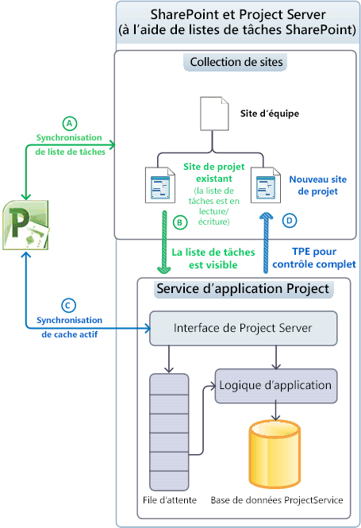
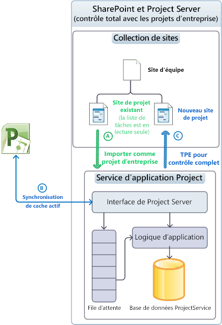
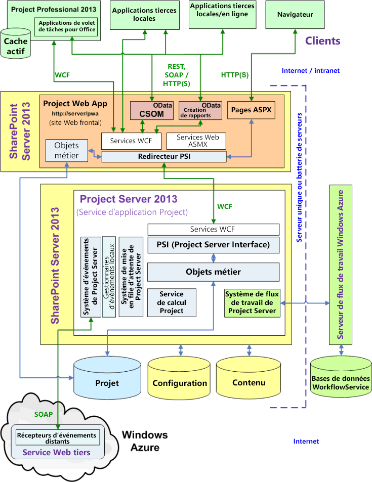
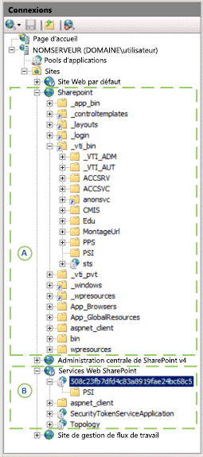

# Architecture Project ServerProject Server architecture

Project Server 2013 intègre des fonctionnalités de gestion de projet au sein d’une batterie de serveurs SharePoint et permet l’utilisation de Project Online avec un modèle objet côté client (CSOM) et une interface OData pour les données de création de rapports.Project Server 2013 integrates project management functionality throughout a SharePoint farm and enables the use of Project Online with a client-side object model (CSOM) and an OData interface for the Reporting data.
   
Project Server 2013 est un système multiniveau qui étend l’architecture introduite dans Office Project Server 2007.Project Server 2013 is a multitiered system that extends the architecture introduced in Office Project Server 2007. Les modifications architecturales incluent l’association du Service d’Application Project avec les collections de sites SharePoint, l’ajout de certains objets métiers sur le serveur web frontal (WFE), le modèle objet côté client (CSOM) pour l’accès distant, une base de données Project, un Interface OData pour les tables de création de rapports et affichages, l’intégration de Windows Workflow Foundation version 4 (WF4) par le biais de Workflow Manager Client 1.0 dans le nuage ou sur un serveur local et les récepteurs d’événements distants qui sont accessibles par plusieurs Project Server installations.Architectural changes include association of the Project Application Service with SharePoint site collections, the addition of some business objects on the web front-end (WFE), the client-side object model (CSOM) for remote access, a single Project database, an OData interface for the Reporting tables and views, integration of Windows Workflow Foundation version 4 (WF4) through Workflow Manager Client 1.0 in the cloud or on a local server, and remote event receivers that are accessible by multiple Project Server installations. En plus de solutions personnalisées sur site, vous pouvez créer des applications qui incluent des récepteurs d’événements distants et les composants accéder aux interfaces CSOM et OData.In addition to on-premises custom solutions, you can create apps that include remote event receivers and components that access the CSOM and OData interfaces.
  
Le niveau frontal inclut les applications tierces, Project Web App et Project Professional 2013.The front-end tier includes Project Professional 2013, Project Web App, and third-party apps. Les applications clientes communiquent avec la couche intermédiaire par le biais de l’Interface Project Server (PSI) ou via les points de terminaison CSOM, qui à son tour communiquent avec l’interface PSI et la couche des objets métiers.Client applications communicate with the middle tier through the Project Server Interface (PSI) or through the CSOM endpoints, which in turn communicate with the PSI and the business object layer. Accès aux données est intégré dans les objets métier.Database access is integrated in the business objects. Le système d’événements Project Server peut accéder à la fois des gestionnaires d’événements locaux et des récepteurs d’événements distants.The Project Server Eventing System can access both local event handlers and remote event receivers. Le Service de calcul Project implémente le moteur de planification Project Professionnel dans Project Server.The Project Calculation Service implements the Project Professional scheduling engine within Project Server. Applications clientes ne (ou non) accéder directement à la base de données de projet ; Project Server masque les objets métiers à partir de clients.Client applications do not (or should not) directly access the Project database; Project Server hides business objects from clients.
  
> [!NOTE]
> Project Server repose sur l’architecture de SharePoint.Project Server is built on the SharePoint architecture. Pour plus d’informations sur le modèle d’application SharePoint et l’architecture de SharePoint Server 2013, consultez la section *mise en route avec le développement SharePoint* dans la documentation du développeur Office 2013.For information about SharePoint Server 2013 architecture and the SharePoint app model, see the  *Getting started with SharePoint development*  section in the Office 2013 developer documentation. 

## Intégration aux collections de sites SharePointIntegrating with SharePoint site collections

Le Service d’Application Project dans Project Server 2013 peut être associé à une collection de sites SharePoint pour une utilisation avec des listes de tâches SharePoint, le Service d’Application Project peut également importer une liste de tâches SharePoint en tant que projet d’entreprise pour complète de Project Server contrôle.The Project Application Service in Project Server 2013 can be associated with a SharePoint site collection for use with SharePoint tasks lists, The Project Application Service can also import a SharePoint tasks list as an enterprise project for full Project Server control. Avec une liste de tâches SharePoint, SharePoint tient à jour le site de projet dans une collection de sites ; Project Professionnel peut synchroniser avec et mettre à jour la liste des tâches.With a SharePoint tasks list, SharePoint maintains the project site in a site collection; Project Professional can synchronize with and update the tasks list. Un site de projet peut être une liste de tâches SharePoint indépendante ou une liste de tâches qui est synchronisée avec un fichier .mpp ; le fichier .mpp peut être stocké localement ou dans une bibliothèque SharePoint.A project site can be an independent SharePoint tasks list or a tasks list that is synchronized with an .mpp file; the .mpp file can be stored locally or in a SharePoint library. 
  
Project Server gère les projets lorsqu’il a le contrôle total ; Project Professional enregistre les données directement dans Project Server.Project Server maintains the projects when it has full control; Project Professional saves data directly to Project Server. Le tableau 1 compare le comportement d’une liste de tâches, le composant WebPart de planification et d’autres fonctionnalités pour le contrôle des listes de tâches SharePoint et des projets importés lorsque Project Server dispose du contrôle total.Table 1 compares the behavior of a tasks list, the Schedule web part, and other functionality for SharePoint control of tasks lists and for imported projects when Project Server has full control. Le composant WebPart planification contient la grille dans la page de Project Web App dans laquelle vous pouvez modifier une planification de projet.The Schedule web part contains the grid on the Project Web App page where you can edit a project schedule. Le mode de lié est où les données d’état sont inscrit qu’une seule fois pour les tâches et feuilles de temps ; dans le mode d’entrée unique, les données d’état de tâche sont entrées séparément à partir de feuilles de temps.The tied mode is where statusing data is entered once for both tasks and timesheets; in single entry mode, task statusing data is entered separately from timesheets.
  
**Le tableau 1. Comparaison des listes de tâches SharePoint et contrôle total****Table 1. Comparison of SharePoint task lists and full control**

| FonctionnalitéFeature | Liste des tâchesTask list | Contrôle totalFull-control |
|:-----|:-----|:-----|
|**Liste des tâches SharePoint****Task list in SharePoint**   |Lecture/écritureRead/write    |Lecture seuleRead-only    |
|**Composant WebPart planification****Schedule web part**   |Lecture seuleRead-only    |Lecture/écritureRead/write    |
|**Création de rapports****Reporting**   |Génération de rapports enrichie via Project ServerRich reporting through Project Server    |Génération de rapports enrichie via Project ServerRich reporting through Project Server    |
|**Autres fonctionnalités de Project Server****Other Project Server functionality**   | Fonctionnalités bloquées :Blocked functionality:   Modifications de projet côté serveur, avec Project Web App ou des applications clientes personnalisées- Server-side project edits, with Project Web App or custom client applications   -État- Statusing   -Tâches ne sont pas visibles en mode lié- Tasks are not visible in tied mode    |Toutes les fonctionnalités sont activéesFull functionality is enabled    |
   
### Gestion de projets sous forme de listes des tâches SharePointManaging projects as SharePoint task lists

Lorsque Project Server est associé à une collection de sites SharePoint où SharePoint gère le contrôle, listes de tâches et les fichiers de Project Professionnel 2013 (.mpp) dans les bibliothèques de documents sont visibles par le Service d’Application Project, mais SharePoint tient à jour le maîtriser les données pour la synchronisation (voir Figure 1).When Project Server is associated with a SharePoint site collection where SharePoint maintains control, task lists and Project Professional 2013 (.mpp) files in document libraries are visible to the Project Application Service, but SharePoint maintains the master data for synchronization (see Figure 1). Planification côté serveur avec le composant WebPart de planification ne peut pas être effectuée.Server-side scheduling with the Schedule web part cannot be done. Vous pouvez utiliser Project Professional pour se synchroniser avec et modifier la liste des tâches dans un site de projet.You can use Project Professional to synchronize with and edit the task list in a project site. En commençant par les listes de tâches SharePoint, les organisations peuvent évoluer progressivement pour utiliser l’ensemble des fonctionnalités de Project Server.By starting with SharePoint task lists, organizations can gradually evolve to use the full functionality of Project Server.
  
La figure 1 illustre les processus suivants lorsque les projets sont tenus à jour dans des listes de tâches SharePoint :Figure 1 shows the following processes when projects are maintained in SharePoint task lists: 
  
- (A) Project Professionnel peut synchroniser la liste des tâches et créer des sites de projet dans la collection de sites avant ou après l’association avec le service d’application Project.(A) Project Professional can synchronize with task lists and create new project sites in the site collection either before or after association with the Project Application Service.
    
- (B) Project Server synchronise les données du site de projet à des fins de génération de rapports, mais SharePoint tient à jour les données de base ; les listes des tâches restent en lecture/écriture.(B) Project Server synchronizes with project site data for reporting purposes, but SharePoint maintains the master data; task lists remain read/write.
    
- (C) Après l’association, Project Professionnel peut créer des projets et les enregistrer ou les publier dans Project Server. Le cache actif dans Project Professionnel tient à jour la synchronisation des données avec Project Server.(C) After association, Project Professional can create new projects and save or publish to Project Server. The Active Cache in Project Professional maintains data synchronization with Project Server.
    
- (D) lorsqu’un projet est publié dans Project Professionnel, l’utilisateur a la possibilité de créer un site de projet pour le projet.(D) When a new project is published in Project Professional, the user has the option of creating a project site for the project. Un projet peut également être créé dans Project Web App comme un type de projet de liste de tâches SharePoint ou comme un type de projet d’entreprise avec contrôle total (TPE).A project can also be created in Project Web App as a SharePoint task list project type or as a full-control enterprise project type (EPT). Étape (D) affiche le TPE de contrôle total.Step (D) shows the full-control EPT.
    
**La figure 1. Listes de tâches à l’aide des sites de projet SharePoint****Figure 1. Using project sites as SharePoint task lists**

![Utilisation de sites de projet en mode visibilité] (media/pj15_Architecture_VisibilityMode.gif "Utilisation de sites de projet en mode visibilité")

 

### Gestion de projets avec contrôle totalManaging projects with full control

Lorsque Project Server est associé à une collection de sites et possède un contrôle total, Project Server importe les listes des tâches en tant que projets d’entreprise de SharePoint et peut supprimer tous les fichiers .mpp connexes.When Project Server is associated with a site collection and has full control, Project Server imports SharePoint task lists as enterprise projects, and can delete any related .mpp files. Project Server tient à jour les données de base pour la synchronisation des tâches ; listes de tâches dans la collection de sites sont en lecture seule (voir Figure 2).Project Server maintains the master data for task list synchronization; task lists in the site collection become read-only (see Figure 2). Les projets importés peuvent être modifiés à l’aide de Project Professionnel ou à l’aide de Project Web App.Imported projects can be edited by using Project Professional or by using Project Web App.
  
> [!NOTE]
> Une fois que Project Server a importé un projet, l’utilisateur indique s’il veut supprimer le projet du site ou annuler la connexion avant la modification du projet. Vous pouvez effectuer la sélection dans Project Professionnel.After Project Server imports a project, the user chooses whether to delete the project from the site or break the connection before editing the project. You can make the choice in Project Professional. 
  
La figure 2 illustre les processus suivants lorsque Project Server tient à jour les projets d’entreprise avec un contrôle total :Figure 2 shows the following processes when Project Server maintains enterprise projects with full control:
  
- (A) L’utilisateur peut choisir les sites de projet à importer. Project Server importe les sites de projet et supprime éventuellement les fichiers .mpp associés. La liste des tâches SharePoint d’un projet importé passe en lecture seule.(A) The user can choose which project sites to import. Project Server imports the project sites, and optionally deletes associated .mpp files. The SharePoint task list of an imported project becomes read-only.
    
- (B) après l’association, Project Professional crée de nouveaux projets et enregistre ou publie dans Project Server.(B) After association, Project Professional creates new projects and saves or publishes to Project Server. Le Cache actif dans Project Professionnel gère la synchronisation des données avec Project Server.The Active Cache in Project Professional maintains data synchronization with Project Server. Le composant WebPart de planification dans Project Web App peut faire planification côté serveur.The Schedule web part in Project Web App can do server-side scheduling.
    
- (C) lorsqu’un projet est publié dans Project Professionnel, l’utilisateur a la possibilité de créer un site de projet pour le projet.(C) When a new project is published in Project Professional, the user has the option of creating a project site for the project. Un projet peut également être créé dans Project Web App avec un TPE contrôle total et publié avec une liste de tâches en lecture seule pour un site de projet dans la collection de sites.A project can also be created in Project Web App with a full-control EPT and published with a read-only task list to a project site in the site collection.
    
**La figure 2. L’utilisation des sites de projet avec contrôle total****Figure 2. Using project sites with full control**

![Utilisation de sites de projet en mode géré] (media/pj15_Architecture_ManagedMode.gif "Utilisation de sites de projet en mode géré")
  
## Architecture généraleGeneral architecture

La figure 3 montre une vue générale de l’architecture de Project Server 2013, y compris l’Application de Service Project, une seule instance de Project Web App sur un serveur Web frontal et plusieurs autres applications clientes, y compris Project Professional 2013.Figure 3 shows a generalized view of the Project Server 2013 architecture, including the Project Service Application, one Project Web App instance on a WFE, and several other client applications including Project Professional 2013.
  
Il peut y avoir plusieurs instances de Project Web App qui communiquent avec l’Application de Service de projet principal.There can be multiple Project Web App instances that communicate with the back-end Project Service Application. Pour une installation locale, le serveur Web frontal peut se trouver sur un serveur distinct dans une batterie de serveurs SharePoint, ou il peut être sur le même serveur SharePoint avec l’Application de Service Project.For an on-premises installation, the WFE can be on a separate server in a SharePoint farm, or it can be on the same SharePoint server with the Project Service Application. Project Online comprend un serveur Web frontal, Application de Service Project et un serveur de Workflow Manager Client 1.0 local ou distant.Project Online includes a WFE, the Project Service Application, and a local or remote Workflow Manager Client 1.0 server. 
  
**La figure 3. Architecture générale Project Server 2013****Figure 3. General Project Server 2013 architecture**

![Architecture de Project Server] (media/pj15_Architecture_ProjectServiceApp_WFE.gif "Architecture de Project Server")

 

Les commentaires généraux suivants s’appliquent à la figure 3 :The following general comments apply to Figure 3:
  
- **Project Online :** Vous pouvez créer des applications qui utilisent les interfaces CSOM, REST et OData.**Project Online:** You can create apps that use the CSOM, REST, and OData interfaces. Un package d’application peut également installer des récepteurs d’événements distants dans un service web personnalisé sur un serveur local, sur un serveur Azure ou sur Microsoft Azure.An app package can also install remote event receivers in a custom web service on a local server, on an Azure server, or on Microsoft Azure. Project Online ne prend pas en charge tiers solutions locales, l’interface WCF, l’interface ASMX ou les gestionnaires d’événements locaux.Project Online does not support third-party on-premises solutions, the WCF interface, the ASMX interface, or local event handlers. 
    
- **Récepteurs d’événements :** Récepteurs d’événements peuvent également être appelées gestionnaires d’événements.**Event receivers:** Event receivers can also be called event handlers. Project Online prend en charge l’inscription à distance Project Server de récepteurs d’événements, qui peut être utilisé par une instance de Project Web App dans le nuage ou par une installation de Project Server sur site.Project Online supports registration of remote Project Server event receivers, which can be used by a Project Web App instance in the cloud or by an on-premises Project Server installation. Une installation de Project Server local prend en charge les récepteurs d’événements distants et les gestionnaires d’événements locaux de confiance totale.An on-premises Project Server installation supports remote event receivers and local full-trust event handlers. 
    
- **Navigateurs :** Il n’existe aucune limitation élargie des navigateurs sur l’affichage de certaines pages de Project Web App, qu’il existe dans Project Server 2010.**Browsers:** There are no cross-browser limitations on viewing some Project Web App pages, as there are in Project Server 2010. Les navigateurs suivants sont pris en charge pour une utilisation complète avec Project Web App :The following browsers are supported for full use with Project Web App: 
    
  - Internet Explorer 8.x (sur Windows 7 et versions antérieures de Microsoft Windows), Internet Explorer 9.x et Internet Explorer 10.xInternet Explorer 8.x (on Windows 7 and earlier versions of Microsoft Windows), Internet Explorer 9.x, and Internet Explorer 10.x 
  - Firefox 4.x (sur Windows, Mac OS-X et Linux/Unix)Firefox 4.x (on Windows, Mac OS-X, and Linux/Unix)
  - Safari 5.x (sur Windows et Mac OS-X)Safari 5.x (on Windows and Mac OS-X)
  - ChromeChrome
    
- **Interfaces de programmation :** Pour les applications tierces, Project Online expose l’interface HTTP/HTTPS (y compris le reste), l’interface CSOM, un service OData pour CSOM et un service OData pour les rapports.**Programmatic interfaces:** For third-party apps, Project Online exposes the HTTP/HTTPS interface (including REST), the CSOM interface, an OData service for the CSOM, and an OData service for reporting. Pour les applications de client tiers qui sont en local (sur l’Intranet), vous pouvez utiliser l’interface WCF pour l’interface PSI, ou vous pouvez utiliser les interfaces CSOM, OData et REST par le biais de HTTP.For third-party client applications that are on-premises (on the Intranet), you can use the WCF interface for the PSI, or you can use the CSOM, OData, and REST interfaces through HTTP. Les clients Project Web App et Project Professional 2013 utilisent l’interface WCF.The Project Web App and Project Professional 2013 clients both use the WCF interface. Dans une installation de serveur unique, les services web, CSOM et REST ASMX frontal en interne appellent les services WCF principale.In a single-server installation, the front-end ASMX web services, CSOM, and REST internally call the back-end WCF services. 
    
    > [!NOTE]
    > L’interface ASMX basés sur SOAP pour les services web dans PSI est toujours disponible dans Project Server 2013, mais il est déconseillé.The SOAP-based ASMX interface for web services in the PSI is still available in Project Server 2013, but is deprecated. 
  
    Le service OData pour les rapports est implémenté par le service WCF OData.svc interne.The OData service for reporting is implemented by the internal OData.svc WCF service. Vous pouvez obtenir le Document de métadonnées de Service pour les données de création de rapports à l’aide de `http://ServerName/ProjectServerName/_api/ProjectData/$metadata`.You can get the Service Metadata Document for the reporting data by using  `http://ServerName/ProjectServerName/_api/ProjectData/$metadata`. 
    
    Le service OData pour CSOM est destiné aux plateformes telles que Windows RT, iOS et Android, où vous pouvez utiliser l’interface REST avec JavaScript dans les pages HTML.The OData service for the CSOM is intended for platforms such as Windows RT, iOS, and Android, where you can use the REST interface with JavaScript in HTML pages. 
    
    > [!NOTE]
    > Bien que le `$metadata` option pour la **ProjectData** reporting service n’est valide, la `$metadata` option pour le service **ProjectServer** de CSOM est supprimé dans la version de Project Server 2013.Although the  `$metadata` option for the **ProjectData** reporting service is valid, the  `$metadata` option for the **ProjectServer** service of the CSOM is removed in the released version of Project Server 2013. Pour plus d’informations sur les requêtes REST pour le modèle CSOM, voir [modèle d’objet côté Client (CSOM) pour Project Server](client-side-object-model-csom-for-project-2013.md).For more information about REST queries for the CSOM, see [Client-side object model (CSOM) for Project Server](client-side-object-model-csom-for-project-2013.md). 
  
- **PSI redirecteur :** L’accès par programme à l’interface PSI sur un serveur Web frontal distinct passe par le redirecteur PSI, qui inclut un redirecteur WCF et un redirecteur de Service Web.**PSI Forwarder:** Programmatic access to the PSI on a separate WFE goes through the PSI Forwarder, which includes a WCF Forwarder and a Web Service Forwarder. Les clients qui utilisent l’interface ASMX accèdent à l’interface PSI par le biais du redirecteur de Service Web.Clients that use the ASMX interface access the PSI through the Web Service Forwarder. Les clients qui utilisent l’interface WCF accèdent à l’interface PSI par le biais du redirecteur WCF.Clients that use the WCF interface access the PSI through the WCF Forwarder. Accès par programme via le modèle CSOM, OData et REST est redirigée par le biais du redirecteur WCF.Programmatic access through the CSOM, OData, and REST is piped through the WCF Forwarder. 
    
- **Flux de travail :** Flux de travail déclaratifs (flux de travail qui est définis dans SharePoint Designer 2013) est déchargé à Workflow Manager Client 1.0 pour le traitement.**Workflows:** Declarative workflows (workflows that are defined in SharePoint Designer 2013) are offloaded to Workflow Manager Client 1.0 for processing. Workflow Manager Client 1.0 peut s’exécuter sur un serveur distinct dans la batterie de serveurs SharePoint, sur Microsoft Azure dans le nuage ou sur un seul ordinateur Project Server pour le test ou des démonstrations.Workflow Manager Client 1.0 can run on a separate server in the SharePoint farm, on Microsoft Azure in the cloud, or on a single Project Server computer for testing or demonstrations. Flux de travail codés développées avec Visual Studio 2012 est traités dans le module d’exécution du flux de travail dans SharePoint, comme dans Project Server 2010.Coded workflows that are developed with Visual Studio 2012 are processed in the workflow runtime within SharePoint, as in Project Server 2010. Pour plus d’informations, voir [mise en route du développement de flux de travail Project Server](getting-started-developing-project-server-workflows.md).For more information, see [Getting started developing Project Server workflows](getting-started-developing-project-server-workflows.md).
    
- **Réseau de périmètre (DMZ) :** La figure 3 n’affiche pas qu’un serveur Web frontal de locale peut être isolé par un pare-feu supplémentaire dans un réseau de périmètre (également appelé « zone démilitarisée » ou DMZ).**Perimeter network (DMZ):** Figure 3 does not show that an on-premises WFE server can be isolated by an additional firewall in a perimeter network (also known as a "demilitarized zone" or DMZ). Un réseau de périmètre permettre permettre aux clients Internet d’accéder à SharePoint et Project Server à travers un pare-feu.A perimeter network can allow Internet clients to access SharePoint and Project Server across a firewall. 
    
- **Des Services Web SharePoint :** La figure 3 n’affiche pas l’infrastructure SharePoint, telles que l’application de Services Web SharePoint principale, qui fait partie de SharePoint Server 2013.**SharePoint Web Services:** Figure 3 does not show the SharePoint infrastructure, such as the back-end SharePoint Web Services application, which is part of SharePoint Server 2013. Lorsque vous installez Project Server, l’Application de Service Project est ajoutée aux Services Web SharePoint.When you install Project Server, the Project Service Application is added to the SharePoint Web Services. 
    
Le niveau frontal inclut les applications tierces, Project Professionnel et Project Web App.The front-end tier includes third-party applications, Project Professional, and Project Web App. Un navigateur affiche les pages ASP.NET 4.0 (pages .aspx) dans Project Web App.A browser displays ASP.NET 4.0 pages (.aspx pages) in Project Web App. Les pages de Project Web App utilisent les composants WebPart Project Server qui communiquent avec l’interface PSI et également utiliser des composants WebPart SharePoint standard.The Project Web App pages use Project Server Web Parts that communicate with the PSI and also use standard SharePoint Web Parts. 
  
La couche intermédiaire inclut la PSI et la couche des objets métiers, qui se compose d’objets logiques qui représentent des entités d’entreprise Project Server.The middle tier includes the PSI and the business object layer, which consists of logical objects that represent Project Server business entities. Les entités métier incluent le projet, tâche, ressource, affectation et ainsi de suite.Business entities include Project, Task, Resource, Assignment, and so on. L’interface PSI et le niveau d’objet métier sont étroitement et se trouvent sur le même serveur.The PSI and the business object tier are tightly coupled and are located on the same server. Une application cliente appelle la PSI par le biais d’une des interfaces disponibles et la PSI appelle les objets métier.A client application calls the PSI through one of the available interfaces, and the PSI invokes business objects. Pour améliorer les performances, le serveur Web frontal de Project Server 2013 inclut certains objets d’entreprise pour les demandes qui ne pas utiliser le système de mise en attente de Project Server ou nécessitent le Service de calcul Project.For improved performance, the WFE of Project Server 2013 includes some business objects for requests that do not use the Project Server Queuing System or require the Project Calculation Service. Les objets Web frontaux communiquent directement avec la base de données de projet.The WFE business objects communicate directly with the Project database.
  
Les composants de Project Web App de Project Server utilisent la base de données de configuration de SharePoint 2013 pour la configuration du site de projet et la base de données de contenu pour le contenu de site de projet tels que des listes de tâches, pages personnalisées, flux de travail, les paramètres de gestion, les documents et les listes de problèmes, risques et engagements.The Project Web App components of Project Server use the SharePoint 2013 configuration database for project site setup and the content database for project site content such as task lists, custom pages, workflows, management settings, documents, and lists of issues, risks, and commitments. La configuration de SharePoint et les bases de données prise en charge des fonctionnalités supplémentaires pour la gestion de projet, telles que les modèles de projet et les espaces de travail, les listes personnalisées pour la collaboration d’équipe et des rapports.The SharePoint configuration and content databases support additional features for project management, such as project templates and workspaces, custom lists for team collaboration, and reports.
  
### Project Web App et composant web frontalProject Web App and the WFE

Vous pouvez configurer plusieurs instances de Project Web App sur un serveur Web frontal et plusieurs serveurs Web frontaux au sein d’un intranet d’entreprise pour activer la distribution de charge pour les clients de l’intranet.You can configure multiple Project Web App instances on a WFE and multiple WFE servers within a corporate intranet to enable load distribution for intranet clients. Lorsqu’une application cliente utilise une instance Project Web App sur un serveur Web frontal distinct, les appels PSI sont acheminées via le redirecteur PSI.When a client application uses a Project Web App instance on a separate WFE server, PSI calls are routed through the PSI Forwarder. Le redirecteur PSI (redirecteur WCF ou du redirecteur de Service Web) effectue les fonctions suivantes :The PSI Forwarder (either the WCF Forwarder or the Web Service Forwarder) performs the following functions:
  
- Optimise les appels à PSI à partir de clients distants.Optimizes calls to the PSI from remote clients.
    
- Elle fait la distinction entre les appels PSI qui nécessitent le Service de file d’attente de Project Server et ceux qui ne pas.Distinguishes between PSI calls that require the Project Server Queue Service, and those that do not. Noms de méthode asynchrones PSI commencent par la file d’attente, tel que **QueueCreateProject**.Asynchronous PSI method names begin with Queue, such as **QueueCreateProject**.
    
- Identifie les appels PSI qui appellent des gestionnaires d’événements locaux enregistrés.Identifies PSI calls that invoke registered local event handlers.
    
- Identifie les appels PSI qui nécessitent le service de calcul Project.Identifies PSI calls that require the Project Calculation Service.
    
- Utilise un cache basé sur un serveur qui fonctionne avec le cache actif côté client dans Project Professionnel pour réduire le nombre d’appels en boucle à Project Server.Uses a server-based cache that works with the client-side Active Cache in Project Professional to reduce roundtrip calls to Project Server.
    
Une fois que SharePoint Server authentifie un utilisateur Project Server, le redirecteur PSI en toute transparence envoie des requêtes qui utilisent les services de serveur principal pour les services PSI sur l’ordinateur qui exécute Project Server.After SharePoint Server authenticates a Project Server user, the PSI Forwarder transparently sends requests that use back-end services to the PSI services on the computer running Project Server. Requêtes qui ne nécessitent pas les services principaux sont envoyées aux objets métier dans l’instance de Project Web App locale.Requests that do not require back-end services are sent to the business objects in the local Project Web App instance. Le redirecteur PSI améliore l’évolutivité, de performances et la fiabilité pour Project Server de traitement sur le réseau local, un réseau étendu et dans Project Online.The PSI Forwarder improves scalability, performance, and reliability for Project Server processing over the LAN, a WAN, and in Project Online.
  
Project Web App est développée avec ASP.NET 4.0.Project Web App is developed with ASP.NET 4.0. Les éléments visuels dans les fichiers .aspx (HTML, contrôles serveur et texte statique) sont distincts de la logique de programmation dans les classes code-behind qui se trouvent dans des assemblys compilés (fichiers .dll).The visual elements in .aspx files (HTML, server controls, and static text) are separate from the programming logic in code-behind classes that are in compiled assemblies (.dll files). Pages de site dans Project Web App, telles que la page de niveau supérieur, le centre de projets et le centre de rapports, peuvent être personnalisés à l’aide de composants WebPart.Site pages in Project Web App, such as the top-level page, Project Center, and Report Center, can be customized by using Web Parts. Impossible de modifier les pages d’application qui n’ont pas une option de **Modifier la Page** dans le menu **Actions du Site** , telles que la page Paramètres du serveur et de la page de feuille de temps de révision.Application pages that do not have an **Edit Page** option in the **Site Actions** menu cannot be edited, such as the Server Settings page and the Review Timesheet page. 
  
### CSOM et PSI (Project Server Interface)The CSOM and the Project Server Interface

L’interface PSI est pris en compte dans 22 services publics, tels que le **projet**, **ressource**, **CustomField**et **état**.The PSI is factored into 22 public services, such as **Project**, **Resource**, **CustomField**, and **Statusing**. L’interface PSI contient également des sept services privés à un usage interne.The PSI also contains seven private services for internal use. L’interface PSI est l’API fondamentales de Project Server ; Il expose les fonctionnalités de Project Server CSOM et des applications externes.The PSI is the fundamental API of Project Server; it exposes Project Server functionality to the CSOM and to external applications. Le modèle CSOM inclut les classes qui accèdent les plus couramment utilisées PSI classes et membres qui sont utilisés pour les applications tierces.The CSOM includes classes that access the most commonly used PSI classes and members that are used for third-party applications. Dans Project Server 2013, certaines fonctionnalités de Project Server ne sont pas disponible dans le modèle CSOM, tels que les services **d’administration**, **calendrier**, **PortfolioAnalyses**et la **sécurité** .In Project Server 2013, some Project Server functionality is not available in the CSOM, such as the **Admin**, **Calendar**, **PortfolioAnalyses**, and **Security** services. 
  
Project Professional 2013 et l’utilisation de Project Web App pour accéder aux données de Project Server dans le brouillon, publiée, l’interface PSI et archiver des tables et les vues de la base de données de projet.Project Professional 2013 and Project Web App use the PSI to access Project Server data in the draft, published, and archive tables and views of the Project database. Vous pouvez accéder à un service PSI via un fichier proxy ou un assembly de proxy pour les services WCF ou les services web ASMX.You can access a PSI service through a proxy file or a proxy assembly, for either the WCF services or the ASMX web services.
  
> [!NOTE]
> Le modèle CSOM est l’interface par défaut pour les développeurs Project Server de tiers ; Il peut être utilisé pour les applications qui accèdent à une installation de Project Server sur site et de Project Online.The CSOM is the preferred interface for third-party Project Server developers; it can be used for applications that access both an on-premises Project Server installation and Project Online. Nous vous recommandons d’utiliser le modèle CSOM pour le développement de nouvelles applications, si le modèle inclut les fonctionnalités dont votre application a besoin.We recommend that you use the CSOM for developing new applications, if the CSOM includes the functionality that your application requires. 
  
Certains line-of-business applications métier et autres applications de tiers qui ont été développées pour Project Server 2010 requièrent les services PSI qui ne figurent pas encore dans le modèle CSOM.Some line-of-business (LOB) applications and other third-party applications that were developed for Project Server 2010 require PSI services that are not yet represented in the CSOM. Si elles ciblent uniquement une installation locale de Project Server, les applications peuvent continuer à utiliser l’interface WCF ou ASMX de la PSI.If they target only an on-premises installation of Project Server, applications can continue to use the WCF interface or the ASMX interface of the PSI.
  
Applications clientes appellent PSI par le biais de proxys de service.Client applications call the PSI through service proxies. Tous les services PSI par le biais d’accéder aux clients qui utilisent l’interface WCF `http://ServerName/ProjectServerName/_vti_bin/psi/ProjectServer.svc`.Clients that use the WCF interface access all PSI services through  `http://ServerName/ProjectServerName/_vti_bin/psi/ProjectServer.svc`. Les clients qui utilisent une interface de service web ASMX utilisent l’URL Project Web App pour le service spécifique.Clients that use an ASMX web service interface use the Project Web App URL for the specific service. Par exemple, le service de **ressources** est à `http://ServerName/ProjectServerName/_vti_bin/psi/resource.asmx?wsdl`.For example, the **Resource** service is at  `http://ServerName/ProjectServerName/_vti_bin/psi/resource.asmx?wsdl`. Si les applications n’ont pas accès intranet à Project Server, ils peuvent utiliser un serveur de Project Web App dans un réseau de périmètre (non illustré à la Figure 3).If applications do not have intranet access to Project Server, they can use a Project Web App server in a perimeter network (not shown in Figure 3).
  
La figure 4 illustre le volet **connexions** dans le **Gestionnaire des Services Internet (IIS)** pour une installation de serveur unique d’un site local de la gestion des flux de travail SharePoint Server 2013 et Project Server 2013 pour Workflow Manager Client 1.0.Figure 4 shows the **Connections** pane in **Internet Information Services (IIS) Manager** for a single-server installation of SharePoint Server 2013, Project Server 2013, and a local Workflow Management site for Workflow Manager Client 1.0. La collection de sites SharePoint (A) inclut les services frontaux PSI dans le `_vti_bin\PSI` sous-répertoire virtuel.The SharePoint site collection (A) includes the front-end PSI services in the  `_vti_bin\PSI` virtual subdirectory. L’application de Services Web SharePoint (B) inclut l’Application de Service Project, avec les services PSI principal dans le `508c23fb7dfd4c83a8919fae24bc68c5/PSI` sous-répertoire virtuel.The SharePoint Web Services application (B) includes the Project Service Application, with the back-end PSI services in the  `508c23fb7dfd4c83a8919fae24bc68c5/PSI` virtual subdirectory. Le GUID est le nom de l’instance de l’Application de Service Project pour cette installation de Project Server.The GUID is the name of the Project Service Application instance for that Project Server installation. 
  
**La figure 4. Gestionnaire des services IIS affichant la PSI frontal (A) et la PSI dorsal (B)****Figure 4. IIS Manager showing the front-end PSI (A), and the back-end PSI (B)**

![PSI frontal et PSI dorsal] (media/pj15_Architecture_PSI_IIS.gif "PSI frontal et PSI dorsal")
  
Applications clientes ne peut pas accéder directement les services WCF pour l’interface PSI dans l’Application de Service de projet principal.Client applications cannot directly access the WCF services for the PSI in the back-end Project Service Application. Si elles ne nécessitent pas d’accès à Project Online, les applications clientes et composants d’applications cœur de métier utilisent le proxy pour l’interface PSI.If they do not require access to Project Online, client applications and components of LOB applications use proxies for the PSI. Une URL principale pour le service de **ressources** dans la Figure 4, par exemple, l’interface WCF serait `http://ServerName:32843/508c23fb7dfd4c83a8919fae24bc68c5/psi/resource.svc`.A back-end URL for the WCF interface of the **Resource** service in Figure 4, for example, would be  `http://ServerName:32843/508c23fb7dfd4c83a8919fae24bc68c5/psi/resource.svc`. Port 32843 est le port HTTP par défaut pour l’application de Services Web SharePoint (32844 est le port pour les communications HTTPS).Port 32843 is the default HTTP port for the SharePoint Web Services application (32844 is the port for HTTPS communications). Toutefois, le fichier web.config de blocs de Project Web App un accès direct aux services PSI principal.However, the web.config file for Project Web App blocks direct access to back-end PSI services.
  
> [!NOTE]
> Le téléchargement du Kit de développement Project 2013 inclut des fichiers proxy PSI pour les services WCF et ASMX et comment les compiler dans des assemblys de proxy.The Project 2013 SDK download includes PSI proxy files for the WCF services and the ASMX services, and instructions for how to compile them into proxy assemblies. > Pour créer des fichiers proxy PSI mis à jour qui utilisent l’interface WCF, vous devez utiliser l’utilitaire svcutil.exe ou dans Visual Studio directement sur l’ordinateur Project Server.> To create updated PSI proxy files that use the WCF interface, you have to use the svcutil.exe utility or Visual Studio directly on the Project Server computer. 
  
Généralement, les membres des services PSI produisent ou consomment des objets **DataSet** typés comme moyen d’échanger des informations avec les objets métier.Members of the PSI services typically produce or consume typed **DataSet** objects as the means to exchange information with the business objects. Il existe également plusieurs modèles différents pour le développement de la PSI.There are also several different models for PSI development. Par exemple, les services PSI **LookupTable** , **CustomFields**et **ressources**utilisent des objets filtre XML pour la manipulation du **jeu de données** , et autres services pas ; certaines méthodes dans le service **d’état** utilisent un paramètre _changeXml_ , tandis que d’autres méthodes et services ne mais pas.For example, the **Resource**, **CustomFields**, and **LookupTable** PSI services use XML filter objects for **DataSet** manipulation, and other services do not; some methods in the **Statusing** service use a  _changeXml_ parameter, while other methods and services do not. Le modèle CSOM n’utilise pas de jeux de données.The CSOM does not use datasets. Bien que le modèle CSOM possède un modèle de programmation différent de la PSI, et vous pouvez utiliser des assemblys .NET ou JavaScript, développement avec le modèle CSOM est généralement plus simple et plus cohérente que le développement avec la PSI.Although the CSOM has a different programming model than the PSI, and you can use either .NET assemblies or JavaScript, development with the CSOM is generally simpler and more consistent than development with the PSI. 
  
Pour plus d’informations sur l’interface PSI, voir [vue d’ensemble de la référence PSI Project](project-psi-reference-overview.md).For more information about the PSI, see [Project PSI reference overview](project-psi-reference-overview.md). Pour plus d’informations sur le modèle CSOM, voir [modèle d’objet côté Client (CSOM) pour Project 2013](client-side-object-model-csom-for-project-2013.md).For more information about the CSOM, see [Client-side object model (CSOM) for Project 2013](client-side-object-model-csom-for-project-2013.md).
  
### Objets métier du composant web frontal et application de service ProjectBusiness objects in the WFE and the Project Service Application

Le modèle objet interne de Project Server inclut des objets métier, qui représentent des entités logiques telles que des projets et des ressources. Les applications clientes accèdent aux objets métier uniquement par le biais de CSOM ou PSI. Les objets métier quant à eux accèdent aux ébauches de tables et d’affichages, et aux tables et affichages publiés et archivés dans la base de données Project.The internal object model of Project Server includes the business objects, which represent logical entities such as Project and Resource. Client applications access business objects only through the CSOM or the PSI. Business objects, in turn, access the draft, published, and archive tables and views in the Project database.
  
Les objets métier ne sont pas exposés aux développeurs tiers. PSI gère le mappage de l’API aux objets métier, et CSOM mappe son API à PSI. Les entités logiques d’objets métier peuvent être classées en trois catégories :Business objects are not exposed to third-party developers. The PSI handles mapping of the API to business objects, and the CSOM maps its API to the PSI. The logical entities of business objects can be classified into three types:
  
- **Les entités principales** sont des objets tels que des projets, tâches, affectations, ressources et des calendriers.**Core entities** are objects such as projects, tasks, assignments, resources, and calendars. Les entités principales incluent une logique métier de base telles que les autorisations et les règles d’affectation de noms.The core entities include basic business logic such as permissions and naming rules. 
    
- **Les entités métier** sont des objets tels que des feuilles de temps, les portefeuilles de projet et les modèles.**Business entities** are objects such as timesheets, project portfolios, and models. Les entités métier incluent une logique métier supplémentaire et sont généralement générées à partir d’une combinaison des entités de base.Business entities include additional business logic and usually are built from a combination of the core entities. 
    
- **Entités de prise en charge** sont des objets tels que la sécurité et la validation.**Support entities** are objects such as security and validation. 
    
Dans Project Server 2010, tous les objets métier sont implémentées dans l’Application de Service Project.In Project Server 2010, all business objects are implemented in the Project Service Application. Dans Project Server 2013, le serveur Web frontal héberge bon nombre d’objets métiers traitent des méthodes synchrones et ne nécessitent pas le Service de calcul Project.In Project Server 2013, the WFE hosts many of the business objects that process synchronous methods and do not require the Project Calculation Service. Méthodes PSI synchrones telles que **DeleteProject** et **ReadAssignments** n’utilisent pas le Service de file d’attente de Project Server.Synchronous PSI methods such as **DeleteProject** and **ReadAssignments** do not use the Project Server Queue Service. Les méthodes asynchrones dans l’interface PSI portent des noms qui commencent par `Queue`, telles que **QueueCreateProject** et **QueueUpdateTimesheet**.Asynchronous methods in the PSI have names that start with  `Queue`, such as **QueueCreateProject** and **QueueUpdateTimesheet**. Une méthode asynchrone envoie un message pour le Service de file d’attente de Project Server, qui planifie le traitement de la méthode pendant que le contrôle est renvoyé à l’utilisateur.An asynchronous method sends a message to the Project Server Queue Service, which schedules processing of the method while control is returned to the user.
  
Le redirecteur PSI détermine les requêtes qui sont envoyées à l’application de service Project et qui peuvent être traitées par les objets métier dans le composant web frontal. Les objets métier du composant web frontal ignorent l’application de service Project et ont un accès direct à la base de données Project, tout comme les autres processus SharePoint du composant web frontal accèdent directement aux bases de données de configuration et de contenu. L’exécution de nombreux objets métier du composant web frontal améliore l’efficacité de Project Server, réduit la charge sur le niveau de l’application et permet à Project Server une meilleure mise à l’échelle pour les charges de travail accrues.The PSI Forwarder determines which requests are sent to the Project Service Application and which can be processed by the business objects in the WFE. The business objects in the WFE bypass the Project Service Application and have direct access to the Project database, similar to the way other SharePoint processes in a WFE directly access the Configuration and Content databases. Running many of the business objects on the WFE improves the efficiency of Project Server, reduces the load on the application tier, and enables Project Server to better scale up for increased workloads.
  
> [!NOTE]
> Dans Project Server 2013, les gestionnaires d’événements locaux doivent être déployés pour le serveur Web frontal et l’ordinateur de Project Server principale.In Project Server 2013, local event handlers must be deployed to the WFE and to the back-end Project Server computer. 
  
### Base de données Project ServerProject Server database

Dans Project Server 2013, les quatre bases de données Project Server des versions précédentes sont regroupés dans une base de données Project dans SQL Server.In Project Server 2013, the four Project Server databases of previous versions are combined into one Project database in SQL Server. Le nom de base de données de projet par défaut est ProjectService.The default Project database name is ProjectService. Les tables et les affichages de rapports conservent leur nom précédente avec la `dbo` préfixe, tel que dbo. MSP_EpmProject et dbo. MSP_EpmProject_UserView.The reporting tables and views retain their previous names with the  `dbo` prefix, such as dbo.MSP_EpmProject and dbo.MSP_EpmProject_UserView. Tables et les vues qui ont été précédemment dans la base de données provisoire ont le `draft` préfixe.Tables and views that were previously in the Draft database have the  `draft` prefix. Tables et vues à partir de la base de données publiée ont le `pub` préfixe.Tables and views from the Published database have the  `pub` prefix. Tables et vues à partir de la base de données Archive ont le `ver` préfixe.Tables and views from the Archive database have the  `ver` prefix. 
  
> [!IMPORTANT]
> Direct access n’est pas pris en charge pour le brouillon ( `draft` préfixe), publié ( `pub` préfixe) et d’archivage ( `ver` préfixe) tables et les vues.Direct access is not supported for the draft ( `draft` prefix), published (  `pub` prefix), and archive (  `ver` prefix) tables and views. Rapports doivent utiliser uniquement les tables et vues, dont la création de rapports le `dbo` préfixe.Reports should use only the reporting tables and views, which have the  `dbo` prefix. 
  
Les données Project Server sont partitionnées dans la base de données Project comme suit :Project Server data is partitioned in the Project database as follows:
  
- Brouillon tables et vues contiennent des données à partir de projets non publiés qui ont été créées par Project Professionnel et d’autres applications.The draft tables and views contain data from unpublished projects that were created by Project Professional and other applications. Project Web App n’affiche pas les données de projet dans les vues et tables de brouillon.Project Web App does not display project data from the draft tables and views.
    
- Les tables publiées et les vues contiennent tous les projets publiés et les ressources d’entreprise, les données globales pour les types de projets d’entreprise (TPE) et autres modèles de projet.The published tables and views contain all of the published projects and enterprise resources, global data for enterprise project types (EPTs), and other project templates. Projets publiés sont visibles dans Project Web App.Published projects are visible in Project Web App. Les données publiées incluent également des tables qui sont spécifiques à Project Web App (feuilles de temps, modèles, vues, etc.) et les tables de données globales (champs personnalisés, tables de choix, les autorisations Project Server et métadonnées).The published data also includes tables that are specific to Project Web App (timesheets, models, views, and so on), and global data tables (custom fields, lookup tables, Project Server authorization permissions, and metadata).
    
- Les données d’archive enregistrent des versions de sauvegarde des projets, des ressources, des champs personnalisés et d’autres données.The archive data saves backup versions of projects, resources, custom fields, and other data.
    
- Les données de création de rapports peuvent être utilisées pour l’accès en lecture seule dans les applications tierces et pour les rapports.The reporting data can be used for read-only access in third-party applications, and for reports. Les cubes OLAP Server Project utilisent les affichages de rapports dont le `_OlapView` suffixe.Project Server OLAP cubes use the reporting views that have the  `_OlapView` suffix. Les cubes OLAP sont disponibles dans une installation de Project Server locaux, mais ne sont pas disponibles dans Project Online.OLAP cubes are available in an on-premises Project Server installation, but are not available in Project Online. 
    
    Les données de génération de rapports sont complètes et mises à jour presque en temps réel. Les tables et affichages de génération de rapports sont optimisés pour la génération de rapports en lecture seule ; par exemple, les tables de génération de rapports sont dénormalisées pour fournir des données redondantes et réduire le nombre de tables relationnelles.Reporting data is comprehensive and is updated nearly in real time. The reporting tables and views are optimized for read-only report generation; for example, the reporting tables are denormalized to provide redundant data and reduce the number of relational tables.
    
Les entités logiques telles que les ressources et les projets peuvent être situées dans plusieurs tables, et toutes les tables d’une entité spécifique ont la même clé principale. Cette dernière correspond au GUID d’une colonne unique qui identifie de manière unique une instance spécifique d’une entité donnée.Logical entities such as Resource or Project can span multiple tables, and all tables for a particular entity have the same primary key. The primary key is a GUID in a single column that uniquely identifies one instance of a particular entity.
  
Données Project Server pour chaque instance de Project Web App sont stockées dans une base de données de projet séparé avec un nom différent.Project Server data for each instance of Project Web App is stored in a separate Project database with a different name. Les applications clientes qui ont un accès direct à Project Server peuvent lire directement les tables et les affichages de rapports.Client applications that have direct access to Project Server can directly read the reporting tables and views. Pour l’accès distant, applications clientes peuvent utiliser l’interface OData et l’interface REST pour obtenir des données pour les rapports.For remote access, client applications can use the OData interface and the REST interface to get data for reports. Les clients doivent utiliser uniquement le modèle CSOM ou la PSI pour accéder le brouillon, publiée et archiver des tables et les vues.Clients should use only the CSOM or the PSI to access the draft, published, and archive tables and views. Le Service de données de création de rapports (RDS, qui n’est pas affiché dans la Figure 3) met à jour les données de création de rapports à partir des données publiées dans presque en temps réel.The Reporting Data Service (RDS, which is not shown in Figure 3) updates the reporting data from published data in nearly real time. La base de données de projet peut se trouver sur un serveur distinct.The Project database can be located on a separate server.
  
Schémas sont documentées uniquement pour les tables et les affichages de rapports.Schemas are documented only for the reporting tables and views. Pour une installation de Project Server sur site, vous pouvez ajouter des tables de rapports et des affichages pour les entités qui ne sont pas définis dans le schéma de base de données de projet.For an on-premises Project Server installation, you can add reporting tables and views for entities that are not defined in the Project database schema. Vous pouvez également créer des bases de données distinctes pour les applications personnalisées sur site.You can also create separate databases for custom on-premises applications. Modification n’est pas pris en charge pour le brouillon, publié et archive des tables et les vues.Modification is not supported for the draft, published, and archive tables and views. Étant donné que la base de données de projet n’est pas directement accessible dans Project Online, création de rapports tables et affichages ne sont pas modifiables.Because the Project database is not directly accessible in Project Online, reporting tables and views cannot be modified. Toutefois, si vous disposez d’un compte SQL Azure, vous pouvez créer des bases de données distinctes pour une utilisation personnalisée avec Project Online.However, if you have a SQL Azure account, you can create separate databases for custom use with Project Online.
  
### Récepteurs d’événementsEvent receivers

Gestionnaires d’événements locaux et des récepteurs d’événements distants pour Project Server Activez extensibilité tiers en réponse aux événements Project Server tels que la création ou la publication d’un projet.Local event handlers and remote event receivers for Project Server enable third-party extensibility in response to Project Server events such as creating or publishing a project. Dans Project Server 2010, tous les gestionnaires d’événements locaux et sont écrites dans le code de confiance totale, déployé directement sur l’ordinateur qui exécute Project Server et pour le Web frontaux et s’exécutent dans le système d’événements Project Server.In Project Server 2010, all event handlers are local and are written in full-trust code, deployed directly on the computer running Project Server and to the WFEs, and run inside the Project Server Eventing System. Étant donné que Project Online ne peuvent pas utiliser des gestionnaires d’événements de confiance totale, Project Server 2013 implémente des récepteurs d’événements distants qui sont similaires pour les récepteurs d’événements distants dans SharePoint Server 2013.Because Project Online cannot use full-trust event handlers, Project Server 2013 implements remote event receivers that are similar to the remote event receivers in SharePoint Server 2013. Une installation locale de Project Server 2013 peut utiliser des gestionnaires d’événements de confiance totale traditionnel et des récepteurs d’événements distants.An on-premises installation of Project Server 2013 can use traditional full-trust event handlers and remote event receivers.
  
Un récepteur d’événements distants Project Server peut être implémenté dans un service web personnalisé avec un point de terminaison SOAP qui s’exécute dans Microsoft Azure ou d’autres environnements qui prennent en charge des services web SOAP.A Project Server remote event receiver can be implemented in a custom web service with a SOAP endpoint that runs in Microsoft Azure or other environments that support SOAP web services. Un package d’application Project Server peut inclure des récepteurs d’événements distants qui sont installés avec l’application.A Project Server app package can include remote event receivers that are installed with the app.
  
Récepteurs d’événements distants peuvent rappeler dans Project Server à l’aide de points de terminaison CSOM (ne pas illustrés à la Figure 3).Remote event receivers can call back into Project Server by using the CSOM endpoints (not shown in Figure 3). L’appel vers un récepteur d’événements distants consacrée des informations depuis le système d’événements Project Server et l’instance Project Web App (ou le client Project Web App dans Project Online) qui émet l’appel.The call to a remote event receiver includes information from the Project Server Event System and the Project Web App instance (or the Project Web App tenant in Project Online) that issues the call. Récepteurs d’événements distants permettent de créer et héberger un service web unique qui peut être utilisé par plusieurs installations de Project Server.Remote event receivers enable you to create and host a single web service that can be used by multiple Project Server installations. En revanche, les gestionnaires d’événements locaux de confiance totale doivent être déployés sur chaque installation de Project Server.By contrast, local full-trust event handlers must be deployed to each installation of Project Server.
  
### Publication et planification côté serveurPublishing and server-side scheduling

Project Server 2013 prend en charge les mises à jour de la planification manuelle et automatisée du projet.Project Server 2013 supports both manual and automated project schedule updates. Le processus par défaut est une mise à jour de la planification manuelle.The default process is a manual schedule update. Autrement dit, le responsable de projet extrait et ouvre un projet dans Project Professionnel ou Project Web App, applique les modifications, puis enregistre et publie le projet pour apporter les modifications disponibles pour tout le monde.That is, the project manager checks out and opens a project in Project Professional or Project Web App, applies the changes, and then saves and publishes the project to make the changes available to everyone. Project Professionnel possède un moteur de planification calcule les modifications, puis enregistre les modifications apportées à Project Server.Project Professional has a scheduling engine that calculates changes and then saves the changes to Project Server. Dans Project Server 2010, le moteur de planification côté serveur est une implémentation différente du moteur de planification dans Project Professionnel.In Project Server 2010, the server-side scheduling engine is a different implementation from the scheduling engine in Project Professional.
  
Dans Project Server 2013, le Service de calcul Project implémente le même moteur de planification dans Project Professional 2013.In Project Server 2013, the Project Calculation Service implements the same scheduling engine that is in Project Professional 2013. Le Service de calcul Project s’exécute dans un service Windows nommé **Service de calcul de Microsoft Project Server**.The Project Calculation Service runs in a Windows service named **Microsoft Project Server Calculation Service**. Modification d’une planification de projet dans Project Web App ou avec des applications tierces qui utilisent les résultats CSOM dans exactement les mêmes modifications planification que Project Professionnel.Editing a project schedule in Project Web App or with third-party applications that use the CSOM results in exactly the same schedule changes that Project Professional would make.
  
> [!NOTE]
> Les applications tierces qui utilisent la PSI peuvent afficher des différences de planification à partir d’une planification calcule Project Web App.Third-party applications that use the PSI may show some scheduling differences from a schedule that Project Web App calculates. Pour la compatibilité descendante, les méthodes PSI publics que côté serveur planification toujours utilisent le moteur de planification qui a été introduit dans Project Server 2010.For backward-compatibility, the public PSI methods that do server-side scheduling still use the scheduling engine that was introduced in Project Server 2010. Une exception est **QueueUpdateProject2**, qui est une nouvelle méthode PSI dans Project Server 2013.An exception is **QueueUpdateProject2**, which is a new PSI method in Project Server 2013. Par exemple, le moteur de planification plus ancien ne planifie pas sous-projets ou des liens vers d’autres projets et ne calcule pas les champs de la valeur acquise.For example, the older scheduling engine does not schedule subprojects or links to other projects, and does not calculate earned value fields. Pour éviter les potentiels de planification des différences entre les applications tierces et Project Professional ou Project Web App, vous devez développer d’applications avec le modèle CSOM lorsque cela est possible.To avoid potential scheduling differences between third-party applications and Project Professional or Project Web App, you should develop applications with the CSOM where possible. 
  
Pour autoriser la mise à jour de la version publiée d’un projet alors qu’un responsable de projet utilise une ébauche de version, Project Server procède comme suit :Project Server allows the published version of a project to be updated while a project manager is using the draft version, by the following steps:
  
1. Project Server applique les mises à jour et replanifie la version publiée.Project Server applies updates and reschedules the published version.
    
2. Project Server enregistre la mise à jour à appliquer à l’ébauche de version lorsque l’un des événements suivants se produit :Project Server saves the update to apply to the draft version when either of the following events occur:
    
   - Project Professionnel ouvre le projet.Project Professional opens the project.
    
   - Project Professional tente de publier le projet.Project Professional tries to publish the project.
    
3. En cas de conflit, le responsable du projet en est informé et doit résoudre le conflit avant la publication de l’ébauche de version.If there is a conflict, the project manager is notified and must resolve the conflict before the draft version can be published.
    
## Voir aussiSee also

- [Vue d’ensemble de Project 2013 pour les développeursProject 2013 overview for developers](http://msdn.microsoft.com/library/8da91ab0-af4f-429f-8241-490600e3f7bd%28Office.15%29.aspx)
- [Programmabilité Project ServerProject Server programmability](project-server-programmability.md)  
- [Modèle objet côté client (CSOM) pour Project 2013Client-side object model (CSOM) for Project 2013](client-side-object-model-csom-for-project-2013.md)  
- [Ce que fait la PSI et ne fait pasWhat the PSI does and does not do](what-the-psi-does-and-does-not-do.md)  
- [Prise en main développement flux de travail Project ServerGetting started developing Project Server workflows](getting-started-developing-project-server-workflows.md)   
- [Présentation des références de projet PSIProject PSI reference overview](project-psi-reference-overview.md)   
- [Protocole Open DataOpen Data Protocol](http://www.odata.org/)
    

