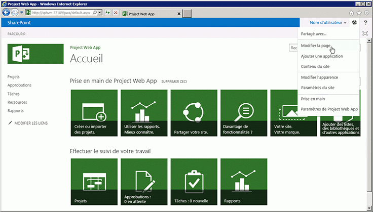
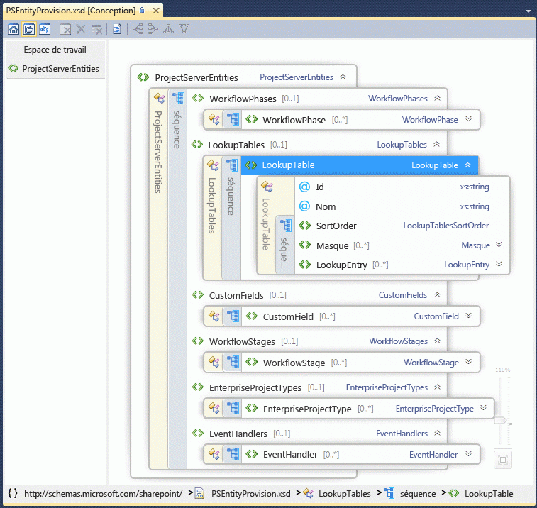

# Programmabilité de Project Server

Découvrez les principales fonctionnalités de programmabilité dans Project Server 2013. Cet article comprend des informations sur le portage d’applications créées pour des versions précédentes de Project Server.

Project Server 2013 est conçu pour prendre en charge la plupart des applications développées pour Project Server 2010 et de nouvelles solutions pour plusieurs plateformes, où les applications peuvent accéder aux installations Project Server locales et en ligne. Les applications et les extensions développées pour Project Server 2003 ou les versions antérieures doivent être repensées pour utiliser le modèle CSOM ou l’interface PSI (Project Server Interface). Les applications développées pour Office Project Server 2007 ou Project Server 2010 peuvent nécessiter des modifications et une recompilation pour pouvoir utiliser l’interface PSI ; pour utiliser le modèle CSOM, ces applications nécessitent une nouvelle conception.
  
La plateforme Project Server permet un haut niveau de productivité pour les programmeurs, car elle s’appuie sur SharePoint Server 2013, .NET Framework 4 et le protocole OData avec le modèle CSOM. Les développeurs peuvent étendre Project Web App avec des applications, des composants d’application et des composants WebPart, définir des flux de travail à l’aide de SharePoint Designer 2013 et appliquer des règles métier à l’aide de récepteurs d’événements distants pour les événements Project Server.
  
## Project Server et SharePoint Server

Project Web App est intégrée sur SharePoint Server 2013 et utilise des pages maîtres et des composants WebPart pour rendre plus facile de créer des applications personnalisées et les solutions Project Web App. Project Server 2013 fait l’objet d’une intégration approfondie avec SharePoint Server 2013, où il sert de plateforme pour la collaboration sur les projets, la création de rapports, l’administration de site, la sécurité et la gestion des flux de travail.
  
Les sites de projets incluent d’autres informations et options de collaboration pour les membres d’équipes, où vous pouvez ajouter des applications par défaut qui incluent un récapitulatif du projet, des listes SharePoint spécialisées pour les tâches avec une chronologie, le suivi des problèmes, risques, éléments livrables du projet et le calendrier de l’équipe, ainsi que les discussions d’équipe et la bibliothèque de documents. Les applications personnalisées pour Project Server 2013 offrent une grande flexibilité et des extensions pour la collaboration des équipes. Vous pouvez également ajouter des composants d’application pour personnaliser une application, à l’aide du mécanisme qui permet d’ajouter et de modifier des composants WebPart lorsque vous modifiez une page. Vous pouvez localiser les sites de projets n’importe où dans la batterie de serveurs SharePoint dans laquelle Project Server est installé. Pour utiliser d’autres services de base de Project Server 2013, tels qu’Excel Services et Enterprise Search, un administrateur peut activer et configurer les services. 
  
Lorsque vous installez Project Server 2013, vous devez configurer l’application de service de projet dans le site SharePoint Web Services. L’application de service de projet inclut des services Windows Communication Foundation (WCF) locaux et des services web ASMX pour l’interface PSI. La recherche SharePoint et la gestion de documents SharePoint sont d’autres exemples d’applications de service. Pour plus d’informations, consultez la documentation pour les développeurs de SharePoint Server 2013.
  
L’application de service de projet est un fournisseur de services logiques qui peut gérer plusieurs instances de Project Web App. Le déploiement de Project Server crée un site Project Web App spécifique au sein d’une application web SharePoint. La page d’accueil de Project Web App contient des liens vers la page Project Center, la page du Centre de ressources et la page Centre d’aide à la décision pour la création de rapports, ainsi qu’une page qui contient une liste d’applications standard supplémentaires. La figure 1 présente la commande **Modifier la page** dans la liste déroulante **Paramètres** de la page d’accueil de Project Web App, qui vous permet d’ajouter ou de modifier des composants WebPart. 
  
> [!NOTE]
> Certaines pages d’administration dans Project Web App, telles que la page Paramètres Project Web App, ne sont pas modifiables et n’affichent pas la commande **Modifier la page**. Project Web App ne vous permet pas de modifier des pages à l’aide de SharePoint Designer 2013. Vous pouvez modifier les pages des sites de projets avec SharePoint Designer 2013. 
  
**Figure 1. Utilisation du menu Modifier la page dans Project Web App**

  
Pour accéder à la page Paramètres du site dans Project Web App, choisissez l’icône **Paramètres** dans le coin supérieur droit de la page. La page Paramètres du site ( `https://ServerName/ProjectServerName/_layouts/15/settings.aspx`) permet de modifier l’apparence et le thème du site, d’ajouter des composants WebPart personnalisés et de modifier ou créer des pages maîtres pour les sites de projets.
  
La personnalisation du code dans les pages ASPX ou personnalisation des pages maîtres Project Web App avec SharePoint Designer 2013 n’est pas prise en charge. La personnalisation du code dans les pages Project Web App peut provoquer des problèmes avec les mises à jour et Service Packs Project Server. 
  
### Personnalisation de Project Web App avec des packages SharePoint

Étant donné que Project Web App est une application SharePoint et que les sites de projet sont des sites SharePoint, vous pouvez ajouter des applications personnalisées, des composants WebPart, des gestionnaires d’événements, des champs personnalisés et d’autres fonctionnalités à l’aide de packages SharePoint (fichiers .wsp) ou d’applications SharePoint (fichiers .spapp). Un package SharePoint ou un package d’application peut inclure plusieurs entités Project Server, où les définitions d’entité sont spécifiées dans un fichier elements.xml dans le package.
  
Pour Microsoft Project Online, vous pouvez ajouter des boutons au ruban de Project Web App, mais vous ne pouvez pas supprimer ou renommer des boutons produit existants et vous ne pouvez pas créer de nouveaux onglets de ruban. Pour plus d’informations, consultez la section [Créer des actions personnalisées à déployer avec les applications pour SharePoint](https://docs.microsoft.com/sharepoint/dev/sp-add-ins/create-custom-actions-to-deploy-with-sharepoint-add-ins).
  
> [!CAUTION]
> Lorsque vous installez un package SharePoint ou un package d’application, les types d’entité Project Server doivent apparaître dans l’ordre spécifié par le schéma PSEntityProvision.xsd. Sinon, la validation du schéma du package échoue et l’installation s’interrompt. 
  
Le fichier de schéma PSEntityProvision.xsd est disponible dans le kit de développement logiciel (SDK) Project 2013, dans le sous-répertoire `Documentation\Schemas\AppProvisioning`. La Figure 2 illustre l’affichage de l’Explorateur de fichiers de schéma XML dans Visual Studio du schéma **PSEntityProvision**, où la séquence **LookupTable** est développée. 
  
**Figure 2. Affichage Visual Studio du schéma d’approvisionnement de l’entité Project Server**

  
Les packages SharePoint qui installent des fonctionnalités Project Server peuvent contenir un ou plusieurs fichiers elements.xml qui suivent le schéma **PSEntityProvision**. Les entités Project Server d’un même fichier XML doivent apparaître dans l’ordre suivant : 
  
1. Phases de flux de travail
    
2. Tables de recherche
    
3. Champs personnalisés
    
4. Étapes du flux de travail
    
5. Types de projet d’entreprise
    
6. Gestionnaires d'événements
    
Lorsque vous créez un package SharePoint qui contient des entités Project Server, il est possible de placer les définitions d’entité dans plusieurs fichiers elements.xml. Chaque fichier XML peut réussir la validation de schéma sans que les entités de l’intégralité du package ne soient dans l’ordre correct. Par exemple, une entité de champ personnalisé dans le premier fichier XML peut faire référence à une table de recherche dans le second fichier XML. Pendant l’installation, le champ personnalisé ne peut pas être créé, car la table de recherche n’a pas encore été créée.
  
Si l’installation du package échoue, les objets créés restent dans Project Web App, mais le package ne s’installe pas complètement. La réinstallation du package peut fonctionner, mais ce n’est pas une bonne expérience pour les clients. Lorsque les définitions d’entité s’étendent sur plusieurs fichiers elements.xml, organisez les entités Project Server dans l’ensemble du package SharePoint pour vous assurer que l’installation suit l’ordre correct. Avec le schéma PSEntityProvision.xsd dans le téléchargement du kit de développement logiciel (SDK) Project 2013, il est possible de développer un outil qui vérifie l’ordre prescrit des entités dans les fichiers XML.
  
## Mise à niveau d’application avec les API Project Server

Lorsque vous mettez à niveau une application développée pour une version précédente de Project Server, vous pouvez choisir d’utiliser le modèle CSOM ou l’interface PSI pour une interface de programmation qui inclut des méthodes pour créer, lire, mettre à jour et supprimer des entités de projet (opérations CRUD). Bien que le modèle CSOM appelle en interne l’interface PSI, il ne remplace pas entièrement toutes les méthodes PSI. Pour les scénarios et les limitations de l’interface PSI et le modèle CSOM, consultez la page sur [les fonctionnalité de l’interface PSI](what-the-psi-does-and-does-not-do.md) et la page sur [les fonctionnalités du modèle CSOM](what-the-csom-does-and-does-not-do.md).
  
> [!NOTE]
> Si le modèle CSOM inclut les fonctionnalités dont vous avez besoin, nous vous recommandons de mettre à niveau les applications pour qu’elles utilisent le modèle CSOM. Le modèle CSOM permet aux applications d’être utilisées pour les installations locales et en ligne de Project Server 2013. 
  
Si votre application lit principalement des données à partir de Project Server, vous pouvez utiliser les vues et les tables de création de rapports dans la base de données Project Server pour un scénario local. Si vous envisagez d’utiliser l’application avec Microsoft Project Online, vous pouvez utiliser le protocole OData pour le service **ProjectData**, qui permet un accès local et en ligne aux données de rapport. Pour plus d’informations, consultez la rubrique [ProjectData – Référence de service Project OData](https://docs.microsoft.com/previous-versions/office/project-odata/jj163015(v=office.15)).
  
### Utilisation de l’interface PSI

L’interface PSI permet aux applications clientes de confiance totale, notamment Project Professionnel 2013, Project Web App et les applications métiers, d’accéder aux données Project Server dans une batterie de serveurs SharePoint. L’interface PSI est créée et utilisée avec .NET Framework 4 et offre des avantages comme un environnement de développement connu, une sécurité intégrée, la gestion des erreurs et le nettoyage de la mémoire.
  
L’interface PSI est accessible par le biais des services WCF ou des services web ASMX. L’interface ASMX est basée sur WCF. Chaque service PSI contient généralement une classe de base avec des méthodes CRUD pour les éléments au sein de cette classe. Les éléments sont spécifiés par les classes **DataSet** liées. Par exemple, le service **CustomFields** contient la classe **CustomFields** avec des méthodes telles que [CreateCustomFields2](https://docs.microsoft.com/previous-versions/office/ee767959(v=office.14)). Les données d’un ou de plusieurs champs personnalisés d’entreprise sont spécifiées dans **CustomFieldDataSet**.
  
> [!NOTE]
> L’interface des services web ASMX PSI est déconseillée dans Project Server 2013. Bien que l’interface ASMX soit toujours disponible, les nouvelles applications qui utilisent l’interface PSI doivent utiliser l’interface WCF, ou si possible, les nouvelles applications doivent préférer le modèle CSOM. Les versions ultérieures de Project Server nécessitent une mise à niveau des applications ASMX existantes pour utiliser l’interface WCF de l’interface PSI ou le modèle CSOM. 
  
Il existe 22 services PSI publics documentés qui sont dupliqués dans l’interface WCF et l’interface ASMX. L’interface PSI inclut également huit services privés et non documentés. Project Web App et Project Professionnel utilisent les services PSI publics et les services PSI privés. L’interface PSI est généralement factorisée pour correspondre aux objets d’entreprise. Autrement dit, chaque méthode PSI est associée à un objet d’entreprise tel que **Calendrier** ou **Ressource**. L’interface PSI est l’interface principale pour les objets d’entreprise. Étant donné que la couche métier fournit des composants de logique métier réutilisables, différentes applications qui interagissent avec les données Project Server utilisent la même logique métier.
  
Les méthodes PSI qui interagissent de façon asynchrone avec Project Server ont des noms qui commencent par **Queue**. Chaque méthode PSI est implémentée avec une interface distincte qui utilise des données fortement typées. Par exemple, la méthode **QueueCreateProject** du service **Project** accepte le paramètre _dataset_ de type **ProjectDataSet**. La classe **ProjectDataSet** est dérivée du type **DataSet**. La vérification du type dans .NET Framework et l’exécution IntelliSense dans Visual Studio permettent de réduire les erreurs de développement avec l’interface PSI. Pour une introduction à la documentation de référence détaillée des espaces de noms, classes, méthodes, propriétés, événements et assemblys connexes PSI, consultez la rubrique [Vue d’ensemble de la référence Project PSI](project-psi-reference-overview.md).
  
Project Server 2013 utilise la gestion des exceptions de .NET Framework. Toutes les erreurs sont journalisées dans le serveur, en haut de la pile PSI. Certaines erreurs envoient un simple rapport au client, comme un objet **SoapException** pour l’interface ASMX ou un objet **FaultException** pour l’interface WCF. Les exceptions peuvent être enregistrées dans le journal des événements d’application et certaines erreurs enregistrent également un rapport détaillé sur le serveur dans les journaux de suivi du service ULS (Unified Logging Service). 
  
Pour les applications locales de confiance totale, l’interface PSI est également extensible. Vous pouvez ajouter un assembly .NET avec un service qui offre de nouvelles fonctionnalités, utilise la même infrastructure de sécurité Project Server et appelle les autres méthodes PSI ou hérite de classes PSI. Une extension PSI peut également fournir l’accès requis à la base de données et à la logique métier pour les nouvelles fonctionnalités.
  
### Utilisation du modèle CSOM

Avec le modèle CSOM, vous pouvez développer des applications qui accèdent à Microsoft Project Online ou une installation Project Server 2013 locale. Les applications peuvent être distribuées dans un Office Store public ou dans un catalogue d’applications privé. Le modèle CSOM est conçu pour être une API facile à utiliser qui consomme ou fournit directement les données par nom avec des requêtes LINQ, plutôt qu’en transmettant des jeux de données et en construisant des paramètres _changeXml_ ou des paramètres de _filtre_ XML. Le modèle CSOM implémente les mêmes fonctionnalités principales que l’interface PSI pour les entités principales telles que **Project**, **Task**, **EnterpriseResource** et **Assignment**. Le modèle CSOM comprend de nombreuses autres entités telles que **CustomField**, **LookupTable**, **WorkflowActivities**, **EventHandler** et **QueueJob**, qui prennent en charge d’autres fonctionnalités courantes de Project Server .
  
Il peut être utilisé en copiant les ressources suivantes sur votre ordinateur de développement local :
  
- Pour le développement .NET Framework 4, copiez l’assembly `%ProgramFiles%\Common Files\Microsoft Shared\Web Server Extensions\15\ISAPI\Microsoft.ProjectServer.Client.dll`. 
    
  Pour la documentation des classes et des membres CSOM, consultez l’espace de noms [Microsoft.ProjectServer.Client](https://docs.microsoft.com/previous-versions/office/dn529530(v=office.15)). Pour un exemple d’application, consultez la rubrique [Prise en main de CSOM et .NET](getting-started-with-the-project-server-csom-and-net.md).
    
- Pour le développement de Microsoft Silverlight, copiez l’assembly `%ProgramFiles%\Common Files\Microsoft Shared\Web Server Extensions\15\TEMPLATE\LAYOUTS\ClientBin\Microsoft.ProjectServer.Client.Silverlight.dll`. 
    
- Pour développer des applications pour Windows Phone 8, copiez l’assembly `%ProgramFiles%\Common Files\Microsoft Shared\Web Server Extensions\15\TEMPLATE\LAYOUTS\ClientBin\Microsoft.ProjectServer.Client.Phone.dll`. 
    
- Pour utiliser JavaScript pour le développement d’applications web et d’applications pour d’autres appareils, copiez les fichiers `%ProgramFiles%\Common Files\Microsoft Shared\Web Server Extensions\15\TEMPLATE\LAYOUTS\PS.js` et `PS.debug.js`. Pour un exemple d’application web, consultez la rubrique [Prise en main du modèle objet JavaScript Project Server 2013](getting-started-with-the-project-server-2013-javascript-object-model.md).
    
Le modèle CSOM appelle en interne l’interface PSI. Par conséquent, si cette dernière ne peut pas effectuer une tâche, le modèle CSOM n’est pas en mesure de le faire non plus. Pour les limitations du modèle CSOM, consultez la page sur [les fonctionnalités de l’interface CSOM](what-the-csom-does-and-does-not-do.md) et la page sur [les fonctionnalités du modèle PSI](what-the-psi-does-and-does-not-do.md). Pour plus d’informations sur le développement avec le modèle CSOM, consultez les rubriques [Mises à jour pour les développeurs dans Project 2013](updates-for-developers-in-project-2013.md) et [Modèle CSOM pour Project 2013](client-side-object-model-csom-for-project-2013.md).
  
### Portage des applications conçues pour Project Server 2003

Dans Project Server 2003, de nombreuses données et fonctionnalités sont disponibles uniquement avec Project Professional 2003 ou par accès direct à la base de données. L’interface PSI, introduite dans Project Server 2007, supprime une grande partie de cette restriction. Contrairement au projet PDS (Project Data Service) dans Project Server 2003, l’interface PSI et le modèle CSOM fournissent des interfaces complètes aux objets d’entreprise dans Project Server.
  
Les applications développées pour le service PDS ne sont pas compatibles avec les versions ultérieures de Project Server. Le modèle CSOM et l’interface PSI prévoient une parité fonctionnelle pour le service PDS, mais ne correspondent pas aux méthodes et paramètres PDS.
  
> [!NOTE]
> Étant donné que les applications PDS doivent être complètement repensées pour Project Server 2013, nous vous recommandons d’utiliser le modèle CSOM. 
  
Pour plus d’informations sur la compatibilité PDS et des instructions sur le portage des extensions PDS vers l’interface PSI, consultez la rubrique [Parité PDS dans les services web PSI](https://docs.microsoft.com/previous-versions/office/developer/office-2007/ms197081(v=office.12)).
  
### Portage des applications conçues pour Project Server 2007 et Project Server 2010

L’interface PSI dans Project Server 2013 est un sur-ensemble du modèle objet PSI dans Office Project Server 2007 et Project Server 2010. De nombreuses applications conçues pour les deux versions précédentes de Project Server continuent à travailler dans des installations locales de confiance totale de Project Server 2013. Toutefois, les types d’application suivants requièrent des mises à jour ou une nouvelle conception :
  
- Utilisez le modèle CSOM pour les applications qui sont adaptées à une utilisation avec Microsoft Project Online.
    
- Utilisez le modèle CSOM pour les applications qui sont adaptées aux appareils mobiles et tablettes.
    
- Utilisez le modèle CSOM pour les applications disponibles dans Office Store ou dans un catalogue d’applications privé.
    
- Pour les applications qui modifient la planification de projets, utilisez le modèle CSOM ou modifiez l’application pour qu’elle utilise la méthode PSI [QueueUpdateProject2](https://docs.microsoft.com/previous-versions/office/project-class/jj236245(v=office.15)). 
    
- Les applications web ou locales qui connectent les utilisateurs à différentes instances de Project Web App doivent utiliser les paramètres de programmation pour les points de terminaison WCF du modèle CSOM ou de l’interface PSI. Les méthodes sont déconseillées. Les applications doivent utiliser l’authentification OAuth à la place de l’authentification par formulaire et pour une utilisation avec Microsoft Project Online. Pour plus d’informations, consultez la rubrique [Autorisation et authentification pour les applications dans SharePoint 2013](https://docs.microsoft.com/sharepoint/dev/sp-add-ins/authorization-and-authentication-of-sharepoint-add-ins).
    
- Les applications qui s’appuient sur des paramètres de sécurité Project Server spécifiques ou en modifient.
    
  > [!NOTE]
  > Une installation par défaut locale de Project Server 2013 utilise le mode d’autorisation SharePoint, où les paramètres de sécurité Project Server ne sont pas accessibles par le biais de l’interface PSI. Pour modifier le mode d’autorisation Project, consultez la section *Mode d’autorisation SharePoint* de la page [Nouveautés pour les professionnels de l’informatique dans Project Server 2013](https://docs.microsoft.com/project/what-s-new-for-it-pros-in-project-server-2016). 
  
- Pour de nombreux flux de travail Project Server personnalisés, vous pouvez utiliser SharePoint Designer 2013 pour créer des flux de travail déclaratifs. Pour les flux de travail personnalisés qui nécessitent une programmation supplémentaire, vous ne devez *pas* utiliser directement des classes ou des membres dans l’espace de noms **Microsoft.Office.Project.Server.Workflow**. Au lieu de cela, utilisez la classe [Microsoft.ProjectServer.Client.WorkflowActivities](https://docs.microsoft.com/previous-versions/office/mt780562(v=office.15)) dans le modèle CSOM. 
    
- En règle générale, les applications qui utilisent l’emprunt d’identité doivent être réécrites pour utiliser l’interface WCF PSI. Les applications qui effectuent des mises à jour de statut simples pour les autres utilisateurs ne requièrent pas d’emprunt d’identité. Ils peuvent utiliser la méthode [StatusAssignment.SubmitStatusUpdates](https://docs.microsoft.com/previous-versions/office/project-class/jj235883(v=office.15)) dans le modèle CSOM ou la méthode [Statusing.SubmitStatusForResource](https://docs.microsoft.com/previous-versions/office/ee755393(v=office.14)) dans l’interface PSI. 
    
- Les composants intergiciels qui s’exécutent sur l’ordinateur Project Server peuvent être installés uniquement pour une utilisation en local et doivent utiliser l’interface WCF PSI. Par exemple, un composant intergiciel qui utilise l’interface ASMX pour échanger des données entre Project Web App en local et une application de feuille de temps externe doit être réécrit pour utiliser l’interface WCF PSI. Pour fonctionner avec Microsoft Project Online, le composant doit être repensé sous la forme d’une application et utiliser le modèle CSOM.
    
### Migration et compatibilité des solutions personnalisées

Les classes et membres des interfaces publiques ASMX et WCF PSI sont identiques. Toutefois, le nombre de colonnes et la taille des tables de données utilisées ou renvoyées par les méthodes PSI peuvent être différents entre Project Server 2013 et les deux versions précédentes de Project Server. Il existe également des différences entre les vues et les tables de création de rapports en comparaison avec la base de données de création de rapports des versions précédentes.
  
> [!IMPORTANT]
> Nous vous recommandons vivement de tester les solutions sur une installation hors production de Project Server 2013 avant de les déployer sur un serveur de production. 
  
Lorsque vous migrez une solution vers Project Server 2013 ou qu’une solution ne fonctionne pas comme prévu, vous devez au minimum procéder comme suit :
  
- Mettez à jour la solution en l’ouvrant dans Visual Studio 2012. Certaines solutions peuvent également utiliser Visual Studio 2010.
    
- Modifiez la cible sur .NET Framework 4.
    
- Modifiez les références d’assembly pour qu’elles utilisent les assemblys Project Server 2013, tels que Microsoft.Office.Project.Server.Library.dll et Microsoft.Office.Project.Server.Events.Receivers.dll.
    
- Dressez la liste des références web ASMX ou des références de services WCF et des espaces de noms et supprimez les références Project Server.
    
- Ajoutez l’assembly de proxy ProjectServerServices.dll que vous pouvez générer à partir des fichiers WCF proxy sources dans le téléchargement du kit de développement logiciel (SDK) Project Server 2013 ou ajoutez les fichiers proxy sources pour les services WCF requis. Pour les services ASMX, ajoutez à nouveau les références de service web ASMX frontales en utilisant les mêmes noms d’espace de noms ; ou ajoutez l’assembly de proxy ProjectServerServices.dll que vous pouvez générer à partir des sources WSDL dans le téléchargement du kit de développement logiciel (SDK) Project Server 2013.
    
  > [!NOTE]
  > Dans le téléchargement du kit de développement logiciel (SDK) Project Server 2013, les espaces de noms des fichiers proxy sources commencent tous par *Svc*. Par exemple, l’espace de noms de service **Resource** dans le fichier proxy WCF et le fichier proxy ASMX est **SvcResource**. > Si votre application utilise différents noms d’espaces de noms, vous pouvez recompiler l’assembly de proxy pour utiliser vos espaces de noms. Vous pouvez également modifier les espaces de noms PSI dans votre application. Par exemple, vous pouvez modifier le script CompileWCFProxyAssembly.cmd et recompiler ProjectServerServices.dll à partir des fichiers proxy sources du téléchargement du kit de développement logiciel (SDK). 
  
- Si vous passez de l’interface ASMX PSI à l’interface WCF, vous pouvez initialiser les classes clientes par programme ou à l’aide de points de terminaison WCF dans app.config. Utilisez l’initialisation par programme lorsque vous avez besoin de passer rapidement à des instances distinctes de Project Web App ou lorsque vous développez un composant WebPart qui utilise l’interface PSI.
    
- Il existe plusieurs nouvelles méthodes et jeux de données dans les services PSI dans Project Server 2013 et certaines classes **DataRow** contiennent de nouvelles propriétés. Par exemple, la méthode [QueueUpdateProject2](https://docs.microsoft.com/previous-versions/office/project-class/jj236245(v=office.15)) de l’interface PSI utilise le moteur de planification Project Server pour replanifier un projet mis à jour sans avoir à ouvrir le projet dans Project Professionnel 2013, et permet également d’ajouter ou de supprimer des entités de projet dans le même appel. 
    
- Compilez et testez la solution.
    
## Planification de projets sur le serveur

Project Server 2013 a deux moteurs de planification. Le moteur de planification le plus récent est le même que le moteur de planification dans Project Professionnel 2013. Lorsque vous apportez des modifications à la planification et que vous les publiez à l’aide du composant WebPart Planification (page de détails du projet) dans Project Web App ou un site de projet, ou à l’aide du modèle CSOM, le calcul des dates, les coûts, la durée, le travail restant, les références et les autres modifications liées à la planification sont les mêmes que si vous apportez les modifications et publiez le projet à l’aide de Project Professionnel 2013. Toutefois, à l’exception de la méthode [QueueUpdateProject2](https://docs.microsoft.com/previous-versions/office/project-class/jj236245(v=office.15)), les méthodes PSI utilisent le moteur de planification plus ancien qui a migré à partir de Project Server 2010. Cela permet de garantir que les applications héritées fonctionnent de la même façon qu’auparavant dans Project Server 2013. 
  
> [!NOTE]
> Pour utiliser le moteur de planification mis à jour dans Project Server 2013, les applications peuvent utiliser le modèle CSOM. 
  
Les deux moteurs (ancien et nouveau) de planification possèdent les restrictions suivantes :
  
- **Planification d’un seul projet** La planification affecte uniquement le projet actuel, lorsque des modifications sont apportées par le biais des mises à jour de l’état des tâches avec l’interface PSI ou le modèle CSOM ou avec Project Web App. Si le projet actuel comporte des liens vers d’autres projets, sous-projets ou projets maîtres, les projets liés ne sont pas modifiés. 
    
- **Tâches récapitulatives** Les tâches récapitulatives sont généralement en lecture seule sur Project Server. Par exemple, les affectations pour les tâches récapitulatives ne peuvent pas être créées et le pourcentage d’achèvement ne peut pas être modifié. Toutefois, Project Server prend en charge la modification des dates et de la durée des tâches récapitulatives planifiées manuellement. 
    
    Les données réelles dans Project Server ne sont pas ajoutées automatiquement à une affectation de tâche récapitulative, car cela contournerait le processus d’approbation dans Project Server. Dans Project Professionnel, lorsque vous ajoutez des données réelles à une tâche subordonnée, ces données sont également ajoutées pour une affectation sur la tâche récapitulative. La différence de comportement peut être source de confusion pour un utilisateur.
    
    Project Server supprime les données réelles sur une affectation de tâche récapitulative si la durée de la tâche subordonnée diminue ou si la date de fin est modifiée.
    
    > [!CAUTION]
    > Bien que Project Professionnel puisse le faire, nous vous recommandons de ne pas émettre d’affectations sur les tâches récapitulatives. 
  
Voici les problèmes et limitations de la programmation PSI avec l’ancien moteur de planification Project Server :
  
- **Modification de l’état actif d’une tâche** L’ancien moteur de planification Project Server peut afficher des heures de début et de fin incohérentes lorsque vous utilisez la méthode [QueueUpdateProject](https://docs.microsoft.com/previous-versions/office/ms471014(v=office.14)) pour modifier l’état actif d’une tâche, s’il y a plusieurs modifications dans l’objet **ProjectDataSet** pour le paramètre _dataset_. Si la propriété **TASK_IS_ACTIVE** est la seule modification du paramètre _dataset_ de **QueueUpdateProject**, vous pouvez mettre à jour le projet.
    
    Pour plus d’informations sur les tâches inactives et l’ancien moteur de planification, consultez les billets de blog sur la [présentation des tâches inactives dans Project 2010](https://blogs.msdn.com/b/project/archive/2010/06/10/introducing-inactive-tasks-in-project-2010.aspx) et [Project Server 2010 : Planification sur le web, l’interface PSI et Project Professionnel](https://blogs.msdn.com/b/brismith/archive/2010/09/10/project-server-2010-scheduling-on-the-web-the-psi-and-project-professional.aspx?wa=wsignin1.0). Pour une comparaison de la planification dans Project Professionnel 2010 et Project Web App dans Project Server 2010, reportez-vous à la rubrique [Comparaison de la gestion de la planification basée sur le Web](https://blogs.msdn.microsoft.com/brismith/2010/09/10/project-server-2010-scheduling-on-the-web-the-psi-and-project-professional/).
    
- **Valeur acquise non calculée** L’ancien moteur de planification ne calcule pas les champs de valeur acquise : CRTE, BAA, VA, CBTP, IPC, VC, VC%, EAA, IPE, ED, ED%, IPAA, VAA, Variation de durée, Variation de début, Variation de fin, Variation de coût et Variation de travail. Si un projet comporte des valeurs pour ces champs et qu’il est mis à jour à l’aide de la méthode **QueueUpdateProject**, les valeurs de champ ne changent pas. Pour éviter ce problème, utilisez la méthode **QueueUpdateProject2**. 
    
Vous pouvez gérer les limitations de la planification PSI des façons suivantes :
  
- Si le modèle CSOM possède les méthodes que requiert l’application, utilisez-le au lieu de l’interface PSI.
    
- Ouvrez des projets dans Project Professionnel et réenregistrez-les sur Project Server.
    
- Dans les rapports, n’incluez pas les champs que l’interface PSI ne met pas à jour.
    
- Ajoutez une note dans les rapports au sujet des données qui peuvent être obsolètes.
    
Il existe des indicateurs dans les tables de création de rapports et les cubes qui vous aident à détecter lorsque certaines données de projet ne sont pas mises à jour. Les données de rapport dans la table MSP_EpmProject et dans MSP_EpmProject_UserView comprennent les champs suivants :  
  
-  _ProjectWbsIsStale_ &ndash; Indique si la structure de répartition du travail (structure de plan de la tâche) est obsolète. 
    
-  _ProjectEarnedValueIsStale_ &ndash; Indique si les champs de valeur acquise sont obsolètes. 
    
-  _ProjectRollupsAreStale_ &ndash; Indique qu’un sous-projet est mis à jour dans l’ébauche de base de données, mais que le projet maître ne l’est pas. Les valeurs répétées du sous-projet sont obsolètes. 
    
-  _ProjectHierarchyNotSynchronized_ &ndash; Le projet maître n’est pas synchronisé avec ses enfants. Cela se produit lorsque les projets enfants sont publiés explicitement, et pas dans le cadre de la publication du projet maître. 
    
-  _ProjectCalculationsAreStale_ &ndash; Project Professionnel a enregistré un projet sans calculer la planification (autrement dit, le mode de calcul est défini sur **Manuel** sous l’onglet **Planifier** de la boîte de dialogue **Options de Project**). 
    
-  _ProjectGhostTaskAreStale_ &ndash; Semblable à _ProjectHierarchyNotSynchronized_, mais vous avertit sur des données de liaison entre projets. Il est possible qu’aucun projet maître n’existe, mais les données de projet sur un côté du lien sont plus récentes que celles de l’autre côté.
    
## À propos de l’accès à la base de données Project Server

Si vous disposez des autorisations dans Microsoft SQL Server pour accéder à la base de données Project Server, vous pouvez lire les vues et les tables de création de rapports. Si vous disposez des autorisations Project Server nécessaires, vous pouvez également lire des données dans les tables de création de rapports à l’aide de requêtes OData. Il est fortement déconseillé aux développeurs d’accéder directement aux tables provisoires, publiées ou archivées par le biais de requêtes SQL Server dans la base de données Project Server. Apporter des modifications directes à une des tables de la base de données Project Server peut endommager l’intégrité référentielle et interférer avec l’accès de base de données par le biais du service Mise en file d’attente de Project Server.
  
> [!IMPORTANT]
> Rien ne vous empêche d’utiliser l’accès direct à la base de données par programme pour mettre à jour les données. Vous devez être conscient que le cache Project Professionnel, les tables publiées et les tables de création de rapports reposent sur un protocole de synchronisation de cache qui peut être perturbé par la modification directe de données. Toutefois, si vous endommagez vos bases de données Project Server ou les caches côté client Project Professionnel suite à un accès direct pour modifier les données, notez que le support technique ne sera pas en mesure de vous aider. 
  
Les applications qui accèdent directement aux vues et tables provisoires, publiées ou archivées dépendent aussi des schémas de base de données, ce qui peut changer dans les Service Packs ou versions ultérieures de Project Server 2013. Les applications qui accèdent directement aux bases de données perdent également la sécurité Project Server intégrée, la logique métier commune, le suivi, les audits, la vérification des erreurs, la création de rapports, les flux de travail et d’autres fonctionnalités. Vous devrez probablement réécrire ce type d’application après les mises à jour de Project Server 2013. 
  
Pour toutes ces raisons, Project Professionnel et Project Web App n’effectuent pas d’appels directs aux tables provisoires, publiées ou archivées. C’est la même chose pour les autres applications qui s’intègrent avec Project Server.
  
Les schémas des tables provisoires, publiées et archivées ne sont pas documentés. Vous pouvez utiliser les tables de création de rapports pour vous aider à générer des rapports. Par ailleurs, le schéma des tables et vues de création de rapports est documenté dans le téléchargement du kit de développement logiciel (SDK) Project 2013. Pour le schéma OData des données de création de rapports, consultez la rubrique [ProjectData – Référence du service Project OData](https://docs.microsoft.com/previous-versions/office/project-odata/jj163015(v=office.15)).
  
## Voir aussi

- [Mises à jour pour les développeurs dans Project 2013](updates-for-developers-in-project-2013.md)    
- [Architecture Project Server 2013](project-server-2013-architecture.md)    
- [Fonctionnalités de l’interface PSI](what-the-psi-does-and-does-not-do.md)   
- [Fonctionnalité du modèle CSOM](what-the-csom-does-and-does-not-do.md)    
- [Modèle objet côté client (CSOM) pour Project 2013](client-side-object-model-csom-for-project-2013.md)    
- [Prise en main du développement de flux de travail Project Server](getting-started-developing-project-server-workflows.md)    
- [Références de programmation Project 2013](project-2013-programming-references.md)    
- [Vue d’ensemble de la référence Project PSI](project-psi-reference-overview.md)    
- [Créer des actions personnalisées à déployer avec les applications pour SharePoint](https://docs.microsoft.com/sharepoint/dev/sp-add-ins/create-custom-actions-to-deploy-with-sharepoint-add-ins).    
- [Présentation des tâches inactives dans Project 2010](https://blogs.msdn.com/b/project/archive/2010/06/10/introducing-inactive-tasks-in-project-2010.aspx)    
- [Project Server 2010 : Planification sur le web, l’interface PSI et Project Professionnel](https://blogs.msdn.microsoft.com/brismith/2010/09/10/project-server-2010-scheduling-on-the-web-the-psi-and-project-professional/)

