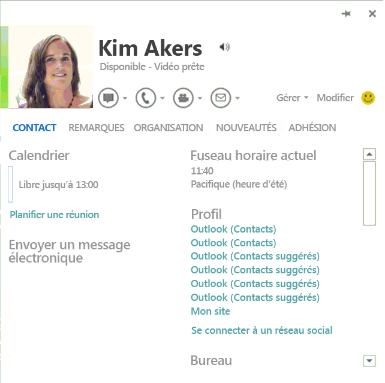

# <a name="integrating-im-applications-with-office"></a>Intégration des applications de messagerie instantanée à Office

Cet article montre comment configurer une application cliente de message instantanée (MI) afin qu'elle intègre des fonctionnalités sociales dans Office 2013, Office 2016, Office 2019 et Office 365, notamment l'affichage de présence et l'envoi de messages instantanés à partir d'une carte de visite.
  
## <a name="introduction"></a>Introduction
<a name="off15_IMIntegration_Intro"> </a>

Office 2013 (et versions ultérieures) permet une intégration enrichie avec les applications clientes de messagerie instantanée, y compris Lync 2013 et Teams. Cette intégration fournit aux utilisateurs des fonctionnalités de messagerie instantanée à partir de Word, Excel, PowerPoint, Outlook, Visio, Project et OneNote ainsi qu'une intégration de présence sur les pages SharePoint. Les utilisateurs peuvent voir la photo, le nom, le statut de présence et les données de contact des personnes de leur liste de contacts. Ils peuvent démarrer une session de messagerie instantanée, passer un appel vidéo ou appeler directement à partir de la carte de visite (l'élément d'interface utilisateur dans Office affichant les options de communication et les informations de contact). Office vous permet de rester facilement connecté à vos contacts sans vous forcer à quitter votre messagerie électronique ou vos documents. 
  
> [!NOTE]
> Cet article utilise le terme application cliente de messagerie instantanée pour faire spécifiquement référence à l'application installée sur l'ordinateur d'un utilisateur qui communique vers le service de messagerie instantanée. Par exemple, Lync 2013 et Teams sont considérées comme des applications clientes de messagerie instantanée. Cet article ne fournit pas de détails sur la façon dont l'application cliente de messagerie instantanée communique avec le service de messagerie instantanée ou sur le service de messagerie instantanée lui-même. 
  
Vous pouvez personnaliser une application cliente de messagerie instantanée afin qu’elle communique avec Office. Vous pouvez notamment modifier votre application de messagerie instantanée pour qu’elle affiche les informations suivantes dans l’interface utilisateur d’Office :
  
- Photo du contact
    
- Nom du contact
    
- Note de statut personnel du contact
    
- Statut de la présence du contact
    
- Chaîne de disponibilité du contact (par exemple, « Disponible » ou « Absent(e) du bureau »)
    
- Chaîne de niveau d’aptitude du contact (par exemple, « Prêt pour la vidéo »)
    
- Lancement de messagerie instantanée en un clic
    
- Lancement d’un appel vidéo en un clic
    
- Lancement d’appel téléphonique en un clic (avec les fonctionnalités SIP, numéro de téléphone, messagerie vocale et appel de nouveau numéro).
    
- Gestion du contact (ajouter au groupe de messagerie instantanée)
    
- Emplacement et fuseau horaire du contact
    
- Données du contact, numéro de téléphone, adresse de messagerie, poste et nom de sa société
    
**Figure 1. Carte de visite dans Office 2013**


  
Pour permettre cette intégration dans Office, l'application cliente de messagerie instantanée doit implémenter un ensemble d'interfaces fournies par Office pour établir une connexion. Les API nécessaires à cette intégration sont incluses dans l'espace de noms [UCCollborationLib](https://docs.microsoft.com/previous-versions/office/communications/ff398475(v=ocs.14)) figurant dans le fichier Microsoft.Office.UC.dll installé avec les versions de Office 2013, comprenant Lync et Skype Entreprise. L'espace de noms **UCCollaborationLib** inclut les interfaces que vous devez implémenter pour intégrer Office. 
  
> [!IMPORTANT] 
> La bibliothèque de types pour les interfaces requises est incorporée à Lync 2013/Skype Entreprise. Pour les intégrateurs tiers, cela fonctionne uniquement lorsque Lync 2013 et Skype Entreprise sont installés sur l’ordinateur cible. Si vous intégrez à l'aide d'Office Standard, vous devez extraire la bibliothèque de types et l'installer sur l'ordinateur cible. Le [kit de développement logiciel (SDK) Lync 2013](https://www.microsoft.com/download/details.aspx?id=36824) inclut le fichier Microsoft.Office.UC.dll. 
  
> [!NOTE]
>  Une multitude d'applications Office 2010 peuvent également s'intégrer à une application de fournisseur de messagerie instantanée tierce : Outlook 2010, Word 2010, Excel 2010, PowerPoint 2010 et SharePoint Server 2010 (à l'aide d'un contrôle ActiveX). Nombre des étapes nécessaires pour l’intégration avec Office 2013 s’appliquent aussi à Office 2010. Il existe plusieurs différences dans la manière dont Office 2010 est intégré avec une application de fournisseur de messagerie instantanée : 
>  - Office 2010 n’affiche pas la photo du contact. 
>  - Vous devez télécharger le fichier Microsoft.Office.Uc.dll indépendamment d’Office 2010. Le [SDK Lync 2010](https://www.microsoft.com/en-us/download/details.aspx?id=18898) inclut le fichier Microsoft.Office.UC.dll pour Office 2010. 
>  - Lorsque l’application Office appelle la méthode [IUCOfficeIntegration.GetAuthenticationInfo](integrating-im-applications-with-office.md#off15_IMIntegration_ImplementRequired_IUCOfficeIntegration) dans l’application cliente de messagerie instantanée, elle transfère la chaîne « 14.0.0.0 ». 
>  - Office 2010 énumère tous les groupes et les contacts dès qu'il se connecte à une application cliente de messagerie instantanée. 
  
## <a name="how-office-integrates-with-an-im-client-application"></a>Intégration d’Office à une application cliente de messagerie instantanée
<a name="off15_IMIntegration_How"> </a>

Quand une application Office 2013 (ou version ultérieure) démarre, elle suit le processus suivant pour s'intégrer à l'application cliente de messagerie instantanée par défaut :
  
1. Elle vérifie le Registre pour identifier l’application cliente de messagerie instantanée par défaut et se connecte ensuite à celle-ci.
    
2. Elle s’authentifie avec l’application cliente de messagerie instantanée.
    
3. Elle se connecte à des interfaces spécifiques qui sont exposées par l’application cliente de messagerie instantanée.
    
4. Elle détermine les fonctionnalités de l’utilisateur connecté (utilisateur local), notamment l’obtention des contacts de l’utilisateur, détermine la présence de l’utilisateur et ses fonctionnalités de messagerie instantanée (messagerie instantanée, conversation vidéo, appels VoIP etc.).
    
5. Elle obtient les informations de présence des contacts de l’utilisateur local.
    
6. Lorsque l'application cliente de messagerie instantanée s'arrête, l'application Office se déconnecte sans assistance.
    
### <a name="discovering-the-im-application"></a>Détection de l’application de messagerie instantanée

L’application Office recherche plusieurs clés et entrées spécifiques dans le Registre pour détecter l’application cliente de messagerie instantanée par défaut. Si elle détecte une application cliente de messagerie instantanée par défaut, elle tente de s’y connecter.
  
L’application Office suit le processus suivant pour découvrir l’application cliente de messagerie instantanée par défaut :
  
1. L’application Office vérifie si la sous-clé HKEY_CURRENT_USER\Software\IM Providers\DefaultIMApp du Registre est définie et lit le nom de l’application mentionnée.
    
2. Ensuite, l'application Office lit la clé HKEY_CURRENT_USER\Software\IM Providers\ _Application name_\UpAndRunning et suit les modifications de sa valeur.
    
3. Puis elle lit la clé de Registre HKEY_LOCAL_MACHINE\Software\IM Providers\ _Application name_ et obtient les valeurs du ProcessName et de l'ID de classe (CLSID) stockées à cet emplacement. 
    
4. Lorsque l'application cliente de messagerie instantanée a réussi sa séquence de démarrage et a enregistré toutes les classes correctement pour l'intégration de présence, elle définit la clé HKEY_CURRENT_USER\Software\IM Providers\ _Application name_\UpAndRunning sur « 2 », ce qui indique que l'application cliente est en cours d'exécution.
    
5. Lorsque l'application Office détecte que la clé HKEY_CURRENT_USER\Software\IM Providers\ _Application name_\UpAndRunning a la valeur « 2 », elle recherche le nom du processus de l'application cliente de messagerie instantanée dans la liste des processus en cours d'exécution sur l'ordinateur.
    
6. Lorsque l'application Office trouve le processus qui utilise l'application cliente de messagerie instantanée, elle appelle **CoCreateInstance** à l'aide du CLSID pour établir une connexion à l'application cliente de messagerie instantanée sous la forme d'un serveur COM hors processus. 
    
### <a name="authenticating-the-connection-to-the-im-application"></a>Authentification de la connexion à l’application de messagerie instantanée

Lorsque l’application Office établit une connexion à l’application cliente de messagerie instantanée, elle effectue ensuite les opérations suivantes :
  
1. Elle appelle la méthode [IUnknown::QueryInterface](https://msdn.microsoft.com/library/ms682521%28v=VS.85%29.aspx) pour vérifier l'interface [IUCOfficeIntegration](integrating-im-applications-with-office.md#off15_IMIntegration_ImplementRequired_IUCOfficeIntegration). 
    
2. Puis elle appelle la méthode **IUCOfficeIntegration.GetAuthenticationInfo**, en transmettant la version d'intégration prise en charge la plus récente (par exemple, « 15.0.0.0 »). 
    
3. Si l’application cliente de messagerie instantanée prend en charge la version d’Office transmise en tant que paramètre, l’application renvoie la chaîne XML codée en dur suivante vers le code appelant :
    
    `<authenticationinfo>`
    
   > [!NOTE]
   > Pour des raisons d'héritage, si l'application cliente de messagerie instantanée prend en charge la version d'Office transmise en tant que paramètre, elle doit renvoyer la valeur  `<authenticationinfo>` exacte vers l'appel à destination de **GetAuthenticationInfo**. 
  
4. Si l'application cliente de messagerie instantanée ne parvient pas à renvoyer une valeur, l'application Office appelle la méthode **GetAuthenticationInfo** à l'aide de la version d'Office prise en charge précédant la version la plus récente (par exemple, « 14.0.0.0 »). 
    
5. Lorsqu'Office détermine que l'application cliente de messagerie instantanée prend en charge l'intégration de la messagerie instantanée et de la présence, il se connecte à un ensemble d'interfaces pour terminer l'initialisation. Pour plus d'informations, voir [Connexion aux interfaces requises](#off15_IMIntegration_HowConnect).
    
Si l’application Office rencontre une erreur lors d’une des étapes précédentes, elle reprend le processus et l’intégration de la présence n’est pas rétablie pendant la session de l’application Office. 
  
### <a name="connecting-to-required-interfaces"></a>Connexion aux interfaces requises
<a name="off15_IMIntegration_HowConnect"> </a>

Après avoir authentifié la connexion à l’application cliente de messagerie instantanée, l’application Office essaie de se connecter à un ensemble d’interfaces requises que l’application cliente de messagerie instantanée doit exposer. L’application Office effectue cela en procédant comme suit :
  
- L'application Office obtient un objet [ILyncClient](integrating-im-applications-with-office.md#off15_IMIntegration_ImplementRequired_ILyncClient) en appelant la méthode **IUCOfficeIntegration.GetInterface**, en transférant la constante **oiInterfaceLyncClient** à partir de l'énumération [UCCollaborationLib.OIInterface](https://msdn.microsoft.com/library/UCCollaborationLib.OIInterface). 
    
- L'application Office obtient un objet [IAutomation](integrating-im-applications-with-office.md#off15_IMIntegration_ImplementRequired_IAutomation) en appelant la méthode **IUCOfficeIntegration.GetInterface**, en transmettant la constante **oiInterfaceAutomation** à partir de l'énumération **OIInterface**. 
    
- L'application Office configure le détecteur d'événements [_ILyncClientEvents](integrating-im-applications-with-office.md#off15_IMIntegration_ImplementRequired_ILyncClient). 
    
- L'application Office configure le détecteur d'événements [_IUCOfficeIntegrationEvents](integrating-im-applications-with-office.md#off15_IMIntegration_ImplementRequired_IUCOfficeIntegration). 
    
- L'application Office obtient l'état de connexion à partir de l'application cliente de messagerie instantanée en accédant à la propriété **ILyncClient.State**. 
    
- L'application Office obtient les fonctionnalités de l'application cliente de messagerie instantanée en appelant la méthode **IUCOfficeIntegration.GetSupportedFeatures**, qui renvoie un indicateur de l'énumération [UCCollaborationLib.OIFeature](https://msdn.microsoft.com/library/UCCollaborationLib.OIFeature). 
    
- L'application Office accède à la propriété **ILyncClient.Self** pour obtenir une référence à un objet [ISelf](integrating-im-applications-with-office.md#off15_IMIntegration_ImplementRequired_ISelf). 
    
### <a name="retrieving-the-capabilities-of-the-local-user"></a>Récupération des fonctionnalités de l’utilisateur local
<a name="off15_IMIntegration_HowConnect"> </a>

L’application Office procède comme suit pour obtenir les fonctionnalités de l’utilisateur local :
  
1. Si l'application cliente de messagerie instantanée prend en charge l'interface **IClient2**, Office tente d'obtenir un objet [IContactManager](integrating-im-applications-with-office.md#off15_IMIntegration_ImplementRequired_IContactManager) en accédant à la propriété **IClient2.PrivateContactManager**. 
    
2. Si l'application de messagerie instantanée ne prend pas en charge l'interface **IClient2**, l'application Office obtient un objet **IContactManager** en accédant à la propriété **ILyncClient.ContactManager**. L'application cliente de messagerie instantanée doit renvoyer un objet **IContactManager** avant de pouvoir établir d'autres fonctionnalités de messagerie instantanée. 
    
3. L'application Office accède à la propriété **ILyncClient.Uri**, puis appelle **IContactManager.GetContactByUri** pour obtenir l'objet [IContact](integrating-im-applications-with-office.md#off15_IMIntegration_ImplementRequired_IContact) associé à l'utilisateur local. 
    
4. L'application effectue plusieurs appels vers **IContact.CanStart** pour établir les fonctionnalités de l'utilisateur local, en transmettant successivement les valeurs de **ModalityTypes.ucModalityInstantMessage** et **ModalityTypes.ucModalityAudioVideo**. 
    
### <a name="retrieving-contact-presence"></a>Récupération de la présence du contact
<a name="off15_IMIntegration_HowConnect"> </a>

L’application Office procède comme suit pour obtenir la présence du contact, notamment de l’utilisateur local : 
  
1. L'application Office appelle **IContact.GetContactInformation** pour obtenir un élément de la présence du contact. 
    
2. Puis elle s'abonne aux modifications de statut de présence du contact. Elle appelle **IContactManager.CreateSubscription** pour obtenir un objet [IContactSubscription](integrating-im-applications-with-office.md#off15_IMIntegration_ImplementRequired_IContactSubscription). Elle appelle ensuite **IContactSubscription.AddContact** pour ajouter le contact à l'abonnement, puis appelle **IContactSubscription.Subscribe** pour obtenir les modifications de statut du contact. 
    
3. Si l'application de messagerie instantanée prend en charge **IContact2**, Office tente d'obtenir les informations de présence en appelant **IContact2.BatchGetContactInformation2**.
    
4. Puis elle récupère les propriétés de présence du contact en appelant **IContact.BatchGetContactInformation**. L'application Office peut obtenir un second jeu de propriétés de présence en accédant à la propriété **IContact.Settings**. 
    
5. Enfin, l'application Office obtient l'appartenance de groupe du contact en accédant à la propriété **IContact.CustomGroups**. Ceci renvoie une collection [IGroupCollection](integrating-im-applications-with-office.md#off15_IMIntegration_ImplementRequired_IGroup) qui contient tous les objets [IGroup](integrating-im-applications-with-office.md#off15_IMIntegration_ImplementRequired_IGroup) auxquels appartient le contact. 
    
### <a name="disconnecting-from-the-im-application"></a>Déconnexion de l’application de messagerie instantanée
<a name="off15_IMIntegration_HowConnect"> </a>

Lorsque l’application Office détecte l’événement **OnShuttingDown** à partir de l’application de messagerie instantanée, elle se déconnecte sans assistance. Toutefois, si l’application Office s’arrête avant l’application de messagerie instantanée, l’application Office n’assure pas le nettoyage de la connexion. L’application de messagerie instantanée doit gérer les fuites de connexion du client. 
  
## <a name="setting-registry-keys-and-entries"></a>Configuration des clés et des entrées de Registre
<a name="off15_IMIntegration_SetRegistry"> </a>

Comme indiqué précédemment, les applications Office compatibles avec la messagerie instantanée recherchent des clés, des entrées et des valeurs spécifiques dans le Registre pour découvrir l’application cliente de messagerie instantanée à laquelle se connecter. Ces valeurs de Registre fournissent à l'application Office le nom du processus et le GUID de la classe qui sert de point d'entrée au modèle d'objet de l'application cliente de messagerie instantanée (autrement dit, la classe qui implémente l'interface **IUCOfficeIntegration**). L’application Office co-crée cette catégorie et se connecte en tant que client au serveur COM hors processus dans l’application cliente de messagerie instantanée. 
  
Utilisez le tableau 1 pour identifier les clés, les entrées et les valeurs qui doivent être écrites dans le Registre pour intégrer une application cliente de messagerie instantanée à Office.
  
**Tableau 1. Clés de Registre pour la configuration de l'application cliente de messagerie instantanée par défaut**

|**Clé**|**Entrée**|**Type**|**Valeur**|**Exemple**|
|:-----|:-----|:-----|:-----|:-----|
|HKEY_LOCAL_MACHINE\Software\IM Internet\\<Nom de l'application\>  <br/> |FriendlyName  <br/> |REG_SZ  <br/> |Nom de l’application cliente de messagerie instantanée tierce.  <br/> |Litware IM 2012  <br/> |
||ProcessName  <br/> |REG_SZ  <br/> |Nom du processus de l’application cliente de messagerie instantanée tierce.  <br/> |litware.exe  <br/> |
||GUID  <br/> |REG_SZ  <br/> |ID de classe (CLSID) pour la classe racine pouvant être co-créée dans l'application de messagerie instantanée (il s'agit de la classe qui implémente l'interface **IUCOfficeIntegration**).  <br/> |Un GUID  <br/> |
|HKEY_CURRENT_USER\Software\IM Providers  <br/> |DefaultIMApp  <br/> |REG_SZ  <br/> |Nom de l’application cliente de messagerie instantanée. Il doit s’agir du même nom que celui de la clé de Registre de niveau supérieur (ruche) HKEY_LOCAL_MACHINE.  <br/> |Litware  <br/> |
|HKEY_CURRENT_USER\Software\IM Providers\\<Nom de l'application\>  <br/> |UpAndRunning  <br/> |REG_DWORD  <br/> | Nombre entier compris entre 0 et 2.  <br/>  0 : n’est pas en cours d’exécution  <br/>  1 : en cours de démarrage  <br/>  2 : en cours d’exécution  <br/> <br/>**Remarque**: la clé de Registre du nom de l’application doit être identique à la valeur de l’entrée DefaultIMApp.           ||
   
## <a name="implementing-the-required-interfaces-for-integration-with-office"></a>Implémentation des interfaces requises pour l’intégration avec Office
<a name="off15_IMIntegration_ImplementRequired"> </a>

Le fichier exécutable (ou le serveur COM) d'une application cliente de messagerie instantanée doit implémenter trois interfaces à partir de l'espace de noms **UCCollaborationLib** pour pouvoir s'intégrer à Office. Dans le cas contraire, l'application Office reprend le processus durant l'initialisation et la connexion avec l'application cliente de messagerie instantanée n'est pas établie. 
  
Les interfaces suivantes sont requises :
  
- [IUCOfficeIntegration](integrating-im-applications-with-office.md#off15_IMIntegration_ImplementRequired_IUCOfficeIntegration) : même si elle n'est pas obligatoire, l'interface **_IUCOfficeIntegrationEvents** doit également être implémentée dans la même classe dérivée. 
    
- [ILyncClient](integrating-im-applications-with-office.md#off15_IMIntegration_ImplementRequired_ILyncClient) : même si elle n'est pas obligatoire, l'interface **_ILyncClientEvents** doit également être implémentée dans la même classe dérivée. 
    
- [IAutomation](integrating-im-applications-with-office.md#off15_IMIntegration_ImplementRequired_IAutomation)
    
### <a name="iucofficeintegration-interface"></a>Interface IUCOfficeIntegration
<a name="off15_IMIntegration_ImplementRequired_IUCOfficeIntegration"> </a>

L'interface **IUCOfficeIntegration** fournit le point d'entrée permettant à une application Office de se connecter à l'application cliente de messagerie instantanée. L'interface définit trois méthodes qu'une application Office appelle dans le cadre du processus d'initialisation d'une connexion avec l'application cliente de messagerie instantanée. La classe qui implémente l'interface **IUCOfficeIntegration** doit pouvoir être co-créée pour qu'Office puisse co-créer une instance de celle-ci. En outre, elle doit exposer le CLSID entré en tant que valeur de l'entrée GUID dans la clé de Registre HKEY_LOCAL_MACHINE\Software\IM Providers\  _Application name_. 
  
La classe qui hérite de **IUCOfficeIntegration** doit également implémenter l'interface **_IUCOfficeIntegrationEvents**. L'interface **_IUCOfficeIntegrationEvents** contient les membres qui exposent les gestionnaires d'événements de l'interface **IUCOfficeIntegration**. 
  
Le tableau 2 indique les membres qui doivent implémentés dans la classe qui hérite de **IUCOfficeIntegration** et **_IUCOfficeIntegration**.
  
> [!NOTE]
> Pour plus d'informations sur les interfaces **IUCOfficeIntegration** et **_IUCOfficeIntegrationEvents**, ainsi que sur leurs membres, consultez [UCCollaborationLib.IUCOfficeIntegration](https://msdn.microsoft.com/library/UCCollaborationLib.IUCOfficeIntegration) et [UCCollaborationLib._IUCOfficeIntegrationEvents](https://msdn.microsoft.com/library/UCCollaborationLib._IUCOfficeIntegrationEvents). 
  
**Tableau 2. Implémentation des interfaces IUCOfficeIntegration et _IUCOfficeIntegrationEvents**

|**Interface**|**Membre**|**Description**|
|:-----|:-----|:-----|
|**IUCOfficeIntegration** <br/> |Méthode **GetAuthenticationInfo**  <br/> |Obtient la chaîne d’informations d’authentification.  <br/> |
||Méthode **GetInterface**  <br/> |Obtient l’interface d’une version spécifique.  <br/> |
||Méthode **GetSupportedFeatures**  <br/> |Obtient les fonctionnalités d’intégration Office prises en charge.  <br/> |
|**_IUCOfficeIntegrationEvents** <br/> |Événement **OnShuttingDown**  <br/> |Événement déclenché lorsque l’application cliente de messagerie instantanée est arrêtée.  <br/> |
   
Utilisez le code suivant pour définir une classe qui hérite des interfaces **IUCOfficeIntegration** et **_IUCOfficeIntegration** au sein d'une application cliente de messagerie instantanée. 
  
```cs
// An example of a class that can be co-created and can integrate
// with Office as an IM provider.
[ClassInterface(ClassInterfaceType.None)]
[ComSourceInterfaces(typeof(_IUCOfficeIntegrationEvents))]
[Guid("{CLSID value}"), ComVisible(true)]
public class LitwareClientAppObject : IUCOfficeIntegration
{
    // Implementation details omitted.
}

```

La méthode **GetAuthenticationInfo** prend une chaîne comme argument pour le paramètre _version_. Lorsque l'application Office appelle cette méthode, elle transfert l'une des deux chaînes comme argument, en fonction de la version d'Office. Lorsque l'application Office fournit la méthode avec la version d'Office prise en charge par l'application cliente de messagerie instantanée (autrement dit, qui prend en charge la fonctionnalité), la méthode **GetAuthenticationInfo** renvoie une chaîne XML « `<authenticationinfo>` » codée en dur. 
  
Utilisez le code suivant pour implémenter la méthode **GetAuthentication** dans le code d’application cliente de messagerie instantanée. 
  
```cs
public string GetAuthenticationInfo(string _version)
{
    // Define the version of Office that the IM client application supports.
    string supportedOfficeVersion = "15.0.0.0";
    // Do a simple check for equivalency.
    if (supportedOfficeVersion == _version)
    {
        // If the version of Office is supported, this method must 
        // return the string literal "<authenticationinfo>" exactly.
        return "<authenticationinfo>";
    }
    else
    {
        return null;
    }
}

```

La méthode **GetInterface** transmet les références aux classes vers le code appelant, en fonction de l'argument transmis pour le paramètre  _interface_. Lorsqu'une application Office appelle la méthode **GetInterface**, elle transfert une des deux valeurs pour le paramètre de l'interface : soit la constante **oiInterfaceILyncClient** (1) ou la constante **oiInterfaceIAutomation** (2) de l'énumération [UCCollaborationLib.OIInterface](https://msdn.microsoft.com/library/UCCollaborationLib.OIInterface). Si l'application Office transfère la constante **oiInterfaceILyncClient**, la méthode **GetInterface** renvoie une référence à une classe qui implémente l'interface **ILyncClient**. Si l'application Office transfère la constante **oiInterfaceIAutomation**, la méthode **GetInterface** renvoie une classe qui implémente l'interface **IAutomation**. 
  
Utilisez le code suivant pour implémenter la méthode **GetInterface** dans le code de l'application cliente de messagerie instantanée. 
  
```cs
public object GetInterface(string _version, OIInterface _interface)
{
    // These objects implement the ILyncClient or IAutomation 
    // interfaces respectively. There is no restriction on what these
    // classes are named.
    IMClient imClient = new IMClient();
    IMClientAutomation imAutomation = new IMClientAutomation();
    // Return different object references depending on the value passed in
    // for the _interface parameter.
    switch (_interface)
    {
        // The calling code is asking for an object that inherits
        // from ILyncClient, so it returns such an object.
        case OIInterface.oiInterfaceILyncClient:
        {
            return imClient;
        }
        // The calling code is asking for an object that inherits
        // from IAutomation, so it returns such an object.
        case OIInterface.oiInterfaceIAutomation:
        {
            return imAutomation;
        }
        default:
        {
            throw new NotImplementedException();
        }
    }
}

```

La méthode **GetSupportedFeatures** renvoie des informations sur les fonctionnalités de messagerie instantanée prises en charge par l'application cliente de messagerie instantanée. Elle prend une chaîne uniquement pour son paramètre,  _version_. Lorsque l’application Office appelle la méthode **GetSupportedFeatures**, celle-ci renvoie une valeur à partir de l’énumération [UCCollaborationLib.OIFeature](https://msdn.microsoft.com/library/UCCollaborationLib.OIFeature). La valeur renvoyée définit les fonctionnalités du client de messagerie instantanée, où chaque fonctionnalité de l’application cliente de messagerie instantanée est indiquée à l’application Office par l’ajout d’un indicateur à la valeur. 
  
> [!NOTE]
>  Les applications Office 2013 (ou versions ultérieures) ignorent les constantes suivantes dans l’énumération **OIFeature** : 
> - **oiFeaturePictures** (2) 
> - **oiFeatureFreeBusyIntegration**
> - **oiFeaturePhoneNormalization**
>
>  Les applications Office 365 2011 (et versions ultérieures) ignorent les constantes suivantes dans l’énumération **OIFeature** : 
> - **oiFeaturePictures** (2) 
> - **oiFeaturePhoneNormalization**
  
Utilisez le code suivant pour implémenter la méthode **GetSupportFeatures** dans le code de l’application cliente de messagerie instantanée. 
  
```cs
public OIFeature GetSupportedFeatures(string _version)
{
    OIFeature supportedFeature1 = OIFeature.oiFeatureQuickContacts;
    OIFeature supportedFeature2 = OIFeature.oiFeatureFastSearch;
    return (supportedFeature1 | supportedFeature2);
}

```

### <a name="ilyncclient-interface"></a>Interface ILyncClient
<a name="off15_IMIntegration_ImplementRequired_ILyncClient"> </a>

L'interface **ILyncClient** mappe vers les fonctionnalités de l'application cliente de messagerie instantanée. Elle expose les propriétés qui font référence à la personne connectée à l'application (l'utilisateur local, représenté par l'interface [UCCollaborationLib.ISelf](https://msdn.microsoft.com/library/UCCollaborationLib.ISelf)), l'état de l'application, la liste des contacts de l'utilisateur local, ainsi que d'autres paramètres. Lorsqu'elle tente de se connecter à l'application cliente de messagerie instantanée, l'application Office obtient une référence à un objet qui implémente l'interface **ILyncClient**. À partir de cette référence, Office peut accéder à la plupart des fonctionnalités de l'application cliente de messagerie instantanée. 
  
En outre, la classe qui implémente l'interface **ILyncClient** doit également implémenter l'interface **_ILyncClientEvents**. L'interface **_ILyncClientEvents** expose plusieurs événements requis pour surveiller l'état de l'application cliente de messagerie instantanée. 
  
Le tableau 3 affiche les membres qui doivent être implémentés dans la classe qui hérite de **ILyncClient** et **_ILyncClientEvents**.
  
> [!NOTE]
> Tout membre de l’interface **ILyncClient** ou **\_ILyncClientEvents** non répertorié dans le tableau doit être présent, mais ne doit pas nécessairement implémenté. Les membres qui sont présents sans être implémentés peuvent lever une erreur **NotImplementedException** ou **E\_NOTIMPL**. 
> 
> Pour plus d'informations sur les interfaces **ILyncClient** et **_ILyncClientEvents**, ainsi que leurs membres, consultez [UCCollaborationLib.ILyncClient](https://msdn.microsoft.com/library/UCCollaborationLib.ILyncClient) et [UCCollaborationLib._ILyncClientEvents](https://msdn.microsoft.com/library/UCCollaborationLib._ILyncClientEvents). 
  
**Tableau 3. Implémentation des interfaces ILyncClient et ILyncClientEvents**

|**Interface**|**Membre**|**Description**|
|:-----|:-----|:-----|
|**ILyncClient** <br/> |Propriété **ContactManager**  <br/> |Obtient le Gestionnaire de groupe de contacts.  <br/> |
||Propriété **ConversationManager**  <br/> |Obtient le Gestionnaire de conversations.  <br/> |
||Propriété **Self**  <br/> |Obtient l'objet **Self**.  <br/> |
||Méthode **SignIn**  <br/> |Démarre le processus de connexion de l’application cliente de messagerie instantanée avec une disponibilité spécifique.  <br/> |
||Propriété **State**  <br/> |Obtient l’état actuel de la plateforme.  <br/> |
||Propriété **Uri**  <br/> |Obtient l’URI de l’application cliente de messagerie instantanée.  <br/> |
|**_ILyncClientEvents** <br/> |Événement **OnStateChanged**  <br/> |Déclenché lorsque l'état de l'application cliente de messagerie instantanée est modifié. Vous devez gérer cet événement et obtenir la propriété **eventData.NewState**. L'événement est déclenché pour tous les processus liés à l'instance d'une application cliente de messagerie instantanée lorsqu'un sous-système de l'application entraîne la modification de l'état.  <br/> |
   
Pendant le processus d'initialisation, Office accède à la propriété **ILyncClient.State**. Cette propriété doit renvoyer une valeur à partir de l'énumération [UCCollaborationLib.ClientState](https://msdn.microsoft.com/library/UCCollaborationLib.ClientState). 
  
```cs
private ClientState _clientState;
public ClientState State
{
    get
    {
        return this._clientState;
    }
}

```

La propriété **State** stocke l'état actuel de l'application cliente de messagerie instantanée. Elle doit être définie et mise à jour dans l'ensemble de la session d'application cliente de messagerie instantanée. Lorsque l'application cliente de messagerie instantanée se connecte, se déconnecte ou s'arrête, elle doit définir la propriété **State**. Il est préférable de définir cette propriété dans les méthodes **ILyncClient.SignIn** et **ILyncClient.SignOut**, comme l'indique l'exemple suivant. 
  
```cs
// This field is of a type that implements the 
// IAsynchronousOperation interface.
private IMClientAsyncOperation _asyncOperation = new IMClientAsyncOperation();
// This field is of a type that implements the ISelf interface.
private IMClientSelf _self;
public IMClientAsyncOperation SignIn(string _userUri, string _domainAndUser, 
    string _password, object _IMClientCallback, object _state)
{
    ClientState _previousClientState = this._clientState;
    this._clientState = ClientState.ucClientStateSignedIn;
    // The IMClientStateChangedEventData class implements the 
    // IClientStateChangedEventData interface.
    IMClientStateChangedEventData eventData = 
        new IMClientStateChangedEventData(_previousClientState, 
        this._clientState);
    if (_userUri != null)
    {
        // During the sign-in process, create a new contact with
        // the contact information of the currently signed-in user.
        this._self = new IMClientSelf(IMContact.BuildContact(_userUri));
    }
    // Raise the _ILyncClientEvents.OnStateChanged event.
    OnStateChanged(this, eventData as UC.ClientStateChangedEventData);
    
    return this._asyncOperation;
    }
}

```

L'exemple de code suivant montre comment configurer le détecteur d'événements à l'aide des interfaces _ **ILyncClientEvents** et _ **IUCOfficeIntegrationEvents**. 
  
```cs
using Microsoft.Office.Uc;
using System;
using System.Runtime.CompilerServices;
using System.Runtime.InteropServices;
namespace SampleImplementation
{
    // Note: UCOfficeIntegration inherits from both IUCOfficeIntegration and _IUCOfficeIntegrationEvents_Event
    [ClassInterface(ClassInterfaceType.None), Guid("13c41ef9-eb90-4e94-8a7c-1e9d686bc019"), ComVisible(true)]
    [ComSourceInterfaces(typeof(_IUCOfficeIntegrationEvents))]
    public class MyInstantMessengerOfficeIntegration : UCOfficeIntegration
    {
        #region IUCOfficeIntegration implementation
        public string GetAuthenticationInfo(string _version)
        {
            return "";
        }
        public object GetInterface(string _version, OIInterface _interface)
        {
            return null;
        }
        public OIFeature GetSupportedFeatures(string _version)
        {
            return OIFeature.oiFeatureAddOneNoteToConversation;
        }
        #endregion
        #region _IUCOfficeIntegrationEvents support
        // This event implements void _IUCOfficeIntegrationEvents.OnShuttingDown();
        public event _IUCOfficeIntegrationEvents_OnShuttingDownEventHandler OnShuttingDown;
        // This method is called by the IM application when it is beginning to shut down.
        // The method will raise the OnShuttingDown event which is translated by .NET COM interop layer
        // into a call to _IUCOfficeIntegrationEvents.OnShuttingDown.
        // This notifies Office applications that the IM application is going away.
        internal void RaiseOnShuttingDownEvent()
        {
            if (this.OnShuttingDown != null)
            {
                this.OnShuttingDown();
            }
        }
        #endregion
    }
    // Note: LyncClient inherits from both ILyncClient and _ILyncClientEvents_Event
    // You must implement LyncClient because the event handlers in _ILyncClientEvents expect you to pass a LyncClient interface.
    [ComVisible(true)]
    [ComSourceInterfaces(typeof(_ILyncClientEvents))]
    public class MyInstantMessengerOfficeIntegration2 :
        Client,
        Client2,
        LyncClient
    {
        #region Interfaces
        public LyncClientCapabilityTypes Capabilities
        {
            get
            {
                throw new NotImplementedException();
            }
        }
        public ConferenceScheduler ConferenceScheduler
        {
            get
            {
                throw new NotImplementedException();
            }
        }
        public ContactManager ContactManager
        {
            get
            {
                throw new NotImplementedException();
            }
        }
        public ConversationManager ConversationManager
        {
            get
            {
                throw new NotImplementedException();
            }
        }
        public DelegatorClient[] DelegatorClients
        {
            get
            {
                throw new NotImplementedException();
            }
        }
        public DeviceManager DeviceManager
        {
            get
            {
                throw new NotImplementedException();
            }
        }
        public bool InSuppressedMode
        {
            get
            {
                throw new NotImplementedException();
            }
        }
        public ContactManager PrivateContactManager
        {
            get
            {
                throw new NotImplementedException();
            }
        }
        public RoomManager RoomManager
        {
            get
            {
                throw new NotImplementedException();
            }
        }
        public Self Self
        {
            get
            {
                throw new NotImplementedException();
            }
        }
        public ClientSettings Settings
        {
            get
            {
                throw new NotImplementedException();
            }
        }
        public SignInConfiguration SignInConfiguration
        {
            get
            {
                throw new NotImplementedException();
            }
        }
        public ClientState State
        {
            get
            {
                throw new NotImplementedException();
            }
        }
        public ClientType Type
        {
            get
            {
                throw new NotImplementedException();
            }
        }
        public string Uri
        {
            get
            {
                throw new NotImplementedException();
            }
        }
        public Utilities Utilities
        {
            get
            {
                throw new NotImplementedException();
            }
        }
        public ApplicationRegistration CreateApplicationRegistration(string _appGuid, string _appName)
        {
            throw new NotImplementedException();
        }
        public AsynchronousOperation Initialize(string _clientName, string _version = "0", string _clientShortName = "0", string _clientNameAbbreviation = "0", string _clientLongName = "0", SupportedFeatures _supportedFeatures = SupportedFeatures.ucAllFeatures, [IUnknownConstant] object _CommunicatorClientCallback = null, object _state = null)
        {
            throw new NotImplementedException();
        }
        public AsynchronousOperation Shutdown([IUnknownConstant] object _CommunicatorClientCallback, object _state)
        {
            throw new NotImplementedException();
        }
        public AsynchronousOperation SignIn(string _userUri = "0", string _domainAndUsername = "0", string _password = "0", [IUnknownConstant] object _CommunicatorClientCallback = null, object _state = null)
        {
            throw new NotImplementedException();
        }
        public AsynchronousOperation SignOut([IUnknownConstant] object _CommunicatorClientCallback, object _state)
        {
            throw new NotImplementedException();
        }
        #endregion
        #region _ILyncClientEvents support
        public event _ILyncClientEvents_OnStateChangedEventHandler OnStateChanged;
        public event _ILyncClientEvents_OnNotificationReceivedEventHandler OnNotificationReceived;
        public event _ILyncClientEvents_OnCredentialRequestedEventHandler OnCredentialRequested;
        public event _ILyncClientEvents_OnSignInDelayedEventHandler OnSignInDelayed;
        public event _ILyncClientEvents_OnCapabilitiesChangedEventHandler OnCapabilitiesChanged;
        public event _ILyncClientEvents_OnDelegatorClientAddedEventHandler OnDelegatorClientAdded;
        public event _ILyncClientEvents_OnDelegatorClientRemovedEventHandler OnDelegatorClientRemoved;
        // Notifies Office apps that the IM client state (signed out, signing in, singed in, signing out, etc) has changed.
        internal void RaiseOnStateChangedEvent(ClientStateChangedEventData eventData)
        {
            if (this.OnStateChanged != null)
            {
                this.OnStateChanged(this, eventData);
            }
        }
        // Notifies Office apps that the IM client has received a notification event from MAPI (e.g. autodiscover has finished)
        internal void RaiseOnNotificationReceivedEvent(LyncClientNotificationReceivedEventData eventData)
        {
            if (this.OnNotificationReceived != null)
            {
                this.OnNotificationReceived(this, eventData);
            }
        }
        // Notifies Office apps that the IM client has received a request for credentials for some operation (e.g. sign in, web search)
        internal void RaiseOnCredentialRequestedEvent(CredentialRequestedEventData eventData)
        {
            if (this.OnCredentialRequested != null)
            {
                this.OnCredentialRequested(this, eventData);
            }
        }
        // Notifies Office apps that the IM client has been delayed from signing in and gives an estimated delay time.
        internal void RaiseOnSignInDelayedEvent(SignInDelayedEventData eventData)
        {
            if (this.OnSignInDelayed != null)
            {
                this.OnSignInDelayed(this, eventData);
            }
        }
        // Notifies Office apps that the capabilities of this IM client have changed.
        internal void RaiseOnCapabilitiesChangedEvent(PreferredCapabilitiesChangedEventData eventData)
        {
            if (this.OnCapabilitiesChanged != null)
            {
                this.OnCapabilitiesChanged(this, eventData);
            }
        }
        // Notifies Office apps that a DelegatorClient object has been added to the IM client object.
        internal void RaiseOnDelegatorClientAdded(DelegatorClientCollectionEventData eventData)
        {
            if (this.OnDelegatorClientAdded != null)
            {
                this.OnDelegatorClientAdded(this, eventData);
            }
        }
        // Notifies Office apps that a DelegatorClient object has been removed from the IM client object.
        internal void RaiseOnDelegatorClientRemoved(DelegatorClientCollectionEventData eventData)
        {
            if (this.OnDelegatorClientRemoved != null)
            {
                this.OnDelegatorClientRemoved(this, eventData);
            }
        }
        #endregion
    }
}
```

### <a name="iautomation-interface"></a>Interface IAutomation
<a name="off15_IMIntegration_ImplementRequired_IAutomation"> </a>

L'interface **IAutomation** automatise les fonctionnalités de l'application cliente de messagerie instantanée. Elle peut être utilisée pour démarrer une conversation, participer à des conférences et fournir un contexte de fenêtre d'extensibilité. 
  
Le tableau 4 indique les membres qui doivent être implémentés dans la classe qui hérite de **IAutomation**.
  
> [!NOTE]
> Tout membre de l’interface **IAutomation** non répertorié dans le tableau doit être présent, mais ne doit pas nécessairement être implémenté. Les membres présents, mais non implémentés, peuvent lever une erreur **NotImplementedException** ou **E_NOTIMPL**. 
> 
> Pour plus d'informations sur l'interface **IAutomation** et ses membres, consultez [UCCollaborationLib.IAutomation](https://msdn.microsoft.com/library/UCCollaborationLib.IAutomation). 
  
**Tableau 4. Implémentation de l’interface IAutomation**

|**Membre**|**Description**|
|:-----|:-----|
|Méthode **StartConversation**  <br/> |Démarre une conversation à l'aide de la modalité de conversation spécifiée. Une instance de **IConversationWindow** est renvoyée.  <br/> |
   
## <a name="implementing-contact-presence-integration"></a>Implémentation de l’intégration de la présence du contact
<a name="off15_IMIntegration_ImplementIMFeatures"> </a>

En plus des trois interfaces requises mentionnées précédemment, il existe plusieurs autres interfaces importantes pour l’activation des fonctionnalités de la présence du contact dans Office. En voici quelques-unes :
  
- Interface [IContact](integrating-im-applications-with-office.md#off15_IMIntegration_ImplementRequired_IContact) ou **IContact2** 
    
- Interface [ISelf](integrating-im-applications-with-office.md#off15_IMIntegration_ImplementRequired_ISelf) 
    
- Interfaces [IContactManager](integrating-im-applications-with-office.md#off15_IMIntegration_ImplementRequired_IContactManager) et [_IContactManagerEvents](integrating-im-applications-with-office.md#off15_IMIntegration_ImplementRequired_IContactManager) 
    
- Interfaces [IGroup](integrating-im-applications-with-office.md#off15_IMIntegration_ImplementRequired_IGroup) et [IGroupCollection](integrating-im-applications-with-office.md#off15_IMIntegration_ImplementRequired_IGroup) 
    
- Interface [IContactSubscription](integrating-im-applications-with-office.md#off15_IMIntegration_ImplementRequired_IContactSubscription) 
    
- Interface [IContactEndPoint](integrating-im-applications-with-office.md#off15_IMIntegration_ImplementRequired_IContactEndPoint) 
    
- Interface [ILocaleString](integrating-im-applications-with-office.md#off15_IMIntegration_ImplementRequired_ILocaleString) 
    
### <a name="icontact-interface"></a>Interface IContact
<a name="off15_IMIntegration_ImplementRequired_IContact"> </a>

L'interface **IContact** représente un utilisateur de l'application cliente de messagerie instantanée. L'interface expose la présence, les modalités disponibles, l'appartenance à un groupe et les propriétés du type de contact d'un utilisateur. Pour démarrer une conversation avec un autre utilisateur, vous devez fournir cette instance d'utilisateur **IContact**.
  
Le tableau 5 indique les membres qui doivent être implémentés dans la classe qui hérite de **IContact**.
  
> [!NOTE]
> Tout membre de l’interface **IContact** non répertorié dans le tableau doit être présent, mais ne doit pas nécessairement être implémenté. Les membres présents, mais non implémentés, peuvent lever une erreur **NotImplementedException** ou **E_NOTIMPL**. 
>
> Pour plus d'informations sur l'interface **IContact** et ses membres, consultez [UCCollaborationLib.IContact](https://msdn.microsoft.com/library/UCCollaborationLib.IContact). 
  
**Tableau 5. Implémentation de l’interface IContact**

|**Membre**|**Description**|
|:-----|:-----|
|Méthode **CanStart**  <br/> |Renvoie **true** si un type de modalité donné peut être démarré sur le contact.  <br/> |
|Méthode **GetContactInformation**  <br/> |Obtient un élément de présence à partir d’un contact de publication.  <br/> |
|Méthode **BatchGetContactInformation**  <br/> |Obtient plusieurs éléments de présence à partir d’un contact de publication.  <br/> |
|Propriété **Settings**  <br/> |Obtient une collection de propriétés de contact.  <br/> |
|Propriété **CustomGroups**  <br/> |Obtient une collection de groupes dont le contact est membre.  <br/> |
   
Pendant le processus d'initialisation, l'application Office appelle la méthode **IContact.CanStart** pour déterminer les fonctionnalités de messagerie instantanée de l'utilisateur local. La méthode **CanStart** récupère un indicateur à partir de l'énumération [UCCollaborationLib.ModalityTypes](https://msdn.microsoft.com/library/UCCollaborationLib.ModalityTypes) en tant qu'argument pour le paramètre  _ _modalityTypes_. Si l'utilisateur peut participer à la modalité demandée (autrement dit, si l'utilisateur est capable d'utiliser la messagerie instantanée, la messagerie audio et vidéo ou le partage d'application), la méthode **CanStart** renvoie **true**.
  
```cs
public bool CanStart(ModalityTypes _modalityTypes)
{
    // Define the capabilities of the current IM client application
    // user by using flags from the ModalityTypes enumeration.
    ModalityTypes userCapabilities = 
        ModalityTypes.ucModalityInstantMessage | 
        ModalityTypes.ucModalityAudioVideo | 
        ModalityTypes.ucModalityAppSharing;
    // Perform a simple test for equivalency.
    if (_modalityType == userCapabilities) 
    {
        return true;
    }
    else 
    {
        return false;
    }
}

```

La méthode **GetContactInformation** récupère les informations relatives au contact à partir de l'objet **IContact**. Le code appelant doit transmettre une valeur à partir de l'énumération [UCCollaborationLib.ContactInformationType](https://msdn.microsoft.com/library/UCCollaborationLib.ContactInformationType) pour le paramètre  _ _contactInformationType_, qui indique les données à récupérer. 
  
```cs
public object GetContactInformation(
    ContactInformationType _contactInformationType)
{
    // Determine the information to return from the contact's data based
    // on the value passed in for the _contactInformationType parameter.
    switch (_contactInformationType)
    {
        case ContactInformationType.ucPresenceEmailAddresses:
        {
            // Return the URI associated with the contact.
            string returnValue = this.Uri.ToLower().Replace("sip:", String.Empty);
            return returnValue;
        }
        case ContactInformationType.ucPresenceDisplayName:
        {
            // Return the display name associated with the contact.
            string returnValue = this._DisplayName;
            return returnValue;
        }
        default:
        {
            throw new NotImplementedException;
        }
        // Additional implementation details omitted.
    }
}
```

Similaire à **GetContactInformation**, la méthode **BatchGetContactInformation** extrait plusieurs éléments de présence relatifs au contact à partir de l'objet **IContact**. Le code appelant doit transmettre un tableau de valeurs à partir de l'énumération **ContactInformationType** pour le paramètre  _ _contactInformationTypes_. La méthode renvoie un objet [UCCollaborationLib.IContactInformationDictionary](https://msdn.microsoft.com/library/UCCollaborationLib.IContactInformationDictionary) contenant les données requises. 
  
```cs
public IMClientContactInformationDictionary BatchGetContactInformation(
    ContactInformationType[] _contactInformationTypes)
{
    // The IMClientContactInformationDictionary class implements the
    // IContactInformationDictionary interface.
    IMClientContactInformationDictionary contactDictionary = 
        new IMClientContactInformationDictionary();
    foreach (ContactInformationType type in _contactInformationTypes)
    {
        // Call GetContactInformation for each type of contact 
        // information to retrieve. This code adds a new entry to
        // a Dictionary object exposed by the
        // ContactInformationDictionary property.
        contactDictionary.ContactInformationDictionary.Add(
            type, this.GetContactInformation(type));
    }
    return contactDictionary;
}
```

La propriété **IContact.Settings** renvoie un objet **IContactSettingDictionary** contenant les propriétés personnalisées relatives au contact. 
  
```cs
public IMClientContactSettingDictionary Settings
{
    get
    {
       // The IMClientContactSettingDictionary class implements
       // the IContactSettingDictionary interface.
       return new IMClientContactSettingDictionary();
    }
}
```

La propriété **IContact.CustomGroups** renvoie un objet **IGroupCollection** incluant tous les groupes dont le contact est membre. 
  
```cs
public IMClientGroupCollection CustomGroups
{
    get {
       // The IMClientGroupCollection class implements
       // the IGroupCollection interface.
        return new IMClientGroupCollection();
    }
}
```

### <a name="iself-interface"></a>Interface ISelf
<a name="off15_IMIntegration_ImplementRequired_ISelf"> </a>

Pendant le processus d'initialisation, l'application Office récupère les données de l'utilisateur actuel en accédant à la propriété **ILyncClient.Self**, qui doit renvoyer un objet **ISelf**. L'interface **ISelf** représente l'utilisateur local et connecté de l'application cliente de messagerie instantanée. 
  
Le tableau 6 présente les membres qui doivent être implémentés dans la classe qui hérite de **ISelf**.
  
> [!NOTE]
> Tout membre de l'interface **ISelf** non répertorié dans le tableau doit être présent, mais ne doit pas nécessairement être implémenté. Les membres présents, mais non implémentés, peuvent lever une erreur **NotImplementedException** ou **E_NOTIMPL**. 
  
**Tableau 6. Implémentation de l'interface ISelf**

|**Membre**|**Description**|
|:-----|:-----|
|Propriété **Contact**  <br/> |Obtient l'objet **IContact** associé à l'utilisateur local.  <br/> |
   
Les propriétés de présence, de modalités disponibles, d'appartenance au groupe et de type de contact de l'utilisateur local sont exposées via la propriété **ISelf.Contact** (qui renvoie un objet **IContact**). Pendant le processus d'initialisation, l'application Office accède à la propriété **ISelf.Contact** pour obtenir une référence aux informations de contact de l'utilisateur local. 
  
Utilisez le code suivant pour définir une classe qui hérite de l'interface **ISelf** qui implémente la propriété **Contact**. 
  
```cs
[ComVisible(true)]
public class IMClientSelf : ISelf
{
    // Declare a private field to store contact data for local user.
    private IMClientContact _contactData;
    // In the constructor for the ISelf object, the calling code 
    // must supply contact data.
    public IMClientSelf (IMClientContact _selfContactData)
    {
        this._contactData = _selfContactData;
    }
    // When accessed, the Contact property returns a reference
    // to the IContact object that represents the local user.
    public IMClientContact Contact
    {
        get
        {
            return this._contactData as IMClientContact;
        }
    }
    // Additional implementation details omitted.
}
```

### <a name="icontactmanager-and-_icontactmanagerevents-interfaces"></a>Interfaces IContactManager et _IContactManagerEvents
<a name="off15_IMIntegration_ImplementRequired_IContactManager"> </a>

L'objet **IContactManager** gère les contacts de l'utilisateur local, notamment les informations de contact de cet utilisateur local. L'application Office utilise un objet **IContactManager** pour accéder aux objets **IContact** qui correspondent aux contacts de l'utilisateur local. 
  
Le tableau 7 affiche les membres qui doivent être implémentés dans la classe qui hérite de **IContactManager** et **_IContactManagerEvents**.
  
> [!NOTE]
> Tout membre de l’interface **IContactManager** non répertorié dans le tableau doit être présent, mais ne doit pas nécessairement être implémenté. Les membres présents, mais non implémentés, peuvent lever une erreur **NotImplementedException** ou **E\_NOTIMPL**. 
>
> Pour plus d'informations sur les interfaces **IContactManager** et **_IContactManagerEvents**, ainsi que sur leurs membres, consultez [UCCollaborationLib.IContactManager](https://msdn.microsoft.com/library/UCCollaborationLib.IContactManager) et [UCCollaborationLib._IContactManagerEvents](https://msdn.microsoft.com/library/UCCollaborationLib._IContactManagerEvents). 
  
**Tableau 7. Implémentation des interfaces IContactManager et _IContactManagerEvents**

|**Interface**|**Membre**|**Description**|
|:-----|:-----|:-----|
|**IContactManager** <br/> |Méthode **GetContactByUri**  <br/> |Recherche ou crée une instance de contact à l’aide de l’URI du contact.  <br/> |
||Méthode **CreateSubscription**  <br/> |Crée un objet **ISubscription** qui peut être utilisé pour le traitement par lots des abonnements ou des requêtes.  <br/> |
||Méthode **Lookup**  <br/> |Recherche un groupe de contacts ou de distribution.  <br/> |
|**_IContactManagerEvents** <br/> |Événement **OnGroupAdded**  <br/> |Déclenché lorsqu'un groupe est ajouté à une collection de groupes. La collection de groupes mise à jour peut être obtenue à partir de la propriété **IContactManager.Groups**.  <br/> |
||Événement **OnGroupRemoved**  <br/> |Déclenché lorsqu'un groupe est supprimé d'une collection de groupes. La collection de groupes mise à jour peut être obtenue à partir de la propriété **IContactManager.Groups**.  <br/> |
||Événement **OnSearchProviderStateChanged**  <br/> |Déclenché lorsque le statut d’un fournisseur de recherche change.  <br/> |
   
Office appelle **IContactManager.GetContactByUri** pour obtenir les informations de présence d'un contact à l'aide de son adresse SIP. Lorsqu'un contact est configuré pour une adresse SIP dans Active Directory, Office détermine cette adresse pour un contact et appelle **GetContactByUri**, transmettant l'adresse SIP du contact vers le paramètre  _ _contactUri_. 
  
Lorsqu'Office ne peut pas déterminer l'adresse SIP du contact, il appelle la méthode **IContactManager.Lookup** pour trouver le SIP en utilisant le service de messagerie instantanée. Ici, Office transmet les meilleures données du contact qu'il peut trouver (par exemple, seule l'adresse de messagerie du contact). La méthode **Lookup** renvoie de manière asynchrone un objet **AsynchronousOperation**. Lorsqu'elle appelle le rappel, la méthode **Lookup** doit renvoyer la réussite ou l'échec de l'opération en plus de l'URI du contact. 
  
```cs
public IMClientContact GetContactByUri(string _contactUri)
{
    // Declare a Contact variable to contain information about the contact.
    IMClientContact tempContact = null;
    // The _groupCollections field is an IGroupCollection object. Iterate 
    // over each group in collection to see if the 
    // contact is a part of the group.
    foreach (IMClientGroup group in this._groupCollections)
    {
       if (group.TryGetContact(_contactUri, out tempContact))
       {
           break;
       }
    }
    // Check to see that the URI returned a valid contact. If it
    // did not, create a new contact.
    if (tempContact == null)
    {
        tempContact = IMClientContact.BuildContact(_contactUri);
    }
    // Return the contact to the calling code.
    return tempContact;
}
```

L'application Office doit s'abonner aux modifications de présence d'un contact individuel. Par conséquent, lorsque le statut de présence d'un contact change, le serveur de messagerie instantanée avertit l'application cliente de messagerie instantanée, ce qui permet d'alerter l'application Office. Pour ce faire, l'application Office appelle la méthode **IContactManager.CreateSubscription** pour créer un objet **IContactSubscription** pour cette requête. 
  
```cs
// Declare a private field to contain an IContactSubscription object.
private IMClientContactSubscription _contactSubscription;
// Return the IContactSubscription object associated 
// with the IContactManager object.
public IMClientContactSubscription CreateSubscription()
{
    return this._contactSubscription;
}
```

### <a name="igroup-and-igroupcollection-interfaces"></a>Interfaces IGroup et IGroupCollection
<a name="off15_IMIntegration_ImplementRequired_IGroup"> </a>

L'objet **IGroup** représente un ensemble de contacts avec des propriétés supplémentaires pour l'identification d'une collection de contacts par un nom de groupe collectif. Un objet **IGroupCollection** représente une collection d'objets **IGroup** définis par un utilisateur local et l'application cliente de messagerie instantanée. L'application Office utilise les objets **IGroupCollection** et **IGroup** pour accéder aux contacts de l'utilisateur local. 
  
Le tableau 9 affiche les membres qui doivent être implémentés dans les classes qui héritent de **IGroup** et **IGroupCollection** dans le tableau suivant. 
  
> [!NOTE]
> Tout membre de l’interface **IGroup** non répertorié dans le tableau doit être présent, mais ne doit pas nécessairement être implémenté. Les membres présents, mais non implémentés, peuvent lever une erreur **NotImplementedException** ou **E_NOTIMPL**. 
>
> Pour plus d'informations sur les interfaces **IGroup** et **IGroupCollection**, ainsi que sur leurs membres, consultez [UCCollaborationLib.IGroup](https://msdn.microsoft.com/library/UCCollaborationLib.IGroup) et [UCCollaborationLib.IGroupCollection](https://msdn.microsoft.com/library/UCCollaborationLib.IGroupCollection). 
  
**Tableau 9. Implémentation des interfaces IGroup et IGroupCollection**

|**Interface**|**Membre**|**Description**|
|:-----|:-----|:-----|
|**IGroupCollection** <br/> |Propriété **Count**  <br/> |Renvoie le nombre d'objets **IGroup** de la collection.  <br/> |
||Propriété **Item**  <br/> |Renvoie l'objet **IGroup** à la position d'index de la collection.  <br/> |
|**IGroup** <br/> |Propriété **Id**  <br/> |Renvoie l’ID du groupe.  <br/> |
   
Lorsque l'application Office obtient les informations relatives à l'utilisateur local, elle accède à l'appartenance aux groupes du contact (utilisateur local) en appelant la propriété **IContact.CustomGroups**, qui renvoie un objet **IGroupCollection**. Le **IGroupCollection** doit contenir un tableau (ou **List**) des objets **IGroup**. La classe qui dérive de **IGroupCollection** doit exposer une propriété **Count**, qui renvoie le nombre d'éléments de la collection, ainsi qu'une méthode d'indexation, **this(int)**, qui renvoie un objet **IGroup** à partir de la collection. 
  
### <a name="icontactsubscription-interface"></a>Interface IContactSubscription
<a name="off15_IMIntegration_ImplementRequired_IContactSubscription"> </a>

L'interface **IContactSubscription** vous permet de spécifier des contacts dont vous souhaitez recevoir des mises à jour d'informations de présence, ainsi que les types d'informations de présence qui déclenchent l'envoi d'une notification. Les applications Office utilisent un objet **IContactSubscription** pour enregistrer les modifications apportées au statut de présence du contact. 
  
Le tableau 10 indique les membres qui doivent être implémentés dans les classes qui héritent de **IContactSubscription**.
  
> [!NOTE]
> Tout membre de l’interface **IContactSubscription** non répertorié dans le tableau doit être présent, mais ne doit pas nécessairement être implémenté. Les membres présents, mais non implémentés, peuvent lever une erreur **NotImplementedException** ou **E_NOTIMPL**.
>
> Pour plus d'informations sur l'interface **IContactSubscription** et ses membres, consultez [UCCollaborationLib.IContactSubscription](https://msdn.microsoft.com/library/UCCollaborationLib.IContactSubscription). 
  
**Tableau 10. Implémentation de l’interface IContactSubscription**

|**Membre**|**Description**|
|:-----|:-----|
|Méthode **AddContact**  <br/> |Ajoute un contact à l’objet d’abonnement.  <br/> |
|Méthode **Subscribe**  <br/> |Permet à l’application cliente de messagerie instantanée de suivre la présence d’un contact.  <br/> |
   
L'interface **IContactSubscription** doit contenir une référence pointant vers tous les objets **IContact** qu'elle surveille, à l'aide d'un tableau ou d'une **List**. La méthode **IContactSubscription.AddContact** ajoute un objet **IContact** pour la structure de données sous-jacente de l'objet **IContactSubscription**, ce qui ajoute un nouveau contact dont les changements de présence doivent être suivis. 
  
```cs
// Store references to all of the IContact objects to subscribe to.
private List<IMClientContact> _subscribedContacts;
// Add a new IContact object to the collection of contacts.
public void AddContact(IMClientContact _contact)
{
    this._subscribedContacts.Add(_contact);
}
```

La méthode **IContactSubscription.Subscribe** permet à une application cliente de messagerie instantanée d'accéder aux observateurs de présence du contact. Elle peut utiliser une stratégie d'interrogation pour obtenir la présence à partir du serveur pour les contacts auxquels l'application cliente de messagerie instantanée s'est inscrite. La méthode **Subscribe** est utile dans les situations où la présence d'une personne ne figurant pas dans la liste des contacts d'un utilisateur est requise (par exemple, à partir d'un réseau plus grand public). 
  
### <a name="icontactendpoint-interface"></a>Interface IContactEndPoint
<a name="off15_IMIntegration_ImplementRequired_IContactEndPoint"> </a>

L'interface **IContactEndPoint** représente un numéro de téléphone à partir de la collection de numéros de téléphone d'un contact. 
  
Le tableau 11 indique les membres qui doivent être implémentés dans les classes qui héritent de **IContactEndPoint**.
  
> [!NOTE]
> Tout membre de l’interface **IContactEndPoint** non répertorié dans le tableau doit être présent, mais ne doit pas nécessairement être implémenté. Les membres présents, mais non implémentés, peuvent lever une erreur **NotImplementedException** ou **E_NOTIMPL**.
>
> Pour plus d'informations sur l'interface **IContactEndPoint** et ses membres, consultez [UCCollaborationLib.IContactEndpoint](https://msdn.microsoft.com/library/UCCollaborationLib.IContactEndpoint). 
  
**Tableau 11. Implémentation de l’interface IContactEndPoint**

|**Membre**|**Description**|
|:-----|:-----|
|Propriété **DisplayName**  <br/> |Obtient la chaîne d’affichage.  <br/> |
|Propriété **Type**  <br/> |Obtient le type de point de terminaison du contact.  <br/> |
|Propriété **Uri**  <br/> |Obtient l’URI du contact.  <br/> |
   
### <a name="ilocalestring-interface"></a>Interface ILocaleString
<a name="off15_IMIntegration_ImplementRequired_ILocaleString"> </a>

L'interface **ILocaleString** est une structure de chaîne localisée contenant une chaîne localisée et l'ID des paramètres régionaux de la localisation. L'interface **ILocaleString** est utilisée pour mettre en forme la chaîne de statut personnalisé sur la carte de visite. 
  
Le tableau 12 affiche les membres qui doivent être implémentés dans les classes qui héritent de **ILocaleString**.
  
> [!NOTE]
> Tout membre de l’interface **ILocaleString** non répertorié dans le tableau doit être présent, mais ne doit pas nécessairement être implémenté. Les membres présents, mais non implémentés, peuvent lever une erreur **NotImplementedException** ou **E_NOTIMPL**.
>
> Pour plus d'informations sur l'interface **ILocalString** et ses membres, voir [UCCollaborationLib.ILocaleString](https://msdn.microsoft.com/library/UCCollaborationLib.ILocaleString). 
  
**Tableau 12. Implémentation de l’interface ILocaleString**

|**Membre**|**Description**|
|:-----|:-----|
|Propriété **LocaleId**  <br/> |Obtient l’ID des paramètres régionaux.  <br/> |
|Propriété **Value**  <br/> |Obtient la chaîne.  <br/> |
   
## <a name="see-also"></a>Voir aussi

- Espace de noms [UCCollaborationLib](https://msdn.microsoft.com/library/UCCollaborationLib) 
    

