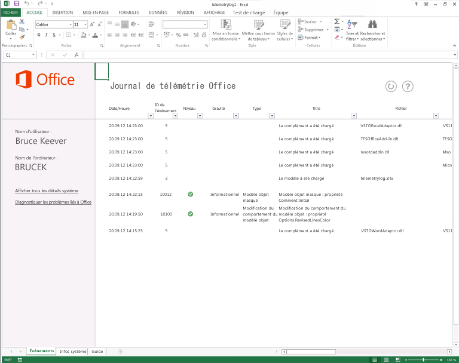

# Dépannage des solutions personnalisées et des fichiers Office avec le journal de télémétrieTroubleshooting Office files and custom solutions with the telemetry log

Utilisez le Journal de télémétrie pour Office 2013 pour déterminer les problèmes de compatibilité avec Office 2013 et les solutions élaborées pour les précédentes versions d'Office.Use the Telemetry Log for Office 2013 to determine compatibility issues with Office 2013 and solutions built for previous versions of Office.
  
L’article suivant décrit le journal de télémétrie et explique comment l’utiliser.The following article describes the Telemetry Log and how to use it. Pour plus d'informations sur des résultats spécifiques affichés dans le Journal de télémétrie, reportez-vous à la section [Problèmes de compatibilité dans Office](compatibility-issues-in-office.md).For more information about specific results displayed in the Telemetry Log, see [Compatibility issues in Office](compatibility-issues-in-office.md).

Au fil des versions, Microsoft a proposé des outils et des infrastructures permettant de personnaliser, d'automatiser et d'étendre Office. Ceux-ci ont permis aux entreprises et aux utilisateurs de créer des solutions ou des compléments pour les applications Office en vue d'améliorer leur productivité et leur efficacité. Ces solutions vont des plus simples comme les macros Visual Basic for Applications (VBA) aux plus complexes telles que les personnalisations .NET Framework. La plupart des utilisateurs qui disposent de ces solutions les utilisent pour effectuer des tâches critiques parfois sans même savoir qu'ils utilisent une personnalisation ajoutée à leurs applications Office.Over the course of many releases, Microsoft has provided tools and frameworks for customizing, automating, and extending Office. This has enabled businesses and users to build solutions or add-ins for Office applications to improve their productivity and efficiency. These solutions can range in complexity from simple Visual Basic for Applications (VBA) macros to robust .NET Framework customizations. Many users who have these solutions rely on them to complete business-critical tasks and may not even know that they are using a customization that is added to their Office applications.
  
Cette prolifération de solutions Office complexifie les mises à niveau des versions Office. Les entreprises et les utilisateurs ignorent si leurs précieuses solutions sont entièrement compatibles avec la nouvelle version. Leurs solutions peuvent utiliser des fonctions et du code informatique disponibles dans des versions précédentes d'Office devenus obsolètes dans les versions ultérieures. Si une solution qui utilise une fonction obsolète est chargée dans l'application « hôte », elle risque de se comporter autrement, de générer une erreur, d'échouer au chargement, voire d'empêcher l'application hôte de fonctionner.With such a proliferation of Office solutions, upgrading versions of Office can be complex. Enterprises and users do not know whether their important and valuable solutions are completely compatible with the new version. Their solutions might use features and computer code that are available in previous versions of Office that have been deprecated in later versions. If a solution that uses a deprecated feature is loaded into the "host" application, the solution might behave differently, cause an error, fail to load, or cause the host application to fail.
  
Outil reposant sur Excel 2013, le Journal de télémétrie pour Office 2013 aide les développeurs et les utilisateurs expérimentés à diagnostiquer les problèmes de compatibilité en affichant les événements qui se produisent dans un éventail d'applications Office 2013. Grâce à cet outil, les utilisateurs sont à même de déterminer les problèmes potentiels avec les compléments qu'ils utilisent dans leur environnement de travail, fournissant ainsi aux décideurs d'entreprise les informations dont ils ont besoin pour déterminer si la mise à niveau vers Office 2013 est possible. Le Journal de télémétrie propose également des commentaires détaillés sur des modifications ou des obsolescences spécifiques dans les modèles objet pour les applications Office 2013, ce qui permet aux développeurs d'identifier et de remanier rapidement le code ou les commandes problématiques. Les informaticiens peuvent voir les tendances de fonctionnement des solutions sur différents clients grâce au Tableau de bord de télémétrie pour Office 2013, outil complémentaire du Journal de télémétrie.The Telemetry Log for Office 2013, a tool built upon Excel 2013, helps developers and experienced users diagnose compatibility issues by displaying events that occur within select Office 2013 applications. Using this tool, users can determine potential issues with add-ins that they use in their work environment, giving enterprise decision-makers the information that they need to decide whether to upgrade to Office 2013. The Telemetry Log also gives detailed feedback about specific changes or deprecations in the object models for the Office 2013 applications, which helps developers quickly identify and refactor problematic code or controls. IT professionals can view trends in solution health across multiple clients by using the Telemetry Dashboard for Office 2013, a companion tool to the Telemetry Log.
  
Pour plus d'informations, voir [Déployer le Tableau de bord de télémétrie](https://technet.microsoft.com/library/f69cde72-689d-421f-99b8-c51676c77717).For more information, see [Deploy Office Telemetry Dashboard](https://technet.microsoft.com/library/f69cde72-689d-421f-99b8-c51676c77717).
  
## Fonctionnement du Journal de télémétrieHow the Telemetry Log works

Lorsqu'un fichier ou une solution Office est chargé, utilisé, fermé ou génère une erreur dans l'une des applications Office 2013 sélectionnées, celle-ci ajoute un enregistrement dans un magasin de données local (une base de données sur le même ordinateur) comprenant les informations sur l'événement. Cet enregistrement comporte le titre de l'événement, l'application qui a journalisé l'événement, l'heure, le nom du fichier ou de la solution, la gravité et une description courte des erreurs survenues, le cas échéant. Lorsqu'il est actualisé, le classeur du Journal de télémétrie affiche la liste des enregistrements que contient le magasin de données local.When an Office file or solution is loaded, used, closed, or raises an error in one of the selected Office 2013 applications, the application adds a record in a local data store (a database on the same computer) that includes information about the event. The record includes a title for the event, the application that logged the event, the time, the name of the file or solution, the severity, and a short description of any errors that may have occurred. When refreshed, the Telemetry Log workbook displays a list of the records contained in the local data store.
  
> [!NOTE]
> L'emplacement par défaut du magasin de données local est %Users%\[utilisateur actuel]\AppData\Local\Microsoft\Office\15.0\Telemetry. La taille maximale par défaut du magasin de données est de 5 Mo (5 120 Ko).The default location for the local data store is %Users%\[Current user]\AppData\Local\Microsoft\Office\15.0\Telemetry. The default maximum size for the data store is 5 MB (5,120 KB). 
  
Les applications Office 2013 sélectionnées ont une API de journalisation de l'exécution qui crée un enregistrement dans le magasin de données local chaque fois qu'un fichier ou une solution déclenche l'un des événements suivants :Selected Office 2013 applications have a run-time logging API that creates a record in the local data store every time that a file or solution raises one of the following events:
  
- **OnLoad**: un enregistrement est journalisé dans le magasin de données local lors du chargement d'un fichier ou d'une solution dans des applications Office 2013 spécifiques. La journalisation de l'erreur d'exécution enregistre le nom du fichier, son emplacement, ainsi que d'autres informations dans le magasin de données local lors du déclenchement d'un événement **OnLoad**.**OnLoad**: A record is logged in the local data store when a file or solution is loaded into specific Office 2013 applications. The run-time error logging records the file name, location, and other information in the local data store when an **OnLoad** event is raised. 
    
- **OnClose**: un enregistrement est journalisé lors de la fermeture d'un fichier ou d'une solution dans l'application. L'enregistrement comporte le nom du fichier ou de la solution, son emplacement et l'application qui a journalisé l'événement.**OnClose**: A record is logged when a file or solution is closed within the application. The record includes the name of the solution or file, its location, and the application that logged the event.
    
- **OnError**: un enregistrement est journalisé lorsqu'une erreur est détectée dans une solution pour certaines applications Office 2013. L'enregistrement comporte le nom du fichier ou de la solution, ainsi que l'échec d'exécution ou le problème de compatibilité rencontré par l'utilisateur. Dans la mesure du possible, les erreurs sont mappées sur les problèmes de compatibilité connus et s'affichent en tant que telles dans le Journal de télémétrie.**OnError**: A record is logged when an error is found in a solution for certain Office 2013 applications. The record includes the name of the solution or file and the run-time failure or compatibility issue that the user encountered. When possible, errors are mapped to known compatibility issues and are displayed as such in the Telemetry Log.
    
Le Journal de télémétrie propose des informations sur un grand nombre de types de fichiers et de solutions pour un large éventail d'applications Office 2013. Les types de fichiers et de solutions surveillés par les API de journalisation de l'exécution varient d'une application à l'autre. Voir tableau 1 pour plus d'informations sur les types de solutions surveillés.The Telemetry Log displays information about a large list of files and solution types for a selection of Office 2013 applications. The type of files and solutions that are monitored by the run-time logging APIs vary by application. See the Table 1 for more information about what kinds of solutions are monitored.
  
### Tableau 1. Types de fichiers et de solutions Office suivis dans le Journal de télémétrieTable 1. Types of Office files and solutions tracked in Telemetry Log

|**Type de solution****Solution type**|**Applications****Applications**|**Description****Description**|
|:-----|:-----|:-----|
|Applications de volet OfficeTask pane apps    |Excel 2013, Word 2013, Project 2013Excel 2013, Word 2013, Project 2013    |Il s'agit des Compléments Office hébergées dans un volet Office de l'application cliente.These are Office Add-ins that are hosted in a task pane within the client application.    |
|Applications de contenuContent apps    |Excel 2013Excel 2013    |Il s'agit des Compléments Office intégrées au contenu du fichier Office.These are Office Add-ins that are integrated into the content of the Office file.    |
|Applications de messagerieMail apps    |Outlook 2013Outlook 2013    |Il s'agit des applications qui apparaissent dans Outlook 2013 lorsque certaines conditions sont remplies (le corps ou l'objet du message comporte des mots ou des expressions spécifiques).These are apps that appear inOutlook 2013 when certain conditions are met (the email body or subject includes particular words or phrases).    |
|Documents actifsActive documents    |Word 2013Word 2013    PowerPoint 2013PowerPoint 2013    Excel 2013Excel 2013    | Par « document actif », on entend tout fichier de document Office différent des autres types de solutions énumérés dans ce tableau. Il peut s'agir de ce qui suit :Active documents are any Office document files other than the other solution types listed in this table. This can include the following:     Fichiers au format binaire Office (.doc, .ppt, .pps, .xls).Office binary format files (.doc, .ppt, .pps, .xls).     Fichiers au format OpenXML Office (.docx, .pptx, .ppsx, .xlsx).Office OpenXML format files (.docx, .pptx, .ppsx, .xlsx).     Fichiers prenant en charge les macros et contenant du code VBA (.docm, .dotm, .pptm, .potm, .xlsm, .xltm).Macro-enabled files that contain VBA code (.docm, .dotm, .pptm, .potm, .xlsm, .xltm).     Fichiers contenant des contrôles ActiveX.Files that contain ActiveX controls.     Fichiers comportant des connexions de données externes.Files that have External Data Connections.    |
|Compléments COMCOM add-ins    |Word 2013Word 2013    PowerPoint 2013PowerPoint 2013    Excel 2013Excel 2013    Outlook 2013Outlook 2013    |Les compléments COM incluent les compléments Outils de développement Office dans Visual Studio 2010.COM add-ins include Office development tools in Visual Studio 2010 application-level add-ins.    |
|Compléments d'automatisation ExcelExcel Automation add-ins    |Excel 2013Excel 2013    |Ce type de solution inclut les versions antérieures des compléments d'automatisation pris en charge par Excel, reposant sur des compléments COM. Les fonctions des compléments d'automatisation peuvent être appelées à partir de formules dans les feuilles de calcul Excel.This solution type includes previous versions of Excel-supported Automation Add-ins, which are built upon COM add-ins. Functions in Automation add-ins can be called from formulas in Excel worksheets.    |
|Macros complémentaires XLL ExcelExcel XLL add-ins    |Excel 2013Excel 2013    |Les macros complémentaires XLL (.xll) sont spécifiques à Excel ; elles sont créées avec un compilateur prenant en charge la création de DLL (bibliothèques de liens dynamiques). Elles ne nécessitent pas d'installation, ni d'enregistrement. Les compléments XLL comprennent également des DLL comportant des commandes et des fonctions définies par l'utilisateur.XLL add-ins (.xll) are specific to Excel and built with any compiler that supports building DLLs (dynamic-link libraries). They do not have to be installed or registered. XLL add-ins also include DLLs that contain user-defined commands and functions.    |
|Compléments XLS RTD ExcelExcel XLS RTD add-ins    |Excel 2013Excel 2013    |Les compléments XLS RTD (Real-Time Data) sont des feuilles de calcul Excel qui utilisent la fonction de feuille de calcul **RealTimeData** pour appeler un serveur d'automatisation afin de récupérer des données en temps réel.XLS real-time data (RTD) add-ins are Excel worksheets that use the **RealTimeData** worksheet function to call an Automation server to retrieve data in real-time.    |
|Compléments Word WLLWord WLL add-ins    |Word 2013Word 2013    |Les compléments WLL (.wll) sont spécifiques de Word et créés au moyen d’un compilateur quelconque prenant en charge la création de DLL.WLL (.wll) add-ins are specific to Word and built with any compiler that supports building DLLs.    |
|Compléments d'applicationApplication add-ins    |Word 2013Word 2013    PowerPoint 2013PowerPoint 2013    Excel 2013Excel 2013    |Les compléments d'application sont des fichiers spécifiques à l'application qui contiennent du code VBA. Ils incluent les modèles Word prenant en charge les macros (.dotm), les compléments Excel (.xla, .xlam) et les compléments PowerPoint (.ppa, .ppam).Application add-ins are application-specific files that contain VBA code. These include macro-enabled Word templates (.dotm), Excel add-ins (.xla, .xlam), and PowerPoint add-ins (.ppa, .ppam).    |
|ModèlesTemplates    |Word 2013Word 2013    PowerPoint 2013PowerPoint 2013    Excel 2013Excel 2013    |Les modèles comprennent les modèles de document (.dot, .dotx), de feuille de calcul (.xlt, .xltx) ou de présentation (.pot, .potx) attachés à un fichier Office.Templates include document (.dot, .dotx), worksheet (.xlt, .xltx), or presentation (.pot, .potx) templates that are attached to an Office file.    |
   
## Utilisation du journal de télémétrie OfficeUsing the Office Telemetry Log

Lorsque vous installez Office 2013, le Journal de télémétrie est installé, le magasin de données local est créé sur le même ordinateur et les API de journalisation de l'exécution sont activées dans les applications Office 2013 énumérées ci-dessus. Une solution ou un fichier doit toutefois être chargé ou ouvert dans l'application pour que le Journal de télémétrie puisse commencer à le surveiller.When you install Office 2013, the Telemetry Log is installed, the local data store is created on the same computer, and the run-time logging APIs are enabled in the Office 2013 applications previously listed. However, a solution or file must be loaded or opened in the application before the Telemetry Log can start to monitor it.
  
Procédez comme suit pour afficher les problèmes Office enregistrés dans le Journal de télémétrie.Use the following procedure to display the recorded Office issues in the Telemetry Log. 
  
### Pour utiliser le Journal de télémétrieTo use the Telemetry Log

1. Pour ouvrir le Journal de télémétrie, effectuez l'une des opérations suivantes :To open the Telemetry Log, do one of the following:
    
   - **Sous Windows 7 :** dans le menu **Démarrer**, choisissez **Tous les programmes**. Dans la liste des programmes, développez **Microsoft Office 15**, développez **Outils Office 15**, puis cliquez sur **Journal de télémétrie Office 15**.**On Windows 7:** On the **Start** menu, choose **All Programs**. Then, in the list of programs, expand **Microsoft Office 2013**, expand **Office 2013 Tools**, and then click **Office 2013 Telemetry Log**.
    
     Un nouveau classeur s'ouvre dans Excel 2013. Il contient trois feuilles de calcul intitulées **Événements**, **Infos système** et **Guide**.A new workbook in Excel 2013 opens. The workbook has three worksheets titled **Events** **System info**, and **Guide**.
    
   - **Sous Windows 8 :** balayez l'écran vers le haut pour afficher la barre d'applications, choisissez **Toutes les applications**, puis **Journal de télémétrie Office 15**.**On Windows 8:** Swipe up to display the AppBar, choose **All Apps**, and then choose **Office 2013 Telemetry Log**.
    
     Un nouveau classeur s'ouvre dans Excel 2013. Il contient trois feuilles de calcul intitulées **Événements**, **Infos système** et **Guide**.A new workbook in Excel 2013 opens. The workbook has three worksheets titled **Events** **System info**, and **Guide**.
    
2. Pour afficher une liste des événements actualisée, dans la feuille de calcul **Événements**, en haut de la feuille de calcul, choisissez **Actualiser**.To view an up-to-date list of events, on the **Events** worksheet, at the top of the worksheet, choose **Refresh**.
    
3. Pour afficher les données d'événement recueillies dans les applications Office 2013, consultez le tableau affiché dans la feuille de calcul **Événements**.To view the event data that is collected from Office 2013 applications, review the table displayed on the **Events** worksheet. 
    
4. Pour consulter les informations relatives à l'ordinateur sur lequel Office 2013 et Journal de télémétrie sont installés, reportez-vous aux informations de la feuille de calcul **Infos système**.To review information about the computer on which Office 2013 and Telemetry Log are installed, review the information displayed on the **System Info** worksheet. 
    
> [!NOTE]
> Il n'est pas nécessaire d'enregistrer le classeur Journal de télémétrie dans Excel 2013 pour conserver un enregistrement des résultats, car les informations sont enregistrées dans le magasin de données local (qui est distinct du Journal de télémétrie). Toutefois, l'enregistrement du classeur n'endommage pas le Journal de télémétrie.It is not necessary to save the Telemetry Log workbook in Excel 2013 to keep a record of the results, because the information is stored in the local data store (which is separate from the Telemetry Log). However, saving the workbook does not damage the Telemetry Log. 
  
Le Journal de télémétrie affiche quelques informations simples sur les événements enregistrés. Chaque enregistrement affiché dans le Journal de télémétrie comporte un titre et indique la gravité de l'événement affiché. Pour les erreurs, les enregistrements comprennent également une description de l'erreur ainsi que la procédure à suivre pour la résoudre. Notez toutefois que tous les enregistrements affichés ne sont pas des erreurs occasionnées par les solutions Office ; le Journal de télémétrie indique également lorsque des solutions et des fichiers sont chargés ou fermés sans problème.The Telemetry Log displays some simple information about the recorded events. Each record displayed in the Telemetry Log contains a title and lists the severity of the event displayed. For errors, the records also include a description of the error together with steps to address the issue. Keep in mind that not all of the records displayed represent errors caused by Office solutions; the Telemetry Log also shows when solutions and files are loaded or closed successfully. 
  
Par exemple, le problème intitulé « Modèle objet - masqué : propriété Comment.Initial » apparaît si une solution ou un fichier prenant en charge les macros ouvert dans Word 2013 tente d'obtenir les initiales d'une personne ayant entré un commentaire. Word 2013 propose des fonctions de commentaires améliorées qui n'affichent pas par défaut les initiales de la personne qui a entré les commentaires. Les API associées à l'ancien modèle de commentaires ont été masquées dans le modèle d'objet Word 2013 mais restent disponibles à des fins de compatibilité descendante. Le problème « Modèle objet - masqué : propriété Comment.Initial » dans le indique le fichier qui tente d'utiliser l'API, l'application qui a déclenché l'événement (Word 2013), l'heure et la date de l'événement, ainsi qu'une description courte de l'erreur et comment la corriger.For example, the issue titled "OM Hidden: Comment.Initial Property" appears if a solution or macro-enabled file opened in Word 2013 attempts to get the initials of a commenter who is associated with a comment. Word 2013 features an improved commenting experience that does not display commenter initials by default. The APIs associated with the older commenting model have been hidden in the Word 2013 object model but remain available for backwards-compatibility. The "OM Hidden: Comment.Initial" issue in the indicates the file that attempted to use the API, the application that raised the event (Word 2013), the time and date of the event, and short description about the error and how to fix it.
  
**Figure 1. Journal de télémétrie Office****Figure 1. Office Telemetry Log**
  
![Observateur d’événements Office affichant des enregistrements. ] (media/off15_OfficeEventViewer_SD.png "Observateur d’événements Office affichant des enregistrements")
  
> [!NOTE]
>  La feuille de calcul des **informations système** qui se trouve dans le journal de télémétrie contient des informations sur l’ordinateur sur lequel Office 2013 est installé.The **System Info** worksheet in the Telemetry Log contains information about the computer on which Office 2013 is installed. La feuille de calcul affiche les informations suivantes :The worksheet displays the following information: 
> - Nom d’utilisateur.User name.
> - Nom complet de l’ordinateur.Full computer name.
> - Architecture du système d’exploitation (x64/64 bits ou x86/32 bits).Architecture of the operating system (x64/64-bit or x86/32-bit).
> - La version de Windows installée sur l’ordinateur.Version of Windows that is installed on the computer.
> - Fuseau horaire pour l’horloge interne de l’ordinateur.Time zone for the computer's internal clock.
> - Version du journal de télémétrie.Version of the Telemetry Log.
> - Version d’Office installée sur l’ordinateur.Version of Office that is installed on the computer.
> 
> Ces informations peuvent être utiles lorsque vous interprétez les problèmes et les événements répertoriés dans la feuille de calcul **Événements**.This information can be useful when you are interpreting the issues and events listed on the **Events** worksheet. 
  
Dans le Journal de télémétrie, un niveau de gravité apparaît à côté des problèmes connus. Dans l'exemple précédent, un problème dans lequel une partie du modèle d'objet a été masquée aura le plus souvent le niveau de gravité « Informationnel ». En revanche, d'autres problèmes connus peuvent être plus graves et nécessiter une action plus rapide. La gravité des problèmes affichés dans le Journal de télémétrie peut être l'une des suivantes :In the Telemetry Log, a level of severity is displayed together with the known issues. From the previous example, an issue in which a part of the object model has been hidden most often has an "Informative" level of severity. On the other hand, other known issues might be more serious and require more immediate action. The severity of the issues displayed in the Telemetry Log can be one of the following:
  
- **Informationnel** Le problème peut ne pas avoir un effet immédiat sur la compatibilité de l'application, mais il est possible que l'utilisateur doive prendre une mesure ultérieurement. De nombreux problèmes de type « Modèle objet - masqué » ont ce niveau de gravité.**Information** The issue may not have an immediate effect on application compatibility, but the user may have to take an action later. Many issues of the "OM hidden" type have this severity level. 
    
- **Avertissement** Le problème peut entraîner une perte de données ou amoindrir la fidélité visuelle.**Warning** The issue could cause data loss or result in reduced visual fidelity. 
    
- **Critique** Le problème peut occasionner une perte importante de fonctionnalité ou mener au blocage de l'application.**Critical** The issue could cause significant loss of functionality or lead the application to crash. 
    
### Tableau 2. Types d'événements affichés dans le Journal de télémétrieTable 2. Types of events displayed in the Telemetry Log

Utilisez le Tableau 2 suivant pour interpréter les enregistrements affichés dans le Journal de télémétrie.Use the following table (Table 2) to interpret the records that are displayed in the Telemetry Log.
  
|**ID d’évènement****Event ID**|**Titre****Title**|**Gravité****Severity**|**Description****Description**|
|:-----|:-----|:-----|:-----|
|11    |Le document a été chargéDocument loaded successfully    ||Le fichier indiqué dans la colonne **Fichier** a été ouvert dans l'application Office sans problème.The file listed in the **File** column was opened in the Office application without any issues.    |
|22    |Échec de chargement du documentDocument failed to load    |AvertissementWarning    | L'application n'a pas pu charger le fichier. Un problème de compatibilité sous-jacente est possible.  The application was unable to load the file. There may be some underlying compatibility issue.    Pour plus d’informations sur la façon de réparer un classeur endommagé dans Excel 2013, reportez-vous à la section [Réparation d’un classeur endommagé](https://office.microsoft.com/en-us/excel-help/repairing-a-corrupted-workbook-HA102749554.aspx).For more information about how to repair a corrupted workbook in Excel 2013, see [Repairing a corrupted workbook](https://office.microsoft.com/en-us/excel-help/repairing-a-corrupted-workbook-HA102749554.aspx).  Pour plus d'informations sur la réparation d'un document endommagé dans Word 2013, reportez-vous à la section [Enregistrer et récupérer une copie de sauvegarde d'un document](https://office.microsoft.com/en-us/word-help/save-and-recover-a-backup-copy-of-a-document-HA010121250.aspx).For more information about how to repair a corrupted document in Word 2013, see [Save and recover a backup copy of a document](https://office.microsoft.com/en-us/word-help/save-and-recover-a-backup-copy-of-a-document-HA010121250.aspx).   |
|33    |Le modèle a été chargéTemplate loaded successfully    ||Le fichier de modèle indiqué dans la colonne **Fichier** a été ouvert dans l'application Office sans problème.The template file listed in the **File** column was opened in the Office application without any issues.    |
|44    |Échec de chargement du modèleTemplate failed to load    |AvertissementWarning    | L'application n'a pas pu charger le fichier de modèle. Un problème de compatibilité sous-jacent est possible ou la disponibilité du modèle a changé.  The application was unable to load the template file. There may be some underlying compatibility issue or the template availability may have changed.  Pour plus d’informations sur la façon de réparer un classeur endommagé dans Excel 2013, reportez-vous à la section [Réparation d’un classeur endommagé](https://office.microsoft.com/en-us/excel-help/repairing-a-corrupted-workbook-HA102749554.aspx).For more information about how to repair a corrupted workbook in Excel 2013, see [Repairing a corrupted workbook](https://office.microsoft.com/en-us/excel-help/repairing-a-corrupted-workbook-HA102749554.aspx).  Pour plus d'informations sur la réparation d'un document endommagé dans Word 2013, reportez-vous à la section [Enregistrer et récupérer une copie de sauvegarde d'un document](https://office.microsoft.com/en-us/word-help/save-and-recover-a-backup-copy-of-a-document-HA010121250.aspx).For more information about how to repair a corrupted document in Word 2013, see [Save and recover a backup copy of a document](https://office.microsoft.com/en-us/word-help/save-and-recover-a-backup-copy-of-a-document-HA010121250.aspx).   |
|55    |Le complément a été chargéAdd-in loaded successfully    ||Le complément indiqué dans la colonne **Fichier** a été chargé dans l'application Office sans problème. Aucun problème de compatibilité n'a été détecté.  The add-in listed in the **File** column loaded within the Office application successfully. No compatibility issues were detected.    |
|66    |Échec du chargement du complémentAdd-in failed to load    |CritiqueCritical    | L'application n'a pas pu charger le complément indiqué dans la colonne **Fichier**.The application was unable to load the add-in listed in the **File** column.    Pour plus d’informations sur la façon de réparer un classeur endommagé dans Excel 2013, reportez-vous à la section [Réparation d’un classeur endommagé](https://office.microsoft.com/en-us/excel-help/repairing-a-corrupted-workbook-HA102749554.aspx).For more information about how to repair a corrupted workbook in Excel 2013, see [Repairing a corrupted workbook](https://office.microsoft.com/en-us/excel-help/repairing-a-corrupted-workbook-HA102749554.aspx).     Pour plus d'informations sur la réparation d'un document endommagé dans Word 2013, reportez-vous à la section [Enregistrer et récupérer une copie de sauvegarde d'un document](https://office.microsoft.com/en-us/word-help/save-and-recover-a-backup-copy-of-a-document-HA010121250.aspx).For more information about how to repair a corrupted document in Word 2013, see [Save and recover a backup copy of a document](https://office.microsoft.com/en-us/word-help/save-and-recover-a-backup-copy-of-a-document-HA010121250.aspx).   |
|77    |Le manifeste du complément a été correctement téléchargéAdd-in manifest downloaded successfully    ||L'application hôte a chargé le manifeste de l'Complément Office.The host application loaded the manifest for the Office Add-in successfully.    |
|88    |Échec du téléchargement du manifeste du complémentAdd-in manifest did not download    |CritiqueCritical    |L’application hôte n’a pas pu charger le fichier manifeste pour l’Complément Office à partir du catalogue SharePoint, du catalogue d’entreprise ou de l’Office Store.The host application was unable to load the manifest file for the Office Add-in from the SharePoint catalog, corporate catalog, or the Office Store.    |
|99    |Échec de l'analyse du balisage du complémentAdd-in manifest could not be parsed    |CritiqueCritical    |L'application hôte a chargé le manifeste de l'Complément Office pour le complément, mais n'a pas pu lire le XML.The host application loaded the Office Add-in manifest for the add-in, but could not read the XML.    |
|1010    |Le complément a trop sollicité le processeurAdd-in used too much CPU    |CritiqueCritical    |L’Complément Office a utilisé plus de 90 % des ressources du processeur sur une période de temps définie.The Office Add-in used more than 90% of the CPU resources over a finite period of time.    |
|1111    |Blocage de l’application lors du chargementApplication crashed on load    |CritiqueCritical    |L'application Office a tenté de charger un document ou une solution au démarrage, mais des problèmes avec le document ou la solution ont empêché l'application de démarrer.The Office application tried to load a document or solution when it launched, but problems with the document or solution prevented the application from launching.    |
|1212    |L'application a du être fermée en raison d'un problèmeApplication closed due to a problem    |CritiqueCritical    |Une erreur critique s'est produite dans l'application, qui a dû fermer.Something caused a critical error in the application and it needed to close.    |
|1313    |Le document a été ferméDocument closed successfully    ||Le fichier indiqué dans la colonne **Fichier** s'est fermé sans problème.The file listed in the **File** column closed successfully.    |
|1414    |La session d'application a été étendueApplication session extended    ||Les sessions d'application avec une solution ou un document spécifique ouvert peuvent durer au maximum 24 heures. Si une session dépasse 24 heures, l'application hôte crée une nouvelle session.Application sessions with a particular document or solution open should only last 24 hours. If a session goes over 24 hours, the host application creates a new session.    |
|1515    |Le complément a été désactivé en raison de l’expiration de la recherche de chaîneAdd-in disabled due to string search time-out    ||Les compléments de messagerie recherchent la ligne d'objet et le corps du message d'un courrier électronique pour déterminer s'ils doivent être affichés avec une expression régulière. L'application de messagerie répertoriée dans la colonne **Fichier** a été désactivée par Outlook 2013, car elle a expiré à plusieurs reprises lors d'une tentative de mise en correspondance d'une expression régulière.  Mail add-in search the subject line and message of an email to determine whether they should be displayed by using a regular expression. The mail app listed in the **File** column was disabled by Outlook 2013 because it timed out repeatedly while trying to match a regular expression.    |
|1616    |Document ouvert lors du blocage de l’applicationDocument open when application crashed    |CritiqueCritical    |Le fichier indiqué dans la colonne **Fichier** était ouvert lorsque l'application (répertoriée dans la colonne d'application) s'est bloquée. Le fichier peut être à l'origine du blocage de l' **application**.  The file listed in the **File** column was open when the application (listed in the application column) crashed. The file may or may not have been responsible for the **Application** crash.    |
|1717    |Le complément a été ferméAdd-in closed successfully    |InformationnelInformative    |L'application a pu fermer le complément sans problème.The application was able to shut down the add-in successfully.    |
|1818    |L'application a été ferméeApp closed successfully    ||L’application hôte a pu fermer l’Complément Office sans problème.The host application was able to close the Office Add-in successfully.    |
|1919    |Le complément a rencontré une erreur d’exécutionAdd-in encountered runtime error    |CritiqueCritical    |L'Complément Office a rencontré un problème qui l'a empêchée de s'exécuter. Pour plus de détails, consultez le journal des alertes de Microsoft Office à l'aide de l'Observateur d'événements Windows sur l'ordinateur sur lequel l'erreur s'est produite.The Office Add-in had a problem that caused it to fail. For more details, look at the Microsoft Office Alerts log using the Windows Event Viewer on the computer that encountered the error.    |
|2020    |Le complément n’a pas pu vérifier la licenceAdd-in failed to verify licensing    |CritiqueCritical    |Les informations de licence de l'Complément Office n'ont pas pu être vérifiées et la licence a peut-être expiré. Pour plus de détails, consultez le journal des alertes de Microsoft Office à l'aide de l'Observateur d'événements Windows sur l'ordinateur sur lequel l'erreur s'est produite.The licensing information for the Office Add-in could not be verified and may have expired. For more details, look at the Microsoft Office Alerts log using the Windows Event Viewer on the computer that encountered the error.    |
|DiversVarious    |« Modification du comportement du modèle objet : ... »"OM Behavior Change: ..."    |InformationnelInformative    |Le code du complément ou du document prenant en charge les macros utilise un objet, un membre, une collection, une énumération ou une constante qui se comporte différemment des versions précédentes d’Office.The add-in or macro-enabled document code uses an object, member, collection, enumeration, or constant that behaves differently from previous versions of Office.   Pour plus d'informations, reportez-vous à la section [Problèmes de compatibilité dans Office](compatibility-issues-in-office.md).For more information, see [Compatibility issues in Office](compatibility-issues-in-office.md).    |
|DiversVarious    |« Modèle objet - supprimé : … »"OM Removed: …"    |CritiqueCritical    |Le code du complément ou du document prenant en charge les macros utilise une collection, une énumération, une constante, un objet ou un membre ayant été supprimé du modèle objet.The add-in or macro-enabled document code uses an object, member, collection, enumeration, or constant that has been removed from the object model.  Pour plus d'informations, reportez-vous à la section [Problèmes de compatibilité dans Office](compatibility-issues-in-office.md).For more information, see [Compatibility issues in Office](compatibility-issues-in-office.md).    |
|DiversVarious    |« Modèle objet - masqué : … »"OM Hidden: …"    |InformationnelInformative    |Le code du complément ou du document prenant en charge les macros utilise une collection, une énumération, une constante, un objet ou un membre ayant été masqué dans le modèle objet.The add-in or macro-enabled document code uses an object, member, collection, enumeration, or constant that has been hidden in the object model.  Pour plus d'informations, reportez-vous à la section [Problèmes de compatibilité dans Office](compatibility-issues-in-office.md).For more information, see [Compatibility issues in Office](compatibility-issues-in-office.md).    |
|DiversVarious    |« Contrôle : … »"Control: …"    ||Le fichier contient un contrôle susceptible de ne pas être pris en charge dans Office 2013 ou par le système d’exploitation de l’ordinateur.The file contains a control that may not be supported in Office 2013 or on the computer's operating system.  Pour plus d'informations, reportez-vous à la section [Problèmes de compatibilité dans Office](compatibility-issues-in-office.md).For more information, see [Compatibility issues in Office](compatibility-issues-in-office.md).    |
   
## ConclusionConclusion

Le Journal de télémétrie fournit aux grandes entreprises, aux utilisateurs individuels et aux développeurs un outil simple pour la surveillance de leurs solutions Office critiques. En identifiant les solutions Office problématiques avant une mise à niveau à grande échelle, les entreprises peuvent prédire de manière plus raisonnable le coût que représente l'adoption d'Office 2013.The Telemetry Log provides large enterprises, individual users, and developers with a simple tool for monitoring their critical Office solutions. By identifying problematic Office solutions before a large-scale upgrade, businesses can more reasonably predict the cost of adopting Office 2013.
  
## Voir aussiSee also

- [Centre pour développeurs OfficeOffice Developer Center](https://msdn.microsoft.com/office/aa905340.aspx)
- [Problèmes de compatibilité dans OfficeCompatibility issues in Office](compatibility-issues-in-office.md)
- [Déployer le Tableau de bord de télémétrie OfficeDeploy Office Telemetry Dashboard](https://technet.microsoft.com/library/f69cde72-689d-421f-99b8-c51676c77717)
- [Centre pour développeurs OfficeOffice Developer Center](https://msdn.microsoft.com/office/aa905340)
    

