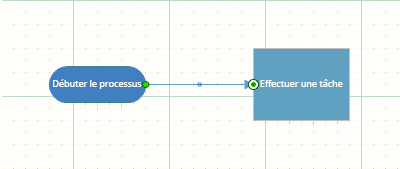

# <a name="manipulate-the-visio-file-format-programmatically"></a>Manipuler le format de fichier Visio par programmation


  
Découvrez comment créer une solution dans Visual Studio 2012 pour lire le nouveau package de format de fichier dans Visio 2013, sélectionner des composants du package, modifier les données d’un composant et ajouter de nouveaux composants au package.
   
## <a name="visio-file-format-manipulation-essentials"></a>Principes essentiels de manipulation du format de fichier Visio
<a name="vis15_ManipulateFF_Essentials"> </a>

Les versions précédentes de Visio enregistraient les fichiers dans un format de fichier binaire propriétaire (.vsd) ou dans un format de fichier de dessin Visio XML (.vdx) de document unique. Visio 2013 propose un nouveau format de fichier (.vsdx) qui est basé sur les technologies d’archive XML et ZIP. Comme dans les versions précédentes de Visio, les fichiers sont enregistrés dans un seul conteneur. Toutefois, contrairement aux fichiers hérités, le nouveau format de fichier peut être ouvert, lu, mis à jour, modifié et créé sans automatiser l’application Visio 2013. Les développeurs qui sont habitués à manipuler le code XML ou l’espace de noms [System.IO.Packaging](https://docs.microsoft.com/dotnet/api/system.io.packaging?view=netframework-4.8) peuvent rapidement commencer à utiliser le nouveau format de fichier par programmation. Les développeurs ayant travaillé avec le format de dessin Visio XML des versions précédentes s’apercevront que bon nombre des structures de ce format ont été conservées dans le nouveau format de fichier. 
  
Dans cet article, nous expliquons comment utiliser le format de fichier Visio 2013 par programmation, à l’aide de Microsoft .NET Framework 4.5, C# ou Visual Basic et Visual Studio 2012. Vous découvrirez comment ouvrir un fichier Visio 2013, sélectionner des composants de document dans ce fichier, modifier des données dans les composants et créer un composant de document.
  
> [!NOTE]
> Les exemples de code présentés dans cet article supposent que vous disposiez d’une connaissance rudimentaire des classes dans les espaces de noms [System.Xml.Linq](https://docs.microsoft.com/dotnet/api/system.xml.linq?view=netframework-4.8) et [System.IO.Packaging](https://docs.microsoft.com/dotnet/api/system.io.packaging?view=netframework-4.8). > Cet article repose également sur l’hypothèse selon laquelle vous comprenez les concepts et la terminologie des OPC (Open Packaging Conventions). Vous devez être familier avec les concepts de packages, les composants de document ou les composants de package et les relations. Pour plus d’informations, voir [OPC : une nouvelle norme pour les packages de données](https://docs.microsoft.com/archive/msdn-magazine/2007/august/opc-a-new-standard-for-packaging-your-data). > Le code montre comment créer des requêtes LINQ (Language Integrated Query) pour sélectionner XML. La plupart des exemples de code utilisent la syntaxe de la requête pour créer des requêtes LINQ. Vous pouvez réécrire n’importe quelle requête LINQ fournie dans le code à l’aide de la syntaxe de la méthode LINQ, le cas échéant. Pour plus d’informations sur la syntaxe de la requête LINQ et la syntaxe de la méthode, voir [Comparaisons entre la syntaxe de la requête LINQ et la syntaxe de la méthode (C#)](https://docs.microsoft.com/dotnet/csharp/programming-guide/concepts/linq/query-syntax-and-method-syntax-in-linq)> Le Tableau 1 indique les rubriques essentielles que vous devez connaître avant de parcourir cet article. 
  
**Tableau 1. Principes de base pour la manipulation du format de fichier Visio 2013**

|**Titre d’article**|**Description**|
|:-----|:-----|
|[Présentation du format de fichier Visio (.vsdx)](introduction-to-the-visio-file-formatvsdx.md) <br/> |Cette vue d’ensemble de haut niveau décrit quelques-unes des principales fonctionnalités du format de fichier Visio 2013. Elle traite des OPC (Open Packaging Conventions) qui ont été appliqués au format de fichier Visio 2013. Elle répertorie également quelques différences entre le format de fichier Visio 2013 et le format de fichier de dessin Visio XML précédent (.vdx).  <br/> |
|[OPC : une nouvelle norme pour les packages de données](https://docs.microsoft.com/archive/msdn-magazine/2007/august/opc-a-new-standard-for-packaging-your-data) <br/> |Cet article de MSDN Magazine décrit les spécifications des normes Open Packaging Conventions sous forme de concept.  <br/> |
|[Éléments fondamentaux des OPC (Open Packaging Conventions)](https://docs.microsoft.com/previous-versions/office/office-12/ee361919(v=office.12)) <br/> [Présentation des formats de fichier Office (2007) Open XML](https://docs.microsoft.com/previous-versions/office/developer/office-2007/aa338205(v=office.12)) <br/> |Ces deux articles traitent de la manière dont les spécifications des normes Open Packaging Conventions ont été appliquées aux fichiers Microsoft Office. Ils contiennent des descriptions sur le fonctionnement des relations dans un package, et incluent également quelques exemples de code.  <br/> |
   
## <a name="create-a-vsdx-file-and-a-new-visual-studio-solution"></a>Créer un fichier .vsdx et une nouvelle solution Visual Studio
<a name="vis15_ManipulateFF_CreateFile"> </a>

Avant de commencer à parcourir les procédures décrites dans cet article, vous devez créer un fichier Visio 2013 à ouvrir et manipuler. Le dessin utilisé dans les exemples de code au fil de cet article contient une seule page avec deux formes liées. L’une d’elles est une forme « Début/fin » du modèle « Diagramme de flux simple ».
  
Utilisez la procédure suivante pour créer un fichier Visio 2013 à utiliser dans les autres procédures de cet article.
  
### <a name="to-create-new-file-in-visio-2013"></a>Pour créer un fichier Visio 2013

1. Ouvrez Visio 2013.
    
2. Créez un document à partir du modèle Diagramme de flux simple en choisissant **CATÉGORIES**, **Diagramme de flux**, **Diagramme de flux simple**, **Créer**.
    
3. À partir de la fenêtre **Formes**, faites glisser une forme **Début/fin** sur la zone de dessin. 
    
4. Sélectionnez la nouvelle forme Début/fin sur la zone de dessin et saisissez « Commencer le processus ».
    
5. À partir de la fenêtre **Formes**, faites glisser une forme **Processus** sur la zone de dessin. 
    
6. Sélectionnez la nouvelle forme Processus sur la zone de dessin et saisissez « Effectuer certaines tâches ».
    
7. Dans le menu contextuel de la forme Début/fin, sélectionnez **Ajouter un connecteur à la page**, puis tracez un connecteur entre les formes Processus et Début/fin sur la zone de dessin, comme illustré dans la figure 1.
    
    **Figure 1. Dessin Visio 2013 simple**
    
     
  
8. Enregistrez le fichier sur votre bureau au format .vsdx en sélectionnant **Fichier**, **Enregistrer sous**, **Ordinateur**, **Bureau**.
    
    Dans la boîte de dialogue **Enregistrer sous**, entrez Package Visio dans la zone **Nom de fichier**, sélectionnez **Dessin Visio (\*.vsdx)** dans la liste **Type de fichier**, puis cliquez sur le bouton **Enregistrer**. 
    
9. Fermez le fichier, puis fermez Visio 2013.
    
> [!TIP]
> Parfois Visio ouvre un fichier avec succès même s’il existe des problèmes avec ce fichier. Pour vous assurer que Visio vous avertit de tous les problèmes de fichier, vous devez activer les avertissements à l’ouverture des fichiers lors du test des solutions qui manipulent les fichiers Visio au niveau du package de fichiers. > Pour activer les avertissements lors de l’ouverture des fichiers, dans Visio 2013, sélectionnez **Fichier**, **Options**, **Avancé**. Sous **Enregistrer/Ouvrir**, sélectionnez **Afficher les avertissements lors de l’ouverture des fichiers**. 
  
Les procédures suivantes utilisent une application console Windows pour manipuler le fichier « Visio Package.vsdx ». La procédure suivante permet de créer et de configurer une nouvelle application console Windows dans Visual Studio 2012.
  
### <a name="to-create-a-new-solution-in-visual-studio-2012"></a>Pour créer une nouvelle solution dans Visual Studio 2012

1. Dans le menu **Fichier**, choisissez **Nouveau**, **Projet**.
    
2. Dans la boîte de dialogue **Nouveau projet**, développez **Visual C#** ou **Visual Basic**, puis choisissez **Windows**, **Application console**.
    
    Dans la zone **Nom**, entrez « VisioFileAccessor », sélectionnez un emplacement pour le projet, puis sélectionnez le bouton **OK**. 
    
3. Dans le menu **Projet**, choisissez **Ajouter une référence**. 
    
    Dans la boîte de dialogue **Gestionnaire de références**, sous **Montages**, choisissez **Framework**, puis ajoutez une référence aux composants **System.Xml ** et **WindowsBase**. 
    
4. Dans le fichier Program.cs ou Module1.vb du projet, ajoutez les directives **using** suivantes (instructions **imports** dans Visual Basic) : 
    
    ```cs
    using System.Xml;
    using System.Xml.Linq;
    using System.IO;
    using System.IO.Packaging;
    using System.Text;
    
    ```

    ```vb
    Imports System.Xml
    Imports System.Xml.Linq
    Imports System.IO
    Imports System.IO.Packaging
    Imports System.Text
    
    ```

5. De même, dans le fichier Program.cs ou Module1.vb, avant la fin de la méthode **Main** de la classe **Program** (**Module1** dans Visual Basic), ajoutez le code suivant qui arrête l’exécution de l’application console jusqu’à ce que l’utilisateur appuie sur une touche. 
    
    ```cs
    // This code stops the execution of the console application
    // so you can read the output.
    Console.WriteLine("Press any key to continue ...");
    Console.ReadKey();
    
    ```

    ```vb
    ' This code stops the execution of the console application
    ' so you can read the output.
    Console.WriteLine("Press any key to continue ...")
    Console.ReadKey()
    ```

## <a name="open-a-visio-2013-file-as-a-package"></a>Ouvrir un fichier Visio 2013 sous forme de package
<a name="vis15_ManipulateFF_OpenPackage"> </a>

Avant de manipuler les données dans le fichier, vous devez tout d’abord ouvrir le fichier dans un objet [Package](https://docs.microsoft.com/dotnet/api/system.io.packaging.package?view=netframework-4.8) qui est contenu dans l’espace de noms [System.IO.Packaging](https://docs.microsoft.com/dotnet/api/system.io.packaging?view=netframework-4.8). L’objet **Package** représente le fichier Visio dans son ensemble. Il présente les membres qui vous permettent de sélectionner des composants de documents individuels dans le package de fichiers. En particulier, la classe **Package** présente la méthode [Open(String, FileMode, FileAccess)](https://docs.microsoft.com/dotnet/api/system.io.packaging.package.open?view=netframework-4.8) statique que vous utilisez pour ouvrir un fichier sous forme de package. Il présente également une méthode [Close()](https://docs.microsoft.com/dotnet/api/system.io.packaging.package.close?view=netframework-4.8) pour fermer le package une fois l’opération terminée. 
  
> [!TIP]
> Il est recommandé d’utiliser un bloc **using** pour ouvrir le fichier Visio dans l’objet **Package** pour ne pas être obligé de fermer explicitement le package de fichiers une fois l’opération terminée.  Vous pouvez également appeler explicitement la méthode **Package.Close** dans le bloc **finally** d’une construction **try/catch/finally**. 
  
Utilisez le code suivant pour obtenir le chemin d’accès complet du fichier « Visio Package.vsdx » à l’aide d’un objet [FileInfo](https://docs.microsoft.com/dotnet/api/system.io.fileinfo?view=netframework-4.8), transmettez le chemin d’accès comme un argument vers la méthode **Package.Open**, puis renvoyez un objet **Package** au code appelant. 
  
### <a name="to-open-a-vsdx-file-as-a-package"></a>Pour ouvrir un fichier .vsdx sous forme de package

1. Après la méthode **Main** dans la classe **Program** (ou **Module1** dans Visual Basic), ajoutez le code suivant. 
    
    ```cs
    private static Package OpenPackage(string fileName, 
        Environment.SpecialFolder folder)
    {
        Package visioPackage = null;
        // Get a reference to the location 
        // where the Visio file is stored.
        string directoryPath = System.Environment.GetFolderPath(
            folder);
        DirectoryInfo dirInfo = new DirectoryInfo(directoryPath);
        // Get the Visio file from the location.
        FileInfo[] fileInfos = dirInfo.GetFiles(fileName);
        if (fileInfos.Count() > 0)
        {
            FileInfo fileInfo = fileInfos[0];
            string filePathName = fileInfo.FullName;
            // Open the Visio file as a package with
            // read/write file access.
            visioPackage = Package.Open(
                filePathName,
                FileMode.Open,
                FileAccess.ReadWrite);
            }
            // Return the Visio file as a package.
            return visioPackage;
    }
    ```

    ```vb
    Private Function OpenPackage(fileName As String, _
        folder As Environment.SpecialFolder) As Package
        Dim visioPackage As Package = Nothing
        ' Get a reference to the location
        ' where the Visio file is stored.
        Dim directoryPath As String = System.Environment.GetFolderPath( _
            folder)
        Dim dirInfo As DirectoryInfo = New DirectoryInfo(directoryPath)
        ' Get the Visio file from the location.
        Dim fileInfos As FileInfo() = dirInfo.GetFiles(fileName)
        If (fileInfos.Count() > 0) Then
            Dim fileInfo As FileInfo = fileInfos(0)
            Dim filePathName As String = fileInfo.FullName
            ' Open the Visio file as a package 
            ' with read/write access.
            visioPackage = Package.Open( _
                filePathName,
                FileMode.Open,
                FileAccess.ReadWrite)
            End If
        ' Return the Visio file as a package.
        Return visioPackage
    End Function
    
    ```

2. Dans la méthode **Main** de la classe **Program** (ou **Module1** dans Visual Basic), ajoutez le code suivant. 
    
    ```cs
    // Open the Visio file in a Package object.
    using (Package visioPackage = OpenPackage("Visio Package.vsdx", 
        Environment.SpecialFolder.Desktop))
    {
    }
    
    ```

    ```vb
    ' Open the Visio file in a Package object.
    Using visioPackage As Package = OpenPackage("Visio Package.vsdx", _
        Environment.SpecialFolder.Desktop)
    End Using
    
    ```

## <a name="select-and-read-package-parts-from-a-package"></a>Sélectionner et lire des composants d’un package
<a name="vis15_ManipulateFF_SelectPart"> </a>

Une fois que le fichier Visio 2013 est ouvert sous forme de package, vous pouvez accéder aux composants de documents qu’il contient à l’aide de la classe [PackagePart](https://msdn.microsoft.com/library/System.IO.Packaging.PackagePart.aspx) incluse dans l’espace de noms **System.IO.Packaging**. Les objets **PackagePart** peuvent être instanciés individuellement ou comme un ensemble. La classe **Package** présente une méthode [GetParts()](https://msdn.microsoft.com/library/System.IO.Packaging.Package.GetParts.aspx) et une méthode [GetPart(Uri)](https://msdn.microsoft.com/library/System.IO.Packaging.Package.GetPart.aspx) pour extraire les objets **PackagePart** du ** Package**. La méthode **Package.GetParts** renvoie une instance de la classe [PackagePartCollection](https://msdn.microsoft.com/library/System.IO.Packaging.PackagePartCollection.aspx), avec laquelle vous pouvez interagir comme toute autre collection qui implémente l’interface [IEnumerator \<T\>](https://docs.microsoft.com/dotnet/api/system.collections.generic.ienumerator-1?redirectedfrom=MSDN&view=netframework-4.7.2). 
  
Utilisez le code de la procédure suivante pour obtenir un objet **PackagePartCollection** du **Package** sous forme de collection, effectuez une itération dans les objets **PackagePart** de la collection et écrivez l’URI et le type de contenu de chaque **PackagePart** dans la console. 
  
### <a name="to-iterate-through-the-package-parts-in-a-package"></a>Pour effectuer une itération dans les composants d’un package

1. Après la méthode `OpenPackage` dans la classe **Program** (ou **Module1** dans Visual Basic), ajoutez le code suivant. 
    
    ```cs
    private static void IteratePackageParts(Package filePackage)
    {
        
        // Get all of the package parts contained in the package
        // and then write the URI and content type of each one to the console.
        PackagePartCollection packageParts = filePackage.GetParts();
        foreach (PackagePart part in packageParts)
        {
            Console.WriteLine("Package part URI: {0}", part.Uri);
            Console.WriteLine("Content type: {0}", part.ContentType.ToString());
        }
    }
    
    ```

    ```vb
    Private Sub IteratePackageParts(filePackage As Package)
        ' Get all of the package parts contained in the package
        ' and then write the URI and content type of each one to the console.
        Dim packageParts As PackagePartCollection = filePackage.GetParts()
        For Each part In packageParts
            Console.WriteLine("Package part: {0}", part.Uri)
            Console.WriteLine("Content type: {0}", part.ContentType.ToString())
        Next
    End Sub 
    
    ```

2. Ajoutez le code suivant dans le bloc **using** de la méthode **Main** de la classe **Program** (le bloc **Using** de la méthode **Main** dans **Module1** dans Visual Basic) : 
    
    ```cs
    // Write the URI and content type of each package part to the console.
    IteratePackageParts(visioPackage);
    
    ```

    ```vb
    ' Write the URI and content type of each package part to the console.
    IteratePackageParts(visioPackage)
    
    ```

3. Appuyez sur la touche F5 pour déboguer la solution. Lorsque le programme est terminé, appuyez sur une touche pour le quitter.
    
L’application console produit une sortie semblable à la suivante (un composant de la sortie a été omis par souci de concision) :
  
 `Package part URI: /docProps/app.xml`
  
 `Content type: application/vnd.openxmlformats-officedocument.extended-properties+xml`
  
 `Package part URI: /docProps/core.xml`
  
 `Content type: application/vnd.openxmlformats-officedocument.core-properties+xml`
  
 `Package part URI: /docProps/custom.xml`
  
 `Content type: application/vnd.openxmlformats-officedocument.custom-properties+xml`
  
 `Package part URI: /docProps/thumbnail.emv`
  
 `Content type: image/x-emf`
  
 `Package part URI: /visio/document.xml`
  
 `Content type: application/vnd.ms-visio.drawing.main+xml`
  
 `Package part URI: /visio/_rels/document.xml.rels`
  
 `Content type: application/vnd.openxmlformats-package.relationships+xml`
  
 `Package part URI: /_rels/.rels`
  
 `Content type: application/vnd.openxmlformats-package.relationships+xml`
  
 `Press any key to continue …`
  
Bien souvent, vous devez sélectionner un objet **PackagePart** sans avoir à effectuer d’itération dans tous les composants. Vous pouvez obtenir un objet **PackagePart** à partir d’un **Package** à l’aide de sa relation avec un **Package** ou un autre **PackagePart**. Une relation dans le format de fichier Visio 2013 est une entité discrète qui décrit comment un composant de document est lié au package de fichiers ou comment deux composants de document sont liés entre eux. Par exemple, le package de fichiers Visio 2013 a lui-même une relation avec son composant de document Visio et le composant de document Visio a une relation avec le composant Windows. Ces relations sont représentées par des instances des classes [PackageRelationship](https://docs.microsoft.com/dotnet/api/system.io.packaging.packagerelationship?view=netframework-4.8) ou [PackageRelationshipCollection](https://docs.microsoft.com/dotnet/api/system.io.packaging.packagerelationshipcollection?view=netframework-4.8). 

La classe **Package** présente plusieurs méthodes pour obtenir les relations qu’elle contient en tant qu’objet **PackageRelationship** ou **PackageRelationshipCollection**. Vous pouvez utiliser la méthode [GetRelationshipsByType(String)](https://msdn.microsoft.com/library/System.IO.Packaging.Package.GetRelationshipsByType.aspx) pour instancier un objet **PackageRelationshipCollection** qui contient les objets **PackageRelationship** d’un type spécifique. Bien entendu, l’utilisation de la méthode **Package.GetRelationshipsByType** nécessite que vous connaissiez déjà le type de relation dont vous avez besoin. Les types de relations sont des chaînes au format d’espace de noms XML. Par exemple, le type de relation du composant de document Visio est https://schemas.microsoft.com/visio/2010/relationships/document. 
  
Une fois que vous connaissez la relation entre un **PackagePart** et un **Package** ou un autre **PackagePart** (autrement dit, lorsque vous avez un objet **PackageRelationship** qui fait référence au **PackagePart** de votre choix), vous pouvez utiliser cette relation pour obtenir l’URI de ce **PackagePart**. Vous devez ensuite transmettre l’URI à la méthode **Package.GetPart** pour renvoyer le **PackagePart**.
  
> [!NOTE]
> Vous pouvez également obtenir une référence à un **PackagePart** spécifique à l’aide de la méthode **Package.GetPart** et de l’URI du **PackagePart**, sans passer par l’étape d’obtention des relations du composant de package. Toutefois, certains composants de package dans le package de fichiers Visio peuvent être enregistrés à un emplacement différent de leur emplacement par défaut dans un package. Vous ne pouvez pas partir du principe qu’un composant de package se trouve toujours dans le même URI pour chaque fichier. > Il est plutôt recommandé d’utiliser les relations pour accéder à des objets **PackagePart** individuels. 
  
Utilisez la procédure suivante pour obtenir un **PackagePart** (le composant de document Visio) à l’aide de l’élément **PackageRelationship** à partir du **Package** qui fait référence au composant. 
  
### <a name="to-select-a-specific-package-part-in-the-package-by-relationship"></a>Pour sélectionner un composant du package spécifique dans le package par relation

1. Après la méthode `IteratePackageParts` dans la classe **Program** (ou **Module1** dans Visual Basic), ajoutez la méthode suivante. 
    
    ```cs
    private static PackagePart GetPackagePart(Package filePackage, 
        string relationship)
    {
        
        // Use the namespace that describes the relationship 
        // to get the relationship.
        PackageRelationship packageRel = 
            filePackage.GetRelationshipsByType(relationship).FirstOrDefault();
        PackagePart part = null;
        // If the Visio file package contains this type of relationship with 
        // one of its parts, return that part.
        if (packageRel != null)
        {
            // Clean up the URI using a helper class and then get the part.
            Uri docUri = PackUriHelper.ResolvePartUri(
                new Uri("/", UriKind.Relative), packageRel.TargetUri);
            part = filePackage.GetPart(docUri);
        }
        return part;
    }
    
    ```

    ```vb
    Private Function GetPackagePart(filePackage As Package, relationship As String) _
        As PackagePart
        ' Use the namespace that describes the relationship 
        ' to get the relationship.
        Dim packageRel As PackageRelationship = 
            filePackage.GetRelationshipsByType(relationship).FirstOrDefault()
        Dim part As PackagePart = Nothing
        ' If the Visio file package contains this type of relationship with 
        ' one of its parts, return that part.
        If Not IsNothing(packageRel) Then
            ' Clean up the URI using a helper class and then get the part.
            Dim docUri = PackUriHelper.ResolvePartUri( _
                New Uri("/", UriKind.Relative), packageRel.TargetUri)
            part = filePackage.GetPart(docUri)
        End If
        Return part
    End Function
    
    ```

2. Remplacez le code dans le bloc **using** de la méthode **Main** de la classe **Program** (le bloc **Using** de la méthode **Main** dans **Module1** dans Visual Basic) par le code suivant. 
    
    ```cs
    // Get a reference to the Visio Document part contained in the file package.
    PackagePart documentPart = GetPackagePart(visioPackage, 
        "https://schemas.microsoft.com/visio/2010/relationships/document");
    
    ```

    ```vb
    ' Get a reference to the Visio Document part contained in the file package.
    Dim documentPart As PackagePart = GetPackagePart(visioPackage, _
        "https://schemas.microsoft.com/visio/2010/relationships/document")
    
    ```

Comme mentionné précédemment, vous pouvez également obtenir des objets **PackagePart** à l’aide de leur relation avec les autres objets **PackagePart**. Cet aspect est très important, car, pour un document Visio de n’importe quelle complexité, la plupart des objets **PackagePart** n’ont pas de relation avec le **Package**. Par exemple, un composant du contenu de la page individuelle dans le package de fichiers (c’est-à-dire, /visio/pages/page1.xml) a une relation avec le composant d’index de la page (c’est-à-dire, /visio/pages/pages.xml) mais pas avec le package de fichiers lui-même. Si vous n’avez pas l’URI exact de la page individuelle dans le package, vous pouvez utiliser sa relation avec le composant d’index de la page pour obtenir une référence à celui-ci.
  
La classe **PackagePart** présente une méthode [GetRelationshipsByType(String)](https://msdn.microsoft.com/library/System.IO.Packaging.PackagePart.GetRelationshipsByType.aspx) qui vous permet de renvoyer un objet **PackageRelationshipCollection** qui contient un seul type d’objet **PackageRelationship**. Une fois l’objet **PackageRelationshipCollection** obtenu, vous pouvez sélectionner l’objet **PackageRelationship** dont vous avez besoin à partir de la collection, puis référencer l’objet **PackagePart**. 
  
Utilisez le code suivant pour obtenir un objet **PackagePart** à partir du **Package** à l’aide de sa relation avec (obtention d’un objet **PackageRelationship** à partir de) un autre objet **PackagePart**.
  
### <a name="to-select-a-specific-package-part-through-its-relationship-to-another-package-part"></a>Pour sélectionner un composant du package spécifique via sa relation avec un autre composant du package

1. Après la méthode `GetPackagePart` dans la classe **Program** (ou **Module1** dans Visual Basic), ajoutez la méthode de surcharge suivante. 
    
    ```cs
    private static PackagePart GetPackagePart(Package filePackage, 
        PackagePart sourcePart, string relationship)
    {
        // This gets only the first PackagePart that shares the relationship
        // with the PackagePart passed in as an argument. You can modify the code
        // here to return a different PackageRelationship from the collection.
        PackageRelationship packageRel = 
            sourcePart.GetRelationshipsByType(relationship).FirstOrDefault();
        PackagePart relatedPart = null;
        if (packageRel != null)
        {
            // Use the PackUriHelper class to determine the URI of PackagePart
            // that has the specified relationship to the PackagePart passed in
            // as an argument.
            Uri partUri = PackUriHelper.ResolvePartUri(
                sourcePart.Uri, packageRel.TargetUri);
            relatedPart = filePackage.GetPart(partUri);
        }
        return relatedPart;
    }
    
    ```

    ```vb
    Private Function GetPackagePart(filePackage As Package, 
        sourcePart As PackagePart, relationship As String) As PackagePart
        ' This gets only the first PackagePart that shares the relationship
        ' with the PackagePart passed in as an argument. You can modify the
        ' code to return a different PackageRelationship from the collection.
        Dim packageRel As PackageRelationship = sourcePart. _
            GetRelationshipsByType(relationship).FirstOrDefault()
        Dim relatedPart As PackagePart = Nothing
        If Not IsNothing(packageRel) Then
            ' Use the PackUriHelper class to determine the URI of the 
            ' PackagePart that has the specified relationship to the 
            ' PackagePart passed in as an argument.
            Dim partUri As Uri = PackUriHelper.ResolvePartUri( _
                sourcePart.Uri, packageRel.TargetUri)
            relatedPart = filePackage.GetPart(partUri)
        End If
        Return relatedPart
    End Function
    ```

2. Ajoutez le code suivant au bloc **using** dans la méthode **Main** de la classe **Program** (le bloc **Using** de la méthode **Main** dans **Module1** dans Visual Basic), sous le code de la procédure précédente. (Ne supprimez pas le code ajouté dans la procédure précédente.) 
    
    ```cs
    // Get a reference to the collection of pages in the document, 
    // and then to the first page in the document.
    PackagePart pagesPart = GetPackagePart(visioPackage, documentPart, 
        "https://schemas.microsoft.com/visio/2010/relationships/pages");
    PackagePart pagePart = GetPackagePart(visioPackage, pagesPart, 
        "https://schemas.microsoft.com/visio/2010/relationships/page");
    
    ```

    ```vb
    ' Get a reference to the collection of pages in the document,
    ' and then to the first page in the document.
    Dim pagesPart As PackagePart = GetPackagePart(visioPackage, documentPart, _
        "https://schemas.microsoft.com/visio/2010/relationships/pages") 
    Dim pagePart As PackagePart = GetPackagePart(visioPackage, pagesPart, _
        "https://schemas.microsoft.com/visio/2010/relationships/page") 
    ```

Avant de pouvoir apporter des modifications au code XML inclus dans un composant de document, vous devez tout d’abord charger le document XML dans un objet qui permet de lire le code XML à l’aide de la classe [XDocument](https://msdn.microsoft.com/library/System.Xml.Linq.XDocument.aspx) ou de la classe [XmlDocument](https://msdn.microsoft.com/library/System.Xml.XmlDocument.aspx). Les deux classes présentent les méthodes relatives aux tâches comme la sélection des éléments XML inclus dans les documents XML, la création, la lecture et l’écriture d’attributs et l’insertion de nouveaux éléments XML dans un document. 
  
La classe **XDocument** vous permet d’interroger le code XML à l’aide de LINQ. Avec LINQ, vous pouvez facilement sélectionner des éléments individuels à partir d’un document XML en créant des requêtes, plutôt que via une itération sur tous les éléments d’une collection et plutôt qu’un test effectué sur les éléments nécessaires. Pour cela, les procédures suivantes dans cet article utilisent la classe **XDocument** et les autres classes de l’espace de noms **System.Xml.Linq** pour utiliser le langage XML. 
  
Utilisez la procédure suivante pour ouvrir un **PackagePart** sous forme de document XML dans un objet **XDocument**. 
  
### <a name="to-read-the-xml-in-a-package-part"></a>Pour lire le code XML dans un composant de package

1. Après la dernière surcharge pour la méthode `GetPackagePart` dans la classe **Program** (ou **Module1** dans Visual Basic), ajoutez la méthode suivante. 
    
    ```cs
    private static XDocument GetXMLFromPart(PackagePart packagePart)
    {
        XDocument partXml = null;
        // Open the packagePart as a stream and then 
        // open the stream in an XDocument object.
        Stream partStream = packagePart.GetStream();
        partXml = XDocument.Load(partStream);
        return partXml;
    }
    ```

    ```vb
    Private Function GetXMLFromPart(packagePart As PackagePart) As XDocument
        Dim partXml As XDocument = Nothing
        ' Open the packagePart as a stream and then
        ' open the stream in an an XDocument object.
        Dim partStream As Stream = packagePart.GetStream()
        partXml = XDocument.Load(partStream)
        Return partXml
    End Function
    ```

2. Ajoutez le code suivant au bloc **using** dans la méthode **Main** de la classe **Program** (le bloc **Using** de la méthode **Main** dans **Module1** dans Visual Basic), sous le code de la procédure précédente. 
    
    ```cs
    // Open the XML from the Page Contents part.
    XDocument pageXML = GetXMLFromPart(pagePart);
    ```

    ```vb
    ' Open the XML from the Page Contents part.
    Dim pageXML As XDocument = GetXMLFromPart(pagePart)
    ```

## <a name="select-and-change-xml-data-in-a-package-part"></a>Sélectionner et modifier des données XML dans un composant de package
<a name="vis15_ManipulateFF_ChangeXML"> </a>

Une fois que vous avez chargé un composant de document dans un objet **XDocument**, vous pouvez utiliser LINQ pour sélectionner des éléments XML et apporter des modifications au document XML. Vous pouvez modifier les données XML, ajouter ou supprimer des données, puis enregistrer le document XML sur le composant du document. 
  
La tâche la plus courante pour manipuler le format de fichier Visio consiste à choisir des éléments XML spécifiques ou des ensembles d’éléments dans le document. L’espace de noms **System.Xml.Linq** inclut la classe [XElement](https://msdn.microsoft.com/library/System.Xml.Linq.XElement.aspx), qui représente un élément XML. La classe **XElement** permet d’accéder aux données figurant dans le fichier Visio à un niveau précis, des éléments **Shape** individuels aux éléments **ValidationRule** (en tant qu’exemples). 
  
Utilisez le code suivant pour sélectionner les éléments **Shape** à partir d’un **XDocument** (contenant un composant du contenu de la page), puis pour sélectionner un élément **Shape** spécifique. 
  
### <a name="to-select-a-specific-element-in-a-package-part"></a>Pour sélectionner un élément spécifique dans un composant de package

1. Après la méthode `GetXMLFromPart` dans la classe **Program** (ou **Module1** dans Visual Basic), ajoutez la méthode suivante. 
        
    ```cs
    private static IEnumerable<XElement> GetXElementsByName(
        XDocument packagePart, string elementType)
    {
        // Construct a LINQ query that selects elements by their element type.
        IEnumerable<XElement> elements = 
            from element in packagePart.Descendants() 
            where element.Name.LocalName == elementType 
            select element;
        // Return the selected elements to the calling code.
        return elements.DefaultIfEmpty(null);
    }
    
    ```

    ```vb
    Private Function GetXElementsByName(partXML As XDocument, _
        elementType As String) As IEnumerable(Of XElement)
        ' Construct a LINQ query that selects elements by their element type.
        Dim elements As IEnumerable(Of XElement) =
            From element In partXML.Descendants()
            Where element.Name.LocalName = elementType
            Select element
        ' If there aren't any elements of the specified type
        ' in the document, return Nothing to the calling code.
        Return elements.DefaultIfEmpty(Nothing)
    End Function
    ```

2. Après la méthode `GetXElementsByName` dans la classe **Program** (ou **Module1** dans Visual Basic) de l’étape précédente, ajoutez la méthode suivante. 
    
    ```cs
    private static XElement GetXElementByAttribute(IEnumerable<XElement> elements,
        string attributeName, string attributeValue) 
    {
        // Construct a LINQ query that selects elements from a group
        // of elements by the value of a specific attribute.
        IEnumerable<XElement> selectedElements = 
            from el in elements
            where el.Attribute(attributeName).Value == attributeValue
            select el;
        // If there aren't any elements of the specified type
        // with the specified attribute value in the document,
        // return null to the calling code.
        return selectedElements.DefaultIfEmpty(null).FirstOrDefault();
    }
    ```

    ```vb
    Private Function GetXElementByAttribute(elements As IEnumerable(Of XElement), _
        attributeName As String, attributeValue As String) As XElement
        ' Construct a LINQ query that selects elements from a group
        ' of elements by the value of a specific attribute.
        Dim selectedElements As IEnumerable(Of XElement) =
            From el In elements
            Where el.Attribute(attributeName).Value = attributeValue
            Select el
        ' If there aren't any elements of the specified type 
        ' with the specified attribute value in the document,
        ' return Nothing to the calling code.
        Return selectedElements.DefaultIfEmpty(Nothing).FirstOrDefault()
    End Function
    
    ```

3. Ajoutez le code suivant au bloc **using** dans la méthode **Main** de la classe **Program** (le bloc **Using** de la méthode **Main** dans **Module1** dans Visual Basic), sous le code de la procédure précédente. 
    
    ```cs
    // Get all of the shapes from the page by getting
    // all of the Shape elements from the pageXML document.
    IEnumerable<XElement> shapesXML = GetXElementsByName(pageXML, "Shape");
    // Select a Shape element from the shapes on the page by 
    // its name. You can modify this code to select elements
    // by other attributes and their values.
    XElement startEndShapeXML = 
        GetXElementByAttribute(shapesXML, "NameU", "Start/End");
    
    ```

    ```vb
    ' Get all of the shapes from the page by getting
    ' all of the Shape elements from the pageXML document.
    Dim shapesXML As IEnumerable(Of XElement) = GetXElementsByName( _
        pageXML, "Shape")
    ' Select a Shape element from the shapes on the page by
    ' its name. You can modify this code to select elements
    ' by other attributes and their values.
    Dim startEndShapeXML As XElement = GetXElementByAttribute( _
        shapesXML, "NameU", "Start/End")
    ```

Une fois que vous avez obtenu une référence à un objet **XElement** inclus dans un objet **XDocument**, vous pouvez la manipuler comme les autres données XML et, par conséquent, modifier les données figurant dans le fichier Visio. Par exemple, si une forme comporte du texte lors de son ouverture dans Visio, l’élément **Shape** correspondant contient au moins un élément **Text**. Si vous modifiez la valeur de cet élément **Text**, le texte de la forme est modifié lorsque le fichier est affiché dans Visio. 
  
Ajoutez le code suivant au bloc **using** dans la méthode **Main** de la classe **Program** (le bloc **Using** de la méthode **Main** dans **Module1** dans Visual Basic), pour modifier le texte de la forme Début/fin : « Commencer le processus » devient « Démarrer le processus ». 
  
```cs
// Query the XML for the shape to get the Text element, and
// return the first Text element node.
IEnumerable<XElement> textElements = from element in startEndShapeXML.Elements()
                               where element.Name.LocalName == "Text"
                               select element;
XElement textElement = textElements.ElementAt(0);
// Change the shape text, leaving the <cp> element alone.
textElement.LastNode.ReplaceWith("Start process");

```

```vb
' Query the XML for the shape to get the Text element, and
' return the first Text element node.
Dim textElements As IEnumerable(Of XElement) =
    From element In startEndShapeXML.Elements()
    Where element.Name.LocalName == "Text"
    Select element
Dim textElement As XElement = textElements.ElementAt(0)
' Change the shape text, leaving the <cp> element alone.
textElement.LastNode.ReplaceWith("Start process")

```

> [!CAUTION]
> Dans l’exemple de code précédent, le texte de la forme existant et la chaîne utilisée pour le remplacer ont le même nombre de caractères. Notez également que la requête LINQ modifie la valeur du dernier nœud enfant de l’élément renvoyé (dans ce cas, un nœud de texte). Cette opération est effectuée pour éviter de modifier les paramètres de l’élément **cp** qui est un enfant de l’élément **Text**. > Vous risquez d’engendrer l’instabilité du fichier si vous modifiez le texte de la forme par programme en remplaçant tous les enfants de l’élément **Text**. Comme dans l’exemple ci-dessus, la mise en forme du texte est représentée par les éléments **cp** sous l’élément **Text** dans le fichier. La définition de la mise en forme est stockée dans l’élément **Section** parent. Si ces deux informations sont incohérentes, le fichier ne peut pas se comporter comme prévu. Visio règle un grand nombre d’incohérences, mais il est préférable de vous assurer que toute modification apportée par programme est cohérente afin que vous contrôliez le comportement final du fichier. 
  
Lorsque vous modifiez le code XML d’un composant de document, ces modifications existent seulement en mémoire. Pour rendre ces modifications persistantes dans le fichier, vous devez enregistrer le fichier XML dans le composant du document.
  
Le code suivant utilise la classe [XmlWriter](https://msdn.microsoft.com/library/System.Xml.XmlWriter.aspx) et la classe [XmlWriterSettings](https://msdn.microsoft.com/library/System.Xml.XmlWriterSettings.aspx) pour réécrire le code XML dans le composant de package. Même si vous utilisez la méthode [Save()](https://msdn.microsoft.com/library/System.Xml.Linq.XDocument.Save.aspx) pour réenregistrer le code XML dans le composant, les classes **XmlWriter** et **XmlWriterSettings** vous permettent de mieux contrôler la sortie, y compris la spécification du type de codage. La classe **XDocument** présente une méthode [WriteTo(XmlWriter)](https://msdn.microsoft.com/library/System.Xml.Linq.XDocument.WriteTo.aspx) qui prend un objet **XmlWriter** et réécrit le code XML dans un flux de données. 
  
Utilisez la procédure suivante pour enregistrer le code XML à partir de la page Visio sur le composant du contenu de la page.
  
### <a name="to-save-the-changed-xml-back-to-the-package"></a>Pour enregistrer à nouveau le code XML modifié dans le package

1. Après la méthode `GetXElementByAttribute` dans la classe **Program** (ou **Module1** dans Visual Basic) de l’étape précédente, ajoutez la méthode suivante. 
    
    ```cs
    private static void SaveXDocumentToPart(PackagePart packagePart, 
        XDocument partXML)
    {
        
        // Create a new XmlWriterSettings object to 
        // define the characteristics for the XmlWriter
        XmlWriterSettings partWriterSettings = new XmlWriterSettings();
        partWriterSettings.Encoding = Encoding.UTF8;
        // Create a new XmlWriter and then write the XML
        // back to the document part.
        XmlWriter partWriter = XmlWriter.Create(packagePart.GetStream(),
            partWriterSettings);
        partXML.WriteTo(partWriter);
        // Flush and close the XmlWriter.
        partWriter.Flush();
        partWriter.Close();
    }
    ```

    ```vb
    Private Sub SaveXDocumentToPart(packagePart As PackagePart, _
        partXML As XDocument)
        ' Create a new XmlWriterSettings object to 
        ' define the characteristics for the XmlWriter.
        Dim partWriterSettings As XmlWriterSettings = New XmlWriterSettings()
        partWriterSettings.Encoding = Encoding.UTF8
        ' Create a new XmlWriter and then write the XML
        ' back to the document part.
        Dim partWriter As XmlWriter = XmlWriter.Create(packagePart.GetStream())
        partXML.WriteTo(partWriter)
        ' Flush and close the XmlWriter.
        partWriter.Flush()
        partWriter.Close()
    End Sub
    ```

2. Ajoutez le code suivant au bloc **using** dans la méthode **Main** de la classe **Program** (le bloc **Using** de la méthode **Main** dans **Module1** dans Visual Basic), sous le code de la procédure précédente. 
    
    ```cs
    // Save the XML back to the Page Contents part.
    SaveXDocumentToPart(pagePart, pageXML);
    
    ```

    ```vb
    ' Save the XML back to the Page Contents part.
    SaveXDocumentToPart(pagePart, pageXML)
    
    ```

3. Appuyez sur la touche F5 pour déboguer la solution. Lorsque le programme est terminé, appuyez sur une touche pour le quitter.
    
4. Ouvrez le fichier Visio Package.vsdx dans Visio 2013. 
    
La forme Début/fin doit contenir le texte « Démarrer le processus ».
  
## <a name="recalculate-data-in-the-file"></a>Recalculer des données dans le fichier
<a name="vis15_ManipulateFF_Recalculate"> </a>

Certaines modifications apportées aux données dans un fichier peuvent exiger de Visio qu’il recalcule le document lors de l’ouverture du fichier. Visio propose un grand nombre de logiques pour un diagramme, en particulier pour les relations de la forme (c’est-à-dire, lorsqu’une forme dépend d’une autre) et la connexion des formes. Si des données sur lesquelles repose la logique personnalisée sont modifiées, Visio doit propager les modifications à toutes les données calculées concernées dans le fichier. 
  
Le format de fichier Visio 2013 inclut quelques techniques que vous pouvez utiliser pour recalculer des données dans le fichier. Vous devez prendre en compte 3 types de scénarios lorsque vous décidez si vous souhaitez recalculer le fichier Visio et décidez de la façon de procéder :
  
- Les modifications apportées aux données n’affectent pas les autres valeurs dans le format de fichier. Vous n’avez pas besoin d’ajouter des instructions supplémentaires à Visio pour recalculer le document. Comme indiqué précédemment, vous pouvez très souvent modifier le texte d’une forme sans avoir à recalculer le document.
    
- Les modifications apportées aux données sont limitées à la modification des valeurs des cellules ShapeSheet dans le fichier XML, et d’autres valeurs ShapeSheet dépendent de ces données. Dans ce cas, vous devez ajouter une instruction de traitement XML (à l’aide de la classe [XProcessingInstruction](https://msdn.microsoft.com/library/System.Xml.Linq.XProcessingInstruction.aspx)) à l’élément **Cell** qui a été modifié. Par exemple, la cellule **ThemeIndex** pour une forme affecte les valeurs de plusieurs autres cellules ShapeSheet contenues dans la forme. Si vous modifiez la cellule **ThemeIndex** dans le fichier lui-même (par exemple, l’élément **Cell** avec une valeur **N** « ThemeIndex »), vous devez ajouter une instruction de traitement à l’élément **Cell** afin que les valeurs dépendantes soient mises à jour. 
    
- Les modifications apportées aux données affectent l’emplacement d’un connecteur ou des points de connexion. Vous pouvez également rencontrer le cas où de nombreuses modifications sont apportées aux données ShapeSheet et vous voulez recalculer l’ensemble du document avec une instruction (au lieu d’ajouter des instructions de traitement individuelles pour chaque modification). Dans ce cas, vous pouvez demander à Visio de recalculer la totalité du document lorsqu’il sera ouvert. Pour ce faire, ajoutez une propriété **RecalcDocument** au composant Propriétés de fichier personnalisées (/docProps/custom.xml) du package Visio. L’ajustement de la position ou de la taille des formes dans un diagramme lié est un exemple de ce type de scénario. 
    
    N’oubliez pas qu’il s’agit de l’option la plus coûteuse en matière de performances.
    
Utilisez la procédure suivante pour insérer un élément **Cell** dans un élément **Shape**, où d’autres éléments **Cell** dans le même élément **Shape** doivent être recalculés en raison de la nouvelle valeur. Le nouvel élément **Cell** inclut une instruction de traitement en tant qu’élément enfant pour informer Visio qu’il doit effectuer un recalcul local. 
  
### <a name="to-recalculate-values-for-a-single-shape"></a>Pour recalculer les valeurs d’une forme unique

1. Remplacez le code dans les deux exemples précédents (modification du texte de la forme et de l’appel par `SaveXDocumentToPart`) dans le bloc **using** de la méthode **Main** de la classe **Program** (le bloc **Using** de la méthode **Main** dans **Module1** Visual Basic) par le code suivant. 
    
    ```cs
    // Insert a new Cell element in the Start/End shape that adds an arbitrary
    // local ThemeIndex value. This code assumes that the shape does not 
    // already have a local ThemeIndex cell.
    startEndShapeXML.Add(new XElement("Cell",
        new XAttribute("N", "ThemeIndex"),
        new XAttribute("V", "25"),
        new XProcessingInstruction("NewValue", "V")));
    // Save the XML back to the Page Contents part.
    SaveXDocumentToPart(pagePart, pageXML);
    
    ```

    ```vb
    ' Insert a new Cell element in the shape that adds an arbitrary local
    ' ThemeIndex value. This code assumes that the shape does not
    ' already have a local ThemeIndex cell.
    startEndShapeXML.Add(New XElement("Cell", _
        New XAttribute("N", "ThemeIndex"),
        New XAttribute("V", "25"),
        New XProcessingInstruction("NewValue", "V")))
    ' Save the XML back to the Page Contents part.
    SaveXDocumentToPart(pagePart, pageXML)
    
    ```

2. Appuyez sur la touche F5 pour déboguer la solution. Lorsque le programme est terminé, appuyez sur une touche pour le quitter.
    
3. Ouvrez le fichier Visio Package.vsdx dans Visio 2013. La forme Début/fin doit maintenant avoir une couleur de remplissage différente.
    
La couleur de la forme s’appuie sur la valeur de la cellule **ThemeIndex**. Elle détermine les thèmes actifs dont hérite la forme. Dans l’exemple précédent, la forme est définie pour hériter d’un thème différent (la cellule **ThemeIndex** est définie sur une valeur de « 25 »). Si vous n’utilisez pas d’instruction de traitement, la couleur du texte de la forme, qui est également affectée par la cellule **ThemeIndex**, n’est pas recalculée. La couleur de remplissage de la forme devient blanc, mais étant donné que son texte reste blanc, le texte est illisible. En outre, sans l’instruction de traitement, Visio risque de mettre à jour la forme ultérieurement, ce qui place le fichier dans un état instable, dans lequel les valeurs de mise en forme de la forme peuvent être mises à jour de manière imprévisible. 
  
Si vous modifiez des données dans le fichier et que cette action nécessite que Visio recalcule le document (par exemple, la modification de la position d’une forme liée, entraînant par conséquent une obligation de reroutage des connecteurs), vous devez ajouter une instruction de recalcul au fichier Visio. L’instruction est créée en ajoutant un élément **property** avec une valeur d’attribut **name** de « RecalcDocument » au fichier XML du composant Propriétés de fichier personnalisées du package de fichiers Visio. Pour obtenir les meilleurs résultats, vous devez vérifier le composant Propriétés de fichier personnalisées pour vous assurer qu’une instruction « RecalcDocument » n’a pas déjà été enregistrée dans le fichier. 
  
Utilisez le code suivant pour modifier la valeur de la cellule **PinY** de la forme de début/fin des exemples précédents. Le code sélectionne l’élément **Cell** qui contient les données de la cellule **PinY** en tant qu’objet **XElement** à l’aide de la valeur de son attribut **N**. Le code ajoute ensuite une instruction de recalcul au composant Propriétés de fichier personnalisées du fichier Visio. 
  
> [!NOTE]
> Ce code repose sur les méthodes `GetPackagePart` et `SaveXDocumentToPart` créées précédemment. 
  
### <a name="to-recalculate-the-entire-document-when-it-is-opened"></a>Pour recalculer l’intégralité du document lorsque celui-ci est ouvert

1. Après la méthode `SaveXDocumentToPart` dans la classe **Program** (ou **Module1** dans Visual Basic) de l’étape précédente, ajoutez la méthode suivante. 
    
    ```cs
    private static void RecalcDocument(Package filePackage)
    {
        // Get the Custom File Properties part from the package and
        // and then extract the XML from it.
        PackagePart customPart = GetPackagePart(filePackage, 
            "https://schemas.openxmlformats.org/officeDocument/2006/relationships/" + 
            "custom-properties");
        XDocument customPartXML = GetXMLFromPart(customPart);
        // Check to see whether document recalculation has already been 
        // set for this document. If it hasn't, use the integer
        // value returned by CheckForRecalc as the property ID.
        int pidValue = CheckForRecalc(customPartXML);
        if (pidValue > -1)
        {
            XElement customPartRoot = customPartXML.Elements().ElementAt(0);
            // Two XML namespaces are needed to add XML data to this 
            // document. Here, we're using the GetNamespaceOfPrefix and 
            // GetDefaultNamespace methods to get the namespaces that 
            // we need. You can specify the exact strings for the 
            // namespaces, but that is not recommended.
            XNamespace customVTypesNS = customPartRoot.GetNamespaceOfPrefix("vt");
            XNamespace customPropsSchemaNS = customPartRoot.GetDefaultNamespace();
            // Construct the XML for the new property in the XDocument.Add method.
            // This ensures that the XNamespace objects will resolve properly, 
            // apply the correct prefix, and will not default to an empty namespace.
            customPartRoot.Add(
                new XElement(customPropsSchemaNS + "property",
                    new XAttribute("pid", pidValue.ToString()),
                    new XAttribute("name", "RecalcDocument"),
                    new XAttribute("fmtid", 
                        "{D5CDD505-2E9C-101B-9397-08002B2CF9AE}"),
                    new XElement(customVTypesNS + "bool", "true")
                ));
        }
        // Save the Custom Properties package part back to the package.
        SaveXDocumentToPart(customPart, customPartXML);
    }
    ```

    ```vb
    Private Sub RecalcDocument(filePackage As Package)
            ' Get the Custom File Properties part from the package and
            ' then extract the XML from it.
            Dim customPart As PackagePart = GetPackagePart(filePackage, _
                "https://schemas.openxmlformats.org/officeDocument/2006/" + _
                "relationships/custom-properties")
            Dim customPartXML As XDocument = GetXMLFromPart(customPart)
            ' Check to see whether document recalculation has already been
            ' set for this document. If it hasn't, use the integer
            ' value returned by CheckForRecalc as the property ID.
            Dim pidValue As Integer = CheckForRecalc(customPartXML)
            If (pidValue > 1) Then
                Dim customPartRoot As XElement = _
                    customPartXML.Elements().ElementAt(0)
                ' Two XML namespaces are needed to add XML data to this 
                ' document. Here, we're using the GetNamespaceOfPrefix and
                ' GetDefaultNamespace methods to get the namespaces that
                ' we need. You can specify the exact strings for the 
                ' namespaces, but that is not recommended.
                Dim customVTypesNS As XNamespace = _
                    customPartRoot.GetNamespaceOfPrefix("vt")
                Dim customPropsSchemaNS As XNamespace = _
                    customPartRoot.GetDefaultNamespace()
                ' Contruct the XML for the new property in the XDocument.Add
                ' method. This ensures that the XML namespaces resolve 
                ' properly, apply the correct prefix, and do not default to 
                ' an empty namespace.
                customPartRoot.Add( _
                    New XElement(customPropsSchemaNS + "property", _
                        New XAttribute("pid", pidValue.ToString()), _
                        New XAttribute("name", "RecalcDocument"), _
                        New XAttribute("fmtid", _
                            "{D5CDD505-2E9C-101B-9397-08002B2CF9AE}"), _
                        New XElement(customVTypesNS + "bool", "true") _
                ))
            ' Save the Custom Properties package part back to the package.
            SaveXDocumentToPart(customPart, customPartXML)
            End If
        End Sub
    ```

2. Après la méthode `RecalcDocument` dans la classe **Program** (ou **Module1** dans Visual Basic) de l’étape précédente, ajoutez la méthode suivante. 
    
    ```cs
    private static int CheckForRecalc(XDocument customPropsXDoc) 
    {
        
        // Set the inital pidValue to -1, which is not an allowed value.
        // The calling code tests to see whether the pidValue is 
        // greater than -1.
        int pidValue = -1;
        // Get all of the property elements from the document. 
        IEnumerable<XElement> props = GetXElementsByName(
            customPropsXDoc, "property");
        // Get the RecalcDocument property from the document if it exists already.
        XElement recalcProp = GetXElementByAttribute(props, 
            "name", "RecalcDocument");
        // If there is already a RecalcDocument instruction in the 
        // Custom File Properties part, then we don't need to add another one. 
        // Otherwise, we need to create a unique pid value.
        if (recalcProp != null)
        {
            return pidValue;
        }
        else
        {
            // Get all of the pid values of the property elements and then
            // convert the IEnumerable object into an array.
            IEnumerable<string> propIDs = 
                from prop in props
                where prop.Name.LocalName == "property"
                select prop.Attribute("pid").Value;
            string[] propIDArray = propIDs.ToArray();
            // Increment this id value until a unique value is found.
            // This starts at 2, because 0 and 1 are not valid pid values.
            int id = 2;
            while (pidValue == -1)
            {
                if (propIDArray.Contains(id.ToString()))
                {
                    id++;
                }
                else
                {
                    pidValue = id;
                }
            }
        }
        return pidValue;
    }
    
    ```

    ```vb
    Private Function CheckForRecalc(customPropsXDoc As XDocument) As Integer
        ' Set the initial pidValue to -1, which is not an allowed value. 
        ' The calling code test to see whether the pidValue is
        ' greater than -1.
        Dim pidValue As Integer = -1
        ' Get all of the property elements from the document.
        Dim props As IEnumerable(Of XElement) = GetXElementsByName( _
            customPropsXDoc, "property")
        ' Get the RecalcDocument property from the document if 
        ' it exists already.
        Dim recalcProp As XElement = GetXElementByAttribute(props, _
            "name", "RecalcDocument")
        ' If there is already a RecalcDocument instruction in the 
        ' Custom File Properties part, then we don't need another one.
        ' Otherwise, we need to create a unique pid value.
        If Not IsNothing(recalcProp) Then
            Return pidValue
        Else
            ' Get all of the pid values of the proeprty elements and then
            ' convert the IEnumerable object into an array.
            Dim propIDs As IEnumerable(Of String) = _
            From prop In props
            Where prop.Name.LocalName = "property"
            Select prop.Attribute("pid").Value
            Dim propIDArray As String() = propIDs.ToArray()
            ' Increment this id value until a unique value is found.
            ' This starts at 2, because 0 and 1 are not valid pid values.
            Dim id As Integer = 2
            While (pidValue = -1)
                If (propIDArray.Contains(id.ToString())) Then
                    id = id + 1
                Else
                    pidValue = id
                End If
            End While
        End If
        Return pidValue
    End Function
    ```

3. Remplacez le code de l’exemple précédent dans le bloc **using** de la méthode **Main** de la classe **Program** (le bloc **Using** de la méthode **Main** dans **Module1** dans Visual Basic) par le code suivant. 
    
    ```cs
    // Change the shape's horizontal position on the page 
    // by getting a reference to the Cell element for the PinY 
    // ShapeSheet cell and changing the value of its V attribute.
    XElement pinYCellXML = GetXElementByAttribute(
        startEndShapeXML.Elements(), "N", "PinY");
    pinYCellXML.SetAttributeValue("V", "2");
    // Add instructions to Visio to recalculate the entire document
    // when it is next opened.
    RecalcDocument(visioPackage);
    // Save the XML back to the Page Contents part.
    SaveXDocumentToPart(pagePart, pageXML);
    
    ```

    ```vb
    ' Change the shape's horizontal position on the page
    ' by getting a reference to the Cell element for the PinY
    ' ShapeSheet cell and changing the value of its V attribute.
    Dim pinYCellXML As XElement = GetXElementByAttribute(
        startEndShapeXML.Elements(), "N", "PinY")
    pinYCellXML.SetAttributeValue("V", "2")
    ' Add instructions to Visio to recalculate the entire document
    ' when it is next opened.
    RecalcDocument(visioPackage)
    ' Save the XML back to the Page Contents part.
    SaveXDocumentToPart(pagePart, pageXML)
    
    ```

4. Appuyez sur la touche F5 pour déboguer la solution. Lorsque le programme est terminé, appuyez sur une touche pour le quitter.
    
5. Ouvrez le fichier Visio Package.vsdx dans Visio 2013. 
    
La forme Début/fin doit maintenant être à 2 pouces du bord inférieur du dessin. Le connecteur entre la forme Début/fin et la forme Processus doit avoir été redirigé pour prendre en charge la modification de la mise en page. Si la propriété **RecalcDocument** n’avait pas été ajoutée au fichier, la position de la forme aurait été modifiée, mais le connecteur n’aurait pas été redirigé vers le nouvel emplacement de la forme. 
  
## <a name="add-a-new-package-part-to-a-package"></a>Ajouter un nouveau composant à un package
<a name="vis15_ManipulateFF_AddNewPart"> </a>

L’un des scénarios les plus courants pour modifier un package de fichiers est d’ajouter un nouveau composant de document au package. Par exemple, si vous voulez ajouter une page au dessin Visio en ajoutant du contenu au package, vous devez ajouter un composant du contenu de la page au package. 
  
Le processus d’ajout d’un nouveau composant au package est simple : 
  
1. Vous créez le document XML avec les données de **PackagePart**. Vous devez prêter une attention particulière aux espaces de noms XML qui régissent le schéma pour le type spécifique de document XML que vous créez.
    
2. Vous créez un fichier pour contenir le code XML et enregistrez le fichier sur un emplacement dans le **Package**.
    
3. Vous créez les relations nécessaires entre le nouveau **PackagePart** et le **Package** ou d’autres objets **PackagePart**. 
    
4. Vous mettez à jour des composants existants qui doivent faire référence au nouveau composant. Par exemple, si vous ajoutez un nouveau composant de contenu de la page (une nouvelle page) dans le fichier, vous devez également mettre à jour le composant d’index de la page (fichier /visio/pages/pages.xml) pour inclure les informations correctes à propos de la nouvelle page.
    
La procédure suivante permet de créer un composant d’extensibilité du ruban dans le fichier Visio. Le nouveau composant d’extensibilité du ruban ajoute au ruban un nouvel onglet avec un seul groupe contenant un seul bouton.
  
### <a name="to-create-a-new-package-part"></a>Pour créer un composant de package

1. Après la méthode `CheckForRecalc` dans la classe **Program** (ou **Module1** dans Visual Basic) de la procédure précédente, ajoutez la méthode suivante. 
    
    ```cs
    private static XDocument CreateCustomUI()
    {
        // Add a new Custom User Interface document part to the package.
        // This code adds a new CUSTOM tab to the ribbon for this
        // document. The tab has one group that contains one button.
        XNamespace customUINS = 
            "https://schemas.microsoft.com/office/2006/01/customui";
        XDocument customUIXDoc = new XDocument(
            new XDeclaration("1.0", "utf-8", "true"),
            new XElement(customUINS + "customUI",
                new XElement(customUINS + "ribbon",
                    new XElement(customUINS + "tabs",
                        new XElement(customUINS + "tab",
                            new XAttribute("id", "customTab"),
                            new XAttribute("label", "CUSTOM"),
                            new XElement(customUINS + "group",
                                new XAttribute("id", "customGroup"),
                                new XAttribute("label", "Custom Group"),
                                new XElement(customUINS + "button",
                                    new XAttribute("id", "customButton"),
                                    new XAttribute("label", "Custom Button"),
                                    new XAttribute("size", "large"),
                                    new XAttribute("imageMso", "HappyFace")
                                )
                            )
                        )
                    )
                )
            )
        );
        return customUIXDoc;
    }
    ```

    ```vb
    Private Function CreateCustomUI() As XDocument
        ' Add a new Custom User Interface document part to the package.
        ' This code adds a new CUSTOM tab to the ribbon for this
        ' document. The tab has one group that contains one button.
        Dim customUINS As XNamespace = _
            "https://schemas.microsoft.com/office/2006/01/customui"
        Dim customUIXML = New XDocument( _
            New XDeclaration("1.0", "utf-8", "true"), _
            New XElement(customUINS + "customUI", _
                New XElement(customUINS + "ribbon",
                    New XElement(customUINS + "tabs",
                        New XElement(customUINS + "tab",
                            New XAttribute("id", "customTab"),
                            New XAttribute("label", "CUSTOM"),
                            New XElement(customUINS + "group",
                                New XAttribute("id", "customGroup"),
                                New XAttribute("label", "Custom Group"),
                                New XElement(customUINS + "button",
                                    New XAttribute("id", "customButton"),
                                    New XAttribute("label", "Custom Button"),
                                    New XAttribute("size", "large"),
                                    New XAttribute("imageMso", "HappyFace")
                                )
                            )
                        )
                    )
                )
            )
        )
        Return customUIXML
    End Function
    ```

2. Après la méthode `CreateCustomUI` dans la classe **Program** (ou **Module1** dans Visual Basic) de l’étape précédente, ajoutez la méthode suivante. 
    
    ```cs
    private static void CreateNewPackagePart(Package filePackage, 
        XDocument partXML, Uri packageLocation, string contentType, 
        string relationship)
    {
        // Need to check first to see whether the part exists already.
        if (!filePackage.PartExists(packageLocation))
        {
            // Create a new blank package part at the specified URI 
            // of the specified content type.
            PackagePart newPackagePart = filePackage.CreatePart(packageLocation,
                contentType);
            // Create a stream from the package part and save the 
            // XML document to the package part.
            using (Stream partStream = newPackagePart.GetStream(FileMode.Create,
                FileAccess.ReadWrite))
            {
                partXML.Save(partStream);
            }
        }
        // Add a relationship from the file package to this
        // package part. You can also create relationships
        // between an existing package part and a new part.
        filePackage.CreateRelationship(packageLocation,
            TargetMode.Internal,
            relationship);
    }
    ```

    ```vb
    Private Sub CreateNewPackagePart(filePackage As Package, _
        partXML As XDocument, packageLocation As Uri, contentType As String, _
        relationship As String)
        ' Need to check first to see whether the part exists already.
        If Not (filePackage.PartExists(packageLocation)) Then
            ' Create a new blank package part at the specified URI
            ' of the specified content type.
            Dim newPart As PackagePart = filePackage.CreatePart(packageLocation, _
                contentType)
            ' Create a stream from the package part and save the
            ' XML document to the package part.
            Using partStream As Stream = newPart.GetStream(FileMode.Create, _
                FileAccess.ReadWrite)
                partXML.Save(partStream)
            End Using
            ' Add a relationship from the file package to this
            ' package part. You can also create relationships
            ' between an existing package part and a new part.
            filePackage.CreateRelationship(packageLocation, _
                TargetMode.Internal, relationship)
        End If
    End Sub
    ```

3. Remplacez tout le code dans le bloc **using** de la méthode **Main** de la classe **Program** (le bloc **Using** de la méthode **Main** dans **Module1** dans Visual Basic) par le code suivant. 
    
    ```cs
    // Create a new Ribbon Extensibility part and add it to the file.
    XDocument customUIXML = CreateCustomUI();
    CreateNewPackagePart(visioPackage, customUIXML, 
        new Uri("/customUI/customUI1.xml", UriKind.Relative),
        "application/xml",
        "https://schemas.microsoft.com/office/2006/relationships/ui/extensibility");
    ```

    ```vb
    ' Create a new Ribbon Extensibility part and add it to the file.
    Dim customUIXML As XDocument = CreateCustomUI()
    CreateNewPackagePart(visioPackage, customUIXML, _
        New Uri("/customUI/customUI1.xml", UriKind.Relative), _
        "application/xml", _
        "https://schemas.microsoft.com/office/2006/relationships/ui/extensibility")
    ```

4. Appuyez sur la touche F5 pour déboguer la solution. Lorsque le programme est terminé, appuyez sur une touche pour le quitter.
    
5. Ouvrez le fichier Visio Package.vsdx dans Visio 2013, puis choisissez l’onglet **PERSONNALISÉ**. 
    
Le ruban personnalisé ressemble à la figure 2 lorsque le fichier est ouvert dans Visio 2013.
  
 **Figure 2. Onglet Personnalisé dans le ruban de Visio 2013**
  

  
Le fichier XML créé par la méthode `CreateCustomUI` se présente comme suit. 
  
```XML
<?xml version="1.0" encoding="utf-8"?>
<customUI xmlns="https://schemas.microsoft.com/office/2006/01/customui">
  <ribbon>
    <tabs>
      <tab id="customTab" label="CUSTOM">
        <group id="customGroup" label="Custom Group">
          <button id="customButton" label="Custom Button" size="large"
              imageMso="HappyFace" />
        </group>
      </tab>
    </tabs>
  </ribbon>
</customUI>
```

## <a name="acknowledgements"></a>Remerciements
<a name="vis15_ManipulateFF_Ackn"> </a>

Nous aimerions saluer la contribution et les apports de Visio MVP **Al Edlund** pour la création d’exemples de code contenus dans cet article technique. Al est un expert reconnu dans la manipulation du format de fichier Visio, y compris le format de dessin Visio XML (.vdx) et le nouveau format de fichier Visio (.vsdx). Al a créé des projets qui permettent d’explorer les formats de fichier Visio par programme et présente les structures à l’intérieur. 
  
Pour plus d’informations sur son travail avec le format de fichier Visio, consultez les liens dans la section Ressources supplémentaires ci-dessous.
  
## <a name="see-also"></a>Voir aussi
<a name="vis15_ManipulateFF_Additional"> </a>

- Par Al Edlund :
    
  - [pkgVisio - Manipulation du code XML dans Visio 2013](https://pkgvisio.codeplex.com/documentation) projet sur CodePlex. 
    
  - [pkgVisio_pt1 ](https://www.youtube.com/watch?v=7LvDKJuP9oQ&amp;feature=youtu.be) vidéo sur YouTube. 
    
  - [pkgVisio_pt2 ](https://www.youtube.com/watch?v=ZIWSXhNSkG8&amp;feature=youtu.be) vidéo sur YouTube. 
    
- [Centre de développement Visio](https://developer.microsoft.com/visio)
    
- [Manipuler des documents au format Open Office XML](https://docs.microsoft.com/previous-versions/office/developer/office-2007/aa982683(v=office.12))
    
- [Créer un document avec des espaces de noms (C#) (LINQ vers XML)](https://docs.microsoft.com/previous-versions/bb387075(v=vs.140))
    
- [Ajouter des composants XML personnalisés à des documents sans démarrer Microsoft Office](https://docs.microsoft.com/previous-versions/visualstudio/visual-studio-2008/bb608597(v=vs.90))
    

