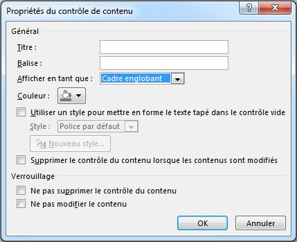
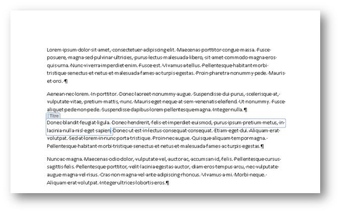
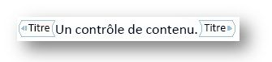
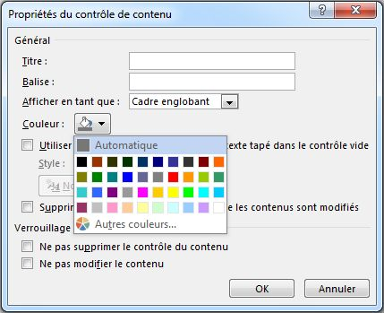
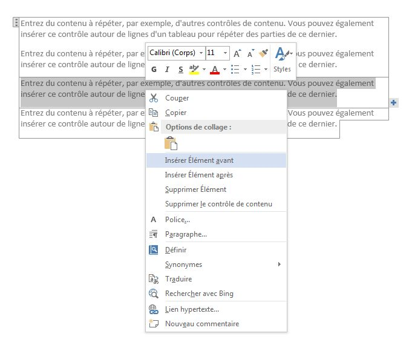
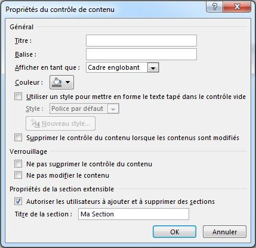
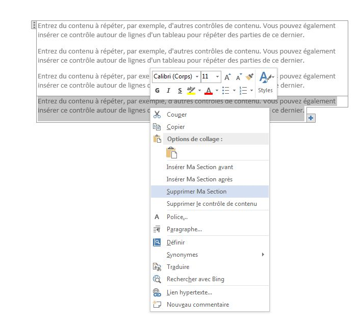
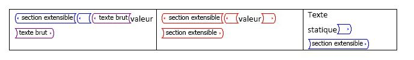
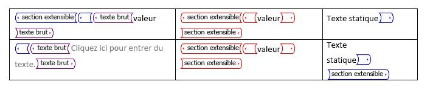

# <a name="content-controls-in-word"></a>Contrôles de contenu dans Word

Découvrez les nouveaux scénarios de document structuré que permettent de déployer les contrôles de contenu Microsoft Word 2013.

Cette rubrique fournit des informations sur les modifications apportées aux contrôles de contenu dans Microsoft Word 2013 et sur les scénarios de document qui peuvent être déployés grâce à ces modifications.
  
### <a name="structured-documents"></a>Documents structurés
<a name="WordCC_StructuredDocs"> </a>

Les documents structurés sont des documents qui contrôlent où le contenu peut s’afficher dans un document, quel type de contenu peut s’afficher dans le document et si ce contenu peut être modifié.
  
Voici quelques scénarios courants pour un contenu structuré dans Microsoft Word :
  
- Un cabinet d’avocats a besoin de créer des documents qui contiennent des passages juridiques qui ne doivent pas être modifiés par l’utilisateur.
    
- Une entreprise a besoin de créer une page de garde pour les propositions où seuls le titre, l’auteur et la date sont saisis par l’utilisateur.
    
- Une entreprise a besoin de créer des factures dans lesquelles les données du client sont incluses dans des zones prédéfinies.
    
### <a name="using-content-controls-to-structure-a-document"></a>Utilisation des contrôles de contenu pour structurer un document
<a name="WordCC_StructuredDocs"> </a>

Les contrôles de contenu sont des entités Microsoft Word qui agissent comme des conteneurs pour un contenu spécifique dans un document. Chaque contrôle de contenu peut comporter des dates, des listes ou des paragraphes de texte mis en forme. Les contrôles de contenu vous aident à créer des blocs de contenu enrichi, structuré, et sont conçus pour être utilisés dans les modèles qui insèrent des blocs bien définis dans vos documents, créant ainsi des documents structurés.
  
Les contrôles de contenu sont idéaux pour la création de documents structurés, car ils vous permettent d’ajuster la position du contenu, de spécifier le type de contenu (par exemple, une date, une image ou du texte), de limiter ou d’activer la modification et d’ajouter une sémantique au contenu.
  
### <a name="content-controls-in-word-2010"></a>Contrôles de contenu dans Word 2010
<a name="WordCC_StructuredDocs"> </a>

Les contrôles de contenu suivants sont disponibles dans Word 2010 :
  
- Texte enrichi
    
- Texte brut
    
- Image
    
- Galerie de blocs de construction
    
- Zone de liste modifiable
    
- Liste déroulante
    
- Date
    
- Case à cocher
    
- Groupe
    
Les contrôles de contenu Word 2010 permettent d’obtenir diverses solutions de document structuré potentielles. Toutefois, dans Word 2013, les contrôles de contenu permettent de déployer encore davantage de scénarios.
  
## <a name="content-control-improvements-in-word-2013"></a>Améliorations des contrôles de contenu dans Word 2013
<a name="WordCC_WhatsNew"> </a>

Dans Word 2013, trois améliorations principales ont été apportées aux contrôles de contenu : une meilleure visualisation, la prise en charge du mappage XML pour les contrôles de contenu de texte enrichi et un nouveau contrôle de contenu pour le contenu qui se répète.
  
### <a name="improved-visualization"></a>Meilleure visualisation

Word 2013 permet aux contrôles de contenu individuels de s’afficher de trois façons possibles :
  
- Cadre englobant
    
- Balises de début et de fin
    
- Aucun
    
> [!NOTE]
> Sauf mention contraire, cette section traite de la visualisation des contrôles de contenu lorsque le document n’est pas affiché en **mode Création**. Pour définir le mode d’affichage d’un contrôle de contenu, utilisez la liste déroulante **Afficher en tant que** dans la boîte de dialogue **Propriétés du contrôle de contenu**. 
  
**Figure 1. Boîte de dialogue Propriétés du contrôle de contenu**


  
Vous pouvez également définir le mode d’affichage d’un contrôle de contenu à l’aide du modèle objet Word 2013 (décrit plus loin dans [Nouveaux membres de modèle objet client de contrôle de contenu Word 2013](#WordCC_NewOM)).
  
### <a name="bounding-box"></a>Cadre englobant
<a name="WordCC_DefaultRendering"> </a>

Le rendu par défaut pour les contrôles de contenu dans Word 2013 est de préserver l’apparence des contrôles de contenu tels qu’ils apparaissent dans Word 2007 et Word 2010 ; autrement dit, comme cadre englobant. Lorsqu’un contrôle de contenu est défini pour apparaître comme **cadre englobant**, l’affichage change en fonction de l’interaction utilisateur suivante :
  
- Lorsque le contrôle de contenu n’est pas activé, aucune visualisation ne se produit
    
- Lorsque vous pointez dessus avec la souris, le contrôle de contenu apparaît sous la forme d’un rectangle ombré
    
**Figure 2. Contrôle de contenu lors du pointage avec la souris**


  
- Lorsque le contrôle de contenu est activé (c’est-à-dire lorsque l’utilisateur clique sur le contrôle de contenu), il s’affiche comme un « cadre englobant » (avec une ligne autour du contenu et le titre, si un titre a été défini)
    
**Figure 3. Contrôle de contenu activé**


  
### <a name="startend-tags"></a>Balises de début et de fin
<a name="WordCC_StartEndTags"> </a>

Lorsque le contrôle de contenu est configuré pour s’afficher entre des **balises de début et de fin**, les balises s’affichent, qu’il y ait une interaction de l’utilisateur ou non, et le titre ne s’affiche jamais ; mais les boutons, tels que le bouton **Liste déroulante**, apparaissent lorsque vous pointez dessus avec la souris. 
  
**Figure 4. Contrôle de contenu défini pour s’afficher entre des balises de début et de fin**


  
### <a name="none"></a>Aucun
<a name="WordCC_Invisible"> </a>

Lorsque l’affichage du contrôle de contenu est défini sur **Aucun**, le contrôle de contenu n’est pas affiché.
  
### <a name="content-control-colorization"></a>Colorisation des contrôles de contenu
<a name="WordCC_CCColorization"> </a>

Outre l’activation d’un autre type d’affichage pour un contrôle de contenu, Word 2013 vous aide également à définir la couleur pour un contrôle de contenu individuel. Vous définissez la couleur d’un contrôle de contenu à l’aide du bouton **Couleur** dans la boîte de dialogue **Propriétés du contrôle de contenu**. 
  
Vous pouvez également définir la couleur d’un contrôle de contenu à l’aide du modèle objet Word 2013 (décrit plus loin dans [Nouveaux membres de modèle objet client de contrôle de contenu Word 2013](#WordCC_NewOM)).
  
**Figure 5. Boîte de dialogue Propriétés du contrôle de contenu**


  
### <a name="support-for-xml-mapping-for-rich-text-content-controls"></a>Prise en charge du mappage XML pour les contrôles de contenu de texte enrichi
<a name="WordCC_XMLMapping"> </a>

Word 2013 vous permet de mapper le contenu des contrôles de contenu de texte enrichi et les contrôles de contenu de bloc de construction de document sur le magasin de données XML. Pour ce faire, vous définissez le *mappage XML* pour le contrôle de contenu. Vous pouvez définir cette propriété à l’aide de la méthode **XMLMapping.SetMapping** existante dans le modèle objet. Dans la partie XML personnalisée, le XML personnalisé est stocké comme balisage plat Open XML converti en chaîne (en utilisant le codage XML standard), pour pouvoir être stocké comme nœud de texte dans la partie XML personnalisée. Toutefois, le mappage a toujours la même limite : il peut mapper uniquement sur des nœuds terminaux ou des attributs feuilles. 
  
> [!NOTE]
> Les contrôles de contenu de texte enrichi ne peuvent pas contenir d’autres contrôles de contenu de texte enrichi. S’il en existe un au sein d’un autre (par exemple, suite à une manipulation du format de fichier, d’une opération de copier/coller, etc.), il n’est pas lié tant qu’il est contenu dans un contrôle de texte enrichi mappé. 
  
Pour plus d’informations sur la configuration d’un mappage XML, consultez la section [Nouveaux membres de modèle objet client de contrôle de contenu Word 2013](#WordCC_NewOM) plus loin dans cette rubrique. 
  
### <a name="supporting-repeating-content"></a>Prise en charge du contenu répétitif
<a name="WordCC_SupportingRepeating"> </a>

Outre les améliorations de la visualisation et la prise en charge pour le mappage XML sur des contrôles de contenu de texte enrichi, Word 2013 ajoute également un nouveau contrôle de contenu qui vous permet de répéter le contenu. Le contrôle de contenu répétitif répète le contenu qu’il contient, ainsi que d’autres contrôles de contenu.
  
Vous insérez le contrôle de contenu répétitif autour de paragraphes entiers ou de lignes de table. Une fois que le contrôle entoure une section, vous pouvez insérer des copies de la section au-dessus ou en dessous de la section contenue.
  
**Figure 6. Menu contextuel de contrôle de contenu répétitif**


  
Vous pouvez répéter la section insérée en utilisant le contrôle sur la fin du contrôle de contenu (affiché sous la forme d’un bouton avec un signe plus ()) ou en choisissant une commande dans le menu contextuel, comme illustré dans la Figure 6. Le contenu répété devient une section distincte du contrôle à laquelle vous pouvez attribuer un titre à l’aide de la boîte de dialogue **Propriétés du contrôle de contenu**. 
  
**Figure 7. Attribution d’un titre de section dans la boîte de dialogue Propriétés du contrôle de contenu**


  
Une fois que vous avez donné un titre à la section, si vous sélectionnez **Autoriser les utilisateurs à ajouter et à supprimer des sections** dans la boîte de dialogue **Propriétés du contrôle de contenu**, les utilisateurs peuvent ajouter ou supprimer la section par nom. 
  
**Figure 8. Utilisation du menu contextuel de contrôle de contenu répétitif pour supprimer une section**


  
Lorsqu’un contrôle de contenu répétitif entoure d’autres contrôles de contenu, les contrôles de contenu entourés sont répétés dans chaque nouvel élément ; mais le contenu de tous ces contrôles de contenu est rétabli sur le texte d’espace réservé. Il existe deux exceptions pour lesquelles le contenu des contrôles enfants est conservé : 
  
- Lorsqu’un contrôle enfant est un contrôle répétitif.
    
- Lorsqu’un contrôle enfant présente un mappage XML à un nœud à l’extérieur du contrôle de contenu répétitif.
    
**Figure 9. Contrôle de contenu répétitif contenant des contrôles enfants avant la répétition**


  
**Figure 10. Contrôle de contenu répétitif contenant des contrôles enfants après la répétition**


  
### <a name="repeating-section-content-controls-around-xml-mapped-controls"></a>Contrôles de contenu répétitif autour de contrôles présentant un mappage XML
<a name="WordCC_RepeatingSectionCCs"> </a>

Pour les mappages XML qui sont contenus dans une section répétitive, Word 2013 les mappe comme suit.
  
Si le mappage ne présente pas de référence croisée avec un élément du jeu de nœuds dans sa chaîne parent, la liaison est une « liaison absolue » et présente le même contenu dans tous les éléments de section répétitive.
  
Si le mappage présente une référence croisée à un élément du jeu de nœuds dans sa chaîne parent, la liaison est une « liaison relative » et est remappée comme suit :
  
- La liaison absolue pour le nœud est déterminée (aplanissement des expressions de requête) ; cela doit se produire sur le mappage initial
    
- L’axe de la liaison qui présente une référence croisée avec le jeu de nœuds est supprimé.
    
- Le reste de l’expression XPath est évalué par rapport à l’expression XPath de l’élément de contenu répétitif
    
Par exemple, les mappages suivants peuvent se produire :
  
- La section répétitive est mappée à \root\next\path
    
- Le contrôle dans l’exemple d’élément est mappé à \root\next\path[2]\baz
    
- Word met en correspondance \root\next\path[2] avec un élément dans le jeu de nœuds
    
La liaison est donc évaluée comme .\baz, où la base est le nœud de l’élément de contenu répétitif.
  
Les suggestions suivantes pour utiliser des contrôles de contenu répétitif peuvent vous aider à éviter de perdre des données et d’être frustré.
  
### <a name="working-with-repeating-section-content-controls-that-are-mapped-to-xml-data"></a>Utilisation des contrôles de contenu répétitif mappés à des données XML
<a name="WordCC_RepeatingSectionCCs"> </a>

Si vous insérez un contrôle de contenu répétitif qui est mappé à des données XML, chaque fois que l’utilisateur rouvrira le document, Word recréera les éléments de section répétitive, en fonction des informations se trouvant dans le magasin de données. Même si vous enregistrez le document, les modifications que l’utilisateur apporte aux éléments de section répétitive dans le document qui ne sont pas également mappées au magasin de données sont perdues.
  
Pour éviter que cela ne se produise, verrouillez le contrôle de contenu répétitif et n’autorisez l’utilisateur à apporter des modifications qu’aux contrôles de contenu enfants déverrouillés qui sont également mappés aux données XML.
  
### <a name="binding-a-repeating-section-content-control-to-a-table"></a>Liaison d’un contrôle de contenu répétitif à une table
<a name="WordCC_RepeatingSectionCCs"> </a>

Si vous souhaitez lier un contrôle de contenu répétitif à une table, insérer la table, *puis* insérez le contrôle de contenu répétitif, et non l’inverse (sinon, vous ne pourrez pas sélectionner uniquement la table). 
  
### <a name="nesting-repeating-section-content-controls-within-a-table"></a>Imbrication de contrôles de contenu répétitif dans un tableau
<a name="WordCC_RepeatingSectionCCs"> </a>

L’imbrication étroite de contrôles de contenu répétitif au sein d’une table (par exemple, lorsque la fin du contrôle de contenu répétitif parent et la fin du contrôle de contenu répétitif enfant se trouvent dans la même cellule) entraîne la suppression de la section répétitive extérieure en cas de suppression ou d’ajout d’un élément dans la section intérieure.
  
Pour éviter que cela ne se produise, ajoutez une marque de paragraphe entre la fin d’un contrôle de contenu répétitif et la fin du contrôle de contenu répétitif suivant. Pour masquer la marque de paragraphe, désactivez l’option **Afficher/Masquer** dans l’onglet **Accueil** du ruban. 
  
### <a name="open-xml-file-format-schema-additions"></a>Ajouts au schéma au format Open XML
<a name="WordCC"> </a>

Les éléments suivants ont été ajoutés au schéma WordprocessingML au format Open XML.
  
**Tableau 1. Nouveaux éléments dans le schéma WordprocessingML au format Open XML pour les contrôles de contenu**

|**Élément**|**Description**|
|:-----|:-----|
|\<w:appearance\>  <br/> |\<w:appearance\> est un élément enfant de \<w:sdtPr\>.  <br/> Voici les valeurs valides pour l’attribut val :  <br/> \<w:appearance val= boundingBox|étiquettes|hidden.  <br/> La valeur par défaut est boundingBox.  <br/> |
|\<w:color\>  <br/> |\<w:color\> est un élément enfant de \<w:sdtPr\>.  <br/> Le modèle de contenu correspond au type complexe CT_Color existant. La valeur par défaut est la couleur utilisée dans Word 2010.<br/> |
   
## <a name="new-word-2013-content-control-object-model-members"></a>Nouveaux membres du modèle objet contrôle de contenu Word 2013
<a name="WordCC_NewOM"> </a>

Avec les nouvelles améliorations et les ajouts apportés aux contrôles de contenu dans Word 2013, le modèle objet Word a été mis à jour pour permettre la manipulation programmatique du nouveau jeu de fonctionnalités. Par ailleurs, des modifications ont été apportées au format de fichier Open XML sous-jacent pour les documents de traitement de texte.
  
Les sections suivantes fournissent davantage d’informations sur les modifications spécifiques apportées au modèle objet relatives à l’amélioration de chaque contrôle de contenu.
  
### <a name="visualization-enhancements"></a>Améliorations de visualisation
<a name="WordCC_VisEnhancements"> </a>

Plusieurs ajouts de modèle objet sont inclus dans Word 2013 pour améliorer la visualisation du contrôle de contenu. Le tableau suivant répertorie les nouveaux membres de l’objet **ContentControl** pour la visualisation. 
  
**Tableau 2. Nouveaux membres de l’objet ContentControl**

|**Membre**|**Description**|
|:-----|:-----|
|. **Appearance** en tant que **WdContentControlAppearance** <br/> |Obtient ou définit la visualisation du contrôle de contenu.  <br/> |
|. **Color** en tant que **WdColor** <br/> |Obtient ou définit la couleur du contrôle de contenu.  <br/> |
   
Le tableau suivant répertorie les constantes dans la nouvelle énumération **WdContentControlAppearance**. 
  
**Tableau 3. Nouvelles constantes d’énumération WdContentControlAppearance**

|**Constante**|**Description**|
|:-----|:-----|
|**wdContentControlBoundingBox** <br/> |Représente un contrôle de contenu affiché sous la forme d’une zone ombrée rectangulaire/englobante (avec un titre facultatif).  <br/> |
|**wdContentControlTags** <br/> |Représente un contrôle de contenu affiché comme des marques de début et de fin.  <br/> |
|**wdContentControlHidden** <br/> |Représente un contrôle de contenu qui n’est pas affiché.  <br/> |
   
### <a name="code-sample"></a>Exemple de code
<a name="WordCC_VisEnhancements"> </a>

L’exemple de code suivant montre comment créer des contrôles de contenu de texte enrichi et définir la visualisation par programme.
  
```vb
Sub testVisualization()
   Dim objcc As ContentControl
   Dim objRange As Range
   
   ' Get the first paragraph as a range object.
   Set objRange = ActiveDocument.Paragraphs(1).Range
   ' Create a rich text content control around the first paragraph.
   Set objcc = ActiveDocument.ContentControls.Add(wdContentControlRichText, objRange)
   objcc.Title = "Default Bounding Box"
   ' Set visualization to the default.
   objcc.Appearance = wdContentControlBoundingBox
   
   ' Create a new paragraph.
   objRange.InsertParagraphAfter
   Set objRange = ActiveDocument.Paragraphs(2).Range
   ' Create a rich text content control around the second paragraph.
   Set objcc = ActiveDocument.ContentControls.Add(wdContentControlRichText, objRange)
   objcc.Title = "Non Bounding"
   ' Set visualization to invisible.
   objcc.Appearance = wdContentControlHidden
   
   ' Create a new paragraph.
   objRange.InsertParagraphAfter
   Set objRange = ActiveDocument.Paragraphs(3).Range
   ' Create a rich text content control around the third paragraph.
   Set objcc = ActiveDocument.ContentControls.Add(wdContentControlRichText, objRange)
   objcc.Title = "Tags Only with Pink color"
   ' Set visualization to Start/End tags with pink color.
   objcc.Appearance = wdContentControlTags
   objcc.Color = wdColorPink
End Sub
```

### <a name="xml-mapping"></a>Mappage XML
<a name="WordCC_XMLMappingOM"> </a>

Aucun ajout n’a été effectué au modèle objet Word 2013 pour prendre en charge le mappage de texte enrichi sur les nœuds XML dans le magasin de données du document. Utilisez plutôt le modèle objet existant pour mapper un contrôle de contenu de texte enrichi sur un nœud XML dans le magasin de données du document. En outre, aucune modification n’a été apportée au schéma WordprocessingML du format de fichier Open XML sous-jacent dans le cadre de la nouvelle prise en charge du contrôle de contenu de texte enrichi spécifiquement pour le mappage XML.
  
#### <a name="code-sample"></a>Exemple de code

L’exemple de code suivant montre comment mapper un contrôle de contenu de texte enrichi à un nœud XML par programme.
  
```vb
Sub testRichBinding()
   Dim objRange As Range
   Dim objcc As ContentControl
   Dim objCustomPart As CustomXMLPart
   Dim blnMap As Boolean
   
   ' Add a custom XML part to the data store.
   Set objCustomPart = ActiveDocument.CustomXMLParts.Add
   ' Load XML fragment into the custom XML part.
   objCustomPart.LoadXML ("<x>Rich Text Databinding</x>")
   ' Get the first paragraph as a range object.
   Set objRange = ActiveDocument.Paragraphs(1).Range
   ' Create a rich text content control around the first paragraph.
   Set objcc = ActiveDocument.ContentControls.Add(wdContentControlRichText, objRange)
   ' Bind the XML node to the rich text content control.
   blnMap = objcc.XMLMapping.SetMapping("/x")
   ' Return whether mapping worked.
   MsgBox objcc.XMLMapping.IsMapped
End Sub
```

### <a name="repeating-section-content-controls-represented-in-the-object-model"></a>Contrôles de contenu répétitif représentés dans le modèle objet
<a name="WordCC_RepeatingSection"> </a>

Le contrôle de contenu répétitif est disponible dans le modèle objet via les ajouts suivants apportés à l’objet **ContentControl** et les nouveaux objets **RepeatingSectionItem** et **RepeatingSectionItemColl**. Le tableau 4 répertorie les nouveaux membres les plus importants de l’objet **ContentControl** pour les contrôles de contenu répétitif. 
  
**Tableau 4. Membres de l’objet ContentControl**

|**Membre**|**Description**|
|:-----|:-----|
|**AllowInsertDeleteSection** en tant que **Boolean** <br/> |Obtient ou définit si les utilisateurs peuvent ajouter ou supprimer des sections du contrôle de contenu à l’aide de l’interface utilisateur. Si cette propriété est appelée pour un contrôle de contenu qui n’est pas de type répétitif, l’appel échoue avec le message d’erreur suivant : « Cette propriété ne peut être utilisée qu’avec des contrôle de contenu répétitifs ».  <br/> |
|**RepeatingSectionItemTitle** en tant que **String** <br/> |Obtient ou définit le nom des éléments répétitifs utilisés dans le menu contextuel. Si cette propriété est appelée pour un contrôle de contenu qui n’est pas de type répétitif, l’appel échoue avec : « Cette propriété ne peut être utilisée qu’avec des contrôle de contenu répétitif ».  <br/> |
|**InsertRepeatingSectionItemBefore** en tant que **ContentControl** <br/> |Ajoute un élément répétitif avant l’élément actif et retourne le nouvel élément répétitif. Si cette méthode est appelée pour un contrôle de contenu qui n’est pas un élément de type répétitif, l’appel échoue avec : « Cette propriété ne peut être utilisée qu’avec des contrôles de contenu d’élément répétitifs ».  <br/> |
|**InsertRepeatingSectionItemAfter** en tant que **ContentControl** <br/> |Ajoute un élément répétitif après l’élément actif et renvoie le nouvel élément répétitif. Si cette méthode est appelée pour un contrôle de contenu qui n’est pas de type répétitif, l’appel échoue avec le message suivant : « Cette propriété peut uniquement être utilisée avec des contrôles de contenu répétitifs. »  <br/> |
   
Le tableau 5 répertorie les membres les plus importants de l’objet **RepeatingSectionItem**. 
  
**Tableau 5. Membres de l’objet RepeatingSectionItem**

|**Membre**|**Description**|
|:-----|:-----|
|**Range** en tant que **Range** <br/> |Renvoie la plage de l’élément répétitif spécifié, à l’exclusion des balises de début et de fin.  <br/> |
|**Delete** <br/> |Supprime l’élément répétitif spécifié.  <br/> |
|**InsertItemAfter** en tant que **RepeatingSectionItem** <br/> |Ajoute un élément répétitif après l’élément spécifié et renvoie le nouvel élément.  <br/> |
|**InsertItemBefore** en tant que **RepeatingSectionItem** <br/> |Ajoute un élément répétitif avant l’élément spécifié et renvoie le nouvel élément.  <br/> |
   
Le tableau 6 répertorie les membres les plus importants de l’objet **RepeatingSectionItemColl**. 
  
**Tableau 6. Membres de l’objet RepeatingSectionItemColl**

|**Membre**|**Description**|
|:-----|:-----|
|**Item** en tant que **RepeatingSectionItem** <br/> |Renvoie un élément répétitif individuel.  <br/> |
   
Le tableau 7 illustre le nouveau membre de l’énumération **WdContentControlType** pour les contrôles de contenu répétitif. 
  
**Tableau 7. Ajout à l’énumération WdContentControlType**

|**Constante**|**Description**|
|:-----|:-----|
|**wdContentControlRepeatingSection** <br/> |Représente un contrôle de contenu qui contient un seul élément dans une section répétitive.  <br/> |
   
### <a name="code-sample"></a>Exemple de code
<a name="WordCC_RepeatingSection"> </a>

L’exemple de code suivant montre comment utiliser par programme des contrôles de contenu répétitif.
  
```vb
Sub testRepeatingSectionControl()
   Dim objRange As Range
   Dim objTable As Table
   Dim objCustomPart As CustomXMLPart
   Dim objCC As ContentControl
   Dim objCustomNode As CustomXMLNode
   
   Set objCustomPart = ActiveDocument.CustomXMLParts.Add
   objCustomPart.LoadXML ("<books>" & _
       "<book><title>Everyday Italian</title>" & _
       "<author>Giada De Laurentiis</author></book>" & _
       "<book><title>Harry Potter</title>" & _
       "<author>J K. Rowling</author></book>" & _
       "<book><title>Learning XML</title>" & _
       "<author>Erik T. Ray</author></book></books>")
   
   Set objRange = ActiveDocument.Paragraphs(1).Range
   Set objTable = ActiveDocument.Tables.Add(objRange, 2, 2)
   With objTable.Borders
       .InsideLineStyle = wdLineStyleSingle
       .OutsideLineStyle = wdLineStyleDouble
   End With
   Set objRange = objTable.Cell(1, 1).Range
   Set objCustomNode = objCustomPart.SelectSingleNode("/books[1]/book[1]/title[1]")
   Set objCC = ActiveDocument.ContentControls.Add(wdContentControlText, objRange)
   objCC.XMLMapping.SetMappingByNode objCustomNode
   Set objRange = objTable.Cell(1, 2).Range
   Set objCustomNode = objCustomPart.SelectSingleNode("/books[1]/book[1]/author[1]")
   Set objCC = ActiveDocument.ContentControls.Add(wdContentControlText, objRange)
   objCC.XMLMapping.SetMappingByNode objCustomNode
   Set objRange = objTable.Rows(1).Range
   Set objCC = ActiveDocument.ContentControls.Add(wdContentControlRepeatingSection, objRange)
   objCC.XMLMapping.SetMapping ("/books[1]/book")
End Sub
```

### <a name="open-xml-file-format-changes-for-repeating-section-content-controls"></a>Modifications de format de fichier Open XML pour les contrôles de contenu répétitif
<a name="WordCC_RepeatingSection"> </a>

La représentation au format de fichier d’un contrôle de contenu répétitif utilise généralement les mêmes noms d’éléments, valeurs, etc. que le balisage XML existant ; toutefois, l’élément \<sdt\> représentant le conteneur répétitif externe existe dans l’espace de noms Word 2013, afin de garantir la compatibilité avec les versions antérieures de Word.
  
Les éléments répétitifs individuels dans le contrôle de contenu répétitif (qui entourent chaque élément) sont enregistrés en tant que contrôles de contenu de texte enrichi à l’aide de la représentation WordprocessingML existante. Le tableau 8 répertorie les nouveaux éléments dans le schéma WordprocessingML pour les contrôles de contenu répétitif.
  
**Tableau 8. Nouveaux éléments dans le schéma WordprocessingML pour les contrôles de contenu répétitif**

|**Élément**|**Description**|
|:-----|:-----|
|\<w15:repeatingSection\>  <br/> |Spécifie un contrôle de contenu répétitif. Cet élément est incompatible avec tous les autres types de contrôles et n’a ni attributs enfants, ni éléments.  <br/> |
|\<w15:repeatingSectionItem\>  <br/> |Spécifie un contrôle de contenu d’élément répétitif. Cet élément est incompatible avec tous les autres types de contrôles et n’a ni attributs enfants, ni éléments enfants.  <br/> |
|\<w15:doNotAllowInsertDeleteSection\>  <br/> |Spécifie que l’utilisateur ne peut ni ajouter ni supprimer des sections à l’aide des options de l’interface dans Word 2013.  <br/> |
|\<w15:sectionTitle\>  <br/> |Spécifie le nom des éléments répétés (et est utilisé dans le menu contextuel lorsque le contrôle est sélectionné).  <br/> |
   

  

